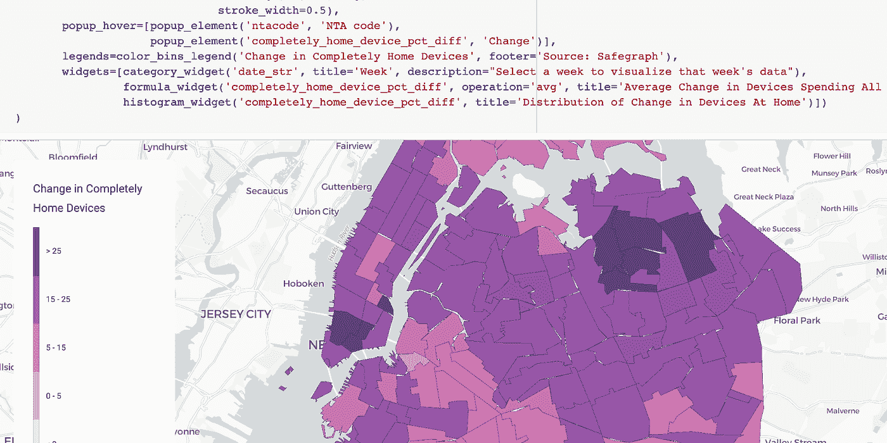
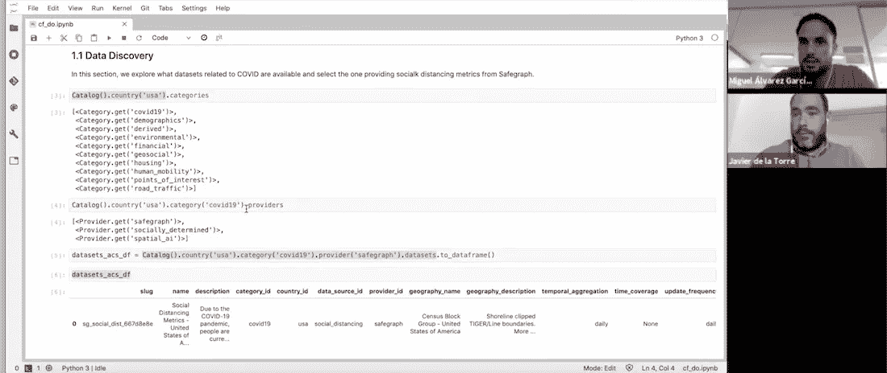
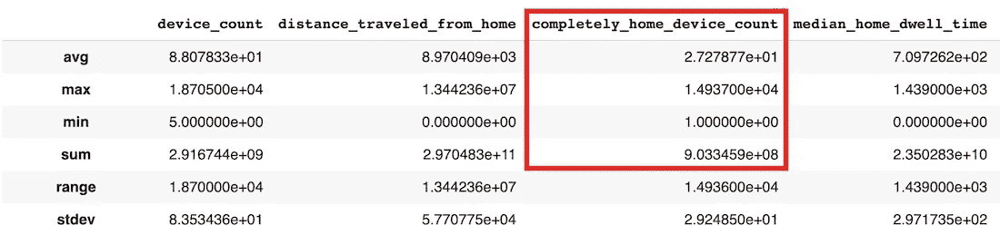
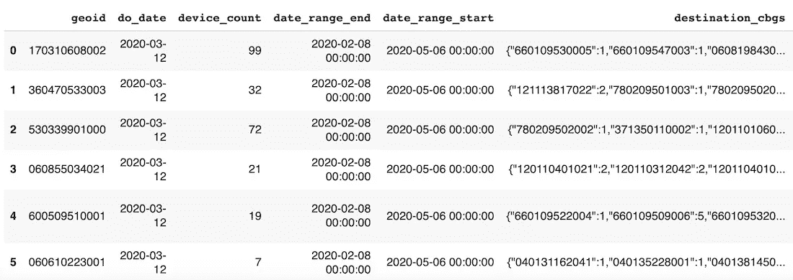
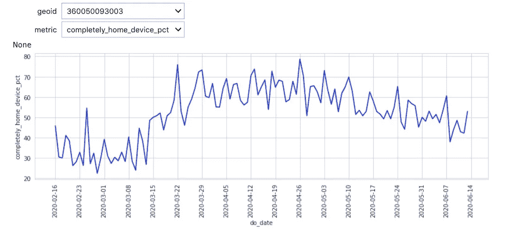
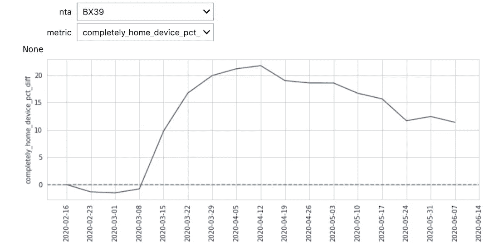
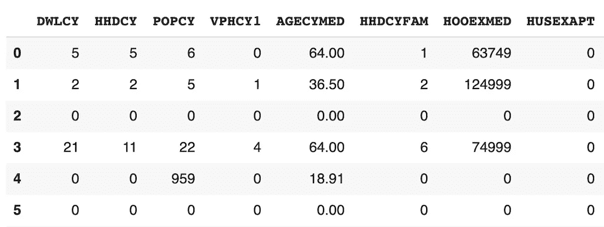
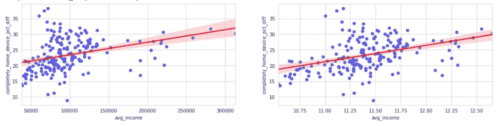

# 如何在空间分析中使用新冠肺炎公共数据

> 原文：<https://towardsdatascience.com/how-to-use-covid-19-public-data-in-spatial-analysis-b46a536ce113?source=collection_archive---------57----------------------->

## 通过 CARTOframes 和 CARTO 的 Data Observatory 演示如何使用公开的新冠肺炎数据集进行空间分析。



在过去的几个月里，我们一直在[向从事新冠肺炎分析的人员免费开放我们的平台](https://carto.com/blog/carto-free-for-fight-against-coronavirus/),[定期向我们的](https://carto.com/blog/covid19-datasets-available-data-observatory/)[数据观测站](https://carto.com/data-observatory/) (DO)添加来自广泛供应商的公共数据集，并展示来自众多受影响行业的[用例，以支持企业、政府和空间社区抗击这种疫情。](https://carto.com/blog)

我们最近举办了一场[网络研讨会](https://go.carto.com/webinars/covid19-spatial-analysis)，介绍了如何在[空间数据科学](https://carto.com/what-is-spatial-data-science/)中使用新冠肺炎公共数据的过程，并转录了以下要点。



为了参考和帮助你复制这种类型的分析，这篇文章中引用的代码和笔记本可以在[这里](https://colab.research.google.com/drive/1NeJCn51aSPPVNli2n8W3q_aUvBHoH-CJ?usp=sharing)找到。

# 设置

在这个例子中，我们在[谷歌云平台](https://cloud.google.com/)上的 Jupyter 笔记本中使用我们的 Python 包 [CARTOframes](https://carto.com/cartoframes/) 。

要设置 CARTOframes，我们首先需要安装库，然后设置我们的帐户凭证。

```
**!**pip install cartoframesmy_base_url **=** 'https://[user].carto.com/'
my_api_key **=** 'XXXXX'

set_default_credentials(
    base_url**=**my_base_url,
    api_key**=**my_api_key
)
```

# 数据发现

接下来，我们可以探索 DO，以确定哪些类型的数据集可以直接用于我们，而不需要来源、清理和规范化。在 DO 中，我们有一个名为“covid19”的新类别，涵盖了与疫情相关的所有可用数据集。

```
**Catalog**().country('usa').categories[**<**Category.**get**('covid19')**>**,
 **<**Category.**get**('demographics')**>**,
 **<**Category.**get**('derived')**>**,
 **<**Category.**get**('environmental')**>**,
 **<**Category.**get**('financial')**>**,
 **<**Category.**get**('geosocial')**>**,
 **<**Category.**get**('housing')**>**,
 **<**Category.**get**('human_mobility')**>**,
 **<**Category.**get**('points_of_interest')**>**,
 **<**Category.**get**('road_traffic')**>**]
```

我们还可以查询哪些提供者属于这个类别，从而使我们能够确定哪个数据集与我们的分析最相关。这里我们可以看到两个提供者， [Safegraph](https://www.safegraph.com/) 和 [Spatial.ai](https://spatial.ai/) 。

```
**Catalog**().country('usa').category('covid19').providers[**<**Provider.**get**('safegraph')**>**,
 **<**Provider.**get**('spatial_ai')**>**]
```

在这个例子中，我们对纽约市的人员流动指标感兴趣，所以让我们更详细地看看 Safegraph 的数据，包括列、描述和地理覆盖范围。

请注意，Safegraph 的数据对全世界从事新冠肺炎相关项目的研究人员、非营利组织和政府公开。为了访问他们的数据，你首先需要签署他们的[联盟协议](https://www.safegraph.com/covid-19-data-consortium)。

```
datasets_acs_df **=** **Catalog**().country('usa').category('covid19').provider('safegraph').datasets.to_dataframe()
datasets_acs_df
```


```
datasets_acs_df.loc[0, 'description']
```

由于新冠肺炎疫情，人们目前正在进行社会距离。“为了了解人口普查区块群体层面的实际情况，SafeGraph 提供了一种临时性的社交距离度量产品。”

```
dataset **=** Dataset.**get**('sg_social_dist_667d8e8e')
dataset.geom_coverage()
```

我们可以进一步描述数据集，以便查看其中的变量，并检查聚合数据的前 10 行。“completely_home_device_count”变量是我们最感兴趣的变量，因为这将为我们提供有多少人留在家中工作的指示。我们可以看到，数据的时间分辨率是每日的，空间分辨率是人口普查区块级别的。

```
dataset.**describe**()
```



```
dataset.head()
```



现在我们已经确定这是我们想要使用的数据，接下来我们需要下载它。但是，因为我们只对特定时间段内的纽约市感兴趣，所以我们需要使用 SQL 查询通过边界框和日期来过滤数据集。边界框是使用 bboxfinder.com 的[以疫情袭击之前的 2 月 16 日开始的一周为基线确定的。](http://bboxfinder.com/)

```
sql_query **=** "SELECT * FROM $dataset$ WHERE ST_IntersectsBox(geom, -74.274573,40.484984,-73.453345,41.054089) AND do_date >= '2020-02-16'"
```

我们可以将这些数据的地理覆盖范围可视化，如下所示。

```
**Map**(Layer(dataset_df[dataset_df['do_date'] **==** '2020-02-16'], geom_col**=**'geom'))
```

# 空间分析

我们可以执行的第一个分析是处理数据，以建立一个时间序列(完整代码请参考[笔记本](https://colab.research.google.com/drive/1NeJCn51aSPPVNli2n8W3q_aUvBHoH-CJ?usp=sharing))。

我们可以在图表中看到一个总体趋势，更多的人呆在家里，这是我们所期望的。在这个阶段，尽管由于人口普查区块的高粒度和每日抽样率，数据是有噪声的。



由于我们感兴趣的是相对于我们之前定义的 COVID 前基线的变化，我们首先需要聚合数据以减少噪音，时间上在周级别，空间上在邻域制表区域(NTA)级别(纽约市自己用于统计的区域)。

```
def aggregate_spatiotemporal(df):
    wavg **=** lambda x : np.round(np.average(x, weights**=**df.loc[x.**index**, 'device_count']), 2)
    df_aux **=** df.groupby(['date_range_start', 'ntacode']).\
                agg({'device_count':'sum',
                     'distance_traveled_from_home':wavg,
                     'completely_home_device_pct':wavg,
                     'median_home_dwell_time':wavg}).reset_index()

    nta_counts **=** df_aux['ntacode'].value_counts()
    nta_to_rm **=** nta_counts[nta_counts **<** nta_counts.**max**()].**index**.tolist()
    df_aux **=** df_aux[**~**df_aux['ntacode'].isin(nta_to_rm)].reset_index(**drop=True**)
    wavg **=** lambda x : np.round(np.average(x, weights**=**df_aux.loc[x.**index**, 'device_count']), 2)
    **return** df_aux.groupby('ntacode').resample('W-SUN', closed**=**'left', label**=**'left', **on=**'date_range_start').\
                    agg({'device_count':'max',
                         'distance_traveled_from_home':wavg,
                         'completely_home_device_pct':wavg,
                         'median_home_dwell_time':wavg}).reset_index()
```

除此之外，我们还计算了一个新的指标“completely _ home _ device _ pct _ diff”，给出了每天在家的时间百分比与基线的差异。

```
df_agg **=** df_agg.merge(df_agg.groupby('ntacode').agg({'completely_home_device_pct':'first'}).\
                      reset_index().**rename**(columns**=**{'completely_home_device_pct':'completely_home_device_pct_bl'}),
                      **on=**'ntacode')
df_agg['completely_home_device_pct_diff'] **=** df_agg['completely_home_device_pct'] **-** df_agg['completely_home_device_pct_bl']
```

随着噪音的减少，现在可以看到不同社区之间的不同模式，并识别空间模式。例如，在 3 月底，我们可以看到皇后区和曼哈顿区之间的差异，当时许多曼哈顿人离开城市，住在第二套房子里。快到五月底的时候，我们看到更多的外出活动，尤其是在布朗克斯和布鲁克林。



# 数据丰富

为了进一步分析，并尝试解释我们所看到的趋势中的一些差异，我们可以增加更多的数据集。由于我们已经下载了具有不同几何图形的数据集，CARTOframes 的一个重要特性是能够不断探索 DO 以丰富我们正在处理的数据框。

在这个例子中，我们用来自[应用地理解决方案](https://www.appliedgeographic.com/)的社会人口数据进行了充实，以确定家用设备百分比的增加与平均收入之间是否存在关联。

由于这是一个优质数据集，它可以从 CARTOframes 内[订阅，用于该分析和其他分析。](https://carto.com/developers/cartoframes/examples/#example-subscribe-to-a-premium-dataset)

如果我们查看社会人口数据集中可用的变量，列名并没有给我们多少关于数据类型的指示。

```
dataset_dem.head()
```



为了帮助确定在这种情况下什么数据最适合我们使用，我们可以获得每个列标题的描述。

```
dataset_dem.variables[ **<Variable**.**get**('VPHCYNONE_3b864015')**>** **#**'Households: No Vehicle Available (2019A)',
 **<Variable**.**get**('VPHCY1_98166634')**>** **#**'Households: One Vehicle Available (2019A)',
 **<Variable**.**get**('VPHCYGT1_815731fb')**>** **#**'Households: Two or More Vehicles Available (2019A)',
 **<Variable**.**get**('INCCYPCAP_70509bba')**>** **#**'Per capita income (2019A)',
 **<Variable**.**get**('INCCYAVEHH_3e94053c')**>** **#**'Average household Income (2019A)',
 **<Variable**.**get**('INCCYMEDHH_b80a7a7b')**>** **#**'Median household income (2019A)',
 **<Variable**.**get**('INCCYMEDFA_5f55ef51')**>** **#**'Median family income (2019A)',]
```

由于我们对收入如何影响在家工作感兴趣，我们选择了“平均家庭收入”来充实我们现有的数据。

```
**Variable**.**get**('INCCYAVEHH_3e94053c').to_dict(){'agg_method': 'AVG',
'column_name': 'INCCYAVEHH',
'dataset_id': 'carto-do.ags.demographics_sociodemographics_usa_blockgroup_2015_yearly_2019',
'db_type': 'INTEGER',
'description': 'Average household Income (2019A)',
'id': 'carto-do.ags.demographics_sociodemographics_usa_blockgroup_2015_yearly_2019.INCCYAVEHH',
'name': 'INCCYAVEHH',
'slug': 'INCCYAVEHH_3e94053c',
'variable_group_id': 'carto-do.ags.demographics_sociodemographics_usa_blockgroup_2015_yearly_2019.household_income'}
```

现在，我们可以用每个 NTA 的平均家庭收入来丰富我们的原始数据框架，如下所示。

```
enriched_df_agg **=** enrichment.enrich_polygons(
    df_agg,
    variables**=**['INCCYAVEHH_3e94053c'],
    aggregation**=**'AVG'
)
```

然后，我们计算了平均家庭收入和相对于基线呆在家里的人的百分比之间的相关性。选择从 5 月 10 日开始的一周，使用平均收入的对数标度，我们可以看到，在收入较高的地区，呆在家里的人增加得更多。

这再次向我们表明，新冠肺炎是[而不是同等地影响每个人](https://carto.com/blog/covid19-inequality-killing-more-black-americans/)，在这个例子中，人口统计起着关键作用。

```
fig, axs **=** plt.subplots(1, 2, figsize**=**(18, 4))
sns.regplot(x**=**'avg_income', y**=**'completely_home_device_pct_diff', 
            **data=**enriched_df_agg[enriched_df_agg['date_str'] **==** '2020-05-10'],
            scatter_kws**=**{'color':'blue', 'alpha':0.6}, line_kws**=**{'color':'red'}, ax**=**axs[0])
sns.regplot(x**=**np.log(enriched_df_agg.loc[enriched_df_agg['date_str'] **==** '2020-05-10', 'avg_income']), 
            y**=**enriched_df_agg.loc[enriched_df_agg['date_str'] **==** '2020-05-10', 'completely_home_device_pct_diff'],
            scatter_kws**=**{'color':'blue', 'alpha':0.6}, line_kws**=**{'color':'red'}, ax**=**axs[1])
```



*本文原载于* [*CARTO 的博客*](https://carto.com/blog/how-to-use-covid19-data-spatial-analysis/) *。*