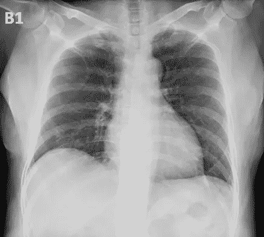
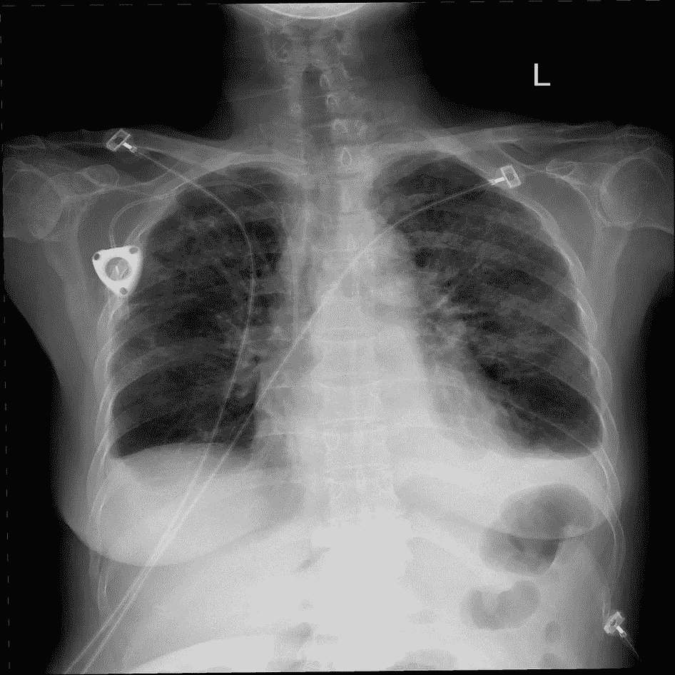
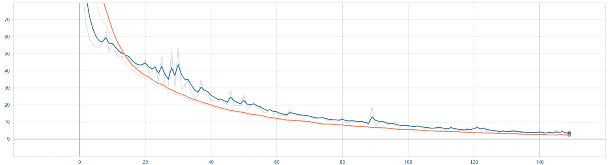
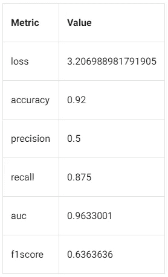
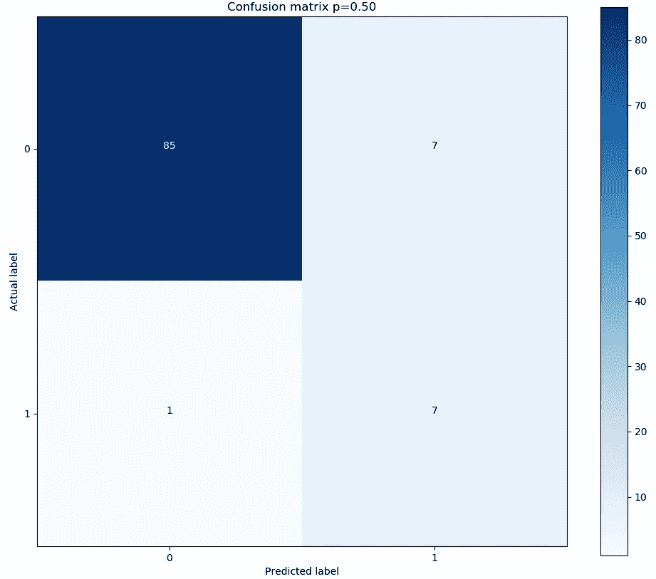
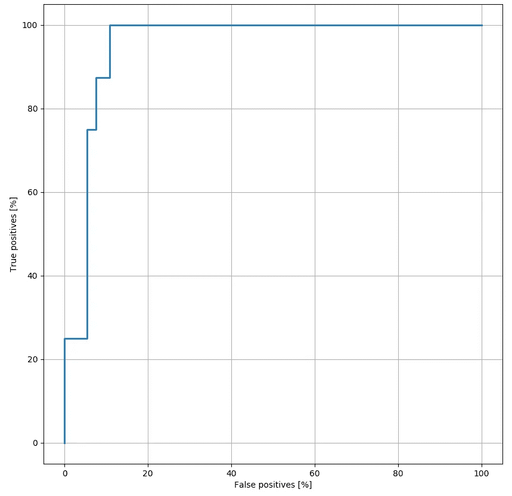
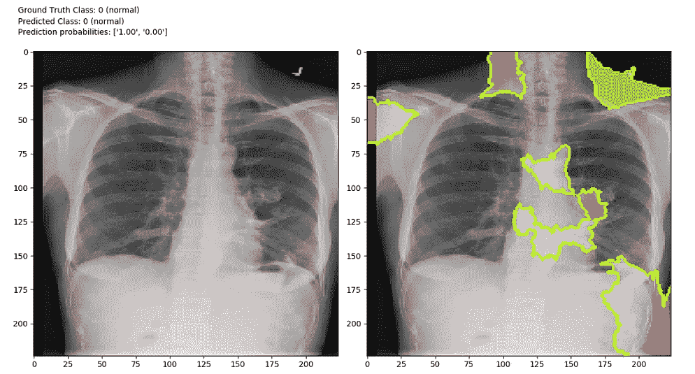
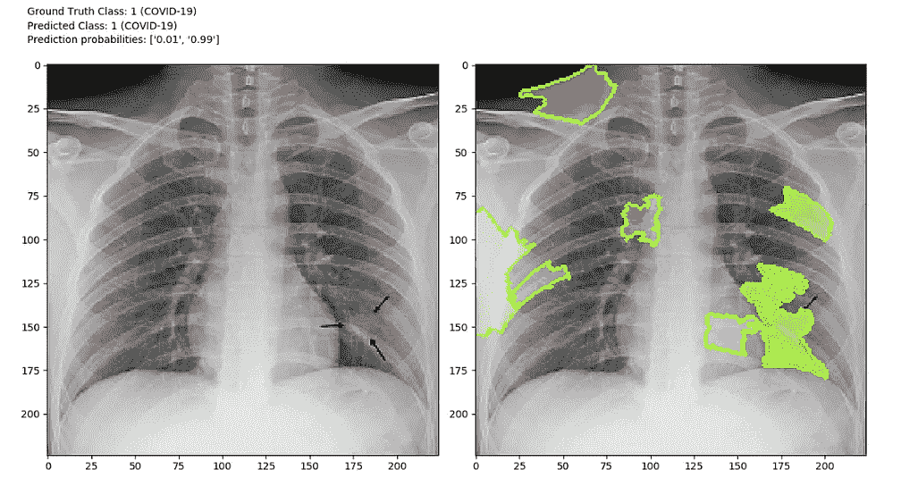

# 如何使用可解释的机器学习使用 COVID-CXR 识别胸部 X 射线上的新冠肺炎感染

> 原文：<https://towardsdatascience.com/how-to-use-covid-cxr-to-predict-covid-19-on-chest-x-rays-with-explainable-ai-c05cb07d5f0f?source=collection_archive---------38----------------------->

## LIME 应用于 CNN 训练预测后前位胸片新冠肺炎感染

***编者按:*** [*走向数据科学*](http://towardsdatascience.com/) *是一份以数据科学和机器学习研究为主的中型刊物。我们不是健康专家或流行病学家，本文的观点不应被解释为专业建议。想了解更多关于疫情冠状病毒的信息，可以点击* [*这里*](https://www.who.int/emergencies/diseases/novel-coronavirus-2019/situation-reports) *。*

# 介绍

在这篇文章中，我将简要描述如何开始将机器学习应用于从胸部 X 射线预测严重的新冠肺炎病例。加拿大伦敦市的人工智能研发实验室最近发布了他们的 [GitHub 知识库](https://github.com/aildnont)以及如何开始使用他们的模型的说明，该模型名为[COVID-CXR](/covid-cxr-an-open-source-explainable-deep-cnn-model-for-predicting-the-presence-of-covid-19-in-75a83b26cab5)【1】。该实验室的方法和发现在它的 [**关于主题**](https://medium.com/@aildnont/investigation-of-explainable-predictions-of-covid-19-infection-from-chest-x-rays-with-machine-cb370f46af1d?source=friends_link&sk=e0ef4b98d9502c81e286a5a0f1530c50)**【2】的文章中有详细描述。我一直在这个实验室工作，并为这个开源库做出了贡献。**

**通过遵循本文中的步骤，您将能够理解并快速开始到目前为止的工作。我希望能够接触到那些能够为这项工作贡献自己技能的人。**

**如果你想阅读到目前为止关于柯维德-CXR 的工作总结，可以看看我的同事[马特·罗斯](https://towardsdatascience.com/@matt.as.ross)写的[文章](/covid-cxr-an-open-source-explainable-deep-cnn-model-for-predicting-the-presence-of-covid-19-in-75a83b26cab5)。**

# **1.获取代码**

**要开始使用伦敦金融城的代码，请克隆 [GitHub 库](https://github.com/aildnont)。一定要安装好必要的依赖项(资源库里有一个 [*requirements.txt*](https://github.com/aildnont/covid-cxr/blob/master/requirements.txt) )。**

# **2.数据预处理**

## **第 2(a)条。下载数据**

**下载以下三个数据集:**

1.  **GitHub 上的[新冠肺炎图像数据收集库](https://github.com/ieee8023/covid-chestxray-dataset)收集了越来越多的来自国际上的新冠肺炎病例的已鉴定的 cxr 和 CT 扫描。我感谢蒙特娄大学的约瑟夫·保罗·寇恩和他的同事们在收集这个数据集时所做的辛勤工作。**
2.  **[图 1 GitHub 上的新冠肺炎胸部 X 射线数据集倡议](https://github.com/agchung/Figure1-COVID-chestxray-dataset)知识库是一个不断增长的来自新冠肺炎病例的已识别 cxr 的集合[4]。我感谢 Audrey Chung 和 Figure 1 在收集这个数据集时所做的辛勤工作。**
3.  **Kaggle 上可用的 [RSNA 肺炎检测挑战](https://www.kaggle.com/c/rsna-pneumonia-detection-challenge)数据集包含几个已识别的 cxr，并包括一个标签，指示图像是否显示肺炎的证据【5】。我感谢北美放射学会和所有其他相关实体提供了这个数据集。**

**在本地机器上的某个地方为您的数据创建一个文件夹，并将您下载的解压缩数据集放入其中。如果您希望为任何其他数据集编写定制的预处理，也可以将它们包含在这里。如果选择包含其他数据集，则必须相应地更新[*preprocess . py*](https://github.com/aildnont/covid-cxr/blob/master/src/data/preprocess.py)。**

```
├── data
│   ├── covid-chestxray-dataset   
│   ├── Figure1-COVID-chestxray-dataset          
│   ├── rsna   
│   └── **additional dataset here**
```

********

****左图:**一个从数据集(1)中提取的带有新冠肺炎标签的 CXR 的示例。**右图:**取自数据集(2)的 CXR 的示例，标记为显示肺炎的证据。**

**在训练我们的网络时，第一个数据集包含 76 个后前位(PA) CXR 图像，这些图像来自新冠肺炎检测呈阳性的患者。在从这两个数据集中仅选择 PA CXRs 时要小心。这个可以在[*preprocess . py*](https://github.com/aildnont/covid-cxr/blob/master/src/data/preprocess.py)中随意修改。**

## **第 2 条(b)款。将所有数据合并到一个数据集中**

**首先，决定是要执行二元分类还是多类分类。在 [*config.yml*](https://github.com/aildnont/covid-cxr/blob/master/config.yml) 中设置合适的字段。**

*   ****二进制分类:**在*列车*区间内，将 *CLASS_MODE* 字段设置为*‘binary’*。该模型将被训练以将标记为新冠肺炎的图像与所有其他图像区分开来。**

```
TRAIN: 
  CLASS_MODE: ‘binary’
```

*   ****多级分类:**在*列车*区间内，将 *CLASS_MODE* 字段设置为*‘multi CLASS’*。该模型将被训练以区分标记为“新冠肺炎”的图像、标记为“其他肺炎”的图像以及标记为“没有发现”的图像。**

**要合并两个数据集中的数据，从项目的根目录执行[*preprocess . py*](https://github.com/aildnont/covid-cxr/blob/master/src/data/preprocess.py)*该脚本将创建一个由大约 1000 幅图像组成的大型数据集，并将它们分成训练集(82%)、验证集(8%)和测试集(10%)。您可以通过修改[*config . yml*](https://github.com/aildnont/covid-cxr/blob/master/config.yml)*的*数据*部分的*数量 _RSNA_IMGS* 字段来控制从 RSNA 数据集中获取的图像数量。*运行此脚本后，/ *数据/已处理的*文件夹将包含包含训练、验证和测试集的 CSV 文件(见下文):***

```
*covid-cxr
├── data
│   ├── interpretability        <- For use later on
│   ├── processed               <- Products of dataset preprocessing
│   │   ├── test_set.csv        <- filenames and labels in test set
│   │   ├── train_set.csv       <- filenames and labels in train set
│   │   └── val_set.csv         <- filenames and labels in val set*
```

***CSV 文件是将图像文件名和标签配对的[熊猫](https://pandas.pydata.org/)数据帧的保存版本。***

## ***第 2 款(c)项。图像预处理***

***图像预处理是在执行训练脚本 ( [*train.py*](https://github.com/aildnont/covid-cxr/blob/master/src/train.py) )时自动进行的*。 [ImageDataGenerator](https://www.tensorflow.org/api_docs/python/tf/keras/preprocessing/image/ImageDataGenerator) (来自 tensorflow.keras)用于在训练之前执行批量图像的预处理。由于每个数据集都有一个图像文件夹以及相应的文件名和标签表，因此调用[*imagedata generator . flow _ from _ data frame()*](https://www.tensorflow.org/api_docs/python/tf/keras/preprocessing/image/ImageDataGenerator#flow_from_dataframe)将图像变换应用于批量图像文件。下面的代码片段演示了 ImageDataGenerator 如何帮助进行图像预处理(来自[*train . py*](https://github.com/aildnont/covid-cxr/blob/master/src/train.py)*)*。****

```
*train_img_gen = ImageDataGenerator(rotation_range=10,   preprocessing_function=remove_text, samplewise_std_normalization=True, samplewise_center=True)train_generator = train_img_gen.flow_from_dataframe(dataframe=data[‘TRAIN’], directory=cfg[‘PATHS’][‘TRAIN_IMGS’], x_col=”filename”, y_col=y_col, target_size=img_shape, batch_size=cfg[‘TRAIN’][‘BATCH_SIZE’], class_mode=class_mode)*
```

***对图像应用了以下变换:***

*   ***图像大小调整为以下形状:224×224×3。***
*   ***对图像进行阈值处理以去除任何非常亮的像素，并修补缺失的区域。***
*   ***图像的像素值被转换为平均值为 0。***
*   ***图像的像素值除以它们的标准差。***

# ***3.训练模型***

## ***第 3 条(a)款。执行培训脚本***

***一旦运行了预处理脚本，就可以继续训练模型了。要训练模型，执行[*train . py*](https://github.com/aildnont/covid-cxr/blob/master/src/train.py)。***

***如果您希望修改模型的架构或超参数，您可以在[*config . yml*](https://github.com/aildnont/covid-cxr/blob/master/config.yml)*中修改其中的几个，而不需要对源代码*做任何修改。*配置文件的*训练*和 *NN* 部分包含允许用户尝试不同超参数的字段。下面是用户可以在配置文件中更改的字段的演示。有关这些字段的详细信息，请查看项目的[自述文件](https://github.com/aildnont/covid-cxr)。****

```
**TRAIN: 
  CLASS_MODE: ‘binary’  
  EXPERIMENT_TYPE: ‘single_train’ 
  BATCH_SIZE: 16 
  EPOCHS: 200 
  THRESHOLDS: 0.5 
  PATIENCE: 7 
  IMB_STRATEGY: ‘class_weight’
  CLASS_MULTIPLIER: [0.15, 1.0]
NN: 
  DCNN_BINARY: 
    KERNEL_SIZE: (3,3) 
    STRIDES: (1,1) 
    INIT_FILTERS: 16 
    FILTER_EXP_BASE: 3 
    MAXPOOL_SIZE: (2,2) 
    CONV_BLOCKS: 3 
    NODES_DENSE0: 128 
    LR: 0.0003 
    DROPOUT: 0.40 
    L2_LAMBDA: 0.0001**
```

****当 *DCNN_BINARY* 字段保留为默认值时，请参见以下二进制分类器架构的可视化描述。****

********

****二进制模型架构概述。在该图中，残差块由两个卷积层定义，第一个卷积层的输入与第二个卷积层的输出相连，后面是最大池层。剩余的块串联连接，然后是 2 个完全连接的层。预测类(p)是最终层的 softmax 激活的 argmax。****

## ****第 3 条(b)款。TensorBoard 中的可视化训练实验****

****默认情况下，TensorBoard 日志会在每次训练时生成。日志可以在*结果/日志/培训/中找到。*在这个项目中，日志文件夹是根据它们创建的日期和时间来命名的。通过在训练运行的日志文件目录中运行 TensorBoard，您可以看到以下内容:****

*   ****在*标量*选项卡上可以看到训练和验证指标。默认情况下，指标包括丢失率、准确率、召回率、精确度和 AUC。****
*   ****测试集指标显示在*文本*选项卡下的表格中。****
*   ****超参数值显示在*文本*选项卡下的表格中。****
*   ****测试集预测的混淆矩阵在*图像*选项卡下可见。****
*   ****测试集预测的 ROC 曲线在*图像*选项卡下可见。****

****************

******左图:**tensor board*SCALARS 选项卡中的损耗与时元图示例。* ***右图:****tensor board 文本页签中测试集指标表示例。*****

****************

******左图:**张量板*页签图像混淆矩阵示例。* ***右图:****tensor board 的 IMAGES 页签中 ROC 曲线的例子。*****

# ****4.石灰解释****

****这个项目最重要的支柱是可解释性。在医疗保健领域，追求可解释的机器学习模型尤为重要。可解释的模型提高了患者和医疗保健提供者对机器学习算法的信任。此外，可解释性通知模型未来迭代的改进。****

****目前，该项目应用[局部可解释的模型不可知解释](https://dl.acm.org/doi/10.1145/2939672.2939778)(即 LIME)来解释我们深度卷积神经网络的预测[6]。我们使用了 LIME creators 的 [GitHub 仓库](https://github.com/marcotcr/lime)中可用的实现。****

## ****4(a):解释测试集中图像的预测****

****在 [config.yml](https://github.com/aildnont/covid-cxr/blob/master/config.yml) 中，将*路径*中的 *MODEL_TO_LOAD* 设置为模型训练后生成的模型权重文件的路径。通过执行 [*lime_explain.py*](https://github.com/aildnont/covid-cxr/blob/master/src/interpretability/lime_explain.py) ，将初始化一个[limimageexplainer](https://lime-ml.readthedocs.io/en/latest/lime.html#lime.lime_image.LimeImageExplainer)对象，并为测试集中的第一个( *0ᵗʰ* )图像生成一个可解释的解释。****

****要为不同的图像生成解释，请将测试集中您希望看到的图像的索引传递给解释函数。回想一下，通过查看*数据/预处理/test_set.csv* ，您可以将测试集视为文件名和标签的表格。一旦执行了[*lime _ explain . py*](https://github.com/aildnont/covid-cxr/blob/master/src/interpretability/lime_explain.py)，调用以下函数解释测试集中的 *iᵗʰ* 例子:****

```
**explain_xray(lime_dict, i, save_exp=True)**
```

## ******4(b):解释石灰说明******

****默认情况下，解释图像保存在*文档/生成图像*中。说明的文件名包括为其生成说明的图像的文件名。****

****一个解释由两张并排的图片组成。左边是原图，右边是说明。绿色区域表示石灰被认为对预测类别贡献最大的区域。红色区域表示石灰认为对预测类别影响最大的区域。预测、标注和预测概率(softmax 层的输出)显示在左上角。下面是解释二元柯维德-CXR 模型预测的几个例子。****

****************

******左:**二元模型对测试集中非新冠肺炎示例的预测的时间解释示例。预测类匹配图像的地面真实类(即，非新冠肺炎)。有助于和不利于新冠肺炎预测的超像素分别被涂成绿色和红色。**右:**二元模型对测试集中的新冠肺炎实例的预测的时间解释的例子。有助于和不利于新冠肺炎预测的超像素分别被涂成绿色和红色。****

****用户还可以指定 LIME 只显示新冠肺炎类的解释。为此，将 [config.yml](https://github.com/aildnont/covid-cxr/blob/master/config.yml) 的 *LIME* 部分中的 *COVID_ONLY* 字段设置为 *true* 。在这种情况下，绿色和红色区域表示对与新冠肺炎相对应的 softmax 输出元素影响最大的区域。****

# ****结论****

****这篇文章描述了如何开始使用 COVID-CXR 并为其做出贡献。请参见[COVID-CXR GitHub 知识库](https://github.com/aildnont/covid-cxr)获取更多说明。存储库的 README.md 解释了项目的组织，并提供了解决方案组织的更详细的描述。我们还努力在源代码文件中提供详细的文档。我们邀请您扩展我们的工作，并为这个项目贡献您可能有的任何想法。****

****最后，请记住*这项工作绝不是为了临床使用*；这纯粹是探索性的。然而，我们希望这个项目最终能给医疗从业者带来一些好处。****

# ****参考****

****[1] M. Ross， [COVID-CXR:一个开源的可解释的深度 CNN 模型，用于预测胸部 X 射线中新冠肺炎的存在](/covid-cxr-an-open-source-explainable-deep-cnn-model-for-predicting-the-presence-of-covid-19-in-75a83b26cab5) (2020)，中等****

****[2] B. VanBerlo 和 M. Ross，[利用机器学习对胸部 X 射线新冠肺炎感染的可解释预测的调查](/investigation-of-explainable-predictions-of-covid-19-infection-from-chest-x-rays-with-machine-cb370f46af1d) (2020)，中等****

****[3] J .科恩，[新冠肺炎影像资料集](https://github.com/ieee8023/covid-chestxray-dataset) (2020)，GitHub。****

****[4] A. Chung，[图 1 新冠肺炎胸部 x 光数据集倡议](https://github.com/agchung/Figure1-COVID-chestxray-dataset) (2020)，GitHub。****

****[4]北美放射学会， [RSNA 肺炎检测挑战](https://www.kaggle.com/c/rsna-pneumonia-detection-challenge) (2019)，Kaggle。****

****[5]里贝罗先生、辛格先生和格斯特林先生。“我为什么要相信你？”:解释任何分类器的预测 (2016)，2016 年 KDD 第 22 届 ACM SIGKDD 知识发现和数据挖掘国际会议论文集****