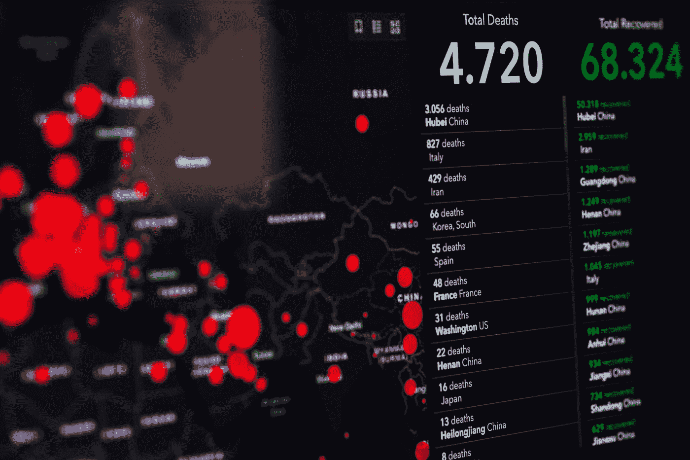

# 如何使用 COVID19Py

> 原文：<https://towardsdatascience.com/how-to-use-covid19py-c3014475283c?source=collection_archive---------58----------------------->



由[马库斯·斯皮斯克](https://unsplash.com/@markusspiske?utm_source=medium&utm_medium=referral)在 [Unsplash](https://unsplash.com?utm_source=medium&utm_medium=referral) 拍摄的照片

## 使用独特的 Python 包获取最新的冠状病毒数据

在整个 COVID19 疫情中，获取和分析足够的数据一直是个问题。到目前为止，像约翰·霍普金斯大学系统科学与工程中心(JHU·CSSE)和《纽约时报》( NYT)这样的机构在向公众提供时间序列和非结构化数据方面做得非常出色。现在，COVID19Py 的创造者们更进一步，为 [@ExpDev07 的 REST API](https://github.com/ExpDev07/coronavirus-tracker-api) 提供了一个极其有用的包装器。该软件包允许用户访问和跟踪受任何冠状病毒影响的人数(如新冠肺炎、新型冠状病毒等)。)

本文旨在向您简要介绍 COVID19Py 0.3.0 中的基本功能和用例。更多信息，请参考 API 的 [Github 库](https://github.com/ExpDev07/coronavirus-tracker-api/blob/master/README.md#picking-data-source)

# 安装和基础知识

在获取数据之前，有几行重要的代码需要运行。

## 安装和导入

```
# Install COVID19 Package in Terminal
$ pip install COVID19PyIn [1]: import COVID19Py
```

## 创建一个新实例来访问数据源

**JHU** 默认数据源来自位于 CSSE JHU 的全球数据库。如果您想使用该数据，则不需要`data_source`参数。

```
In [2]: covid19 = COVID19Py.COVID19()
```

**CSBS** 

```
In [3]: covid19 = COVID19Py.COVID19(data_source="csbs")
```

**NYT** 同样，《纽约时报》也发布了美国冠状病毒病例累计数的数据文件。您可以使用`data_source = "nyt”`参数提取美国县级时间序列

```
In [3]: covid19 = COVID19Py.COVID19(data_source="nyt")
```

# 样本响应

接下来，重要的是要记住所有的输出都是字典格式的。如果您想在 pandas 中使用数据框，那么您必须采取适当的步骤来实现。

## 获取案例总数

当您访问实例中的所有数据时，您最终会得到一个带有两个键的输出:`"latest"`和`"locations"`。最新键显示最近确诊病例、死亡和康复患者的数量。location 键包含每个国家的最新数据，包括纬度、经度和人口数量。

```
In [4]: data = covid19.getAll()# Get same output with timelines as well
In [4]: data = covid19.getAll(timelines=**True**)
```

## 仅获取最新计数

```
In [5]: latest = covid19.getLatest()Out [5]: {'confirmed': 2401378, 'deaths': 165043, 'recovered': 0}
```

运筹学

```
In [5]: data = covid19.getAll()
        latest = data["latest"]Out [5]: {'confirmed': 2401378, 'deaths': 165043, 'recovered': 0}
```

## 仅获取位置值

```
In [6]: location = covid19.getLocations()Out [6]:[{'id': 0,
  'country': 'Afghanistan',
  'country_code': 'AF',
  'country_population': 37172386,
  'province': '',
  'last_updated': '2020-04-20T11:01:05.072895Z',
  'coordinates': {'latitude': '33.0', 'longitude': '65.0'},
  'latest': {'confirmed': 996, 'deaths': 33, 'recovered': 0}},
 {'id': 1,
  'country': 'Albania',
  'country_code': 'AL',
  'country_population': 2866376,
  'province': '',
  'last_updated': '2020-04-20T11:01:05.092994Z',
  'coordinates': {'latitude': '41.1533', 'longitude': '20.1683'},
  'latest': {'confirmed': 562, 'deaths': 26, 'recovered': 0}},
   ...
   ...
```

运筹学

```
In [6]: data = covid19.getAll()
        latest = data["location"]
```

通过使用`rank_by`属性，您甚至可以根据`'confirmed'`、`'deaths'`和`'recovered'`的数量对位置进行排序

```
In [6]: latest = covid19.getLocations(rank_by='recovered')
```

## 选择特定国家

如果您只想查看给定国家的最新案例，那么您只需知道国家代码即可

```
In [7]: location = covid19.getLocationByCountryCode("US")# Get same output with timelines as well
In [7]: location = covid19.getLocationByCountryCode("US",    
                                                    timelines=**True**)# Using the location id instead of country code
In [7]: location = covid19.getLocationById(39)
```

# 结论

越多的公司和组织能够收集和存储冠状病毒数据，我们就能越早找到抗击疫情的模式和方法。那里的大部分数据是跟踪数据，这意味着它只是跟踪确认、死亡和恢复的数量。NYT 和 Twitter 等一些公司已经发布了用于情感分析的非结构化数据，医疗机构也已经能够发布用于诊断和识别的胸片。

***编者按:*** [*走向数据科学*](http://towardsdatascience.com/) *是一份以数据科学和机器学习研究为主的中型刊物。我们不是健康专家或流行病学家，本文的观点不应被解释为专业建议。想了解更多关于疫情冠状病毒的信息，可以点击* [*这里*](https://www.who.int/emergencies/diseases/novel-coronavirus-2019/situation-reports) *。*