# 如何使用交叉验证完成矩阵

> 原文：<https://towardsdatascience.com/how-to-use-cross-validation-for-matrix-completion-2b14103d2c4c?source=collection_archive---------16----------------------->

## 寻找最佳 k 个潜在特征和因子矩阵的逐步交叉验证优化

照片由[施巧灵·佩纳](https://unsplash.com/@jespl?utm_source=medium&utm_medium=referral)在 [Unsplash](https://unsplash.com?utm_source=medium&utm_medium=referral) 上拍摄

## 一般

交叉验证是机器学习中一个众所周知的实践，通常，它是训练过程的一部分，确保我们的模型在不拟合的数据上表现良好。有不同的方法进行交叉验证，但在所有这些方法中，我们都是根据不适合的数据来预测适合的模型。

在我搜索矩阵补全工具时，我发现主要是使用全部数据的例子，并且没有留下测试集。在这篇文章中，我将一步一步地演示如何使用交叉验证在 NMF(非负矩阵分解)算法中找到最佳的 **k** (潜在特征)来完成矩阵中的缺失值。然而，这也可以应用于其他算法。

为了让每个人都在同一页上，矩阵分解是使用线性代数将矩阵分解成其组成部分。任何矩阵 **X** 都可以化简为一对因子矩阵 **A** 和 **Y** ，其中 **X** 是这些矩阵的点积:

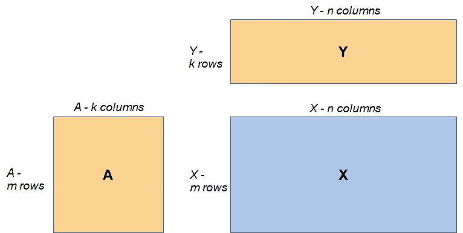

x 矩阵和 A/Y 作为它的因子矩阵

网上关于矩阵分解的信息数不胜数，我就不细说了。当矩阵及其因子矩阵的所有值都非负时，称为 NMF。更多信息见[https://en . Wikipedia . org/wiki/Non-negative _ matrix _ factorization](https://en.wikipedia.org/wiki/Non-negative_matrix_factorization)

这篇文章展示了:

1.如何实现交叉验证以找到最佳 k 个潜在特征

2.如何处理初始因子矩阵的随机性

以下是我工作的基础:

1.Alex Williams 的一个帖子，我从中获得了 NMF 交叉验证的灵感:[http://alexhwilliams . info/itsneuronalbog/2018/02/26/crossval/](http://alexhwilliams.info/itsneuronalblog/2018/02/26/crossval/)，我的帖子**实际上是那个概念的一步一步的实现。**

2.Tautvydas 的 Stackoverflow 答案，其 NMF 优化函数被用作代码的基础:[https://stack overflow . com/questions/22767695/python-non-negative-matrix-factorization-that-handles-both-zero-and-missing-dat](https://stackoverflow.com/questions/22767695/python-non-negative-matrix-factorization-that-handles-both-zeros-and-missing-dat)

代码是用 Python 编写的，并在 Numpy 数组上演示，但可以很容易地修改以用于 Pandas 数据框架。

**什么是‘潜在特征’，为什么我们需要正确的数量？**

对于一个矩阵 **X，**可能有许多对 **A** / **Y** ，每对在**形状**和**值**上有所不同。

为了将讨论集中在**形状**元素上，我们假设 **X** 有 **m** 行和 **n** 列，如上图所示。因此 **A** 和 **Y** 的形状对于 **A** 应该是 **m** 乘 **k** ，对于 **Y** 应该是 k 乘 **n** ，其中 **k** 可以是任意的计数(正整数)。

**k** 代表 **A** 和**Y**的特征数量，但是由于我们只有 **X** ，我们不知道 **k** 的尺寸，因此我们也不知道 **A** / **Y** 的形状。这就是为什么 **k** 所代表的特征被称为**潜在特征**的原因。在下图中我们看到不同对的因子矩阵 **A** / **Y** ，每对都有不同的 **k** ，它们都是有效矩阵:

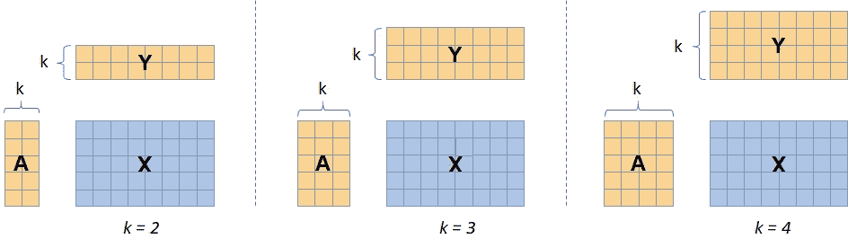

为了演示什么是**潜在特征**，我们来看一个例子。矩阵补全有很多用途，然而最著名的是基于 [Netflix Prize](https://en.wikipedia.org/wiki/Netflix_Prize) 的电影分级推荐系统，其中用户的偏好部分缺失。

下面是一个完整矩阵的例子(蓝色的)，其中的数字代表用户的排名，因子矩阵嵌入了一些特性，在本例中为 3。

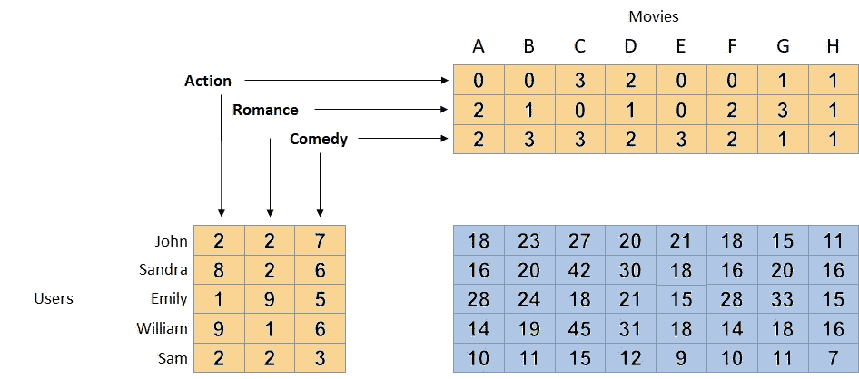

如果约翰喜欢喜剧，而电影 B、C、E 是喜剧，则算法可以“分配”一个特征来表示喜剧偏好，因为有一些支持信息。

想要补全 **X** 中的缺失值，应该选择使用哪个 **k** ？

太小的 **k** 可能会缺少我们需要的信息，导致拟合不足。在这种情况下，添加更多的特性可以告诉我们更多关于缺失值的信息。

对于 **k** 过高的值可能会导致过度拟合。这是因为我们得到了多个解决方案，如下表所示:

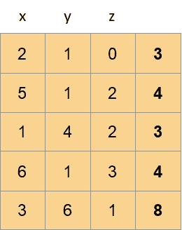

右边的向量不提供任何新信息。它只是其余向量(x+y-z)的线性组合。

**通过交叉验证流程确定 k。**

## 步骤 1-生成样本数据

这里我们创建自己的“缺失数据”。背后是什么？

1.我们希望创建一个完整的表，包括“缺失的值”，这样我们就可以真正看到在过程结束时我们是否很好地完成了这些值。

2.我们希望从 real **A** 和 **Y** 生成表格，这样我们就知道什么样的 **k** 是最优的，并看看我们是否得到这个作为输出。

在打印输出中，我使用了一个小矩阵(10 乘 12)，主要是为了演示方便。然而，为了看到交叉验证的真实效果，我们需要一个更大的矩阵，所以所有的图都取自一个 40×25 的矩阵。两个矩阵都有 5 个潜在特征。

**注意，k 必须小于矩阵的行/列的最小值，否则我们有多个解。**

输出(10 乘 12):

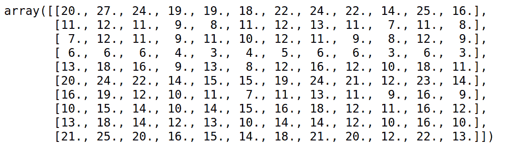

现在，我们随机创建空值来模拟真正的“缺失值”:

输出(10 乘 12):

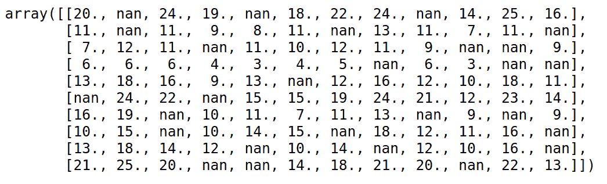

从现在开始，代码与具有缺失值的实矩阵相关。

## 步骤 2 —准备阶段

首先，我们创建空掩码。这是最后一步所需要的，在这一步中，我们用得到的矩阵来填充缺失的值。

现在我们给矩阵加 1(或任何其他数字)。这是为什么呢？

学习阶段从用 0 填充零开始，所以我们想要区分真正的零和用零填充的零。

当然，这只是在矩阵中有零的情况下才有意义。

## 步骤 3-折叠准备

在任何交叉验证中，我们都将数据分开，例如一部分数据被拟合，其余的数据用于测试。

在这里，我们将数据矩阵划分为四个部分，每个部分都作为一个等待测试的集合。矩阵被垂直和水平分成两半，如下图所示。

这满足了一个基本要求，即拟合区域应该分布在所有的行和列上，否则，算法就没有正确的数据可以学习。

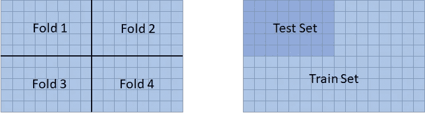

在左手边:分成 4 折。在右侧:折叠 1 作为测试集，其他折叠作为训练集。

我们得到每个折叠的训练和测试误差，然后使用它们的平均值。

我用了 4 折。然而，人们可以使用不同的折叠数，甚至将其发展为一个参数。

在我们的矩阵上应用该函数产生了训练和测试集，以及每个集的 0/1 掩码。例如，当 fold=2 时，我们得到:

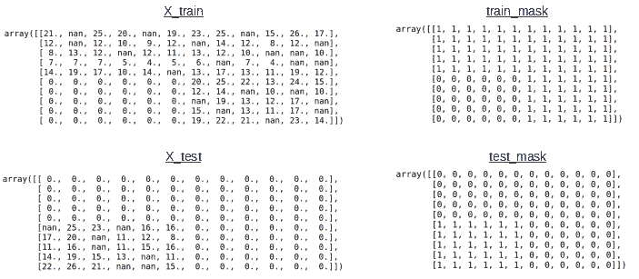

这些掩码仅用于折叠，还不包括空掩码。这将在下一步中与折叠遮罩合并为一个。

## 步骤 4 —交叉验证

交叉验证函数相对较长，所以首先我将它的主要组件写成一个简短的算法:

交叉验证算法流程

**为什么我们要把每个褶皱分成几个周期？**

学习过程从给因子矩阵 **A** 和 **Y** 中的一个分配随机值开始。然后在学习过程中，更新矩阵，直到我们达到最优。

然而，我们不知道我们开始使用的随机矩阵会把我们引向绝对最优还是仅仅一个局部最优。

所以这里我们在几个周期中尝试几个初始随机矩阵，取最佳周期的**端矩阵**。请注意，我们的最佳周期是具有较低**序列误差**(不是测试误差)的周期，因为这仍然是装配阶段而不是测试阶段的一部分。

下图描述了**一折**的几个循环:

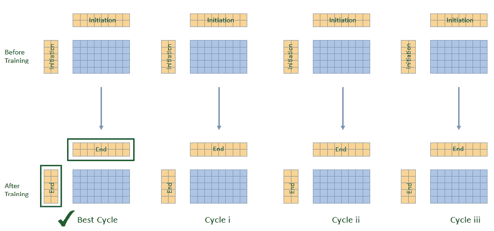

被绿线包围的矩阵将被用于实际学习中，该学习使用已经优化的 **k** (参见步骤 7)。

完整的交叉验证功能有几个部分。下面介绍一些主要的方法。其余的可以在文章底部提到的完整笔记本中找到。

**第一部分:每次折叠的准备** —主要是每次折叠准备面膜。

**第二部分:矩阵初始化** —每个周期初始化 Y，A，X(屏蔽)。还初始化训练和测试误差值。

**第三部分:更新**——每次迭代更新 **A** 、 **Y** 和 **X** 的学习过程。

**第四部分:结论** —收集所有结果，选出每次折叠的最佳周期和平均折叠误差。

## 步骤 5 —运行多个 **k**

这里，我们对不同的 **k** 使用 nmf_cv 函数。在学习期间，我们可以跟踪每个周期的训练和测试误差，以及每个折叠的最佳周期图。

下面是三个有代表性的图和各自的误差——左侧的欠拟合(过低 **k** )、中间的右 **k** 和右侧的过拟合。注意不同之处。

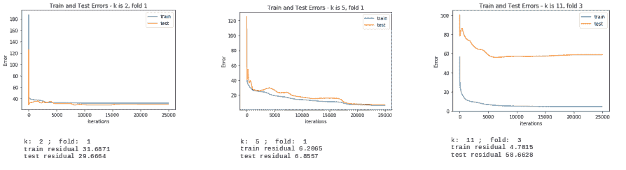

每 k 训练和测试误差的差异

然后我们提取最佳运行:

下图显示了每个 **k** 的训练和测试误差。正如我们所料，最佳的 **k** 是 5，这是由于我们在步骤 1 中创建样本数据时选择的潜在特征。在真实数据中，我们当然不知道这个数字。

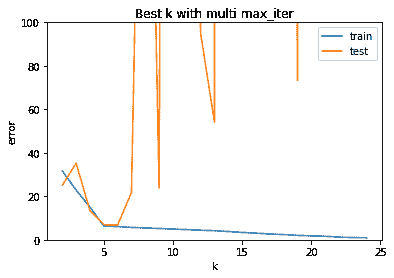

对于某些 **k** (例如 k=8)，测试误差非常高，似乎偏离了“完美”的测试误差曲线。为了克服这个问题，可以使用平方根或对数矩阵，以减少数字，并以此“控制”误差。

## 步骤 6 —捕获 **A** 和 **Y**

如前所述，给定的矩阵 **X** 可能具有完全不同的因子矩阵，不仅在形状上，而且在它们的值上。因此，对于不同的折叠，我们可以在相似的 **X** 矩阵中结束训练过程，但是非常不同的 **A** 和 **Y** 。参见 2×2 矩阵的示例:

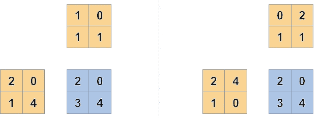

同一 X 矩阵的不同组因子矩阵。

这意味着我们不能只对所有的 **A** 或 **Y** 求平均值。替代方法是使用其中一对(例如来自 fold 0 的 **A** 和 **Y** )。

## 步骤 7 —使用优化的 **k** 和捕获的 **A** / **Y** 矩阵进行训练

这是我们实际使用交叉验证结果的步骤:

-我们使用最佳 k(仅隐含地，A**A**/**Y**的形状假定为右 **k** )

-我们使用末端 A/Y 矩阵。由于这些是端矩阵，我们不必使用非常高的迭代次数。

功能:

我们得到了预测矩阵。我们可以将原始矩阵与预测矩阵(两者的左上角)以及**非空**值的误差进行比较:

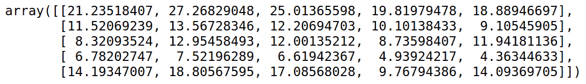

现在是原文:

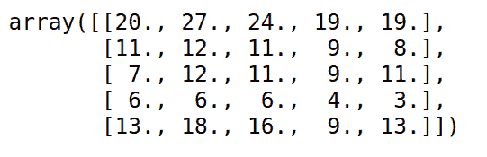

## 步骤 8-检查空值错误

因为我们知道缺失值(我们创建了原始矩阵)，所以我们有机会检查算法预测缺失值的能力。

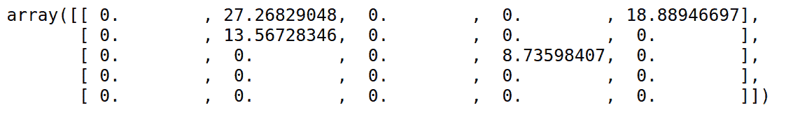

现在是原文:

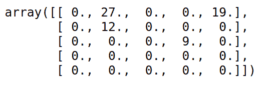

## 步骤 9-合并 NMF 中缺失的值

这里我们得到了完整的矩阵。

## **重新加盖**

如果没有交叉验证，我们就不可能知道要使用的 **k** 潜在特征，并且对于任何更高的 **k** 我们都会获得更好的**列车**性能，因为我们使用了所有的数据。

此外，随机矩阵可能会将我们引向局部优化点，而不是最佳点。通过使用最佳运行的末端 **A/Y** 矩阵，我们确保达到最小误差。

人们可以按原样使用该代码，或者根据特定需要对其进行修改，例如使用另一种算法。

完整的笔记本可以在[https://github . com/ishaytelaviv/cross _ validation _ matrix _ completion/blob/master/cv _ for _ NMF _ sample 1 . ipynb](https://github.com/IshayTelavivi/cross_validation_matrix_completion/blob/master/cv_for_nmf_sample1.ipynb)中找到