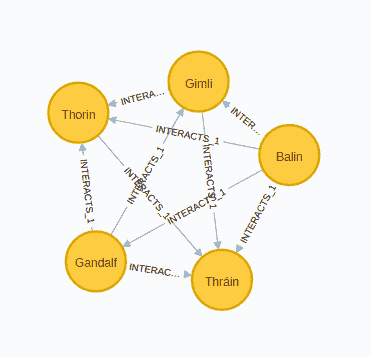
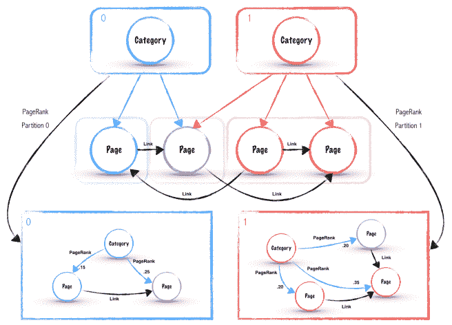

# 如何在指环王社交网络上的 Neo4j 图形数据科学库中使用 Cypher 投影

> 原文：<https://towardsdatascience.com/how-to-use-cypher-projection-in-neo4j-graph-data-science-library-on-a-lord-of-the-rings-social-b3459138c4f1?source=collection_archive---------39----------------------->

## 了解有关 cypher projection 的所有信息，以及如何使用它来投影虚拟图形

继续介绍[上一篇博文](/exploring-the-graph-catalog-feature-of-neo4j-graph-data-science-plugin-on-a-lord-of-the-rings-d2de0d0a023)中的 [Neo4j Graph 数据科学库](https://github.com/neo4j/graph-data-science) graph catalog 特性，其中我们深入研究了[原生投影](https://neo4j.com/docs/graph-data-science/1.0/management-ops/native-projection/)，我们将在这篇博文中了解一下 [Cypher 投影](https://neo4j.com/docs/graph-data-science/1.0/management-ops/cypher-projection/)。它是图形投影的更具表现力的变体，也允许我们投影虚拟图形。

# 图形导入

我们将在 import 语句中使用 APOC 库[中的一些程序。我已经习惯了总是有 APOC 在身边，我甚至很少单独提到它。它包含了许多令人敬畏的程序，很难想象没有它的生活。](https://github.com/neo4j-contrib/neo4j-apoc-procedures/)

# 导入节点

```
LOAD CSV WITH HEADERS FROM
"https://raw.githubusercontent.com/morethanbooks/projects/master/LotR/ontologies/ontology.csv" as row FIELDTERMINATOR "\t"
WITH row, CASE row.type WHEN 'per' THEN 'Person'
                        WHEN 'gro' THEN 'Group'
                        WHEN 'thin' THEN 'Thing'
                        WHEN 'pla' THEN 'Place' END as label
CALL apoc.create.nodes(['Node',label], [apoc.map.clean(row,['type','subtype'],[null,""])]) YIELD node
WITH node, row.subtype as class
MERGE (c:Class{id:class})
MERGE (node)-[:PART_OF]->(c);
```

# 导入关系

```
UNWIND ['1','2','3'] as book
LOAD CSV WITH HEADERS FROM 
"https://raw.githubusercontent.com/morethanbooks/projects/master/LotR/tables/networks-id-volume" + book + ".csv" AS row
MATCH (source:Node{id:coalesce(row.IdSource,row.Source)})
MATCH (target:Node{id:coalesce(row.IdTarget,row.Target)})
CALL apoc.create.relationship(source, "INTERACTS_" + book,
{weight:toInteger(row.Weight)}, target) YIELD rel
RETURN distinct true;
```

# Cypher 投影

使用密码投影的一般语法是:

```
CALL gds.graph.create.cypher(
    graphName: String,
    nodeQuery: String,
    relationshipQuery: String,
    configuration: Map
)
```

节点查询是一个 cypher 语句，用于描述我们想要投影的节点。它必须返回节点的内部 id，并且可选地返回它们的任何属性。另一方面，关系查询描述了我们想要投射的关系。cypher 语句应该返回关系的源和目标节点的内部 id，以及可选的它们的类型和它们的任何属性。

# 整个图表

我们将从一个简单的场景开始，并在内存中投影整个图形。在关系查询中添加列**类型**允许数据科学引擎区分关系类型，这反过来为我们提供了一个在执行算法时过滤关系的选项。

```
CALL gds.graph.create.cypher(
    'whole-graph',
    // nodeQuery
    'MATCH (n) RETURN id(n) AS id',
    // relationshipQuery
    'MATCH (n)-[r]->(m) RETURN id(n) AS source, id(m) AS target, type(r) as type'
```

和之前的博文一样，我们将从弱连通分量算法开始。它用于检查我们的图中有多少孤岛或不连接的组件，这将帮助我们更好地理解不同图算法的结果。此外，有时我们可能希望只在最大的连通分量上运行其他图算法。

```
CALL gds.wcc.stream('whole-graph')
YIELD nodeId, componentId
RETURN componentId, count(*) as size
ORDER BY size DESC limit 10
```

结果

因为在我们的图中只有一个连通分量，所以我们不必担心来自其他图算法的扭曲结果。

## 从目录中删除投影图

每次分析后，我们将从内存中释放投影图。

```
CALL gds.graph.drop('whole-graph');
```

# 无向加权关系图

接下来，我们将投影一个无向加权图。让我们看看[原生投影](https://neo4j.com/docs/graph-data-science/1.0/management-ops/native-projection/)是如何处理无向关系的:

*   `UNDIRECTED`:每种关系都以自然和相反的方向投射

为了使用 cypher projection 生成一个无向关系，我们在两个方向上投影一个关系，有效地允许图形数据科学引擎在两个方向上遍历它。让我们看一下下面的例子，以便更好地理解。我们创建了两个节点，它们之间只有一个连接。

```
CREATE (:Test)-[:REL]->(:Test);
```

为了向两个方向投射关系，我们只需在我们的**匹配**语句中省略关系的方向，就这样。一个微小但至关重要的细节！

```
MATCH (n:Test)-[r]-(m:Test)
RETURN id(n) as source, id(m) as target;
```

结果

我们还将展示一种在节点查询中使用 **UNION** 语句来投影多个节点标签的有利方式。

```
CALL gds.graph.create.cypher(
    'undirected_interactions',
    // nodeQuery
    'MATCH (n:Person) RETURN id(n) AS id
     UNION
     MATCH (n:Thing) RETURN id(n) as id',
    // relationshipQuery (notice no direction on relationship)
   'MATCH (n)-[r:INTERACTS_1|:INTERACTS_2|:INTERACTS_3]-(m)
    RETURN id(n) AS source, id(m) AS target, 
           type(r) as type, r.weight as weight')
```

## 随机行走算法

为了摆脱 PageRank 或 Louvain 等常见的图算法，让我们使用[随机行走算法](https://neo4j.com/docs/graph-data-science/1.0/alpha-algorithms/random-walk/)。本质上，它模拟了一个喝醉的人如何穿过我们的图表。它通常用于 node2vec 算法中。我们定义佛罗多为起始节点，然后随机走五步两次。

```
MATCH (n:Node{Label:'Frodo'})
CALL gds.alpha.randomWalk.stream('undirected_interactions',
    {start:id(n), steps:5, walks:2})
YIELD nodeIds
RETURN [nodeId in nodeIds | gds.util.asNode(nodeId).Label] as result
```

结果

你会得到不同的结果，因为这毕竟是一个随机游走算法。

## 三角形计数和聚类系数

另一个分析社交网络的有用算法是[三角形计数和聚类系数算法](https://neo4j.com/docs/graph-data-science/1.0/algorithms/triangle-counting-clustering-coefficient/)。三角形由三个节点组成，其中每个节点都与另外两个节点有关系。聚集系数是对图中节点聚集程度的度量。这使我们能够估计图表中节点的紧密程度。

```
CALL gds.alpha.triangleCount.write('undirected_interactions',
    {relationshipTypes:['INTERACTS_1'],
     writeProperty:'triangles',
     clusteringCoefficientProperty:'clustering'})
YIELD nodeCount, triangleCount, averageClusteringCoefficient
```

结果

全局或平均聚类系数是 0.54，这意味着我们图表中的人非常紧密。我们也可以看看个体和他们的局部聚类系数。

```
MATCH (p:Person)
RETURN p.Label as person, 
       p.clustering as coefficient, 
       p.triangles as triangles
ORDER BY coefficient DESC LIMIT 5
```

结果

让我们想象一下特伦和他的关系，观察他们是如何形成一个紧密的社区的。



Thrain 的所有联系人也相互影响，因此聚类系数的值为 1.0。

## 从目录中删除投影图

```
CALL gds.graph.drop('undirected_interactions');
```

# 分类页面排名

到目前为止，所有上述图形分析都可以用本地投影来完成。Cypher projection 可以投影仅在查询时存在的图形，或者当我们希望使用比节点标签或关系类型更高级的过滤时。

分类页面排名(Categorical PageRank)是由肯尼·巴斯塔尼(Kenny Bastani)在他的[博客文章](https://neo4j.com/blog/categorical-pagerank-using-neo4j-apache-spark/)中首次提出的概念。我还用图算法库写了一篇关于它的[博文](https://tbgraph.wordpress.com/2018/01/14/neo4j-categorical-pagerank/)。现在是时候用图形数据科学库来展示它了。



来源:[Kenny Bastani](https://www.kennybastani.com/2015/01/categorical-pagerank-neo4j-spark.html)[发布的](https://twitter.com/kennybastani)分类页面排名

背后的想法很简单。如上例所示，我们有一个页面图，这些页面之间有链接，并且可能属于一个或多个类别。为了更好地理解网络中节点的全局 pagerank 分数，我们可以将我们的图分解成几个子图，每个子图对应一个类别，并对每个子图执行 pagerank 算法。我们将结果存储为类别和页面之间的关系属性。这样，我们可以分解哪些类别对 page 的全球 pagerank 得分有贡献。

我们会从假设每一次互动都是积极的背书开始(我知道其实不是，我们就假装吧)。我们将根据角色所属的类别(人类，精灵)把我们的图表分解成几个子图表。例如，在计算男性类别的 pagerank 时，将考虑所有节点。然而，只有来自属于男人阶层的角色的关系才会被考虑。

```
CALL gds.graph.create.cypher(
    'categorical_men',
    // nodeQuery
    'MATCH (n:Person) RETURN id(n) AS id
     UNION
     MATCH (n:Thing) RETURN id(n) as id',
    // relationshipQuery
    'MATCH (c:Class)<-[:PART_OF]-(n)-[r:INTERACTS_1|:INTERACTS_2|:INTERACTS_3]-(m)
     // Use the parameter
     WHERE c.id = $class
     RETURN id(n) AS source, id(m) AS target, 
            r.weight as weight,type(r) as type',
    {parameters: { class: 'men' }})
```

现在让我们在这张图上运行加权 pageRank。

```
CALL gds.pageRank.stream('categorical_men',
    {relationshipWeightProperty:'weight'})
YIELD nodeId, score
RETURN gds.util.asNode(nodeId).Label as name, score
ORDER BY score DESC LIMIT 5
```

结果

甘道夫名列第一，阿拉贡紧随其后。我想知道阿拉贡在第三部中是否得到了大多数人的支持，因为他在最后成为了他们的国王。

```
CALL gds.pageRank.stream('categorical_men',
    {relationshipTypes:['INTERACTS_3'],
     relationshipWeightProperty:'weight'})
YIELD nodeId, score
RETURN gds.util.asNode(nodeId).Label as name, score
ORDER BY score DESC LIMIT 5
```

结果

不出所料，阿拉贡领先。佛罗多已经不在名单上了，因为他在第三部中与所有人都隔离开来，独自和山姆一起走向末日火山。老实说，如果有山姆在你身边，你永远不会感到孤独。

## 从目录中删除投影图

```
CALL gds.graph.drop('categorical');
```

# 虚拟分类图

我们只研究了男人的类别，并计算了特定子图的分类 pagerank。如果我们分别为每个类投影一个子图，这将非常耗时。这就是为什么我们将使用虚拟关系类型在单个命名图中为每个类投影一个子图。在关系查询中，我们可以选择以列**类型**的形式返回我们想要的任何内容。我们将返回原始的关系类型，并结合人的类来创建虚拟的关系类型。这将允许我们计算每个类的分类 pagerank。

```
CALL gds.graph.create.cypher(
    'categorical_virtual',
    'MATCH (n:Person) RETURN id(n) AS id
     UNION
     MATCH (n:Thing) RETURN id(n) as id',
    'MATCH (c:Class)<-[:PART_OF]-(n)-[r:INTERACTS_1|:INTERACTS_2|:INTERACTS_3]-(m)
     RETURN id(n) AS source, id(m) AS target, 
            type(r) + c.id as type, r.weight as weight')
```

我们现在可以计算精灵类的分类 pagerank。

```
CALL gds.pageRank.stream('categorical_virtual', 
    {relationshipTypes:['INTERACTS_1elves','INTERACTS_2elves','INTERACTS_3elves'],
     relationshipWeightProperty:'weight'})
YIELD nodeId, score 
RETURN gds.util.asNode(nodeId).Label as name, score 
ORDER BY score DESC LIMIT 5
```

结果

如果我们想要计算每个类的分类 pagerank 并存储结果，我们可以使用与[最初的博客文章](https://tbgraph.wordpress.com/2018/01/14/neo4j-categorical-pagerank/)中相同的方法，我们将结果保存在类和人之间的关系中。

```
MATCH (c:Class)
CALL gds.pageRank.stream('categorical_virtual',
    {relationshipTypes:['INTERACTS_1'+c.id,'INTERACTS_2'+c.id,'INTERACTS_3'+c.id],
     relationshipWeightProperty:'weight'}) 
YIELD nodeId, score
WITH c, gds.util.asNode(nodeId) as node, score
// 0.15 is the default value for nodes with no incoming links
WHERE score > 0.151
CREATE (c)-[:PAGERANK{score:score}]->(node)
```

现在，我们可以根据类别 pagerank 得分获得每个类的前三名成员。

```
MATCH (c:Class)-[s:PAGERANK]->(p:Person)
WITH c, p, s.score as pagerank
ORDER BY pagerank DESC
RETURN c.id as class,
       collect(p.Label)[..3] as top_3_members
```

结果

佛罗多以四个第一领先，甘道夫三个第一，山姆两个第一。大多数结果都是不言自明的，就像甘道夫领导的矮人班的支持，吉姆利自己是个矮人排在第二位，所以他可能和所有其他矮人都有互动。因为勒苟拉斯经常和吉姆利在一起，所以他排在第三位。另一方面，山姆和弗罗多独自冒险进入兽人土地的中心，与兽人的互动最多(不是真正的代言)。

## 从目录中删除投影图

```
CALL gds.graph.drop('categorical_virtual');
```

# 结论

Cypher projection 非常有表现力，它允许我们投影存储图的任何子图以及只在查询时存在的任何虚拟图。我们大多只是被我们的想象力所限制。亲自尝试一下[图形数据科学库](https://github.com/neo4j/graph-data-science)，如果您有任何建议或反馈，请告诉我们。

和往常一样，代码可以在 [GitHub](https://github.com/tomasonjo/blogs/blob/master/lotr_graph_data_science_catalog/Cypher%20projection%20of%20the%20Graph%20Catalog%20feature%20on%20a%20Lord%20of%20the%20Rings%20network.ipynb) 上获得。