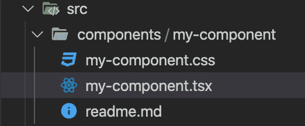
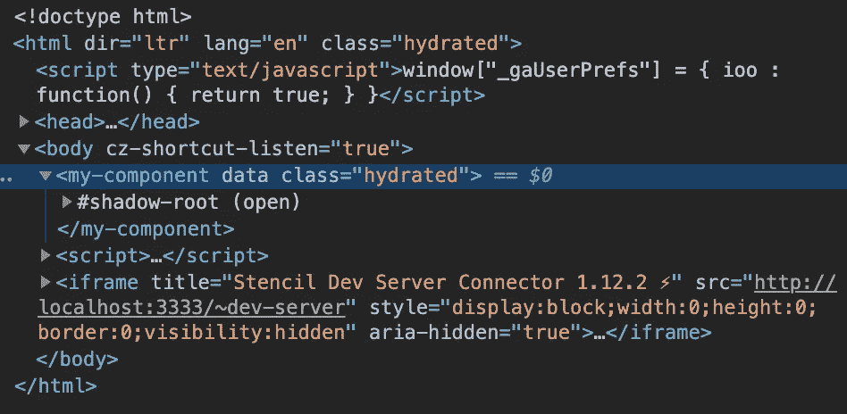
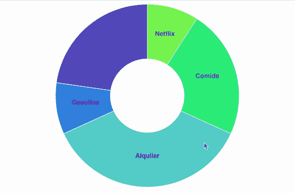

# 如何将 D3js 与 WebComponents 一起使用

> 原文：<https://towardsdatascience.com/how-to-use-d3js-with-webcomponents-a75ae4f980de?source=collection_archive---------30----------------------->


卢克·切瑟在 Unsplash[上的照片](https://unsplash.com/s/photos/metrics?utm_source=unsplash&utm_medium=referral&utm_content=creditCopyText)

## 用 D3js 和模板制作强大的图形

D3 是一个非常棒的用于数据可视化的开源库，最初由 Mike Bostock 开发。它提供了各种各样的工具，允许从零开始或使用预建的模板制作罕见的图形。D3 提供的可能性是无限的，你只需要看看[他们的画廊](https://observablehq.com/@d3/gallery)。

如果你已经使用过 D3，你会知道除了得到惊人的图形之外，你还会得到一堆脚本，用于格式化数据、迭代 SVG 元素、与服务器通信的服务、模型等等..所有这些，很可能，在一个与图表本身联系不紧密的项目中，真是一团糟！

幸运的是， **Web 组件**的世界比以往任何时候都更容易接近，它是创建**自己的图形中枢**以及**封装的**和**可重用的**的完美工具。在任何地方的自定义元素上，您都可以检查 Web 组件是否与您首选的开发框架兼容。

# StencilJS

[Stencil](https://stenciljs.com/) 是一个 web 组件，或者更确切地说是自定义元素，一个使用了大多数已知 Web 开发框架的主要功能的编译器。

这个工具是由[*ionic framework*](https://ionicframework.com/)*开发的，旨在让兼容多种 web 开发框架的组件变得更加容易，朝着一个不可知的框架思想发展。*

*因此，在一个基于 *Web 组件* ( *定制组件*)标准的项目中使用 D3，使用 *StencilJS* 是一个优雅且容易实现的解决方案，如果你想要一个可重用的图形项目的话。*

# *第一步:创建模具项目*

*首先使用`npm`安装最新版本的 *StencilJS* 并初始化基础项目:*

```
*npm install @stencil/core@latest --save-exact
npm init stencil*
```

*用箭头键选择`component`选项，并设置项目名称。Stencil 的 CLI 将创建一个项目文件夹，您会在其中找到包含默认生成的第一个组件`my-component`的`src`文件夹。组件文件夹的`.tsx`文件是包含其主要逻辑的文件。*

**

*生成组件的脚手架*

*现在，通过在控制台的根项目文件夹中键入`start`命令，检查一切是否正常。*

```
*npm run start*
```

*应该会打开一个新的浏览器窗口，显示 **HelloWorld！**的*模版，*的*老实说有点钝。**

# *步骤 2:导入 D3 并创建一个图表*

*启动项目后，代码中的任何更新都将呈现在浏览器上。现在，我们只需要将 D3 导入到组件的代码中。首先，我们需要使用`npm`来安装它:*

```
*npm install d3 --save*
```

*通常，当我们在 Javascript 代码中使用 d3 时，我们一次导入 D3 别名上所有引用，如下所示:`import * from ‘d3.js'`。然而，从上一版本开始，使用*打字稿*，我们将不得不单独导入不同的模块。这有点乏味，但它会帮助我们使应用程序轻量级。在本例中，我们使用的是**饼图**，因此我们将导入以下模块:*

```
*import { select } from 'd3-selection'
import { pie, arc } from 'd3-shape';import { scaleOrdinal } from 'd3-scale';
import { quantize } from 'd3-interpolate';
import { interpolateCool } from 'd3-scale-chromatic';*
```

*   *`select`操作符允许获取我们想要使用或修改的`html`元素的引用。*
*   *`pie`操作员负责生成数据结构，而`arc`是一个工具，允许我们生成绘制图表所需的角度值和比率。*
*   *`scaleOrdinal`、`quantize`和`interpolateCool`运算符帮助我们根据图表各部分的值生成多种颜色。*

*这样，我们就设置好了，我们只需要知道在哪里放置 D3 代码。该组件的基本结构如下所示:*

*Stencil API 提供了许多装饰器和方法，允许我们与组件及其生命周期进行交互。*

# *道具()*

*这个装饰器允许从组件的外部世界获取输入。在我们的例子中，这些将是图表数据。这些输入是在 html 中使用我们的组件时提供的。*

*事实上，如果我们查看项目文件，`src/index.html`包含生成的组件(在本例中只有一个),我们可以看到组件的实例化是这样完成的:*

```
*<my-component data='myData'></my-component>*
```

*其中`myData`是提供给我们的组件的数据结构，因此它可以迭代它并绘制图表。*

# *渲染()*

*该函数在组件被实例化或修改后被调用，负责生成最终将由浏览器呈现的`html`标签。这里我们生成组件的`html`模式，并且我们将包含 SVG 元素，我们将使用它来生成所有的饼状图元素。*

# *componentDidLoad()*

*一旦元素被完全加载，这个方法就被调用，防止我们得到组件的 html 元素的空引用。*

*与 D3 相关的逻辑用于重新生成数据结构和图形元素，必须在这个方法中设置，这样我们可以保证我们可以引用最终的 html。*

# *元素()*

*这个装饰器允许我们访问主组件，从而迭代其子元素`html`。特别是，这是我们使用 D3 的`select`函数并获取 SVG 的参考，我们将在 SVG 中膨胀我们的图表。由于模板的封装，我们必须通过`shadowRoot`访问:*

```
*select(this.element.shadowRoot.querySelectorAll(".chart")[0]);*
```

**

*用于上下文隔离的组件封装*

*一旦我们得到了 SVG 元素的引用，我们可能会忘记所有关于*模板*的事情，开始专门考虑 D3。所以我们添加脚本来生成饼图(或其他),这就是了，我们将准备好我们的 *webcomponent* :*

*使用前面的代码，我们将得到如下图表:*

**

*圆形分格统计图表*

*你可以在 GitHub 链接中找到完整的代码示例。*

# *最后:导出并随处重用*

*一旦我们准备好发布我们的图表，我们只需要建立它，并在我们可能有的任何其他项目中使用它。幸运的是，这个过程非常简单，只需检查`package.json`文件来设置项目名称、版本号、许可证、描述等..并发射`build`命令:*

```
*npm run build*
```

*这将在`www/build`文件夹中生成准备分发的 WebComponent。要在任何其他项目中使用它，您只需将其发布到您的 [npm](https://www.npmjs.com/) 帐户中，即可享受其所有功能:*

```
*npm login
npm publish*
```

# *结论*

**模板*允许创建一个**模块化的工作环境，可导出和访问**主 web 开发框架。这是一个很好的机会来统一多个项目的所有图形元素，并标准化它们的使用，代码回收，html，css 等..*

*如果你在一个与 **UX/UI** 部门持续接触的开发团队中工作，那么模板是开发一个可持续的 [**设计系统**](https://stenciljs.com/docs/what-is-design-system) 的完美地方，它可以一劳永逸地让每个人都轻松。*