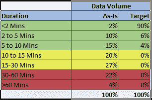

# 如何在绩效改进中使用数据分析

> 原文：<https://towardsdatascience.com/how-to-use-data-analysis-in-performance-improvement-119cfad6414?source=collection_archive---------16----------------------->

## 我关于数据分析如何在实际场景中帮助性能优化的经验，以及我们能从中学到什么。

塞巴斯蒂安·赫尔曼在 [Unsplash](https://unsplash.com?utm_source=medium&utm_medium=referral) 上的照片

想象一下，你需要做一个银行交易，但是网站太慢了。页面加载时间太长，你只能看到一个蓝色的圆圈。

或者想象一下，你正在向关键利益相关者展示一些重要的东西，但是你的屏幕卡住了。你等了几秒钟，又等了几秒钟，但运气不佳。这会非常令人沮丧。

**系统性能问题是一个现实。我们时常会面对它。**

如此多的思想和时间投入到设计一个软件应用程序来增强用户体验。围绕布局、外观和感觉以及可用性特征的每一个细节都会被给予如此多的关注。同样重要的是设计最佳系统性能。

系统应该运行得很快。用户期望在点击一个按钮时，页面应该被加载或者事务应该被处理。体验应该是无缝的。不应该有任何等待时间。否则，你可能会失去一个客户。

尽管进行了精心的设计、开发、测试和实施，但有时软件应用程序会因为各种原因表现不佳——业务可能会发生变化，设计不是最佳的或可扩展的，存在未考虑周全的未知因素，等等。

我们如何实现性能优化？数据分析为什么以及如何帮助提高性能？我们能有一个框架来预测和预防性能问题吗？

我遇到过几个这样的场景，在这篇文章中，我将分享对这些问题的一些看法。

## **如何实现系统性能优化？—从发现问题开始。**

当出现系统性能问题时，每个人都会知道存在性能问题，但大多数时候，他们不知道确切的问题。

服务台会收到一些用户投诉，沮丧的最终用户会直接发来电子邮件，严重的情况下还可能会上报给高级管理层。

在这样一个阶段，一个普遍的趋势是想出一个快速解决方案来尽快解决问题。虽然这是当时的需要，有时可能会奏效很多次，但那不会奏效。

这需要找出真正的问题所在，而这很难。业务部门可能对问题有不同的看法，IT 开发人员和后端管理员可能有不同的看法，管理层可能有完全不同的看法。

性能专家、数据库管理员、应用程序开发人员和功能顾问、业务用户—大多数时候都需要协作才能找到问题的根源。

像下面这样的问题会得到一些启发。

*   性能问题到底是什么？它影响哪个业务场景？
*   有业绩基准吗？预期的性能是什么，现在是什么？偏差是什么？
*   是所有最终用户都发现了该问题，还是特定的业务用户发现了该问题？如果应用程序是全球性的，该问题是特定于任何地理区域还是适用于任何地方？
*   系统性能是否在一天或一周的特定时间降级？有什么模式吗？
*   用户如何访问软件应用程序？通过办公室互联网？通过 VPN？还是家庭网络？可能有几种变化。
*   它会影响哪些顶级场景？有影响的场景重要吗？有时候，没有关联。
*   该问题是否可重现？

可能会有很多这样的问题。有了正确的问题集，你就能洞察如何找到真正的问题。

## 数据分析有什么帮助？

一旦我们从用户、IT 开发人员、支持人员和管理人员那里收集了信息，我们就会比以前更好地了解问题。然而，在大多数情况下，我们并不真正知道确切的问题。

是因为软件设计不好还是编码不好？系统资源是否过低？交易量的大幅增长是否导致了该问题？企业是否通过遵循不应该做的情景和行为导致了问题？仍然会有许多这样的问题，我们仍然需要找到答案。

这是由多种原因造成的。我见过没有人有一个完整的图片的情况。每个利益相关者都从他们的有利角度来看待问题，这可能是也可能不是正确的观点。但我们确实意识到了问题的严重性，并打算继续前进。

这就是数据分析大有帮助的地方。数据不会说谎。如果订单处理缓慢，数据会显示—对于特定的订单，一天中的什么时间、什么时间等等，您可以深入查看并找到大量关于问题何时开始、发生了什么变化等等的信息。

我将用一个例子来说明这一点。

我曾在一个为业务运营实施了 Oracle 电子商务套件 ERP 和 Oracle 移动现场服务(MFS)应用程序的环境中工作过。

Oracle EBS 数据库将拥有企业所需的所有数据。现场工作人员会定期将他们的服务请求信息同步到他们的笔记本电脑上，以便为他们的客户提供服务。这个同步过程将在 Oracle MFS 和 Oracle EBS 之间后台运行。

这些数据需要是实时的，最大滞后时间为 5-10 分钟，不能超过这个时间。同步过程需要非常好地执行，否则现场工作人员将无法获得必要的数据来为客户服务。

在这种情况下，该系统表现不佳。现场工作人员多次抱怨同步过程缓慢。他们很沮丧。

大多数用户在全球范围内报告了这个问题。他们说，有时他们不得不等几分钟，有时甚至几个小时。这不仅影响了他们的工作，甚至影响了他们的个人生活。

每个人都有自己的想法和解决问题的方法。甚至像查询调优、增加基础设施资源(如 CPU、内存等)这样的短期修复。没有一件事长久有效。

我们需要的是后退一步，理解到底是什么问题，并永远解决它。这就是数据分析发挥作用的地方。

作为数据分析结果的模型。在那之前，没有数据模型来显示性能问题。在集成场景中达到这一点有点棘手，但是下面这个简单的视图帮助了所有的利益相关者，如下所示。

**样本性能数据分析汇总**

正如您在上面看到的，对于数据同步，业务的可接受限制是不到 2 分钟，即使对于较大的数据集，也不会超过 10 分钟，但实际上，73%的数据同步花费的时间超过 10 分钟。需要进行大规模的改进。

在那之前，没有人知道这个数据。每个人都有自己的看法！

业务用户认为问题比这更糟糕，而 IT 开发人员认为情况比这更好，真正的问题在两者之间。

虽然这看起来可能是一个简单的结果，但在实际场景中，很难得出一个简单的视图。保持事情简单是困难的。连这种简单的观点都没有人有过！

下一步，我们在与利益相关方的讨论中明确提出了目标— 90%的数据同步在不到 2 分钟内完成，6%在 2 到 5 分钟内完成，4%在 5 到 10 分钟内完成。

> **令人惊讶的是，这样的数据分析**甚至在纯粹的**技术问题上帮助了各种利益相关者。我在 IT 开发人员级别、业务用户社区级别，甚至在程序委员会会议上都看到了这一点。**

我们是否应该继续向其他全球地区推广？这可能需要多长时间来修复？我们能否在商定的 SLA 内为客户提供服务？数据分析和趋势可以回答很多问题。

一旦建立了这种关系，就可以用通俗易懂的语言分享和交流现状和目标，这样即使是非技术人员也可以很容易理解。

一旦确定了问题，就成功了一半。

非常重要的是，要清楚地识别、陈述和沟通问题，将所有利益相关者聚集在一起，避免含糊不清。这就产生了朝着目标努力的积极性。

在这种情况下，有许多解决方案可以实现，这超出了本文的范围，但是简单地说，架构师、开发人员、业务分析人员和用户都参与了这项工作。

确定执行时间超过 15 分钟的消耗时间最多的前 10 个 SQL 查询，通过重写它们、通过索引优化执行或者改变执行计划和整体性能调优来调优它们。

另一种方法是分批处理。将整体执行从串行处理拆分为并行处理，创建线程。提高每个线程的执行时间。另一个解决方案是减少由于数据量造成的网络延迟。

这些解决方案的组合有助于解决问题并提高这方面的性能。上述数据分析也有助于验证优化后的结果是否令人满意。

## 性能分析的预测模型

我在生产环境中遇到过各种性能问题。有时，一个 SQL 查询表现不佳会影响整个系统。发生这种情况是因为一次夜间收集统计数据批处理程序运行改变了查询的执行计划。

在另一个例子中，订单发货过程严重滞后，影响了仓库的员工。尽管采取了措施，我们还是经常面临这种情况。

性能专家可以通过应用更好的执行计划、SQL 概要文件等，快速识别并修复这种情况。

我发现有用的是有一个用于性能监控和预先预防潜在问题的仪表板。

> 这很棘手，但是在这个方向上的努力对构建性能最好的应用程序大有帮助。该系统可以具有基于过去数据和趋势的智能和预测能力，以预测性能问题。

比方说，该系统可以预测比平常高得多的流入数据量，我们可以建立智能来警告下游的潜在性能问题，并可能修复它们。

构建数据分析框架和仪表板非常重要，这样我们就可以定期进行分析，根据需要提醒管理员、架构师和企业。模拟数据量增长，制定归档和清除策略，选项非常多。

## **最终想法**

绩效改进的整个过程没有固定的模式。成功解决一种问题的方法可能不适合另一种问题，尽管它可能看起来像一个类似的问题。

正如系统性能问题是一个设计和技术问题一样，解决方案需要更多的人类参与以及对期望和情绪的管理。我们需要在实际的环境中与真实的人一起工作。

> 这个练习一部分是软件工程，一部分需要广泛的技能，这些技能是艺术、交流、人文以及技术的结合。

数据分析不仅有助于确定问题的根源，而且有必要让所有利益相关者达成共识，管理预期并交付结果。因此，当我们着手改进性能时，我们必须给予这一点适当的时间和关注。

***(如果你发现上面的文章有用，你可能会发现下面的也很有用*** [***如何解决复杂问题的方法***](/how-to-approach-solving-complex-problems-797cb0f29418)***)***