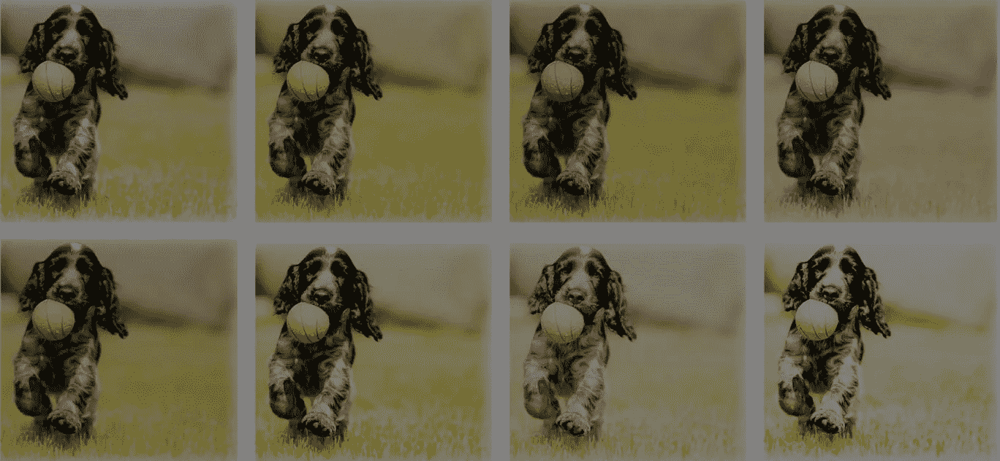

# 如何使用数据扩充将图像数据集扩大 10 倍

> 原文：<https://towardsdatascience.com/how-to-use-data-augmentation-to-10x-your-image-datasets-dab42858be55?source=collection_archive---------34----------------------->

## 图像数据扩充:基本数据操作、GANs 和元学习

众所周知，机器学习模型需要数据来训练。没有[训练数据](https://lionbridge.ai/services/ai-training-data/)，再复杂的算法本质上也没用。那么当你没有足够的数据时，你会怎么做呢？

多年来，研究人员开发了各种巧妙的解决方案。数据扩充是这些解决方案之一。**我们没有试图寻找和标记更多的数据点，而是根据现有的数据构建新的数据点**。

等等？我们能做到吗？我们当然可以。尽管这并不总是容易的，也不一定能产生最好的结果，但它仍然是一个可行的选择。

使用数据扩充方法扩展数据集不仅有助于应对有限数据的挑战。它还可以减少过度拟合并提高我们模型的泛化能力，因为它增加了我们训练集的多样性。

所以让我们切入正题:我们如何执行数据增强？

我认为下面的[图片说明了一切。在本文中，我们将关注图像增强，因为它是当前最活跃的研究领域，但这些技术中的大多数可以应用于所有类型的数据。](https://link.springer.com/article/10.1186/s40537-019-0197-0)

来源:[https://link.springer.com/article/10.1186/s40537-019-0197-0](https://link.springer.com/article/10.1186/s40537-019-0197-0)

# 基本图像操作

要做的第一件简单的事情是对图像执行几何变换。你可能会认为机器学习可以很容易地区分两个相同的不同旋转的图像，但它不能。

来源:[相册:快速灵活的图像增强](https://arxiv.org/pdf/1809.06839v1.pdf)

图像翻转、裁剪、旋转和平移是一些显而易见的第一步。我们还可以使用对比度、锐化、白平衡、色彩抖动、随机色彩处理和许多其他技术(称为光度变换)来改变图像的色彩空间。如果你曾经使用过 Instagram 滤镜或 Snapseed，那么你就会明白我在说什么。你可以随心所欲地发挥创造力。

此外，你可以将图像混合在一起，随机擦除图像的片段，当然，也可以以各种方式将以上所有内容结合起来。

# 使用机器学习的数据扩充

除了基本的图像处理，越来越多的工程师开始使用机器和深度学习技术来增加他们的数据。可以这么想:我们可以用机器学习模型产生更多的数据来训练更多的机器学习模型。一些最有前途的作品如下:

# 特征空间增强和自动编码器

在上面的例子中，我们在输入空间上变换图像。我们还可以在特征空间中应用变换。

通过神经网络，我们可以非常有效地将高维输入(如图像)映射到低维表示(称为特征或潜在空间)中。可以把它想象成把一个三维张量编码成一个 1D 向量，而不会丢失太多信息。在几个维度上进行图像编码使得执行增强更加容易。

许多有趣的论文提出了不同的方法，例如将 k 个最近的邻居连接在一起，添加噪声，插值等等。

[自动编码器](http://ufldl.stanford.edu/tutorial/unsupervised/Autoencoders/)已经证明是提取特征空间表示的最佳选择。自动编码器是一种特殊类型的神经网络，它试图重建输入。它们由两个网络组成，一个编码器和一个解码器。编码器接收输入，并将其编码为低维向量(特征空间)。解码器获取该向量，并尝试重建原始输入。

通过这样做，中间的潜在向量包含了关于数据集的所有信息，可以提取出来做各种事情，包括数据扩充。

# 基于 GAN 的数据增强

生成建模是目前最令人兴奋的技术之一，因为它可以生成全新的图像。生成模型可以在数据中生成新的模式，因为它们学习数据的分布，而不是它们之间的边界(这在大多数机器学习模型中很常见)。

在那个方向，[【生成对抗网络(GAN)](https://theaisummer.com/gan-computer-vision/) 已经成为业界和研究的标准。GANs 由两个网络组成，即发生器和鉴别器。生成器的工作是产生除了噪声以外没有任何输入的假数据。第二个模型，鉴别器，接收真实图像和伪图像(由生成器产生)作为输入，并学习识别图像是伪图像还是真实图像。

随着这些网络相互竞争，同时训练它们(在一个称为对抗训练的过程中)，魔法开始了:

生成器在图像生成方面变得越来越好，因为它的最终目标是欺骗鉴别器。反过来，鉴别器在辨别真假图像方面变得越来越好，因为它的目标是不被愚弄。结果是来自发生器的难以置信的真实的假数据。

GANs 制作了一些我们见过的最真实的图像和视频。还记得深度假货吗？那都是甘斯的工作。那么，为什么不把它们用于数据增强，而不是在《闪灵》中用金凯瑞取代杰克·尼克尔森呢？

# 元学习

最后但同样重要的是，我们有[元学习](https://lilianweng.github.io/lil-log/2018/11/30/meta-learning.html)。元学习是一个相对较新的领域，在这个领域中，我们使用神经网络来优化其他神经网络，方法是调整它们的超参数、改进它们的布局等等。在数据扩充方面，事情变得有点复杂。

简单来说，我们使用分类网络来调整增强网络，以生成更好的图像。

看看下面的图像:通过向增强网络(很可能是 GAN)输入随机图像，它将生成增强图像。增强图像和原始图像都被传递到第二个网络，该网络对它们进行比较，并告诉我们增强图像有多好。重复这个过程后，增强网络在生成新图像方面变得越来越好。

来源:[使用深度学习的图像分类中数据增强的有效性](https://arxiv.org/pdf/1712.04621.pdf)

当然，这种方法不是唯一可用的方法，但它是该领域不同研究论文的一个很好的起点。

# 结论

数据扩充绝非易事。已经有不少有趣的作品(这里是其中的一个[集合](https://paperswithcode.com/task/data-augmentation)，但是仍然有很大的改进空间。例如，我们仍然可以提高 GANs 样本的质量，找到使用元学习的新方法，也许还可以建立不同增强技术的分类法。

当然，我们仍然可以发现在其他形式的数据中使用这些技术的新方法，比如文本、表格数据、图表数据等等。为什么不扩大范围呢？强化学习怎么样？还是搜索算法？舞台是你的。

*最初发布于*[*lionbridge . ai*](https://lionbridge.ai/articles/data-augmentation-with-machine-learning-an-overview/)*—一家为许多世界上最大的公司和成功的初创公司提供数据注释和收集服务的提供商*