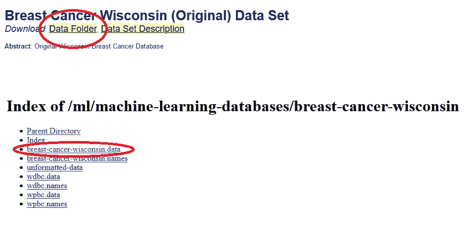
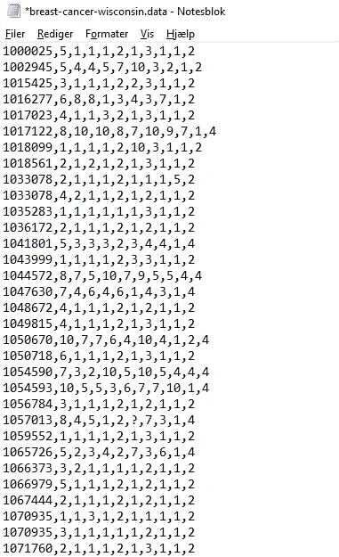
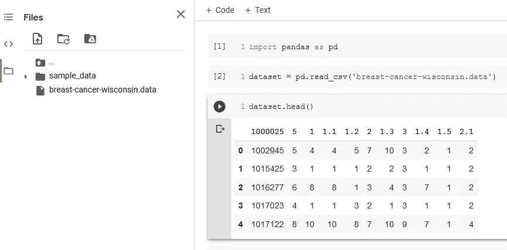
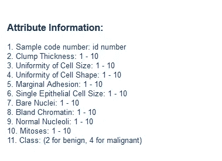
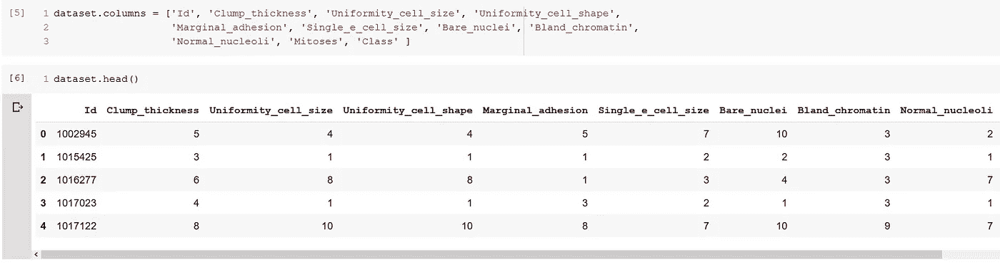

# 如何使用。来自 UCI 的数据文件

> 原文：<https://towardsdatascience.com/how-to-use-data-files-from-uci-68b740b4719d?source=collection_archive---------11----------------------->

## 不要被恐惧吓倒。数据后缀，这比你想象的要简单！


梅勒妮·德雷维克在 [Unsplash](https://unsplash.com?utm_source=medium&utm_medium=referral) 上的照片

你将学习如何使用来自 UCI 的**的数据集。数据**文件类型在这篇短文中。

## 哪里可以找到数据？

**Kaggle.com**是寻找用于数据科学项目的数据的绝佳选择。该网站充满了有趣的数据集、其他科学家的笔记本和教程。我在 **Kaggle** 上遇到的所有数据集都已经**。csv** 文件，这个和熊猫一起工作的时候很方便。

你可能会想知道(至少我是这样想的)Kaggle 是不是唯一可以找到数据的地方。

**提示:**其实不是！

你还会在 [UCI 机器学习知识库上找到令人惊叹的数据集。](https://archive.ics.uci.edu/ml/index.php)一个有趣数据集的例子是 [**乳腺癌威斯康星(原始)数据集**](https://archive.ics.uci.edu/ml//datasets/Breast+Cancer+Wisconsin+%28Original%29) 。

我最近想使用这个精确的数据集来练习我的分类技能。然而，我很快遇到了一些麻烦(至少我是这么认为的)。我下载的数据包含在一个**中。数据**文件…


显示数据集的名称和文件扩展名的 Windows 资源管理器屏幕截图。

你是如何处理这件事的？
我当然不知道。

因为我只和**合作过。csv** 文件(我是一个相对较新的数据科学家)我所知道的是如何使用 pandas **read_csv()** 函数将我的数据集导入到数据框架中。

[下载](https://archive.ics.uci.edu/ml//datasets/Breast+Cancer+Wisconsin+(Original))数据首先点击数据文件夹，这将带你进入第二页(下图的下半部分)，在这里你点击你想要下载的文件。



如何从 UCI 下载数据

**。数据**文件可用 **Microsoft Excel** 或**记事本打开。** 我试着做了后者:



用**记事本**打开的数据文件

可以看到所有的数据点都是用逗号分隔的！

很自然地，我尝试在 **Google Colab** 中实现数据。我很好奇它是否会起作用。



如您所见，使用 **read_csv()** 将数据读入数据帧没有任何问题。

这真的说明了我觉得熊猫有多厉害！

我认为还缺少一件小事。列名。所以让我们加上这些。



截图来自 UCI 乳腺癌-威斯康辛州-原文

在 UCI 的一个数据集的页面上向下滚动一点，你会找到**的属性信息**。这为相应数据集中的特征提供了名称。现在，我们可以将它们添加到我们的数据框架中。

使用**将列名添加到数据框架中。DataFrame 上的 columns** 属性。
看一看:



带有列名的数据框架的屏幕截图

如果您想亲自尝试，以下是来自 Google Colab 的所有代码(您必须从 UCI 下载数据并上传到 Colab 文档):

```
import pandas as pd

dataset = pd.read_csv('breast-cancer-wisconsin.data')

dataset.columns = ['Id', 'Clump_thickness', 'Uniformity_cell_size', 'Uniformity_cell_shape', 'Marginal_adhesion', 'Single_e_cell_size', 'Bare_nuclei', 'Bland_chromatin', 'Normal_nucleoli', 'Mitoses', 'Class']

dataset.head()
```

***你知道吗？***
这个。**数据**文件类型实际上是文本文件。它被一个名为 *analysis studio、*的数据挖掘软件所使用，然而该程序已经不再被开发*(来源:*[*Fileinfo*](https://fileinfo.com/extension/data)*，访问时间:2020 年 8 月 15 日)*。

我希望这篇短文对你有用。我很高兴我现在知道我可以使用**。来自 UCI 的数据**文件没有问题！

*坚持学习！
—雅各布·托夫加德·拉斯姆森*