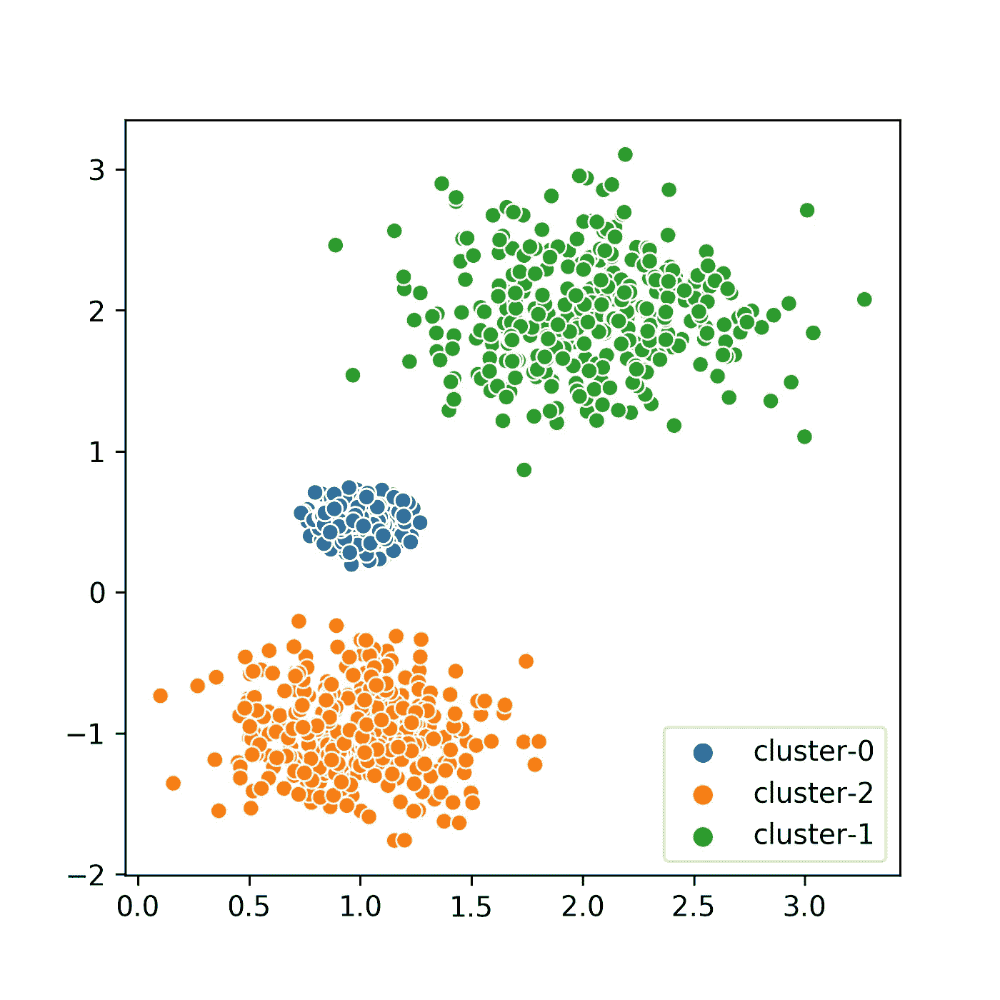
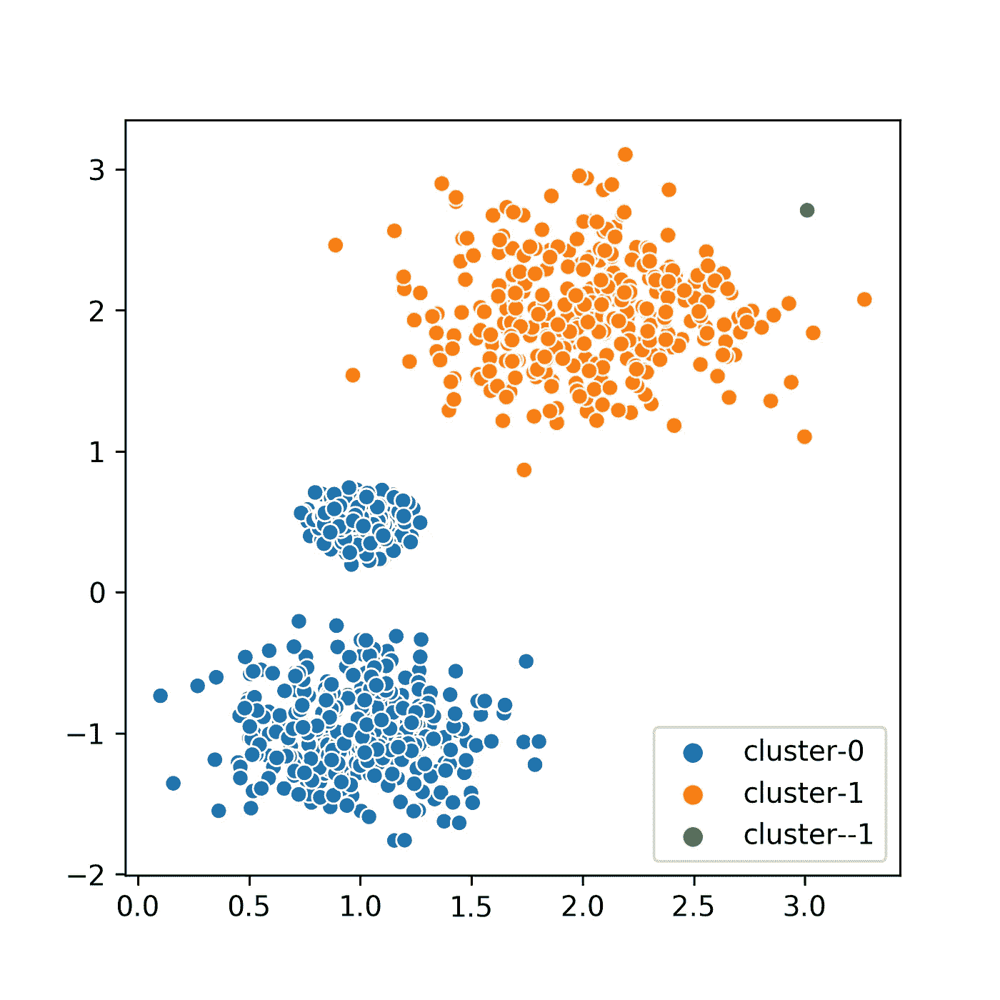
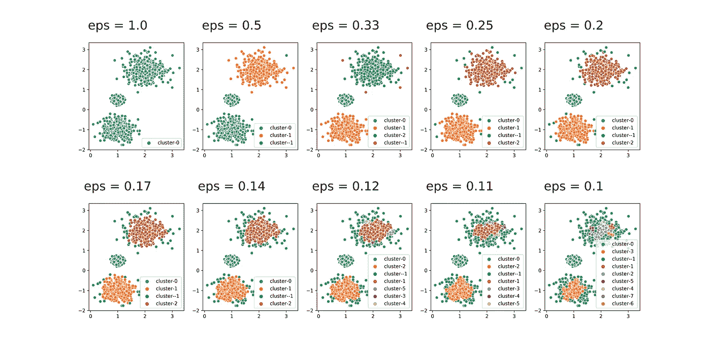
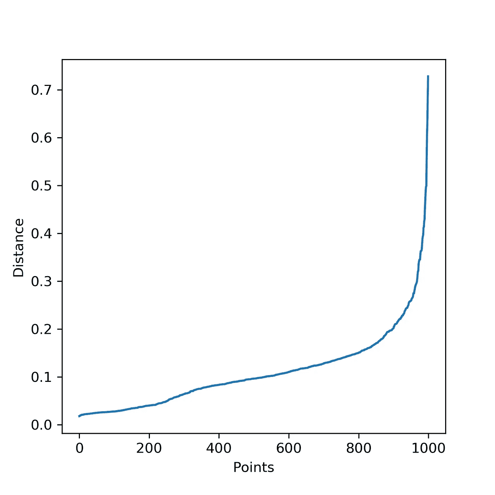
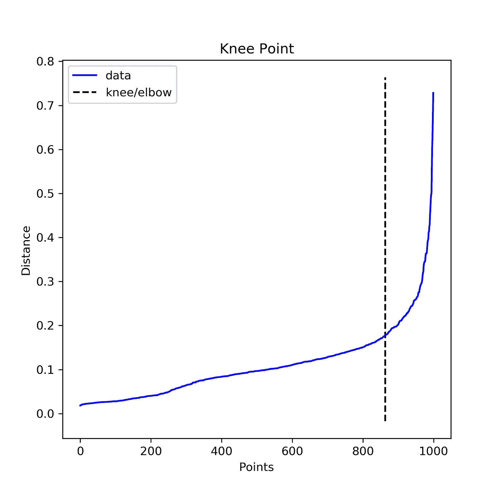
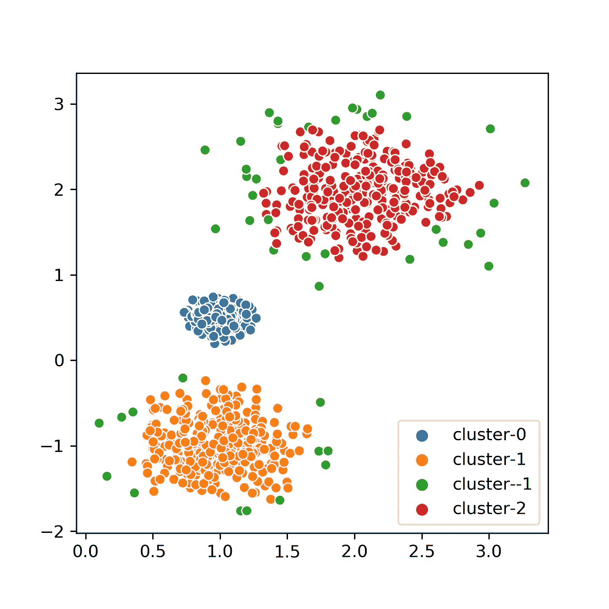

# 如何有效地使用 DBSCAN

> 原文：<https://towardsdatascience.com/how-to-use-dbscan-effectively-ed212c02e62?source=collection_archive---------3----------------------->

## 有效使用最常引用的聚类算法的完整指南

[DBSCAN](https://dl.acm.org/doi/10.5555/3001460.3001507) 是一个极其强大的聚类算法。首字母缩写代表**带噪声应用的基于密度的空间聚类**。顾名思义，该算法使用密度来聚集空间中的点以形成簇。该算法一旦被正确实现就可以非常快。然而，在本文中，我们更愿意讨论优化 DBSCAN 的参数，以获得比算法实现本身更好的效用。(DBSCAN 的实现非常简单。更难的部分，如果有的话，将是为邻居查找结构化数据。)

在我们开始之前，确保你手头有这些包裹。

```
numpy
sklearn
matplotlib # for visualization
seabron # for pretty visualizations
kneed # for our computations
```

# 连续的例子

让我们首先创建一组数据，它可以复制一组适合我们分析的数据点。Python 对它的类库非常慷慨。为了生成数据，我们将使用 **sci-kit learn** 库的 **make blobs** 函数。

```
from sklearn.datasets import make_blobs
import seaborn as sns
import matplotlib.pyplot as plt
import numpy as npcenters = [[1, 0.5], [2, 2], [1, -1]]
stds = [0.1, 0.4, 0.3]
X, labels_true = make_blobs(n_samples=1000, centers=centers, cluster_std=stds, random_state=0)fig = plt.figure(figsize=(10, 10))
sns.scatterplot(X[:,0], X[:,1], hue=["cluster-{}".format(x) for x in labels_true])
```

在这里，我创建了 3 个数据块。我们可以看到这些数据块的可视化，如图 1 所示。在这个例子中，我故意创建了 3 个不同密度的集群来增加集群的难度。



图一。原始集群的可视化

# DBSCAN 及其参数

DBSCAN 有几个参数，其中有两个非常重要。第一个是 ***eps*** 参数，另一个是***min _ points(min _ samples)***。后者指的是将一个点视为密集区域或有效聚类所需的相邻点的数量。通常，我们将其设置为对数据集和数据中存在的维度数量有意义的值。这将决定被识别的异常值的数量。不过这个参数没有 ***eps*** 那么关键。

## DBSCAN 的ε参数

DBSCAN 最重要的参数可以确定为 ***eps*** 。这是一个点选择其邻居的最远距离。因此，直觉上这将决定一个点将发现多少个邻居。虽然我们可以为 min_points/min_samples 提供一个默认值，但我们不能为 eps 提供默认值。这将取决于数据本身的分布。让我们用数据集的一些猜测值进行 DBSCAN。代码和可视化(图 2 中)如下所示。

```
db = DBSCAN(eps=0.5, min_samples=10).fit(X)
labels = db.labels_fig = plt.figure(figsize=(10, 10))
sns.scatterplot(X[:,0], X[:,1], hue=["cluster-{}".format(x) for x in labels])
```



图二。eps=0.5 时的 DBSCAN

# 调整 EPS 参数

从上一张图中我们可以清楚地看到，两个集群已经合并在一起。这很糟糕。这种情况会降低真实集群应用程序的召回率。我们再来试试变 ***eps*** 集群。代码和可视化效果(如图 3 所示)如下所示。

```
import numpy as np
import seaborn as sns
import matplotlib.pyplot as plt
from sklearn.cluster import DBSCANfig = plt.figure(figsize=(20, 10))
fig.subplots_adjust(hspace=.5, wspace=.2)
i = 1for x in range(10, 0, -1):
    eps = 1/(11-x)
    db = DBSCAN(eps=eps, min_samples=10).fit(X)
    core_samples_mask = np.zeros_like(db.labels_, dtype=bool)
    core_samples_mask[db.core_sample_indices_] = True
    labels = db.labels_

    print(eps)
    ax = fig.add_subplot(2, 5, i)
    ax.text(1, 4, "eps = {}".format(round(eps, 1)), fontsize=25, ha="center")
    sns.scatterplot(X[:,0], X[:,1], hue=["cluster-{}".format(x) for x in labels])

    i += 1
```



图三。不同 ***eps*** 值下的 DBSCAN

可以看到我们在 ***eps=0.1*** 和 ***eps=0.3*** 之间打了一个甜蜜点。 **eps** 小于该值的值有太多噪声或异常值(以绿色显示)。请注意，在图像中，我通过将代码中的分母从 10 增加到 1 来减少 ***eps*** 。我们怎样才能自动做到这一点？

# 调整每股收益值的系统方法

由于 ***eps*** 数字与预期发现的邻居数量成正比，我们可以使用最近邻居来对 ***eps*** 达成一个公平的估计。让我们计算一下最近的邻居。

```
from sklearn.neighbors import NearestNeighborsnearest_neighbors = NearestNeighbors(n_neighbors=11)
neighbors = nearest_neighbors.fit(X)
distances, indices = neighbors.kneighbors(X)distances = np.sort(distances[:,10], axis=0)fig = plt.figure(figsize=(5, 5))
plt.plot(distances)
plt.xlabel("Points")
plt.ylabel("Distance")plt.savefig("Distance_curve.png", dpi=300)
```



第 10 个邻居的距离变化

请注意，在最近邻计算中，点本身将作为第一个最近邻出现。所以我们寻找 11 个最近的邻居。我们对到第 10 个最近邻居*的距离进行排序，并绘制距离变化。我们可以看到，肘点出现在*和 ***0.3*** 之间的某处。这正是我们所期待的，不是吗？考虑到我挑选 10 作为用于聚类的 ***min_samples*** 值，我选择第 10 个邻居。希望到目前为止有意义。**

# *检测肘点的膝盖定位器*

*[Ville Satopaa](https://ieeexplore.ieee.org/author/37704602300) 等人在 2011 年提交了论文“ [**大海捞针:检测系统行为中的拐点**](https://doi.org/10.1109/ICDCSW.2011.20) ”。在本文中，出于检测 ***肘点*** (或 ***膝点*** )的目的，我将使用他们的 python 库[***kneed***](https://pypi.org/project/kneed/)。我们可以使用下面的代码来查找和绘制拐点。*

```
*from kneed import KneeLocatori = np.arange(len(distances))
knee = KneeLocator(i, distances, S=1, curve='convex', direction='increasing', interp_method='polynomial')fig = plt.figure(figsize=(5, 5))knee.plot_knee()
plt.xlabel("Points")
plt.ylabel("Distance")

print(distances[knee.knee])*
```

**

*拐点图*

*我们可以看到通过这种方法检测到的拐点在距离 0.178 处。现在我们可以用这个值作为我们的 ***eps*** 来看看我们新的集群看起来会是什么样子。*

**

*带自动检测 Eps 的 DBSCAN*

*我们可以看到，我们对实际的聚类有一个合理的估计。这对于研究工作来说通常已经足够了。如果不存在离群点是该场景的直观假设，则可以简单地使用计算出的最近邻居来将离群点(称为`cluster--1`)重新分配给检测到的聚类。*

# *限制*

*这种方法有几个隐含的假设。*

1.  *所有集群的密度都是相同的。*
2.  *聚类大小或标准差是相同的。*

*当我们考虑用于膝部计算的相同邻居级别时，这些假设是隐含的。但是，在原始数据中，我们可以清楚地看到密度并不相同。这就是我们观察到一些异常值的主要原因，即使我们在创建斑点时使用固定的标准偏差来分布这些点。此外，修复这些问题超出了本文的范围。*

# *最后的想法*

*我附上了一个 jupyter 笔记本，上面有本文中的例子使用的完整代码。您可以通过下面的链接访问该笔记本。*

*我希望你喜欢阅读我的文章，就像我喜欢写作一样。请在您的研究工作中尝试这些方法。这对我帮助很大。*

*感谢阅读！*

*干杯！😊*