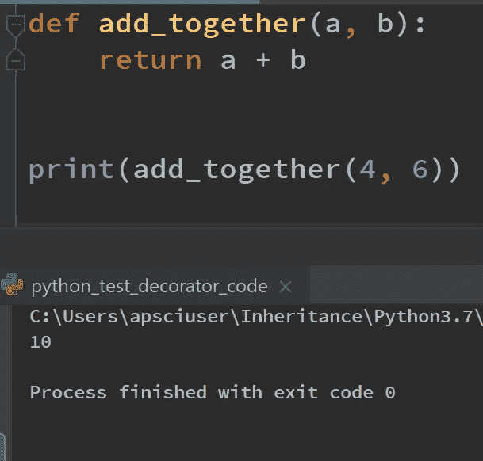
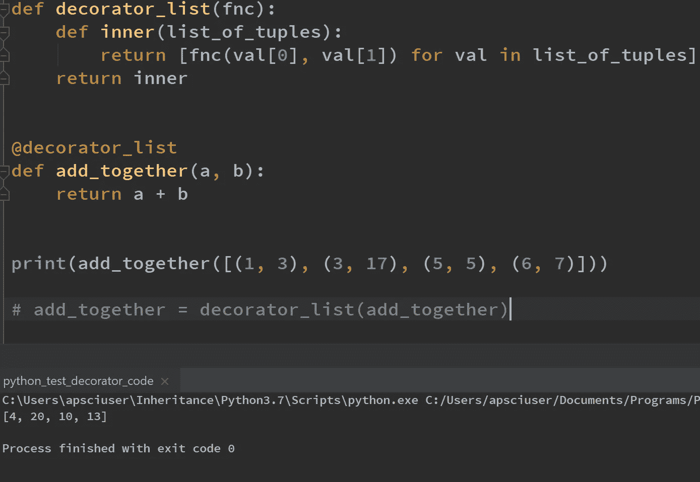
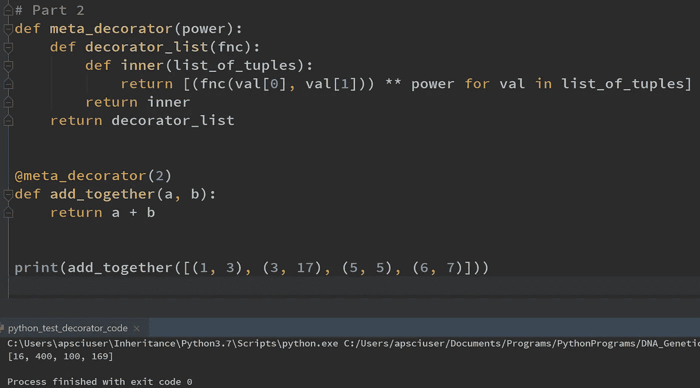
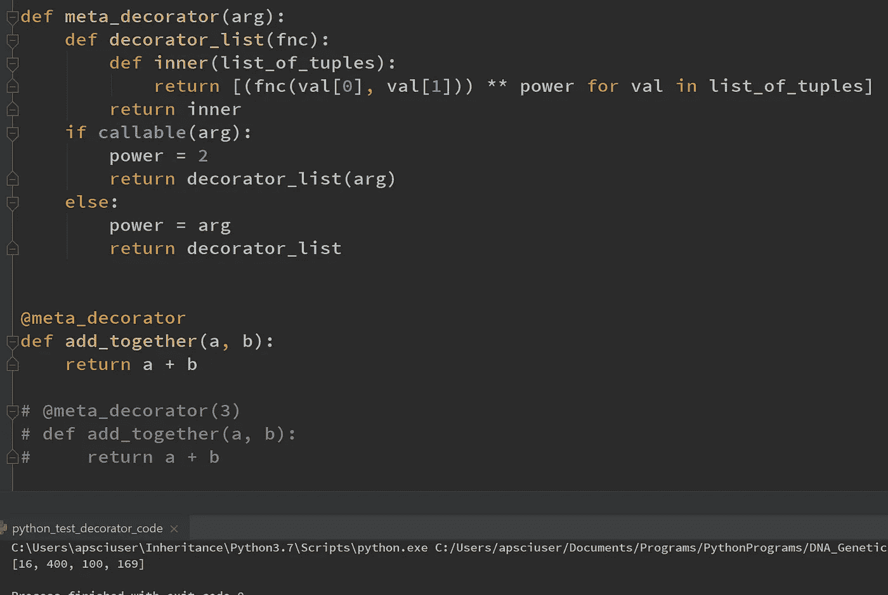

# 举例说明如何在 Python 中使用装饰器

> 原文：<https://towardsdatascience.com/how-to-use-decorators-in-python-by-example-b398328163b?source=collection_archive---------1----------------------->

图片由[王思然·哈德逊通过 Unsplash](https://unsplash.com/photos/MzSqFPLo8CE) 提供

# Python 中的装饰者

Python 中的装饰器是一个函数，它将另一个函数作为其参数，并返回另一个函数。装饰器非常有用，因为它们允许对现有函数进行扩展，而无需对原始函数源代码进行任何修改。

考虑下面的例子:

## 1.相加函数

简单的 add_together 函数将 2 个整数作为参数，并返回传递的 2 个整数值的总和。

## 1.1.用装饰器扩展 add _ 的功能

让我们提出下面的场景。我们希望 add_together 能够将 2 个元素元组的列表作为其参数，并返回一个整数列表，该列表表示它们的值的总和。我们可以通过使用装饰器来实现这一点。

首先，我们给装饰者一个明智的名字，暗示它的预期目的是什么。这里的 decorator，称为 decorator_list，只是一个将另一个函数作为参数的函数。这个函数在 decorator_list 的参数列表中被命名为‘fnc’。

在 decoratored 函数中，我们定义了一个名为 inner 的局部函数。inner 函数将一个 2 元素元组列表作为其参数。内部函数循环遍历这个 2 个元素元组的列表，并对每个元组应用原始函数 add_together，其中元组的索引位置 0 是 add_together 中 a 的参数，索引位置 1 是 add_together 中 b 的参数。内部函数返回这些值的汇总列表。decorator_list 函数最后返回内部函数。

现在，让我们应用这个逻辑，看看装饰函数是如何工作的。

为了应用装饰器，我们使用语法@，后面是装饰器的函数名，位于正在装饰的函数*的上方。这在语法上与以下内容相同:*

从语法上来说，@decorator_list 等同于将函数 add_together 传递给 decorator_list，并重新赋值给 add_together

这里，我们将函数 add_together 传递给 decorator_list 函数，该函数返回内部函数，我们将该函数赋给变量名 add_together。由于 add_together 现在指向内部函数，该函数需要一个包含 2 个元素元组的列表，因此我们可以调用 add_together，并将一个元组列表作为参数。

控制台的标准输出显示，我们现在已经扩展了原始 add_together 函数的功能，因此它现在可以接受一个元组列表。

修饰函数的完整源代码可从以下网址获得:

## 2.可以自己接受参数的装饰者

装饰者自己获取参数也可能是有用的。在这里稍微修改的例子中，我们将一个整数参数传递给装饰器。元组中的两个值相加后，该整数值用作指数。这里，值 2 对每个值进行平方，因此对于第一个元组，返回 16(即 1 + 3 的平方)。

为了在装饰器中使用参数，我们只需要定义一个*装饰器*本身。在下面的例子中，2 是传递给 meta_decorator 的参数。这个 meta_decorator 函数返回 decorator_list 函数，2 作为参数传递给 power。然后，这个 decorator_list decorator 以普通方式使用，即，它接受 add_together 函数并返回 inner，然后我们可以用元组列表调用它。

现在我们有了一个返回的元组列表，它们被加在一起并平方。对于立方或四倍，我们只需在 meta_decorator 的参数中添加 3 或 4。

当我们想要创建接受参数本身的 decorators 时，就增加了一个额外的函数层。

该示例的源代码如下所示:

## 3.装饰器中的默认参数

现在我们已经看到，我们可以为装饰器指定参数，也可以不为装饰器指定参数，这样就会设置一个默认值。

如果我们不向装饰器传递任何参数，就像我们对@meta_decorator 所做的那样，args 就被认为是一个函数。

由于传递了函数的内置可调用函数将返回布尔值 True，因此 power 被赋值为 2，我们可以立即直接调用将返回 inner 的 decorated_list 函数。

如果 arg *不是*一个函数，而是一个整数，那么它是不可调用的(就像被注释掉的代码中会发生的那样)。然后我们转到 else 语句，该语句执行相应的块。无论我们传递哪个值，都会分配给 Power，然后我们创建 decorator_list 函数，该函数最终返回 inner。

该代码片段的源代码如下所示:

## 4.摘要

装饰器是一种优雅的方式来扩展我们的原始函数的功能，而不改变它们的源代码。此外，我们定义的装饰器可以接受参数，或者返回到一组预定义的默认参数。这篇文章展示了装饰者的基本知识，以及如何将它们整合到我们的功能设计中。