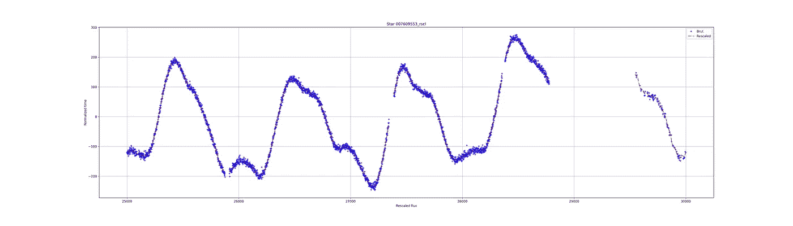
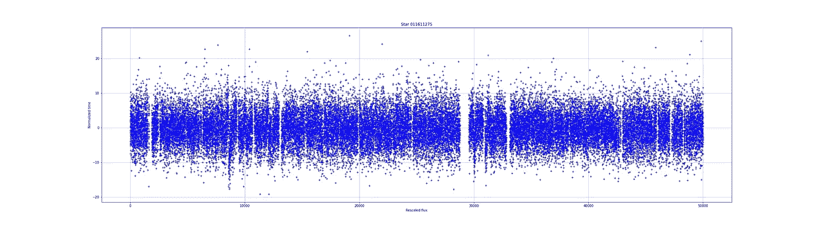
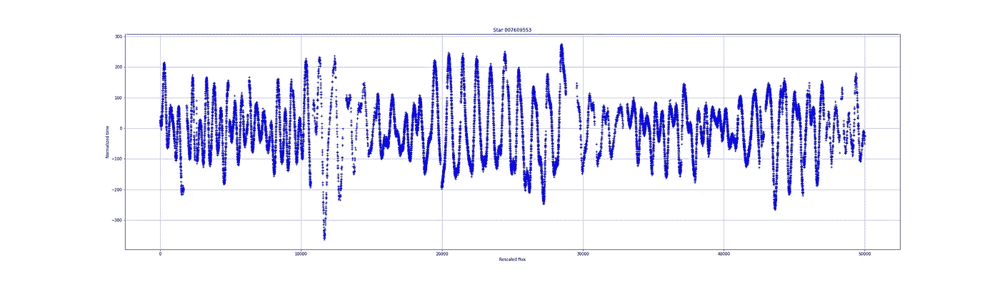
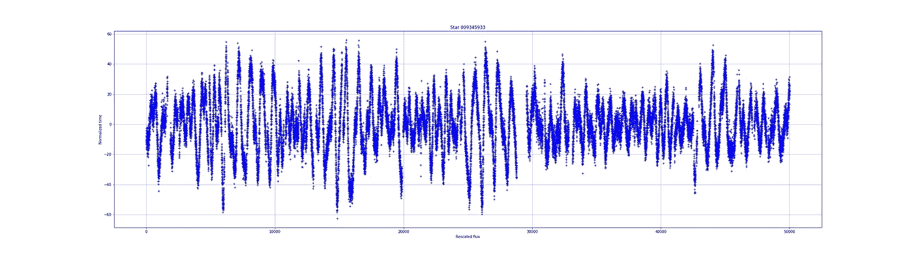
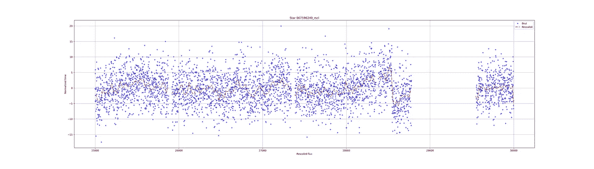
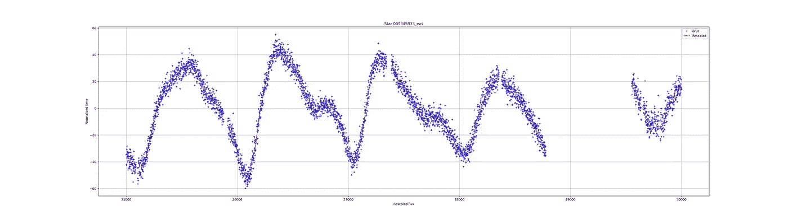
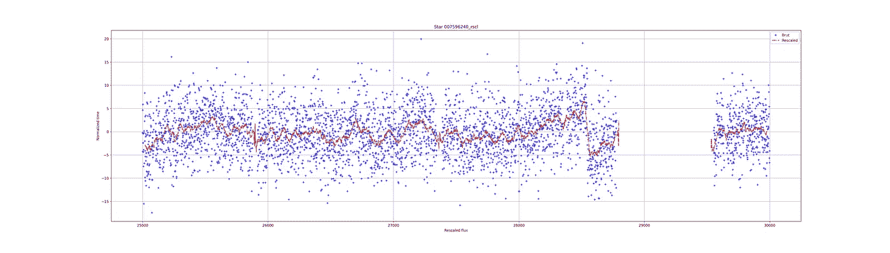
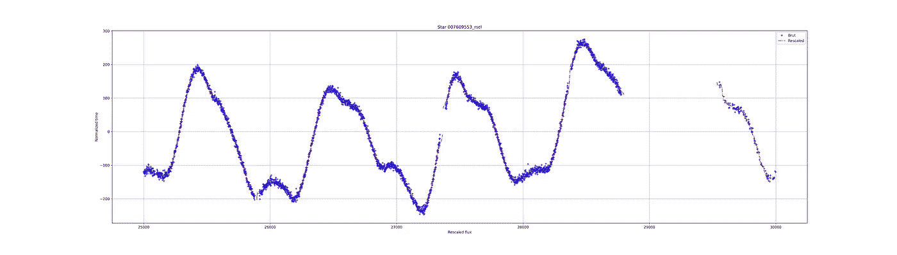
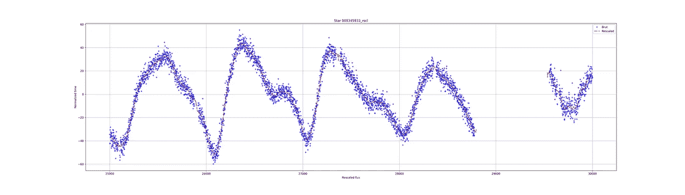
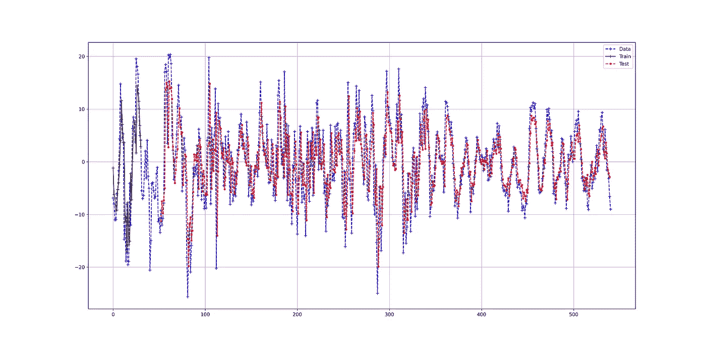

# 如何使用深度学习进行时间序列预测

> 原文：<https://towardsdatascience.com/how-to-use-deep-learning-for-time-series-forecasting-3f8a399cf205?source=collection_archive---------6----------------------->



资料来源:研究结果——由作者计算

## RNN 家族的一个应用

## 介绍

很长一段时间，我听说时间序列的问题只能用统计方法来逼近(AR[1]，AM[2]，ARMA[3]，ARIMA[4])。这些技术通常由数学家使用，他们试图不断改进这些技术来约束平稳和非平稳的时间序列。

几个月前，我的一个朋友(数学家、统计学教授、非平稳时间序列专家)邀请我去验证和改进重建恒星光变曲线的技术。事实上，开普勒卫星[11]像许多其他卫星一样，无法持续测量附近恒星的光通量强度。开普勒卫星在 2009 年至 2016 年期间致力于搜索太阳系以外的行星，称为太阳系外行星或系外行星。

如你所知，我们将比我们的地球走得更远一点，深入到一次银河之旅中，机器学习将是我们的船只。如你所知，天体物理学一直是我的强烈爱好。

> Github 上有笔记本:[这里](https://github.com/Christophe-pere/Time_series_RNN)。

## RNN，LSTM，GRU，双向，CNN-x

那么我们将乘坐哪艘船来完成这项研究呢？我们将使用递归神经网络(RNN[5])，模型。我们将使用 LSTM[6]，GRU[7]，堆叠 LSTM，堆叠 GRU，双向[8] LSTM，双向 GRU，还有 CNN-LSTM[9]。对于那些热衷于树家族的人，你可以在这里找到杰森·布朗利[写的一篇关于 XGBoost 和时间序列的文章。github](https://machinelearningmastery.com/xgboost-for-time-series-forecasting/) 上有一个关于时间序列的很好的知识库。

对于那些不熟悉 RNN 家族的人来说，把他们看作是具有记忆效应和遗忘能力的学习方法。双向术语来自体系结构，它是关于两个 RNN，它们将在一个方向(从左到右)和另一个方向(从右到左)上“读取”数据，以便能够获得长期依赖关系的最佳表示。

## 数据

正如前面介绍中所说，这些数据对应于几颗恒星的通量测量。事实上，在每一个时间增量(小时)，卫星都会测量来自附近恒星的通量。这种通量或强度，即光强度，随着时间的推移而变化。这有几个原因，卫星的适当运动、旋转、视角等。会有所不同。因此，测量到的光子数量会发生变化，恒星是一个熔化材料球(氢氦聚变)，它有自己的运动，因此光子的发射取决于它的运动。这对应于光强度的波动。

但是，也可能有行星，系外行星，扰乱恒星，甚至在恒星和卫星的视线之间通过(凌日法[12])。这条通道遮蔽了恒星，卫星接收到的光子更少，因为它们被从它面前经过的行星阻挡了(一个具体的例子是由于月亮引起的日食)。

这组通量测量值称为光变曲线。光线曲线是什么样的？以下是一些例子:



恒星与恒星之间的通量差别很大。有些非常吵，而另一些非常稳定。尽管如此，通量还是呈现出异常。在光变曲线中可以看到洞或缺少测量。目标是看看是否有可能在没有测量的情况下预测光曲线的行为。

## 数据整理

为了能够使用模型中的数据，有必要进行数据简化。这里将介绍两种，*移动平均线*和*窗口法*。

***均线:***

移动平均包括取 X 个连续的点并计算它们的平均值。这种方法允许减少可变性并消除噪声。这也减少了点数，是一种缩减采样方法。

下面的函数允许我们通过给出一个用于计算点的平均值和标准偏差的数字来计算一系列点的移动平均值。

您可以看到该函数在输入中有 3 个参数。 ***时间*** 和 ***通量*** 是时间序列的 ***x*** 和 ***y*** 。 ***滞后*** 是控制点数的参数，用于计算时间和通量的平均值以及通量的标准偏差。

现在，我们可以看看如何使用这个函数和转换得到的结果。

```
***# import the packages needed for the study***
matplotlib inline
import scipy
import pandas as pd
import numpy as np
import matplotlib.pyplot as plt
import sklearn
import tensorflow as tf
***# let's see the progress bar***
from tqdm import tqdm
tqdm().pandas()
```

现在我们需要导入数据。文件`kep_lightcurves.csv`包含了 13 颗恒星的数据。每个星形有 4 列，原始通量(“…_orig”)、重定标通量是原始通量减去平均通量(“…_rscl”)、差值(“…_diff”)和残差(“…_res”)。所以，总共 52 列。

```
# reduce the number of points with the mean on 20 points
x, y, y_err  = moving_mean(df.index,df["001724719_rscl"], 20)
```

df.index 对应于时间序列的时间
df["001724719_rscl"]重新标度的恒星通量(" 001724719")
lag=20 是将计算平均值和标准差的点数

前 3 条光线曲线的结果:



前 3 颗恒星的光变曲线，移动平均值显示 25，000 到 30，000 个测量值之间的点

***窗口方法:***

第二种方法是窗口法，它是如何工作的？

你需要取一些点，在前面的例子中是 20，计算平均值(与前面的方法没有区别)，这个点是新的时间序列的开始，它在位置 20(移动 19 个点)。但是，不是移动到接下来的 20 个点，而是将窗口移动一个点，计算前 20 个点的平均值，并通过向前移动一步来一次又一次地移动。这不是一种下采样方法，而是一种清理方法，因为效果是平滑数据点。

让我们看看它的代码:

您可以像这样轻松地使用它:

```
# reduce the number of points with the mean on 20 points
x, y, y_err  = mean_sliding_windows(df.index,df["001724719_rscl"], 40)
```

`df.index`对应于时间序列的时间
`df[“001724719_rscl”]`【001724719】
`lag=40`是将计算平均值和标准差的点的数量

现在，看看结果:



使用窗口方法显示 25，000 和 30，000 测量值之间的点的前 3 颗恒星的光变曲线

嗯，还不错。将滞后设置为 40 允许在小孔中“预测”或扩展新的时间序列。但是，如果你仔细观察，你会发现在红线的起点和终点有一个分歧。可以改进该函数以避免这些伪像。

在研究的其余部分，我们将使用移动平均法获得的时间序列。

***将 x 轴从数值改为日期:***

如果需要，您可以更改日期轴。开普勒任务开始于 2009 年 3 月 7 日，结束于 2017 年。 [*熊猫*](https://pandas.pydata.org/) 有一个叫`pd.data_range()`的函数，这个函数允许你从一个不断递增的列表中创建日期。

`df.index = pd.date_range(‘2009–03–07’, periods=len(df.index), freq=’h’)`

这一行代码将创建一个新的索引，频率为几个小时。如果你打印结果(如下),你会发现一个合适的实际时间表。

```
$ df.index
DatetimeIndex(['2009-03-07 00:00:00', '2009-03-07 01:00:00',
               '2009-03-07 02:00:00', '2009-03-07 03:00:00',
               '2009-03-07 04:00:00', '2009-03-07 05:00:00',
               '2009-03-07 06:00:00', '2009-03-07 07:00:00',
               '2009-03-07 08:00:00', '2009-03-07 09:00:00',
               ...
               '2017-04-29 17:00:00', '2017-04-29 18:00:00',
               '2017-04-29 19:00:00', '2017-04-29 20:00:00',
               '2017-04-29 21:00:00', '2017-04-29 22:00:00',
               '2017-04-29 23:00:00', '2017-04-30 00:00:00',
               '2017-04-30 01:00:00', '2017-04-30 02:00:00'],
              dtype='datetime64[ns]', length=71427, freq='H')
```

您现在已经有了原始时间序列的良好时间刻度。

***生成数据集***

因此，现在已经创建了数据归约函数，我们可以将它们合并到另一个函数中(如下所示)，该函数将考虑初始数据集和数据集中存在的恒星名称(这一部分可以在函数中完成)。

要生成新的数据框，请执行以下操作:

```
stars = df.columns
stars = list(set([i.split("_")[0] for i in stars]))
print(f"The number of stars available is: {len(stars)}")
> The number of stars available is: 13
```

我们有 4 种数据类型的 13 颗星，对应于 52 列。

```
df_mean, df_slide = reduced_data(df,stars)
```

很好，在这一点上，您有两个新的数据集，其中包含通过移动平均和窗口方法减少的数据。

## 方法

***准备数据:***

为了使用机器学习算法来预测时间序列，必须相应地准备数据。数据不能仅仅设置在(x，y)数据点。数据必须采用序列[x1，x2，x3，…，xn]和预测值 y 的形式。

下面的函数向您展示了如何设置数据集:

开始前有两件重要的事情。

*1-数据需要重标度*
深度学习算法在数据在[0，1]范围内预测时间序列时效果更好。简单来说，`[scikit-learn](https://scikit-learn.org/stable/modules/generated/sklearn.preprocessing.MinMaxScaler.html)`提供了函数`[MinMaxScaler](https://scikit-learn.org/stable/modules/generated/sklearn.preprocessing.MinMaxScaler.html)()`。您可以配置`feature_range`参数，但默认情况下需要`(0, 1)`。并清除 nan 值的数据(如果你不删除 nan 值，你的损失函数将输出 nan)。

```
***# normalize the dataset*** 
num = 2 ***# choose the third star in the dataset***
values = df_model[stars[num]+"_rscl_y"].values ***# extract the list of values***
scaler = MinMaxScaler(feature_range=(0, 1)) ***# make an instance of MinMaxScaler***
dataset = scaler.fit_transform(values[~np.isnan(values)].reshape(-1, 1)) ***# the data will be clean of nan values, rescaled and reshape***
```

*2-数据需要转换成 x 列表和 y 列表* *现在，我们将通过`create_values()`函数来为模型生成数据。但是，在此之前，我更喜欢通过以下方式保存原始数据:*

*`df_model = df_mean.save()`*

```
****# split into train and test sets***
train_size = int(len(dataset) * 0.8)   ***# make 80% data train***
train = dataset[:train_size] ***# set the train data***
test  = dataset[train_size:] ***# set the test data*** 
***# reshape into X=t and Y=t+1*** look_back = 20
trainX, trainY = create_dataset(train, look_back)
testX, testY = create_dataset(test, look_back)
***# reshape input to be [samples, time steps, features]***
trainX = np.reshape(trainX, (trainX.shape[0], trainX.shape[1], 1))
testX = np.reshape(testX, (testX.shape[0], testX.shape[1], 1))*
```

*看一看结果:*

```
*trainX[0]
> array([[0.7414906],
       [0.76628096],
       [0.79901113],
       [0.62779976],
       [0.64012722],
       [0.64934765],
       [0.68549234],
       [0.64054092],
       [0.68075644],
       [0.73782449],
       [0.68319294],
       [0.64330245],
       [0.61339268],
       [0.62758265],
       [0.61779702],
       [0.69994317],
       [0.64737128],
       [0.64122564],
       [0.62016833],
       [0.47867125]]) ***# 20 values in the first value of x train data*** trainY[0]
>array([0.46174275]) ***# the corresponding y value****
```

****指标****

*我们用什么标准来预测时间序列？我们可以使用平均绝对误差和均方误差。它们由函数给出:*

*您需要首先导入函数:*

```
*from sklearn.metrics import mean_absolute_error, mean_squared_error*
```

****RNNs:****

*你可以用几行代码轻松实现带有 Keras 的 RNN 家族。在这里，您可以使用此功能来配置您的 RNN。您需要首先从 Keras 导入不同的模型，例如:*

```
****# import some packages***
import tensorflow as tf
from keras.layers import SimpleRNN, LSTM, GRU, Bidirectional, Conv1D, MaxPooling1D, Dropout*
```

*现在，我们有从 Keras 进口的模型。下面的函数可以生成一个简单的模型(`SimpleRNN`、`LSTM`、`GRU`)。或者，两个模型(相同的)可以堆叠，或用于`Bidirectional`或两个双向模型的堆叠。还可以用`MaxPooling1D` 和`dropout`加上 CNN 部分(`Conv1D`)。*

*该函数计算训练部分和测试部分的度量，并在数据帧中返回结果。看你如何用五个例子。*

*LSTM:*

```
****# train the model and compute the metrics***
> x_train_predict_lstm, y_train_lstm,x_test_predict_lstm, y_test_lstm, res= **time_series_deep_learning**(train_x, train_y, test_x, test_y, model_dl=**LSTM** ,  unit=12, look_back=20)
***# plot the resuts of the prediction***
> plotting_predictions(dataset, look_back, x_train_predict_lstm,  x_test_predict_lstm)
***# save the metrics per model in the dataframe df_results***
> df_results = df_results.append(res)*
```

*GRU:*

```
****# train the model and compute the metrics***
> x_train_predict_lstm, y_train_lstm,x_test_predict_lstm, y_test_lstm, res= **time_series_deep_learning**(train_x, train_y, test_x, test_y, model_dl=**GRU**,  unit=12, look_back=20)*
```

*堆栈 LSTM:*

```
****# train the model and compute the metrics***
> x_train_predict_lstm, y_train_lstm,x_test_predict_lstm, y_test_lstm, res= **time_series_deep_learning**(train_x, train_y, test_x, test_y, model_dl=**LSTM** ,  unit=12, look_back=20, **stacked=True**)*
```

*双向 LSTM:*

```
****# train the model and compute the metrics***
> x_train_predict_lstm, y_train_lstm,x_test_predict_lstm, y_test_lstm, res= **time_series_deep_learning**(train_x, train_y, test_x, test_y, model_dl=**LSTM** ,  unit=12, look_back=20, **bidirection=True**)*
```

*美国有线电视新闻网 LSTM 报道:*

```
****# train the model and compute the metrics***
> x_train_predict_lstm, y_train_lstm,x_test_predict_lstm, y_test_lstm, res= **time_series_deep_learning**(train_x, train_y, test_x, test_y, model_dl=**LSTM** ,  unit=12, look_back=20, **cnn=True**)*
```

## *结果*

*考虑到数据，这个结果相当不错。我们可以看到，深度学习 RNN 可以再现具有良好准确性的数据。下图显示了 LSTM 模型的预测结果。*

**

*LSTM 预言*

**表 1:不同 RNN 模型的结果，显示了 MAE 和 MSE 指标**

```
 *Name    | MAE Train | MSE Train | MAE Test | MSE Test
--------------------------------------------------------------------
            GRU |   4.24    |   34.11   |   4.15   |   31.47 
           LSTM |   4.26    |   34.54   |   4.16   |   31.64 
      Stack_GRU |   4.19    |   33.89   |   4.17   |   32.01
      SimpleRNN |   4.21    |   34.07   |   4.18   |   32.41
           LSTM |   4.28    |   35.1    |   4.21   |   31.9
         Bi_GRU |   4.21    |   34.34   |   4.22   |   32.54
  Stack_Bi_LSTM |   4.45    |   36.83   |   4.24   |   32.22
        Bi_LSTM |   4.31    |   35.37   |   4.27   |   32.4
Stack_SimpleRNN |   4.4     |   35.62   |   4.27   |   33.94
      SimpleRNN |   4.44    |   35.94   |   4.31   |   34.37 
     Stack_LSTM |   4.51    |   36.78   |   4.4    |   34.28
 Stacked_Bi_GRU |   4.56    |   37.32   |   4.45   |   35.34
       CNN_LSTM |   5.01    |   45.85   |   4.55   |   36.29
        CNN_GRU |   5.05    |   46.25   |   4.66   |   37.17 
  CNN_Stack_GRU |   5.07    |   45.92   |   4.7    |   38.64*
```

*表 1 显示了 RNN 家族的训练集和测试集的平均绝对误差(MAE)和均方误差(MSE)。GRU 在测试集上显示出最好的结果，MAE 为 4.15，MSE 为 31.47。*

## *讨论*

*结果很好，重现了不同恒星的光变曲线(见笔记本)。然而，波动并没有完全再现，峰值没有相同的强度，通量略有偏移。可以通过注意机制(变形金刚[10])进行潜在的纠正。另一种方法是调整模型、层数(堆栈)、单元数(单元)、不同 RNN 算法的组合、新的损失函数或激活函数等。*

## *结论*

*本文展示了将所谓的人工智能方法与时间序列相结合的可能性。记忆算法的力量(RNN、LSTM、GRU)使得精确重现事件的零星波动成为可能。在我们的例子中，恒星通量表现出相当强烈和显著的波动，这些方法已经能够捕捉到。*

*这项研究表明，时间序列不再保留给统计方法，如 ARIMA[4]模型。*

## *参考*

*[1] [自回归模型，维基百科](https://en.wikipedia.org/wiki/Autoregressive_model)
【2】[移动平均模型，维基百科](https://en.wikipedia.org/wiki/Moving-average_model)
【3】彼得·惠特尔，1950。*时间序列分析中的假设检验。*论文
【4】阿尔贝托·卢塞诺&丹尼尔·培尼亚，2008。*自回归综合移动平均(ARIMA)建模*。威利在线图书馆。[https://doi.org/10.1002/9780470061572.eqr276](https://doi.org/10.1002/9780470061572.eqr276)
【5】鲁梅尔哈特，戴维 E. *等著*，1986 年。*通过反向传播误差学习表征*。*性质*。323(6088):533–536。[自然杂志..533R](https://ui.adsabs.harvard.edu/abs/1986Natur.323..533R) 。
[6]hoch Reiter，Sepp&schmid Huber，于尔根，1997 年。*长短期记忆*。*神经计算*。**9**(8):1735–1780。[土井](https://en.wikipedia.org/wiki/Doi_(identifier)):[10.1162/neco . 1997 . 9 . 8 . 1735](https://doi.org/10.1162%2Fneco.1997.9.8.1735)
【7】Cho，KyungHyun *等人*，2014。*门控递归神经网络对序列建模的经验评估*。[arXiv](https://en.wikipedia.org/wiki/ArXiv_(identifier)):[1412.3555](https://arxiv.org/abs/1412.3555)
【8】m .舒斯特& K.K .帕利瓦尔，1997 年。*双向递归神经*网络。IEEE 信号处理汇刊，第 45 卷，第 11 期，第 2673-2681 页。DOI**:**[10.1109/78.650093](https://doi.org/10.1109/78.650093)
【9】塔拉·n·塞纳特*等人*，2014。*卷积、长短期记忆、全连接深度神经网络*。[https://static . Google user content . com/media/research . Google . com/fr//pubs/archive/43455 . pdf](https://static.googleusercontent.com/media/research.google.com/fr//pubs/archive/43455.pdf)
【10】阿希什·瓦斯瓦尼*等人*，2017。你需要的只是关注。[https://arxiv.org/abs/1706.03762](https://arxiv.org/abs/1706.03762)
【11】[开普勒任务，美国宇航局](https://www.nasa.gov/mission_pages/kepler/overview/index.html)*