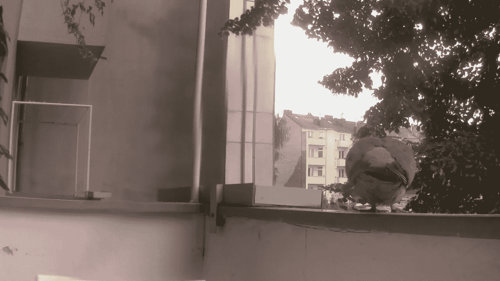
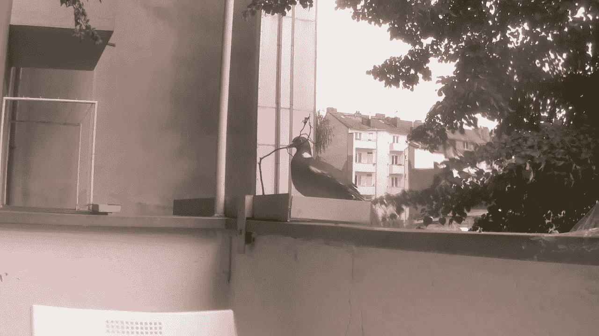
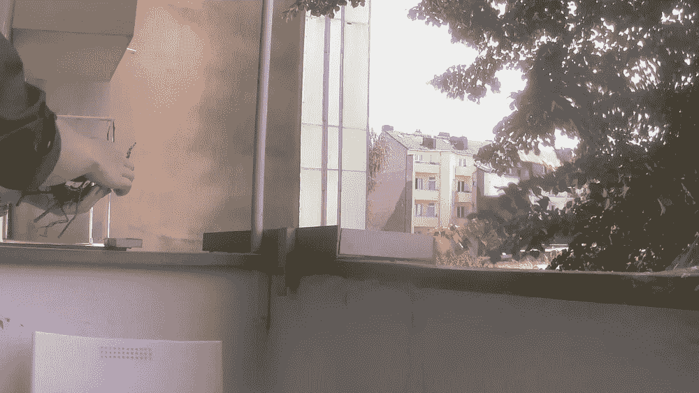
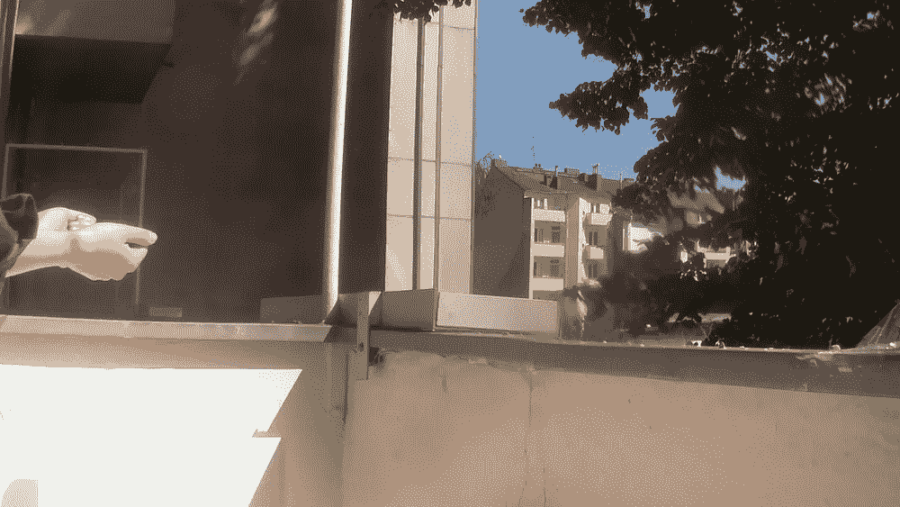
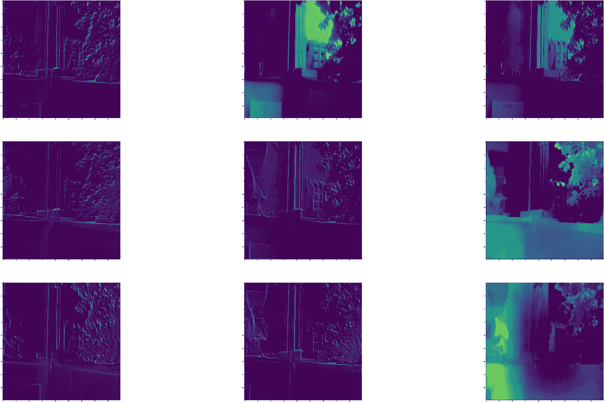

# 如何用深度学习把鸽子从阳台上赶走

> 原文：<https://towardsdatascience.com/how-to-use-deep-learning-to-shoo-pigeons-from-the-balcony-31a2704f2160?source=collection_archive---------38----------------------->

## 鸽子回避系统

## 基于 Keras 的迁移学习和树莓 Pi 的生产部署

免责声明:你正在阅读的第三部分是关于如何训练鸽子识别模型的。 [*第 1 部分*](https://medium.com/@tatianasennikova/how-artificial-intelligence-helped-me-to-win-the-war-against-the-pigeons-9458293983a1) *提供了架构概述，* [*第 2 部分*](https://medium.com/@tatianasennikova/how-to-set-up-data-collection-for-the-pigeon-avoidance-system-eba572fe6dc9) *描述了技术设置。*

我在鸽子回避系统实施后喝着早晨的咖啡

在这一部分，我详细介绍了训练鸽子分类模型的过程。本文由四个部分组成:

1.  塑造数据集
2.  模特培训
3.  推理
4.  观点

# 塑造数据集

前一部分我在阳台上搭了个树莓派，开始采集图像。与此同时，我正在用鸽子 Tinder 给图片贴标签，这是一个自制的网络应用程序，它可以帮助我将图片分类到指定的类别文件夹中:“鸽子”、“人类”和“什么都没有”。显然，我拍了很多没有鸽子的照片。这是因为传感器是由树枝的运动和光线变化触发的。在风平浪静、阳光明媚的日子，我得到的图像通常比阴天和刮风的日子要少。鸽子每天都停在我的阳台上，总共在那里呆 5-10 分钟。这导致了我的数据集中高度不平衡的类。我正在通过增加鸽子和人类的职业来解决这个问题。遗憾的是，我不能应用很多不同的增强技术，因为垂直或水平翻转鸽子没有意义，因为阳台的布局是恒定的，鸽子很少倒着落在上面。这同样适用于随机裁剪，因为鸽子经常出现在图像的边缘，因此将它们裁剪掉的风险很高。这给我留下了一些增强技术，处理模糊和清晰。我使用以下代码进行数据扩充:

数据扩充类

仅增加训练数据是至关重要的。另一个重要方面是时间因素。当我第一次训练模型时，我通过从标签照片的桶中随机(没有替换)挑选图像来生成训练和测试数据集。我很快在验证和训练数据上获得了 100%的准确性，这些数据看起来已经很可疑了，但是当我将模型投入生产时，它的表现并不好。分类看起来非常随意。然后，我决定按照时间戳分割数据，并在前十天的数据上训练模型，在接下来的三天进行验证，在最后两天进行测试。这产生了一个更健壮的模型，并且防止了如果我们随机分割数据所发生的数据泄露。在训练数据集中，我总共有 200 张鸽子图像。应用数据增强后，我把它增加到 600。我还将增强应用到人类图片以达到 600 张，并且大多数“无”类包含 600 张没有人类或鸽子的图片。在验证数据集中，每个类有 50/50/50 个图像，在测试中有 30/30/30 个图像。正如我们将在后面看到的，通过利用迁移学习的力量，每个班级只需要 200 幅图像就足以训练一个非常准确的模型。

# 模特培训

由于训练神经网络是一项计算量很大的任务，所以我没有在 Raspberry 上执行它。目前，我在本地培训模型，但考虑在不久的将来切换到云解决方案之一。

Keras 是我几年来深度学习的默认选择，主要是针对 LSTMs。然而，完成这个项目后，我现在认为 PyTorch 可能是迁移学习的更好选择，原因如下。最初，我想在预训练的 [ResNet50](https://keras.io/api/applications/resnet/) 上使用迁移学习，因为它在图像分类任务上一直显示出非常好的结果。然而，Keras 在 ResNet 架构中有一个非常有线的 BatchNormalisation 层实现。在微调过程中，批量归一化图层被冻结，并使用原始 imagnet 数据集的平均值和标准偏差进行训练。然而，imagenet 的平均值和标准偏差不同于用于微调和推断的新数据集。有多种解决方法，如在微调过程中解冻批量规范化层，以及在训练和推断过程中操作 lerning_phase 标志。然而，我不能仅仅为了应用一个最先进的模型而证明这些变通方法的使用是正确的。因此，我选择了 [VGG19](https://keras.io/api/applications/vgg/) ，仅仅经过 30 个时期，它就为我提供了 98%的测试数据集准确率。

现在让我们看看建模部分。首先，我们需要加载数据。我使用 Keras 的 ImageDataGenerator 类来逐步加载图像。它为当前的小批量加载足够的图像到内存中。ImageDataGenerator 类的另一个好处是，它还可以自动缩放像素值，并进行图像预处理，如归一化。

配置图像数据生成器

我将训练和测试数据生成器分开保存，以便将来我可以只对训练数据执行数据扩充。注意，我们对两个数据集应用相同的预处理函数，它执行预训练 VGG19 所期望的数据预处理。

接下来，为了逐步加载数据，我们需要创建一个迭代器。这需要调用 flow_from_directory()方法并指定数据集目录，例如训练、测试或验证目录。该方法允许我们配置多个参数，如 class_mode、target_size 等。

加载并迭代数据集

我们需要为训练和验证迭代器设置每个时期的步骤参数，以便指定有多少批图像定义一个时期。它通常计算为数据集的长度除以批处理大小，但是，它可以设置为一个较小的数字，以允许更频繁的回调。

计算每个时期的步数

现在让我们定义模型架构。使用 Keras 进行迁移学习的步骤顺序是:

1.  加载没有顶层的预训练模型。为此，将 include_top 参数设置为 False。
2.  冻结网络，因为我们假设它在之前的训练中学习的基本概念(过滤图)对于广泛的图像分类问题保持不变。
3.  添加新的可训练层，其中可能包括:展平层，如果您注意到模型过拟合，则删除层，以及带有要预测的类数量的密集输出层。

指定模型架构

请注意，我在这个任务中使用了相对较小的学习率。这通常适用于所有迁移学习问题。由于我们只是微调顶层，我们应该保持较低，以避免梯度下降跳跃。

我们去训练循环。为了避免模型过度拟合，我应用了早期停止，并在训练时定期保存模型检查点。

训练分类模型

在我的鸽子识别问题上运行指定的模型架构 30 个时期，在测试数据集上给了我 98%准确度的预测，这意味着我错误地分类了两幅图像。在这两张照片中，鸽子用尾巴面对镜头，站在一个非常不幸的角度。连我都认不出这团毛绒绒的东西里有一只鸽子。

分类错误的鸽子

# 推理

如前所述，我在本地机器上执行训练，在 Raspberry Pi 上执行推理。由于我使用深度学习进行分类模型，我需要首先安装 TensorFlow。显然，它不像以前在我的本地机器上那样微不足道。Raspberry Pi 上的原子库存在一些问题。因此，我需要经历很多步骤，这里的[和](https://qengineering.eu/install-tensorflow-2.2.0-on-raspberry-pi-4.html)都有很好的描述。我将在这里复制主安装脚本，只是为了避免它丢失。但这完全归功于最初推出安装教程的 Q-engineering:

TensorFlow 安装脚本

在这之后，我们只需要安装 Keras 通常会顺利进行。

一切准备就绪后，我们就可以开始实现推理管道了。我们将在本地训练的模型转移到 Raspberry Pi 进行推理。然后我们加载它以备将来使用。

负载预训练模型

在 Raspberry 上加载模型大约需要 2 分钟，所以我们只在启动主管道后做一次。然后，我们需要读取检测到运动后拍摄的图像。

加载要分类的图像

之后，我们将其提供给预测方法。请注意，我们应用 tensor flow . keras . applications . vgg 19 中的 preprocess_input 方法，该方法以与训练期间相同的方式预处理图像。

将图像分类

最后，我们将预测的类提供给主管道，并通过在末尾添加类名来重命名原始图像。重命名部分是未来评估所必需的。

保存图像

现在，当我们在 Raspberry 上运行我们的模型时，我们可以检查它在速度和准确性方面的性能。正如我前面提到的，加载模型需要 2 分钟，加载保存的图像需要 0.2 秒，对图像进行分类需要 2 秒。这速度足以吓跑鸽子。然而，模型在生产环境中运行几天后，我开始面临的问题是数据漂移。现实总是比一个阶段性的实验更复杂。现实是狂野的，以前从未发生过的事情会突然发生。我们无法预见它，我们只需要对我们实验室取得的成绩持怀疑态度，并足够灵活地适应不断变化的环境。我所说的是鸽子行为的变化。他们开始在我阳台前的树上筑巢。为什么这是个问题？因为它们开始出现在我的阳台上，嘴里叼着棍子。这是模型还没有准备好处理的事情，因为它从来没有见过一只鸽子拿着一根棍子。因此它断定它不是一只鸽子。

拿着棍子的鸽子

接下来的几天，拿着棍子的鸽子成了我阳台上的常客，这让我收集到了新的数据。我重新训练了这个模型，并且已经在庆祝成功了，看着鸽子在着陆后仅仅三秒钟就飞离了我的阳台。然而，我的庆祝太早了。一天，我决定清理阳台上鸽子掉落的树枝，因为它们对我的鸽子回避系统感到惊讶。现在，我惊讶地意识到，系统识别出我是一只鸽子，只是因为我手里拿着棍子。

我被归类为鸽子取决于我手里拿着什么

在左边的照片上，我手里拿着棍子，我被归类为一只鸽子。在右边的照片中，同样的手，但是没有棍子，被归类为人类。

过滤网络第一层的地图

当我们从神经网络的第一层检索激活时，我们可以在右下角观察到手和棍子激活的过滤图。这样，我们可以对如何做出分类决策建立一些直觉。

我的下一步是收集棍子的图像，我拿着棍子，有棍子和没有棍子的鸽子。然后我根据新数据重新训练了模型。这让我在测试数据集上再次获得了大约 98%的准确率，在生产数据集上也是如此，但只是在接下来的 5 天内。之后，我不得不根据新收集的数据重新训练模型。这让我们了解到这个项目的主要内容:

> 为了开发强大的机器学习产品，数据科学家应该采取端到端的所有权。这不仅意味着在 jupyter 笔记本上培训模型，还意味着生产部署和产品的进一步支持和开发。

不得不说，经过“模型备份→数据采集→数据标注→模型评估→模型再训练→生产部署”几个圈子，模型开始概化图像好了很多。最后，它学会了“鸟”的概念，鸽子回避系统开始从我的阳台上赶走各种各样的鸟，不仅仅是鸽子。

最后，这就是系统在生产中的工作方式:

一只鸽子落在阳台上，但几乎立即飞走了，因为它受到了运动的干扰

# 观点

正如我们已经看到的，数据漂移对于在生产中运行的机器学习解决方案来说是一个严重的问题。因此，我希望自动化模型备份→数据收集→数据标记→模型评估→模型培训→生产部署的循环。为此，我计划使用云解决方案。这可能是未来文章的主题。

保持更新，如果你对这个项目有任何问题，请随时通过 LinkedIn 联系我。