# 如何使用 Docker 在 AWS 上部署仪表板应用程序

> 原文：<https://towardsdatascience.com/how-to-use-docker-to-deploy-a-dashboard-app-on-aws-8df5fb322708?source=collection_archive---------3----------------------->


由[卡洛斯·穆扎](https://unsplash.com/@kmuza?utm_source=unsplash&utm_medium=referral&utm_content=creditCopyText)在 [Unsplash](https://unsplash.com/s/photos/analytics-dashboard?utm_source=unsplash&utm_medium=referral&utm_content=creditCopyText) 上拍摄

## 如何与更广泛的受众分享您的分析仪表板的分步指南

仪表板是探索数据和模型行为的绝佳方式。它们也是与技术和非技术涉众沟通的不可或缺的工具。我假设你不需要任何说服——你已经花了很多时间精心打磨你的 *R Shiny* 或 *Python Dash* web 应用程序！你为自己创造的东西感到自豪…但是仪表板只在你的笔记本电脑上工作。您如何允许其他人访问您的仪表板？

> “我们大多数人需要听音乐才能理解它有多美。但这通常不是我们展示统计数据的方式:我们只展示音符，不播放音乐。”— [汉斯·罗斯林](https://www.ted.com/talks/hans_rosling_shows_the_best_stats_you_ve_ever_seen)

本指南假设您已经准备好部署仪表板应用程序。如果不是这样，您可以通过克隆这个 Github repo 来完成。*不了解 Docker 或 AWS。*本次回购中的仪表板应用程序使用联合分析来分析用户对电动汽车的偏好。你可以在这里了解这个应用[的更多信息。然而，您不需要理解这个仪表板做什么来遵循这个指南。仪表板的预览如下所示:](/the-right-electric-vehicle-for-me-a-use-case-for-conjoint-analysis-d9840ca31353)

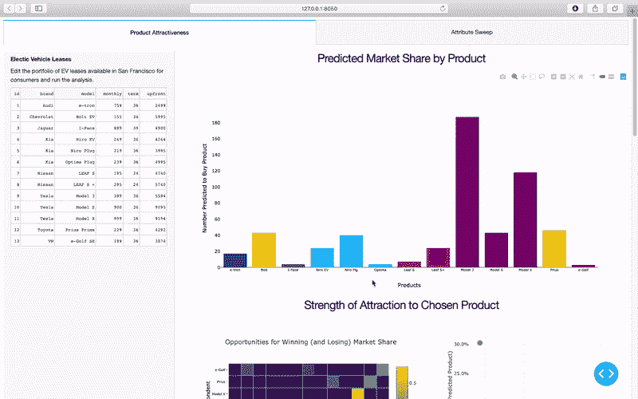

用于联合分析的仪表板应用程序

应用程序的文件结构如下所示:

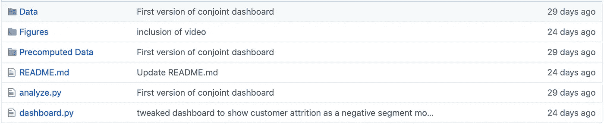

图一。Python Dash web 应用程序的代码

在上面的 web 应用程序中，`dashboard.py`包含了应用程序代码。当用户与仪表板交互时，联合分析由`dashboard.py`中的函数触发，这些函数随后调用`analyze.py`中的相关联合函数来对`Data`和`Precomputed Data`文件夹运行计算。`README.md`是唯一依赖于`Figures`文件夹的文件。

# Docker 如何帮助在云上部署？

Docker 使您能够部署一个包含所有所需部分(即库、依赖项)的应用程序，并将其作为一个单独的*映像*发布。我们可以在任何安装了 Docker 的主机上运行这些映像(即在任何 Docker 引擎上)，而不考虑架构或操作系统。这些运行的实例被称为*容器*。如果该映像在您的笔记本电脑上成功运行，您可以保证它可以在任何 Docker 引擎上运行。由于许多云平台支持 Docker 映像的运行，我们可以很容易地在云中部署仪表板应用程序。

现在我们对 web 应用程序和 docker 有了更多的了解，我们可以继续在 AWS 上部署它。

# 步骤 0:先决条件

要完成这项工作，您需要在系统上安装 Docker 以及一个 AWS 帐户。

## 子步骤 0a:在系统上安装 Docker

在您的系统上安装 Docker 的说明可从[这里](https://docs.docker.com/install/)获得。如果你想在 Windows 或 OSx 上运行 Docker，你需要安装 Docker Desktop。由于 Docker 最初是为 Linux 构建的，Docker Desktop 将运行一个 Linux 虚拟机，该虚拟机随后启动基于 Linux 的映像。

## 子步骤 0b:注册 AWS 帐户

你可以在这个[链接](https://aws.amazon.com/free)注册免费使用 AWS 服务一年。

## 子步骤 0c:安装 AWS 命令行界面

命令行界面(CLI)允许您从命令行调用 AWS 服务。您可以按照这里的说明[安装 AWS CLI。](https://docs.aws.amazon.com/cli/latest/userguide/cli-chap-install.html)

*以下说明假设您已经安装了 CLI 版本 1。*

# 步骤 1:为容器化准备仪表板应用程序

您的本地系统和 docker 容器之间有两个差异，可能会导致部署中的问题:

1.  网络配置
2.  文件系统

## 网络配置

在 *Python Dash* 的情况下，默认是让 app 在`localhost`运行。但是，在这种情况下，您只能从本地计算机访问服务器。该应用通常使用以下样板文件在本地部署*:*

```
if __name__ == '__main__':
    .
    .
    app.run_server(debug=True)
```

上面的代码不允许您从 Docker 引擎访问 dashboard 应用程序，因为该应用程序只能由容器访问。我们需要在`dashboard.py`中明确指定主机，以便从容器外部访问仪表板应用程序。

```
if __name__ == '__main__':
    .
    .
    app.run_server(host='0.0.0.0', port=8050, debug=True)
```

如上图修改`dashboard.py`并保存。一旦构建并运行了 docker 映像，我们就可以在`[http://0.0.0.0:8050](http://0.0.0.0:8050)`通过 web 浏览器访问仪表板。在 *R 闪亮*的情况下，只要我们在**步骤 2** 中露出适当的端口，仪表板就应该可以从`[http://127.0.0.1:<port](http://127.0.0.1:8001)>`处接近。我们可以在 *R Shiny* 应用程序代码中指定要使用的端口:

```
options(shiny.port = 8100)
```

## 文件系统

docker 容器的文件系统反映了 Linux 系统的文件系统。其根目录下包含`bin`、`etc`、`mnt`、`srv`、`sys`等文件夹。如果构建一个 *Python Dash* app，通常的做法是将 app 的源代码存储在根目录下的`app`文件夹中。在*闪亮*的情况下，我们可以在`srv`文件夹里面创建一个子文件夹`shiny-server`来存储源代码。

因此，当应用程序被容器化时，我们在源代码中指定的任何相对路径几乎肯定不起作用，因为容器将当前路径作为其根目录(默认)。最简单的解决方案是将容器的当前目录改为指向源代码的位置。我们将在**步骤 2** 中看到如何做到这一点。

另一个(次优)解决方案是修改源代码，这样我们就可以给出绝对路径。例如，在`dashboard.py`中，我们可以将第 16 行和第 17 行修改为:

```
folderStr = "/app/Data/"  # old version was "./Data"
destFolder = "/app/Precomputed Data/"
```

这种方法带来的问题是仪表板应用程序变得更难维护。让我们在`dashboard.py`中保持文件路径不变。相反，我们将在**步骤 2** 中明确更改工作目录。

# 第二步:从你的 dashboard 应用程序构建一个 Docker 图像

我们创建一个文件夹`DashboardImage`,我们将在其中填充 Docker 图像的原始内容。最终，任何 Docker 引擎都可以使用这个 Docker 映像来运行 dashboard 应用程序。让我们在`DashboardImage`中创建以下文件结构:

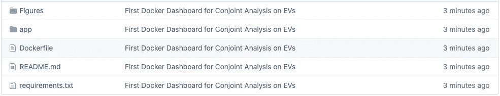

图二。仪表板图像的内容

让我们更仔细地看看这个目录的内容:

*   `app`文件夹:除了`README.md`和`Figures`文件夹，我们将 Dashboard app 内容(如图 1 所示)复制到这个文件夹中。
*   `Figures`文件夹:将仪表盘 app 的`Figures`文件夹复制到这里。这个文件夹只有`README.md`需要。
*   `README.md`:将`README.md`从`app`文件夹移到这里。
*   `Dockerfile`:用于创建满足仪表板应用程序要求的图像的指南。
*   `requirements.txt`:只有当你的仪表板是用 Python 写的时候才需要。它列出了运行 Dashboard 应用程序所需的库。通过在这里指定所需的 Python 包，我们使`Dockerfile`更具可读性。有了*闪亮的*，我们省略这个文件，在`Dockerfile`中显式安装所需的包。

## 子步骤 2a:编写 requirements.txt 文件

`requirements.txt`文件应该包含您的仪表板需要的所有库。它可能看起来像这样:

```
dash
dash-renderer
dash-core-components
dash-html-components
dash-table
plotly
numpy
pandas
scipy
matplotlib
seaborn
```

仪表板需要前六个库才能正确呈现。`analyze.py`需要剩余的库来执行联合分析。

## 子步骤 2b:编写 Dockerfile 文件

`Dockerfile`包含设置仪表板应用程序的说明。`Dockerfile`分层构建图像。每行都有格式:<指令>自变量>。让我们创建以下`Dockerfile`:

```
FROM continuumio/miniconda3COPY requirements.txt /tmp/
COPY ./app /app
WORKDIR "/app"RUN conda install --file /tmp/requirements.txtENTRYPOINT [ "python3" ]
CMD [ "dashboard.py" ]
```

第一行从 Dockerhub(一个公共的容器库)中提取一个基本映像。基本映像包含 Miniconda，它位于基本 Ubuntu 发行版之上。如果你想部署一个闪亮的应用程序，你可以选择`rocker/shiny`图片。

第二行和第三行将`requirements.txt`文件和`app`文件夹从主机上的应用程序文件夹复制到 Docker 容器根目录下的`tmp`文件夹和`app`文件夹。如果这些文件夹不存在，则会自动创建。第四行将工作目录设置为`app`文件夹。这一行是适应容器文件结构的首选解决方案，因为它只需要对`Dockerfile`进行更改。

第五行安装`requirements.txt`中指定的每个包。对于一个闪亮的应用程序，你需要明确指定你想要安装的每个包。例如:

```
RUN R -e "install.packages(c('package1', 'package2', 'package3'))"
```

我们还想为闪亮的应用程序公开正确的端口。因此，我们将在`Dockerfile`中包含以下行:

```
EXPOSE <PORT NUMBER>
```

`ENTRYPOINT`指定当图像作为容器运行时将执行的命令。如果我们在运行 docker 映像时没有指定参数，Docker 将使用`CMD`行中显示的默认参数来执行，这将使 Python 运行 dashboard 应用程序。注意，我们不需要指定应用程序的绝对路径，即`/app/dashboard.py`，因为我们已经将工作目录更改为`/app`。在 R 中，我们使用`CMD`来执行闪亮的服务器。

# 第三步:建立你的码头工人形象

一旦创建了内容，我们就可以构建一个 docker 映像。为了创建图像`conjoint_dashboard`，进入`DashboardImage`文件夹并运行以下程序:

```
docker build -t conjoint_dashboard .
```

Docker 通过`Dockerfile`一行一行地构建软件层。

要确认关于图像的一些基本细节，运行`docker images`。

```
REPOSITORY             TAG     IMAGE ID       CREATED        SIZEconjoint_dashboard     latest  b50b2d7a61cc   6 seconds ago  2.32GBcontinuumio/miniconda3 latest  406f2b43ea59   4 months ago   430MB
```

您还可以通过运行以下命令来检查映像是否构建正确:`docker run conjoint_dashboard`。回想一下在步骤 1 中，我们修改了`dashboard.py`以使主机可以在`[http://0.0.0.0:8050](http://0.0.0.0:8050)`访问。从 docker 机器(即您的计算机)上，在上述地址打开一个 web 浏览器，检查仪表板是否按预期工作。

# 第四步:上传你的 Docker 图片到 Amazon 注册

我们需要确保我们的图像在 AWS 中可用。为此，我们需要执行以下步骤:

*   在 ECR(AWS 弹性容器注册中心)中创建一个存储库`dashboard`。*我们特意给 AWS 存储库取了一个与我们构建的映像不同的名称，这样我们就可以很容易地区分这两者。*
*   为您的 AWS 帐户创建访问密钥
*   使 Docker 客户端能够向 AWS 注册中心进行身份验证
*   将`conjoint_dashboard`推入`dashboard`仓库

## 子步骤 4a:在 ECR 中创建存储库

登录 [AWS 管理控制台](https://aws.amazon.com/console/)。您的首次登录将使用您的 root 帐户。登录后，搜索“ECR”。弹性容器注册中心(ECR)是一个完全托管的 Docker 容器*注册中心*。一个*注册中心*是一个储存库的集合。点击*开始*创建新的存储库。我们将存储库命名为`dashboard`，并单击*创建存储库*。

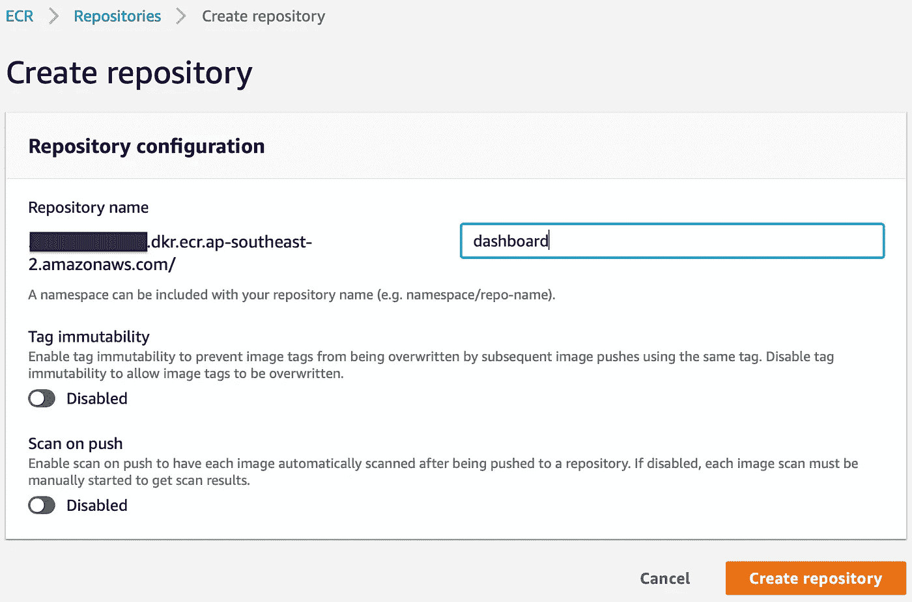

## 子步骤 4b:创建访问密钥

我们将为 root 帐户创建一个访问密钥。*避免使用 root 帐户是一个很好的做法，因为它提供了对 AWS 资源的无限制访问。然而，为了简化过程，我们将使用 root 帐户部署应用程序。*

要创建访问密钥，请单击您的帐户名，然后单击*我的安全凭证。*

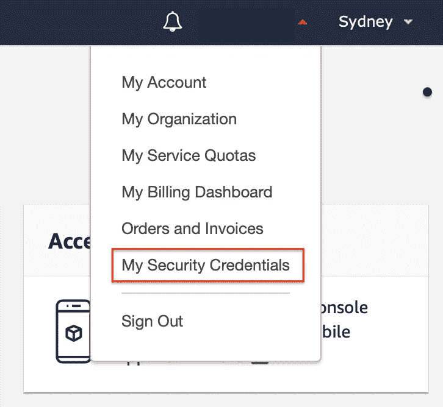

在新屏幕中，打开*访问密钥(访问密钥 ID 和秘密访问密钥)*下拉菜单，点击*创建新的访问密钥*。创建密钥后，您将收到以下消息。

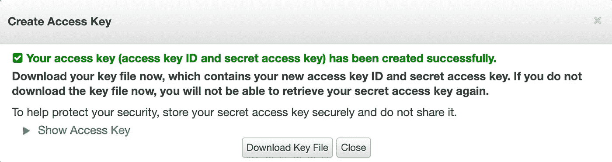

下载凭据并将其存储在安全的地方。

## 子步骤 4c:使 Docker 客户端能够通过 AWS 进行身份验证

使用您新创建的访问密钥，您将需要在终端中使用以下命令配置您的`aws_access_key_id`和`aws_secret_access_key`:

```
aws configure set aws_access_key_id <YOUR_ACCESS_KEY>
aws configure set aws_secret_access_key <YOUR_SECRET_KEY>
```

我们还需要设置区域和输出格式。您所在的地区可以从 AWS 管理控制台中找到。

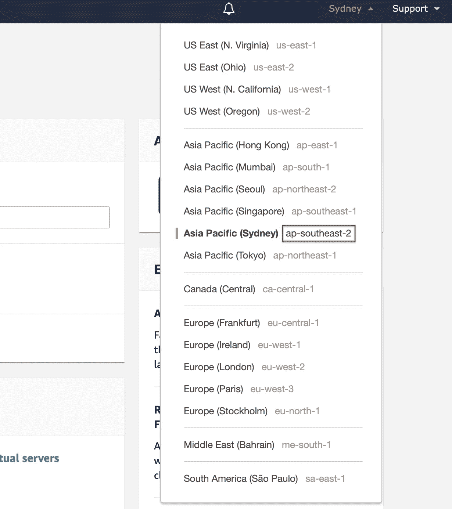

然后，我们可以在终端中运行以下命令:

```
aws configure set default.region <YOUR_REGION>
aws configure set default.output json
```

我们现在可以尝试登录 ECR:

```
$(aws ecr get-login --no-include-email --region <YOUR REGION>)
```

您应该会收到一条*登录成功*的消息。

## 子步骤 4d:将构建的仪表板推入 AWS 存储库

我们首先用新创建的仪表板存储库的 URI 来标记`conjoint_dashboard`。您可以通过点击`dashboard`存储库在 AWS 管理控制台中找到 URI:

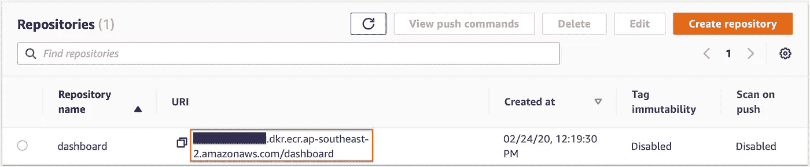

我们通过在终端中运行以下命令，用上面的 URI 标记图像`conjoint_dashboard`:

```
docker tag conjoint_dashboard <ACCOUNT NUM>.dkr.ecr.<REGION>.amazonaws.com/dashboard
```

我们现在可以将图像推送到存储库。

```
docker push <ACCOUNT NUM>.dkr.ecr.<REGION>.amazonaws.com/dashboard
```

将`conjoint_dashboard`图像上传到注册表所需的时间取决于您的互联网连接。图片推送后，点击 ECR 中的`dashboard`即可找到图片。

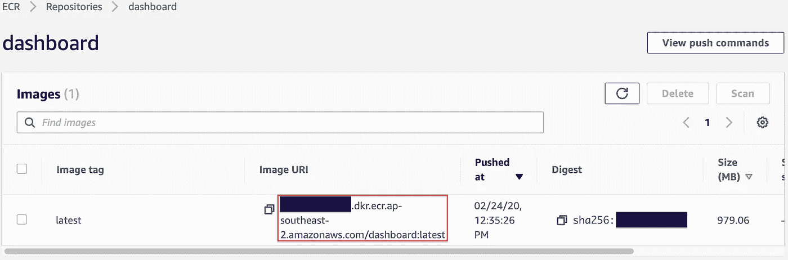

您将需要图像 URI 来部署仪表板应用程序。图像标签`latest`显示在 URI 的末尾(冒号后),表示仪表板的版本。

# 步骤 5:使用 ECS 部署 Docker 容器

弹性容器服务(ECS)运行和管理 Docker 容器。它是高度可伸缩的，允许自动部署更多的容器来满足需求。返回 AWS 管理控制台的主页，搜索“ECS”。

进入 ECS 后，让我们单击*开始*按钮。您将被带到*步骤 1:容器和任务*。容器定义描述了容器的需求以及系统应该如何运行容器。通过点击*配置*按钮，我们可以配置容器来容纳仪表板应用程序。

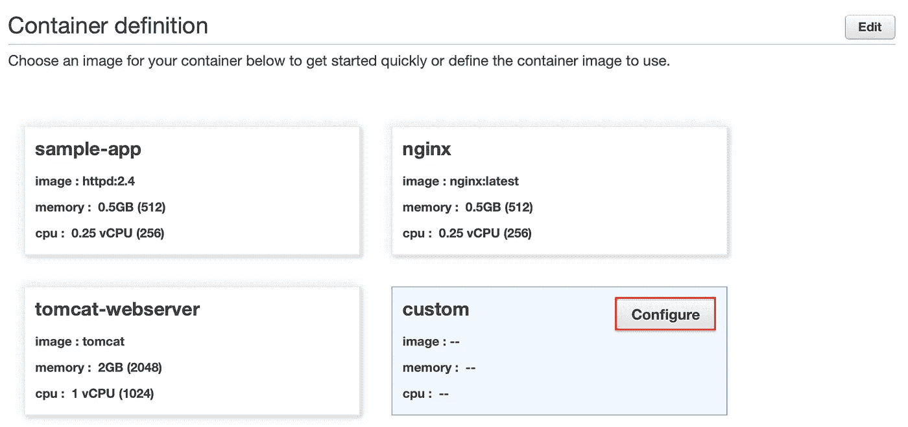

我们只需要填充前两个字段。我们将容器命名为`conjoint_dashboard`，并用在**步骤 4** 结束时给出的图像 URI 填充第二个字段。点击*更新*。

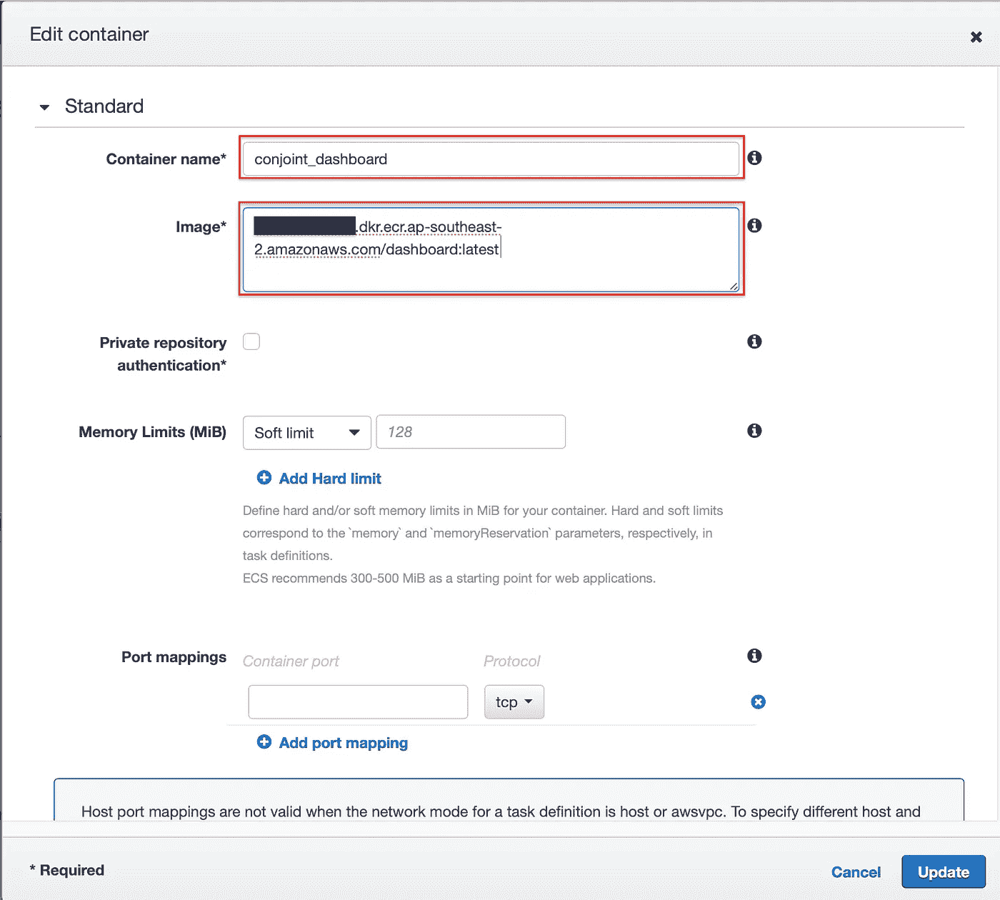

向下滚动到任务定义并点击*编辑*。在这里，我们可以指定容器的硬件要求。我们如下填充这些字段，然后*保存*。

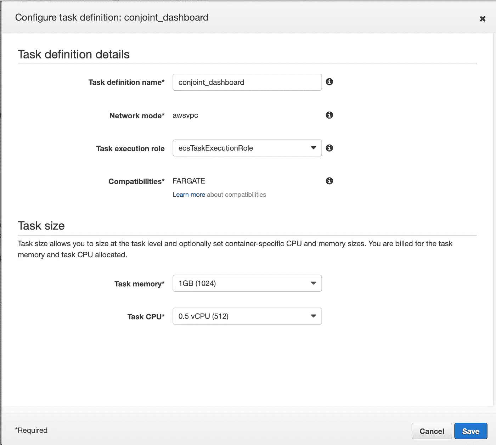

当我们点击下一个的*时，我们将被带到服务定义页面。这些字段是预先填充的，因此单击下一个*的*进入集群定义。我们需要做的就是将集群命名为“联合”，然后点击*下一步*。然后您可以查看配置并点击*创建*。*

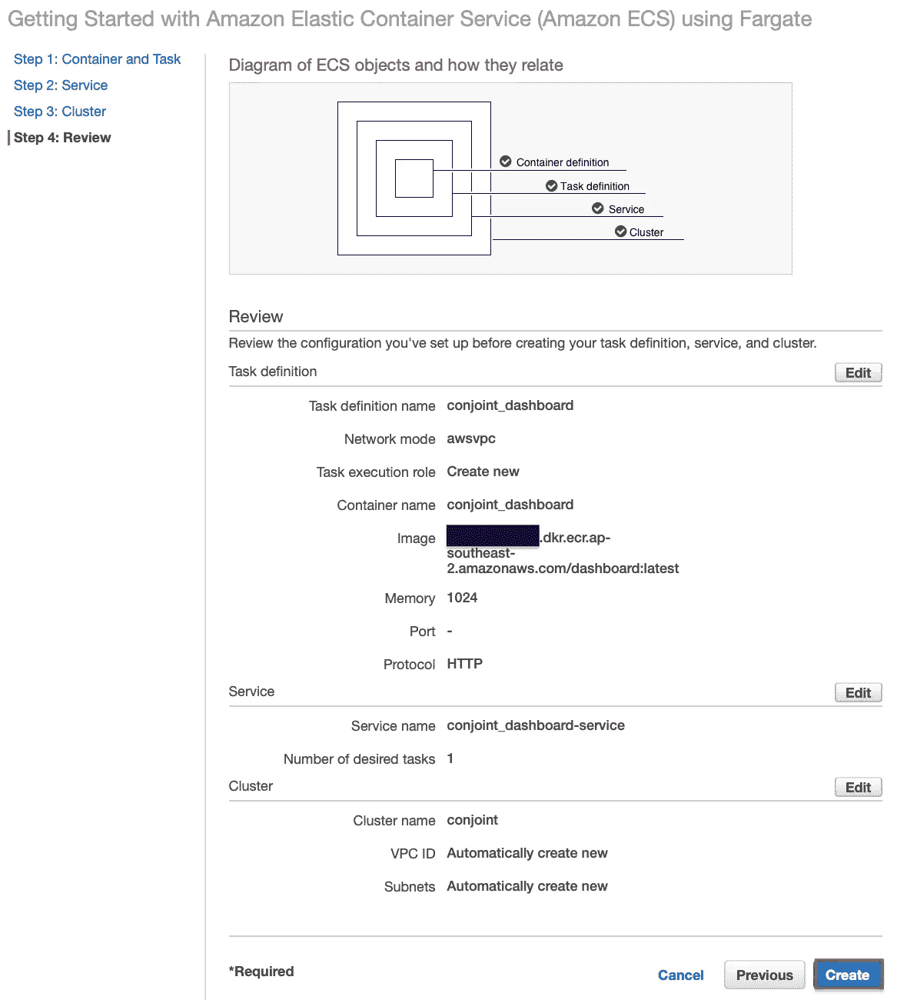

这个过程需要几分钟。完成后，点击*查看服务*。

# 步骤 6:访问仪表板服务

默认情况下，该服务只允许端口 80 上的流量。这是一个问题，因为 Docker 容器只能在端口 8050 上访问。因此，我们需要改变安全组的规则。点击*安全组*标识符。

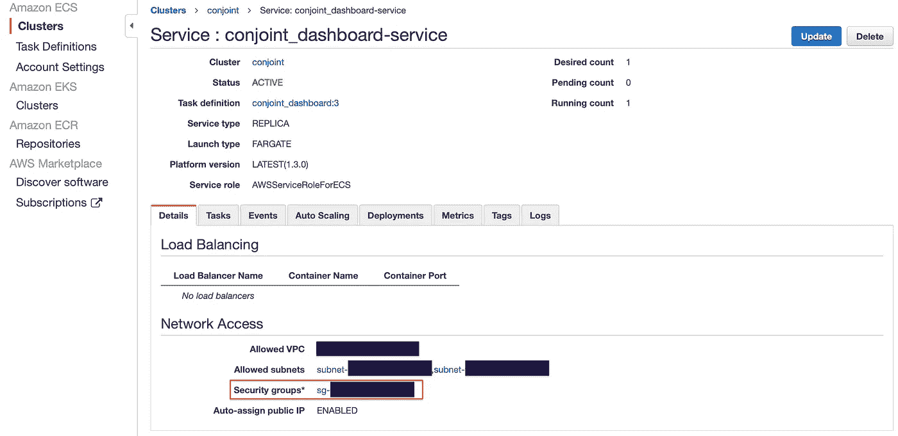

页面加载后，点击*入站规则*选项卡和*编辑规则*按钮。

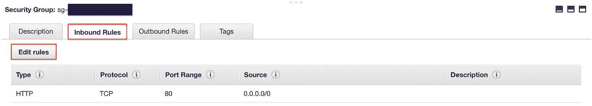

点击*保存规则前，按如下方式重新填充字段。*

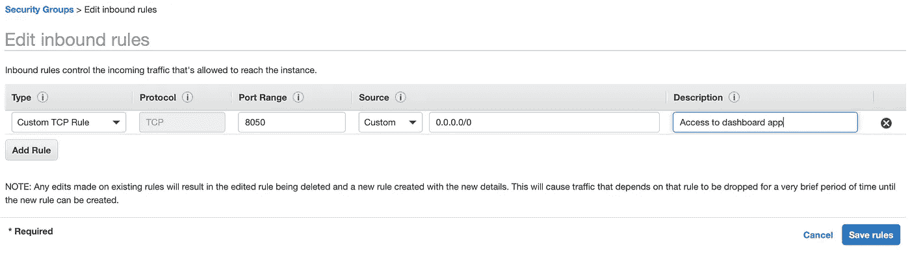

我们可以通过单击 ECS 侧栏中的*集群*并单击`conjoint`来检查服务是否正在运行。页面加载后，点击*任务*选项卡，然后点击任务标识符。

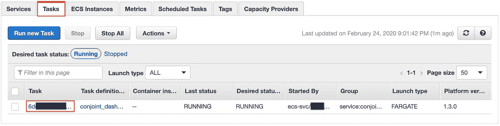

将显示任务配置。

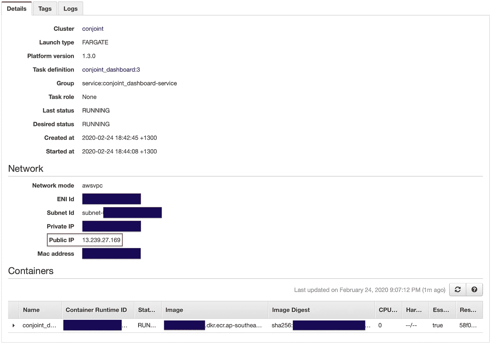

我们可以看到任务正在运行，并且可以在地址`[http://13.239.27.169:8050](http://13.239.27.169:8050.)`访问。当然，你的 IP 会不一样。用您的 IP 地址代替上面的 IP 地址，您应该可以访问您的仪表板。为了快速浏览这个应用程序，你可以观看这个[链接](https://youtu.be/JucZrr-W6CY)。

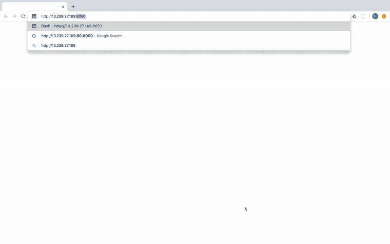

访问 AWS 上的仪表板

# 结论

你有它！通过仔细遵循这些步骤，您将成功地在 AWS 上部署了一个仪表板应用程序。通过在步骤 5 中正确配置 ECS 设置，还可以使服务可扩展，随着需求的增加自动部署新任务。

感谢阅读！如果你觉得这些材料有用，你可能也会觉得我最近写的一篇文章很有趣:[不，深度学习是不够的](https://medium.com/atlassiandata/nope-deep-learning-is-not-enough-13b150dab936)

[](https://medium.com/atlassiandata/nope-deep-learning-is-not-enough-13b150dab936)