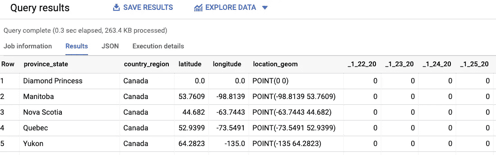
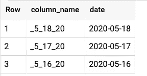
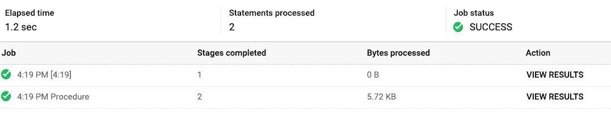
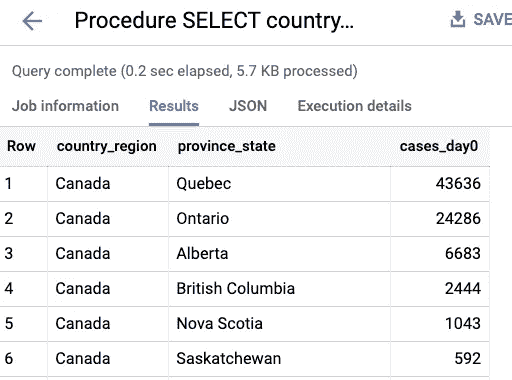
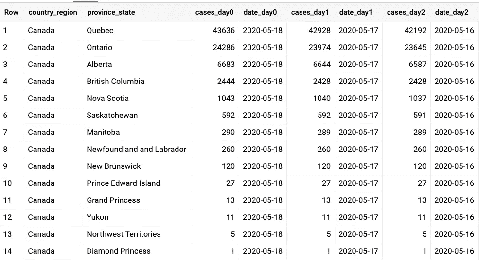
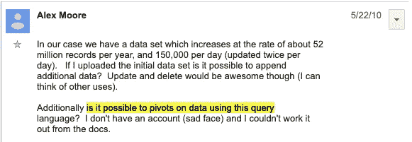

# 如何在 BigQuery 中使用动态 SQL

> 原文：<https://towardsdatascience.com/how-to-use-dynamic-sql-in-bigquery-8c04dcc0f0de?source=collection_archive---------2----------------------->

## 格式化字符串，并使用立即执行

比方说，我们想要查找过去 3 天加拿大各省确诊的 COVID 病例数。有一个 BigQuery 公共数据集，里面有 Johns Hopkins 发布的信息，我们可以如下查询:

```
SELECT 
 *   
FROM `bigquery-public-data`.covid19_jhu_csse.confirmed_cases
WHERE country_region LIKE 'Canada'
```

我们得到:



每个日期都有一栏

呀！每个日期都有一栏。我们如何找到最近三天的数据？


BigQuery 中的动态 SQL！图片由来自 [Pixabay](https://pixabay.com/?utm_source=link-attribution&utm_medium=referral&utm_campaign=image&utm_content=166539) 的 [Jim Semonik](https://pixabay.com/users/44833-44833/?utm_source=link-attribution&utm_medium=referral&utm_campaign=image&utm_content=166539) 拍摄

## 获取列的信息模式

我们可以使用 INFORMATION_SCHEMA 来获取列的列表，并使用以下命令来查找最近三天:

```
SELECT 
   column_name, 
    parse_date('_%m_%d_%y', column_name) AS date
FROM 
  `bigquery-public-data`.covid19_jhu_csse.INFORMATION_SCHEMA.COLUMNS
WHERE 
    table_name = 'confirmed_cases' AND 
    STARTS_WITH(column_name, '_')
ORDER BY date DESC LIMIT 3
```

这将返回:



表中的最近天数

## 创建动态 SQL 语句

您可以使用 EXECUTE IMMEDIATE 运行动态 SQL 语句。例如，假设我们有一个列名为 _5_18_20 的变量，这就是如何使用它来执行 SELECT 语句:

```
DECLARE col_0 STRING;
SET col_0 = '_5_18_20';**EXECUTE IMMEDIATE** **format**("""
  SELECT 
     country_region, province_state, 
    ** %s** AS cases_day0
  FROM `bigquery-public-data`.covid19_jhu_csse.confirmed_cases
  WHERE country_region LIKE 'Canada'
  ORDER BY cases_day0 DESC
""", **col_0);**
```

仔细看看上面的查询。首先，因为我声明了一个变量，等等。，这是一个 BigQuery 脚本，其中每个语句都以分号结束。

然后，我使用 BigQuery 的[字符串格式函数](https://cloud.google.com/bigquery/docs/reference/standard-sql/string_functions#format_string)来创建我想要运行的语句。因为我要传入一个字符串，所以我在格式字符串中指定了%s，并传入 col_0。

结果包括两个阶段:



第二阶段的结果是:



## 编写过去 3 天的脚本

我们可以结合以上三个想法——INFORMATION _ SCHEMA、脚本和立即执行来获得过去 3 天的数据。

```
DECLARE columns ARRAY<STRUCT<column_name STRING, date DATE>>;SET columns = (
  WITH all_date_columns AS (
    SELECT column_name, parse_date('_%m_%d_%y', column_name) AS date
    FROM `bigquery-public-data`.covid19_jhu_csse.INFORMATION_SCHEMA.COLUMNS
    WHERE table_name = 'confirmed_cases' AND STARTS_WITH(column_name, '_')
  )
  SELECT ARRAY_AGG(STRUCT(column_name, date) ORDER BY date DESC LIMIT 3) AS columns
  FROM all_date_columns
);EXECUTE IMMEDIATE format("""
  SELECT 
     country_region, province_state, 
     %s AS cases_day0, '%t' AS date_day0,
     %s AS cases_day1, '%t' AS date_day1,
     %s AS cases_day2, '%t' AS date_day2
  FROM `bigquery-public-data`.covid19_jhu_csse.confirmed_cases
  WHERE country_region LIKE 'Canada'
  ORDER BY cases_day0 DESC
""", 
columns[OFFSET(0)].column_name, columns[OFFSET(0)].date,
columns[OFFSET(1)].column_name, columns[OFFSET(1)].date,
columns[OFFSET(2)].column_name, columns[OFFSET(2)].date
);
```

步骤:

*   将列声明为一个数组变量，该变量将存储最近 3 天的列名和日期
*   将列设置为获取 3 天的查询结果。请注意，我正在使用 ARRAY_AGG，这样我就可以将完整的结果集存储在一个变量中。
*   格式化查询。请注意，我使用`%t '来表示时间戳(有关详细信息，请参见字符串格式文档),并传入了六个参数。

结果是:



## 使用立即执行

除了使用字符串格式，您还可以使用如下命名变量:

```
EXECUTE IMMEDIATE """
  SELECT country_region, province_state, _5_18_20 AS cases 
  FROM `bigquery-public-data`.covid19_jhu_csse.confirmed_cases 
  WHERE country_region LIKE [**@country**](http://twitter.com/country)
  ORDER BY cases DESC LIMIT 3
"""
**USING 'Canada' AS country;**
```

您也可以使用问号来处理位置变量:

```
EXECUTE IMMEDIATE """
  SELECT country_region, province_state, _5_18_20 AS cases 
  FROM `bigquery-public-data`.covid19_jhu_csse.confirmed_cases 
  WHERE country_region **LIKE ?**
  ORDER BY cases DESC **LIMIT ?**
"""
**USING 'Canada', 3;**
```

USING 子句在某些情况下很棘手。例如，以下内容不起作用:

```
*EXECUTE IMMEDIATE """
  SELECT country_region, province_state, ? AS cases -- PROBLEM!!!
  FROM `bigquery-public-data`.covid19_jhu_csse.confirmed_cases 
  WHERE country_region LIKE ?
  ORDER BY cases DESC LIMIT ?
"""
USING '_5_18_20', 'Canada', 3; -- DOESNT WORK!!!!*
```

这是因为第一个参数被解释为:

```
*'_5_18_20' AS cases*
```

因此，不能通过使用。因此，我推荐使用 String FORMAT()来创建立即执行的查询，因为它没有这些问题。

## 下一步是什么？PIVOT()，就是这样！

动态 SQL 特性是在 big query 10 岁生日的时候发布的。这里有一个视频，一些 BigQuery 的朋友祝它生日快乐:

来自 10 年前的第一个用户线程对在几秒钟内处理 60B 记录赞不绝口，并对近乎实时的查询(事情越变越多……)深思熟虑。在同一个线程中是第一个功能请求…枢轴:



动态 SQL 最终使这成为可能， [Felipe Hoffa](https://medium.com/u/279fe54c149a?source=post_page-----8c04dcc0f0de--------------------------------) 承诺他将编写一个函数，最终能够在 BigQuery 中使用 PIVOT()——敬请期待。

尽情享受吧！

*感谢我的同事*[*Jagan r . Athreya*](https://medium.com/u/ac51b9da0e54?source=post_page-----8c04dcc0f0de--------------------------------)*对使用格式的有益讨论和建议，并感谢*[*feli PE Hoffa*](https://medium.com/u/279fe54c149a?source=post_page-----8c04dcc0f0de--------------------------------)*的怀旧之旅。*