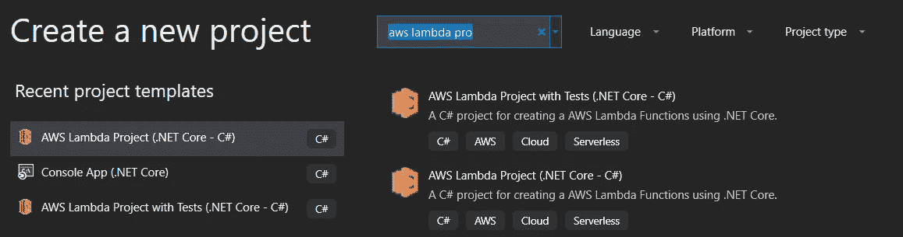
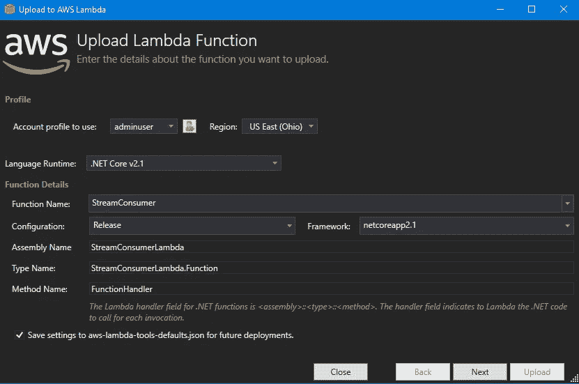
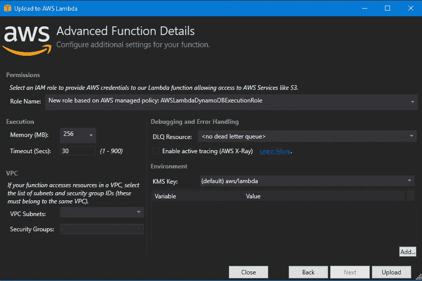
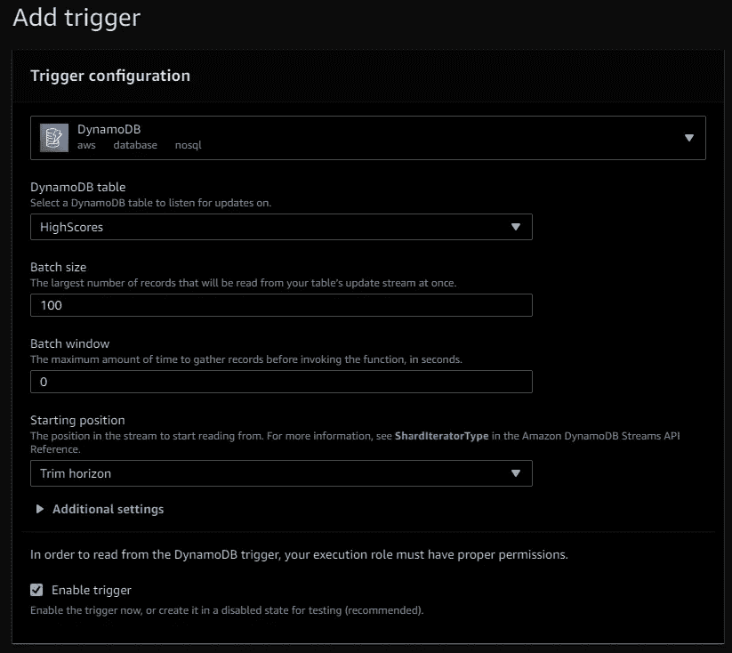
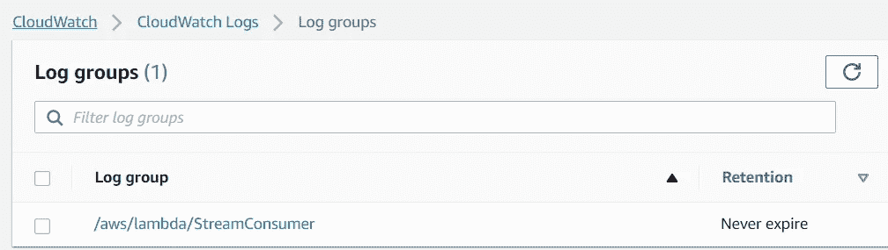
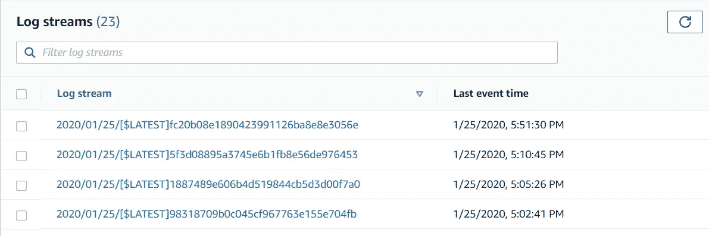
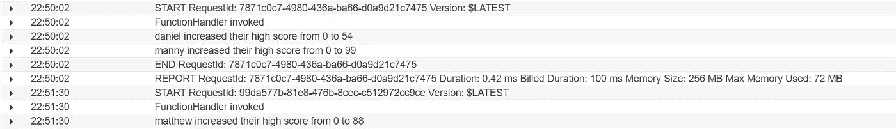
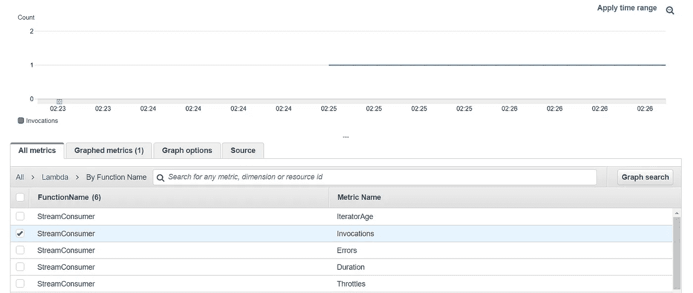

# 中的 DynamoDB 流和 AWS Lambda 入门。网络核心

> 原文：<https://towardsdatascience.com/how-to-use-dynamodb-streams-with-aws-lambda-and-net-core-62db43ae98c1?source=collection_archive---------14----------------------->

## 使用 AWS Lambda 在 C#中使用 DynamoDB 流的分步教程

事件驱动编程在当今的软件世界中非常流行。用松散耦合的、可独立部署的、易于扩展的组件来构建一个系统有很多优点。可以利用无服务器工具来创建其中的一些组件；一个 AWS，这通常意味着使用 DynamoDB 和 Lambda。在本文中，我们将构建一个小型的事件驱动系统，其中 DynamoDB 是我们的事件源，Lambda 函数被调用来响应这些事件。为此，我们将使用一个名为 DynamoDB Streams 的特性。

在一个表上启用 DynamoDB 流后，对该表的所有修改都会被记录下来，并按顺序推送到流中。AWS 没有指定流的内部，但是它们非常类似于 Kinesis 流(并且可能在幕后使用它们)。)有多种方法来使用流，包括使用 Kinesis 客户端库(AWS 提供的 SDK)，但最简单的方法之一是将流配置为 Lambda 函数的触发器。

现在，让我们浏览启用 DynamoDB 流的过程，编写一个简短的 Lambda 函数来使用流中的事件，并将 DynamoDB 流配置为 Lambda 函数的触发器。我们将一步一步来，但如果你想跳到最后，检查源代码和 Terraform，直接去我的 [GitHub repo](https://github.com/matthew-harper/dynamodb_stream_consumer) 。如果你需要复习 DynamoDB 的基础知识，可以看看我写的关于[开始使用 DynamoDB](https://medium.com/trimble-maps-engineering-blog/getting-started-with-dynamodb-and-net-core-how-to-build-a-leaderboard-4335f2bd56a8) 的文章。

# 先决条件

为了准确地遵循这个指南，你需要安装 Visual Studio 2019 和 [AWS 工具包](https://aws.amazon.com/visualstudio/)。我在这里使用这种设置是因为它与 Lambda 紧密集成；只需点击一下，即可将您的代码发布到 AWS。

我包含了一个 Terraform 文件来创建 DynamoDB 表(包括它的索引和流)。如果你以前没有使用过 Terraform，这是一个很棒的工具，可以让你把基础设施写成代码。或者，您可以使用 AWS 管理控制台手动创建和配置 DynamoDB 表。

# 创建 DynamoDB 表和流

我们先来看一下 Terraform 文件 [main.tf](https://github.com/matthew-harper/dynamodb_stream_consumer/blob/master/StreamConsumerLambda/main.tf) 。该文件只包含一个资源(基础设施对象)——我们的 DynamoDB 表。在这个资源中，定义了表的每个属性和索引(在[的前一篇文章](https://medium.com/trimble-maps-engineering-blog/getting-started-with-dynamodb-and-net-core-how-to-build-a-leaderboard-4335f2bd56a8)中概述了全局和辅助索引)。)

启用流所需的两个参数是 stream_enabled(布尔)
和 stream_view_type(枚举)。steam_view_type 允许您选择将多少数据推送到流中。您可以从四个选项中进行选择:

*   KEYS_ONLY —仅修改记录的分区和排序键
*   NEW _ IMAGE 更新记录的所有属性
*   OLD_IMAGE —修改前记录的所有属性
*   新图像和旧图像-修改前后的所有属性

在我们的示例中，我们将选择 NEW_AND_OLD_IMAGES，这样我们可以获得尽可能多的信息。一般来说，您会希望在使用最少数据量的同时选择满足您需求的选项。

如果您想使用 Terraform 在 AWS 中运行这个数据库，唯一需要的先决条件是您的机器上已经存储了[共享 AWS 凭证](https://docs.aws.amazon.com/ses/latest/DeveloperGuide/create-shared-credentials-file.html)(如果您曾经使用过 AWS CLI，那么您已经准备好了。)[下载 Terraform](https://www.terraform.io/downloads.html) 并添加到你的路径中。编辑 main.tf 文件，并将“profile”更改为您自己的 AWS 概要文件的名称。然后在包含。tf 文件并运行以下两个命令:

Terraform 将执行生成基础设施所需的所有 AWS APIs。如果您对 terraform 文件进行了更改，您可以再次运行“terraform 应用”来执行更新。当你用完后，执行“terraform destroy”将从你的 AWS 环境中删除你的所有更改。

# 创建一个 Lambda 来使用该流

有了我们的表，让我们为 Lambda 函数编写代码来使用它。打开 Visual Studio 201 并创建一个新的 AWS Lambda 项目(。NET Core c#)；一旦安装了 AWS Toolkit for Visual Studio，就可以使用这个模板。当提示选择蓝图时，选择“空函数”,因为我们要从头开始。

看看我们项目的 NuGet 依赖项。模板已经添加了基本 Lambda 函数所需的包。

我们需要再添加一个依赖项。从管理 Nuget 包窗口，搜索并安装 Amazon.Lambda.DynamoDBEvents。看一看它，然后我们将讨论它:

在顶部附近，我们为 Amazon 添加了一个 using 指令。Lambda.DynamoDBEvents 命名空间。然后我们转到模板提供的 Lambda 函数(FunctionHandler)，它接受一个字符串和一个 ILambdaContext 作为参数。ILambdaContext 包含关于 Lambda 函数的有用信息，比如内存限制、剩余执行时间和日志访问，所以我们将保留这些信息。我们用 DynamoDBEvent 替换了 string 参数；此对象包含 DynamodbStreamRecord 对象的列表。每个 DynamodbStreamRecord 都是对 DynamoDB 表的单个数据修改的描述。

当我们配置 Lambda 来监听 DynamoDB 流时，我们将选择一个最大批处理大小和一个收集该批处理的时间窗口。因此，我们的函数需要能够在每次被调用时处理多个 DynamodbStreamRecord。所以我们添加了一个循环来遍历 DynamoDBEvent 中的每一项并执行一些操作。在我们的示例中，操作是使用 ILambdaContext。Logger 将关于事件的信息写入 CloudWatch，但是您可以修改函数的内容以适应您的用例。

代码准备就绪后，我们可以通过在解决方案资源管理器中右键单击项目并选择“发布到 AWS Lambda”来将函数发布到 AWS。"为您的新 Lambda 函数选择一个名称和一个 AWS 区域。

下一个屏幕将询问关于 Lambda 的更多细节。我们将对默认值进行的唯一更改是选择一个 IAM 角色；这指定了 Lambda 在执行期间必须与其他 AWS 服务交互的特权。基于 AWSLambdaDynamoDBEecutionRole 创建一个新角色—这允许对 DynamoDB 流的列表和读取访问，以及对 CloudWatch 日志的写入访问。然后继续把你的函数上传到云端。

# Lambda 配置— AWS 控制台

最后一步，导航到 AWS 控制台的 Lambda 部分，选择我们刚刚发布的函数。

我们将添加一个触发器，以便每当记录被添加到 DynamoDB 流中时启动 Lambda 函数。从功能配置屏幕中选择“添加触发器”并选择 DynamodDB。您将看到下面的屏幕，为我们的事件源编写详细信息。

确保选择了所需的 DynamoDB 表，然后查看其他选项。批处理大小是每次执行时发送给我们的函数的 DynamodbStreamRecords 的最大数量。批处理窗口决定了流从表中读取事件并调用 Lambda 函数的步调，以秒为单位。对于这个例子，默认的选择就足够了，但是在现实世界中，您会希望根据您的用例来定制这些选择。较短的批处理窗口对于需要接近实时地对更新做出反应的应用程序来说是有意义的，而较长的窗口(和较大的批处理大小)在处理单个项目是快速操作并且可以在批处理过程之间暂停的情况下可能更具成本效益。

# 测试和验证

是时候试试我们创造的东西了。前往 AWS 控制台中的 DynamoDB 表，并开始进行更改。添加一些新记录。修改现有记录。我们如何知道我们的流和 Lambda 是否在工作？嗯，由于我们的 Lambda 写入 CloudWatch，我们必须检查日志。在 AWS 控制台中导航到 CloudWatch，并从侧栏中选择 log groups。

您应该会看到一个与 Lambda 函数同名的组。打开它，你会发现一个日志流列表。Lambda 函数的每个执行上下文将创建一个流。作为参考，第一次调用函数时，会创建一个执行上下文(函数的临时运行时环境)。连续调用你的函数会遇到相同的上下文，直到十分钟后你的函数才执行。冷却期过后，再次调用 Lambda 将导致函数被加载到一个新的执行上下文中(这就是所谓的冷启动。)对函数的多次同时调用也可能导致创建新的执行上下文，因为一个执行上下文一次只能处理一个请求。

无论如何，您应该看到至少一个日志流。如果没有，请尝试刷新页面；有时日志需要一段时间来传播。如果你仍然运气不好，检查你为 Lambda 配置的触发器，确保它被设置到正确的 DynamoDB 表。此外，如果您的批处理窗口大小被设置为大于零的任何值，那么您必须等到它到期时，流才会收集所有的表修改。当您点击流时，您应该会看到类似如下的日志:

您还可以进入 CloudWatch 指标，显示有关您的功能的更多信息。下面你会发现一个令人兴奋的函数调用图；你可以看到我们在 2:25 从 0 到 1。

# 概述

流允许有趣的用例，否则在 DynamoDB 中很难支持这些用例。每当一个用户超过他当前的最高分，我们就可以给他发电子邮件。我们还可以聚合数据并将其写入另一个表中；也许我们会跟踪某个游戏的高分在某个时间窗口内改变了多少次。流还支持数据复制；这在我们希望在更适合这类活动的数据库(如 SQL Server 或 Redshift)中运行分析查询的情况下非常有用。)花几分钟时间试用它们，看看它们是否适合您未来应用程序中的用例。