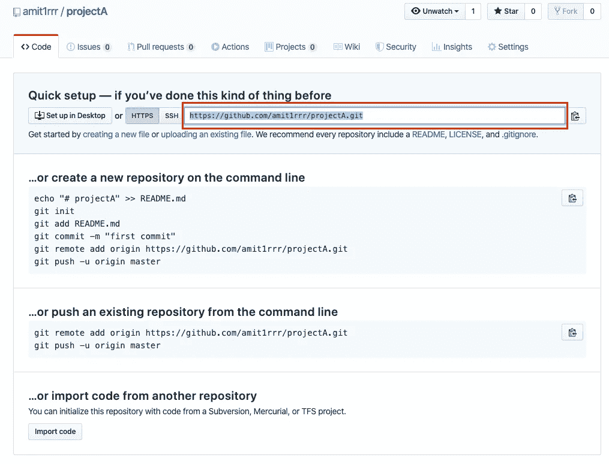

# Jupyter 笔记本如何使用 Git / GitHub

> 原文：<https://towardsdatascience.com/how-to-use-git-github-with-jupyter-notebook-7144d6577b44?source=collection_archive---------1----------------------->

这是一个针对 Jupyter 笔记本用户的综合性 Git 教程。如果你已经熟悉某一部分，可以随意跳过。最后你将能够-

*   将您的笔记本推送到 GitHub 存储库
*   开始版本化您的笔记本
*   [在 GitHub 上查看笔记本拉取请求](#0bf3)
*   了解如何恢复到特定版本
*   获得反馈并与您的同事讨论笔记本电脑的变化
*   轻松共享您的笔记本供他人查看

# 创建 GitHub 帐户

如果您没有 GitHub 帐户，请在这里创建一个。

# 在本地设置 Git

*   [下载并安装](https://git-scm.com/downloads)Git 的最新版本。
*   通过在终端上运行以下命令，在 git 中设置您的姓名和电子邮件

```
>> git config --global user.name "Mona Lisa"
>> git config --global user.email "email@example.com"
```

*   [通过缓存您的密码，用 GitHub](https://help.github.com/en/github/using-git/caching-your-github-password-in-git) 连接您的本地 git 客户端。

# 创建新存储库

GitHub 存储库就像你在云中的超级文件夹。您可以存储文件(笔记本、数据、源代码)，查看这些文件的历史更改，打开问题，讨论更改等等。人们通常为每个项目创建一个存储库。

让我们继续在 GitHub 上创建一个存储库。创建后，您将看到如下页面，复制突出显示的存储库 URL。



# 克隆存储库

让我们通过在终端上运行以下命令，在我们的机器上克隆 GitHub 存储库。它将在我们的机器上创建 projectA 目录，该目录链接到 GitHub 上的 amit1rrr/projectA 存储库。将`[https://github.com/amit1rrr/projectA.git](https://github.com/amit1rrr/projectA.git)`替换为上一步中您自己的存储库 URL

```
>> git clone https://github.com/amit1rrr/projectA.git
   Cloning into 'projectA'...
   warning: You appear to have cloned an empty repository.
```

# 将笔记本推送到 GitHub

我们的存储库现在是空的，让我们把一些笔记本推到它。我们将两个笔记本复制到我们克隆项目的目录下，

```
>> cp /some/path/analysis1.ipynb /path/of/projectA/
>> cp /some/path/scratch.ipynb /path/of/projectA/
```

假设我们要将`[analysis1.ipynb](https://github.com/amit1rrr/projectA.git)`推送到 GitHub。我们首先需要告诉本地 git 客户端开始跟踪文件—

```
>> git add analysis1.ipynb
```

您可以检查哪些文件正在被 git 状态跟踪，


您可以看到`[analysis1.ipynb](https://github.com/amit1rrr/projectA.git)` 在“*待提交的变更*下，因此它被我们的本地 git 客户端跟踪。现在让我们提交更改—

```
# -m flag provides a human friendly message describing the change
>> git commit -m "Adds customer data analysis notebook"
```

提交只是创建一个您可以随时恢复的检查点。现在最后把这个提交给 GitHub —

```
>> git push
```

现在你可以访问 GitHub 上的[库页面](https://github.com/amit1rrr/projectA)查看你的[提交](https://github.com/amit1rrr/projectA/commits/master)。

# 在分支中发展

假设您正在进行一个跨越多天的大型项目，但是您需要定期提交正在进行的工作作为备份。方法是创建一个特征分支。

每个存储库都有一个默认的分支(通常是“*主*或“*主*”)，存储已完成工作的最新版本。团队中的每个成员都可以创建自己的功能分支来存储他们的 WIP 提交。当他们在一个特征分支中的工作准备好被共享时，他们可以创建一个 pull 请求供同行评审&随后将特征分支合并到 master 中。让我们用具体的步骤来解决这个问题。

假设我即将开始一个分析客户数据的新项目。首先，我将创建一个新的分支，

```
>> git checkout -b customer_data_insights
```

然后，我将创建/编辑一些笔记本和其他文件来进行实际的分析。当我准备好提交我的 WIP 时，我将执行通常的 git add，git commit，git push。在 git 推送时，您会看到以下错误，因为 GitHub 上还不存在这个分支。


简单地通过复制错误中显示的命令首先推动分支，

```
>> git push --set-upstream origin customer_data_insights
```

然后使用 git push 将您的提交推送到这个新创建的分支。

# 创建拉式请求

> 假设您已经在 feature branch 上工作了一段时间，它已经准备好进入黄金时间了。最有可能的是，你想先与你的同事分享它，在合并到主分支之前得到他们的反馈。这就是拉请求的作用。

您可以从 GitHub UI 创建拉请求。转到您的项目页面->拉式请求选项卡->单击“新建拉式请求”。


选择要合并到主控形状的分支。验证提交和更改的文件列表。点击“*创建拉式请求*”。


在下一页上，提供标题并简要描述您的更改，单击“*创建拉动式请求*”。


# 查看笔记本提取请求

GitHub pull 请求对于同行评审来说非常棒，因为它们可以让您并排看到更改并对其进行评论。但是在 Jupyter 的例子中，GitHub 显示了 JSON 的差异，这些差异真的很难理解(见下文)。


GitHub 上的笔记本差异

> 您可以使用 [ReviewNB](https://www.reviewnb.com?utm_source=reviewnb_blog) 来解决笔记本差异问题。它向您展示了丰富的差异&让您可以对任何笔记本单元格进行评论，以便与您的团队讨论变化。


丰富的差异和评论

一旦你的更改被队友批准，你就可以从 GitHub UI 合并它们。


或者从命令行运行 git merge + git push，


# 恢复到特定的笔记本版本

如果您想暂时回到提交，签出文件，然后回到您所在的位置，那么您可以简单地签出所需的提交。最后运行*“git check out master”*返回到当前状态。


如果你真的想回到一个旧的状态，并在那里做一些改变，你可以从那个提交开始一个新的分支—

```
>> git checkout -b old-state <some-commit-id>
```

你也可以在 GitHub 上浏览旧的提交，方法是进入你的项目页面->提交。打开所需的提交，点击“*查看文件*，查看提交时的笔记本状态。


# **分享你笔记本的只读链接**

当你在 GitHub 上浏览存储库中的笔记本时，它会将它们呈现为 HTML 格式。所以像[这种](https://github.com/amit1rrr/PythonDataScienceHandbook/blob/master/notebooks/03.09-Pivot-Tables.ipynb)分享笔记本的只读链接非常方便。如果它是一个私有的存储库，与你共享链接的人需要有一个 GitHub 帐户，并且有权限访问你的存储库。

> 出于安全考虑，GitHub 不会在笔记本中运行任何 Javascript。如果您的笔记本电脑包含交互式小工具，您可以使用 [nbviewer](https://nbviewer.jupyter.org/) 或 [ReviewNB](https://www.reviewnb.com/?utm_source=reviewnb_blog) 。

# 结论

如果您是 Git 的新手，可能需要一些时间来适应所有的命令。但是这是一种在软件项目中得到证实的合作方式&在数据科学工作中也被广泛使用。您可以将其与 [ReviewNB](https://www.reviewnb.com?utm_source=reviewnb_blog) 结合使用，以消除工作流程中的一些问题。

黑客快乐！