# 非技术性的 Google Colab

> 原文：<https://towardsdatascience.com/how-to-use-google-colab-for-data-science-for-free-49c3353624e?source=collection_archive---------45----------------------->

当我们寻求执行分析时，有多种方式来运行分析或训练模型。最流行的方法是在您的计算机上下载 [Anaconda](https://www.anaconda.com/) 框架，并在 Jupyter 笔记本(以前称为 Python 笔记本)上工作。

## 数据科学中的笔记本是什么？

很简单，我们在大学里用笔记本做什么？我们做笔记，记下问题，解决问题，并试图整理我们的想法。数据科学或与之相当的编码通过 Jupyter 笔记本电脑实现。我们本地的这些笔记本使用我们计算机的硬件。

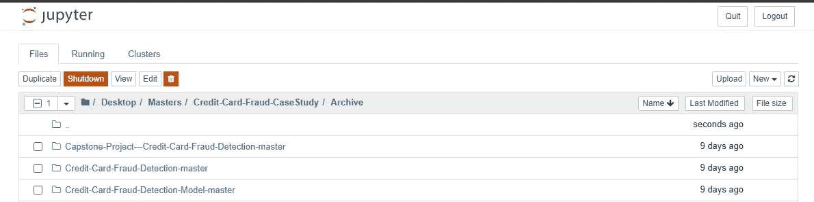

我本地机器上的 Jupyter 笔记本(图片由[作者](https://www.linkedin.com/in/anishmahapatra/)提供)

当我们想要训练更复杂的模型或使用更多的数据时，我们的局部可能是不够的。购买和维护硬件的成本可能很高。相反，如果您的硬件与您的数据科学不兼容，并且您有一台装有互联网浏览器的 PC，您可以免费做同样的事情！

为了训练更复杂的模型，我们希望利用并行处理来训练模型。我们可以在 Google Colab 上免费使用 GPU 来实现这一点。(记住，我们笔记本电脑上的 CPU，云上的 CPU 和 GPU)。

人们可以利用多种框架来尝试数据科学，Google Colab 是设置时间最少、速度最快的框架之一。这篇文章是为想尝试一下的非技术人员准备的。如果有任何问题，请随时通过 [LinkedIn](https://www.linkedin.com/in/anishmahapatra/) 或电子邮件联系我，我很乐意帮忙。欢迎在下面评论你想了解的更多信息(技术或其他方面)。接下来，我可以通过电子邮件快速回复。


照片由[安朵斯瓦斯](https://unsplash.com/@wasdrew?utm_source=medium&utm_medium=referral)在 [Unsplash](https://unsplash.com?utm_source=medium&utm_medium=referral) 上拍摄

让我们深入了解一下**云:Google Colab Edition。**

[](/the-cloud-google-cloud-platform-gcp-made-easy-anish-mahapatra-3d0aed3fe7fa) [## 谷歌云平台基础(GCP)

### 云是一个复杂的空间。这并不像大多数人想象的那样简单。让我们简化一下…

towardsdatascience.com](/the-cloud-google-cloud-platform-gcp-made-easy-anish-mahapatra-3d0aed3fe7fa) 

## 运行 Google Colab 笔记本

前往 [Google Drive](https://drive.google.com/drive/u/0/my-drive) 并登录您的 Google 帐户。

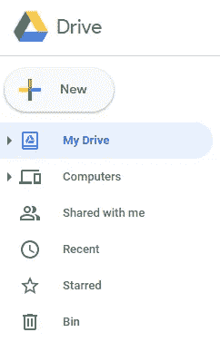

点击**新建**图标(图片由[作者](https://www.linkedin.com/in/anishmahapatra/)

从这里，点击更多并选择谷歌合作实验室。

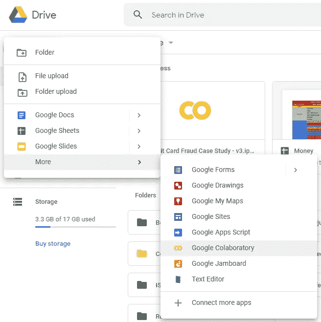

点击**谷歌合作实验室**，如图所示(图片由[作者](https://www.linkedin.com/in/anishmahapatra/)提供)

这将在 [Google Colab](https://colab.research.google.com/notebooks/intro.ipynb#recent=true) 上打开一个新的 Python 笔记本。或者你可以去 Google Colab 打开一个新的笔记本。

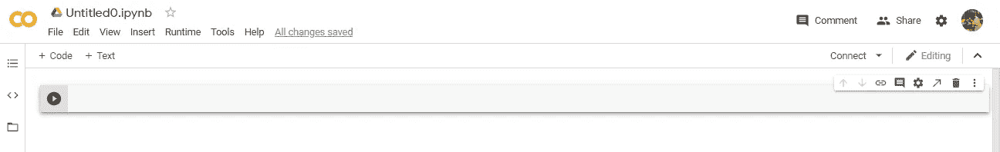

Google Colab 中的新笔记本(图片由[作者](https://www.linkedin.com/in/anishmahapatra/)提供)

尝试进口熊猫，以确保它是有效的。

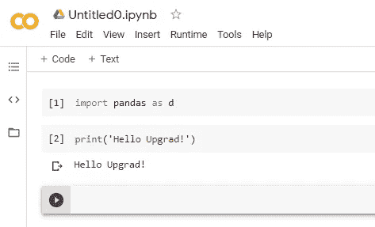

示例代码(图片由[作者](https://www.linkedin.com/in/anishmahapatra/)提供)

你现在有一个功能齐全的谷歌 Colab 笔记本。

## 在 Google Colab 上打开一个现有的 Jupyter 笔记本

假设您已经在本地 Jupyter 笔记本上做了一些工作——您可以直接复制代码，也可以通过文件菜单选项下的*上传笔记本*选项上传笔记本。

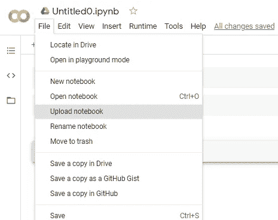

上传笔记本的选项(图片由[作者](https://www.linkedin.com/in/anishmahapatra/)提供)

## 如何将数据接收到 Colab 笔记本中

转到 Google Drive，创建一个新文件夹来存储您的数据。使用上传文件选项上传您的数据集和驱动器中的其他资料。

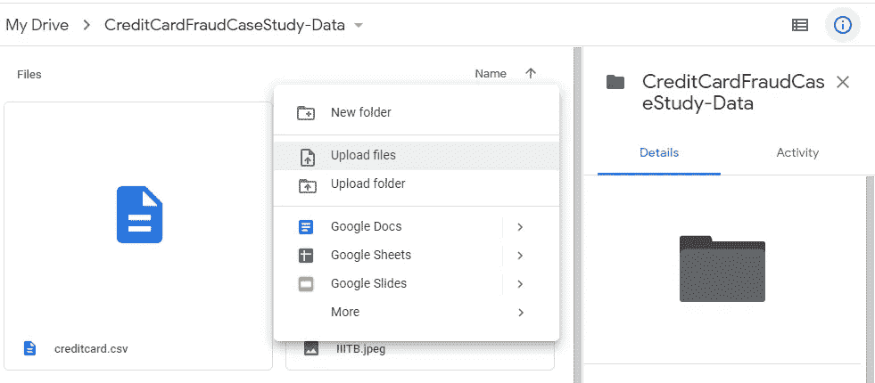

上传你需要的文件(图片由[作者](https://www.linkedin.com/in/anishmahapatra/)提供)

您现在应该有文件(。csv ),你需要在你的谷歌驱动器。接下来，我们将在 Google Colab 上安装 Google Drive。为此，我们需要允许 Google Colab 访问 Google Drive。

我会保持简单，我会给你一个方法，使用它。

```
# Since this notebook is from Google Colab, mounting Google Drive for authentication tokenfrom google.colab import drivedrive.mount('/content/drive')
```

一旦运行它，您应该会看到类似这样的内容:

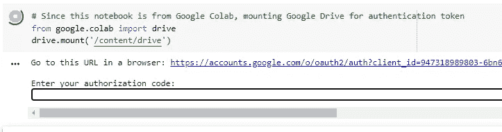

(图片由[作者](https://www.linkedin.com/in/anishmahapatra/)提供)

点击该链接，您将进入另一个页面，在 Google Colab 上验证您的 Google Drive。


点击允许认证你的账户(图片由[作者](https://www.linkedin.com/in/anishmahapatra/)提供)

现在将生成一个唯一的代码，将其复制并粘贴到 Google Colab 的文本框中。

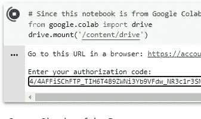

输入唯一的代码并点击回车(图片由[作者](https://www.linkedin.com/in/anishmahapatra/)提供)

您现在应该会看到类似下面的消息。

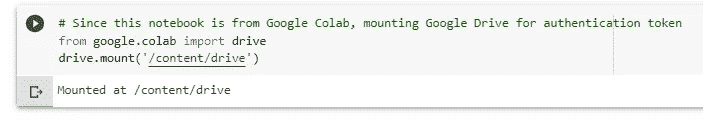

(图片由[作者](https://www.linkedin.com/in/anishmahapatra/)提供)

干得好！现在，您已经将 Google Drive 安装到了 Google Colab 上。这意味着你现在可以在 Google Colab 上访问 Google Drive 中的信息。

## 如何读取. csv 文件作为熊猫数据帧

这很简单。想象 Google Drive 是您的本地设备，并相应地加载数据——下面是一个示例

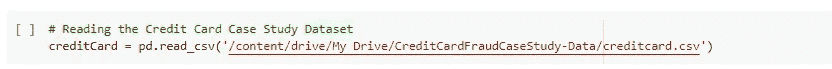

摄取一个. csv 文件作为熊猫数据帧(图片由[作者](https://www.linkedin.com/in/anishmahapatra/)提供)

别忘了进口熊猫套餐！

你现在可以在 Google Colab 上运行你的代码了。这就是你在云上度过大部分时间的方式。

## 如何使用 GPU 进行模型训练

1.  您可以通过将鼠标悬停在图标上来查看 RAM 和磁盘的使用情况，如下所示。

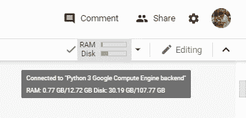

(图片由[作者](https://www.linkedin.com/in/anishmahapatra/)提供)

2.转到运行时选项

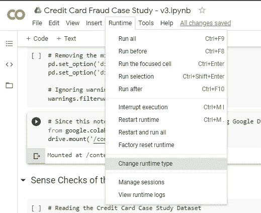

(图片由[作者](https://www.linkedin.com/in/anishmahapatra/)提供)

3.当您要训练模型时，请选择 GPU 作为选项

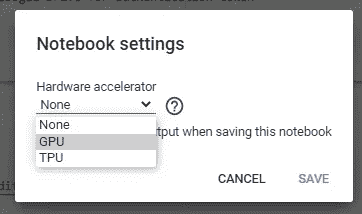

(图片由[作者](https://www.linkedin.com/in/anishmahapatra/)提供)

4.然后，运行所有细胞

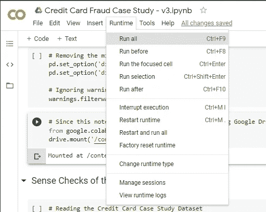

(图片由[作者](https://www.linkedin.com/in/anishmahapatra/)提供)

好了，你现在是 Google Colab 的中级用户了。

[](https://medium.com/datadriveninvestor/jupyter-notebook-crashed-so-i-deployed-my-data-science-project-in-the-cloud-in-15-minutes-for-56edc0ac4d0d) [## Jupyter 笔记本崩溃了，所以我在 15 分钟内就把我的数据科学项目部署到了云中(对于…

### 你可以用一个很老很老的系统免费进行奇特的数据科学研究——只要动动脑筋，从这个博客中获得帮助。

medium.com](https://medium.com/datadriveninvestor/jupyter-notebook-crashed-so-i-deployed-my-data-science-project-in-the-cloud-in-15-minutes-for-56edc0ac4d0d) 

## 奖金

黑暗模式！

进入设置->网站，选择黑暗。

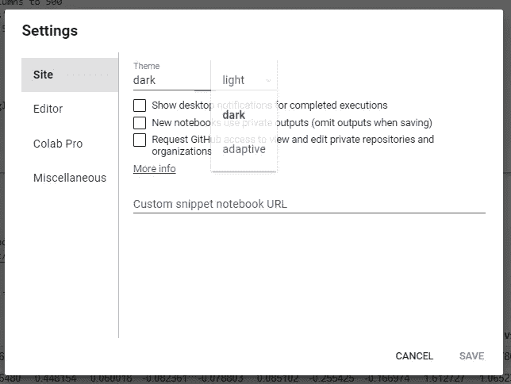

(图片由[作者](https://www.linkedin.com/in/anishmahapatra/))

在上面编码感觉更舒服

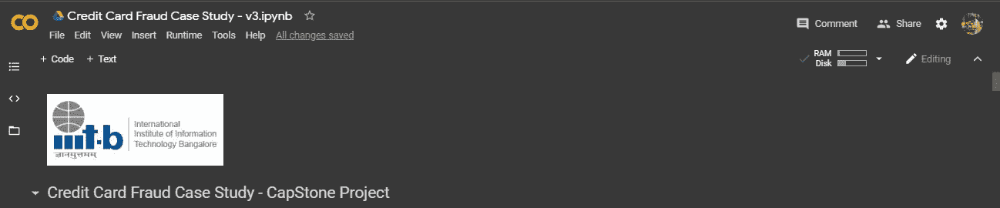

黑暗模式(图片来自[作者](https://www.linkedin.com/in/anishmahapatra/)

使用这些新发现的知识开始学习数据科学。请随意通过 mu Github 获取一些灵感。或者进入 Kaggle 开始。

[](https://github.com/anishmahapatra01/) [## anishmahapatra01 —概述

### 每天尝试新事物—专业数据科学家追求数据硕士…

github.com](https://github.com/anishmahapatra01/) 

[**neptune.ai**](https://neptune.ai/blog) 我偶然发现的一个很棒的附加资源，可以帮助你进一步了解如何在 Google Colab 中处理文件。

[](https://neptune.ai/blog/google-colab-dealing-with-files) [## 如何在 Google Colab 中处理文件:你需要知道的一切- neptune.ai

### 谷歌合作实验室是一个免费的 Jupyter 笔记本环境，运行在谷歌的云服务器上，让用户…

海王星. ai](https://neptune.ai/blog/google-colab-dealing-with-files) 

干得好！所以，关于我的一点点。我是一家顶级数据科学公司的数据科学家，目前正在攻读数据科学硕士学位。我花很多时间学习和工作。如果你喜欢这个，给我点爱！😄我也写关于千禧一代的[生活方式](https://medium.com/@anishmahapatra/the-millennial-burn-out-is-real-a0acebff25ae)、[咨询](https://medium.com/@anishmahapatra/my-top-5-learnings-as-a-consultant-accc5989ec34)、[聊天机器人](https://chatbotslife.com/how-you-can-build-your-first-chatbot-using-rasa-in-under-15-minutes-ce557ea52f2f)和[金融](https://medium.com/@anishmahapatra/the-investment-guide-for-smart-noobs-9d0e2ca09457)！如果您对此有任何问题或建议，请随时通过 LinkedIn[联系我](https://www.linkedin.com/in/anishmahapatra/)或关注我[这里](https://medium.com/@anishmahapatra)，我很想听听您的想法！

[](https://www.linkedin.com/in/anishmahapatra/) [## Anish Mahapatra —数据科学家— Mu 适马公司| LinkedIn

### 我正在努力理解数学、商业和技术如何帮助我们在未来做出更好的决策…

www.linkedin.com](https://www.linkedin.com/in/anishmahapatra/) 

作为本系列后续步骤的一部分，我将发布更多关于我们如何在现实世界中利用云的用例。欢迎[关注我](https://medium.com/@anishmahapatra)并与我联系了解更多信息！

[](https://medium.com/@anishmahapatra) [## Anish Mahapatra —中等

### 阅读 Anish Mahapatra 在媒体上的文章。专业数据科学家攻读数据科学硕士学位。在…工作

medium.com](https://medium.com/@anishmahapatra)