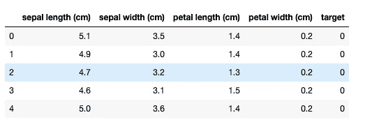
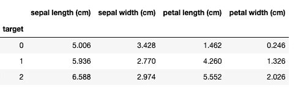
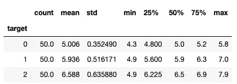

# 如何在 pandas 中使用 groupby()和聚合函数进行快速数据分析

> 原文：<https://towardsdatascience.com/how-to-use-groupby-and-aggregate-functions-in-pandas-for-quick-data-analysis-c19e7ea76367?source=collection_archive---------22----------------------->

## 初学者指南使用这个强大的组合在熊猫


图片来自 [Pixabay](https://pixabay.com/?utm_source=link-attribution&utm_medium=referral&utm_campaign=image&utm_content=17482)

**简介**

当您开始学习 pandas 中的数据分析时，您应该学习的第一个函数是如何使用 groupby()函数以及如何将其结果与聚合函数相结合。这相对来说比较简单，可以让你快速地做一些强大而有效的分析。

在本文中，我们将解释:

> 什么是 groupby()函数，它是如何工作的？
> 
> 什么是聚合函数，它们是如何工作的？
> 
> 如何一起使用 groupby 和 aggregate 函数

在本文结束时，您应该能够应用这些知识来分析您选择的数据集。

让我们开始吧。我们将在这里使用虹膜数据集，所以让我们开始加载它在熊猫。

**加载虹膜数据集**

您可以使用下面的代码加载 iris 数据集并检查它的前几行:

```
from sklearn import datasets
import pandas as pddata = datasets.load_iris()
df = pd.DataFrame(data.data,columns=data.feature_names)
df['target'] = pd.Series(data.target)
df.head()
```



通过目测数据集，您可以看到我们拥有的唯一分类变量是目标。您可以使用 unique()函数来检查它取什么值:

```
df.target.unique()
array([0, 1, 2])
```

我们可以看到它有三个值:0、1 和 2。

**使用 groupby()**

既然您已经检查了目标列是分类的以及它取什么值，那么您可以尝试使用 groupby()函数。顾名思义，它应该将你的数据分组。在这种情况下，它将把它分成代表不同花卉种类的三组(我们的目标值)。

```
df.groupby(df.target)<pandas.core.groupby.generic.DataFrameGroupBy object at 0x1150a5150>
```

如您所见，groupby()函数返回一个 DataFrameGroupBy 对象。乍一看不是很有用。这就是你需要集合函数的原因。

**什么是聚合函数？**

聚合函数是接受一系列条目并返回一个以某种方式汇总它们的值的函数。

好的例子有:

> count()，
> 
> max()，
> 
> min()，
> 
> 均值()，
> 
> std()，
> 
> 描述()

正如我提到的，你可以在一系列的条目中使用它们。让我们将它应用于数据集的其中一列:

```
df['sepal length (cm)'].mean()5.843333333333334
```

我们可以看到萼片长度列的平均值是 5.84。

现在让我们使用 describe()函数，它将给出更多的汇总统计数据。

```
df['sepal length (cm)'].describe()count    150.000000
mean       5.843333
std        0.828066
min        4.300000
25%        5.100000
50%        5.800000
75%        6.400000
max        7.900000
Name: sepal length (cm), dtype: float64
```

您可以看到，它给出了与前一个函数相同的平均值和一些附加信息:计数、最小值、最大值、标准值和四分位数范围。

**同时使用 groupby()和聚合函数**

现在是时候把你学到的东西结合在一起了。好消息是，您可以在 groupby 对象上调用聚合函数，这样您将获得每个组的结果。

让我们用 iris 数据集再次证明这一点:

```
df.groupby(df.target).mean()
```



如你所见，我们的索引列没有给出组名(在我们的例子中是 0、1 和 2)以及每列和每组的平均值。

你可以看到，第 0 组的平均花瓣长度(1.46 厘米)比其他两组的平均花瓣长度(1 (4.26 厘米)和 2(5.52 厘米)小得多。看起来这可能是被分析的花卉之间的一个重要差异。

您还可以对 group by 对象使用 describe()来获取我们组的所有描述性统计信息:

```
df.groupby(df.target).describe()
```


如您所见，该表为您提供了所有组和所有列的描述性统计数据。如果很难读懂，你也可以一次只看一栏:

```
df.groupby(df.target)['sepal length (cm)'].describe()
```



正如您在这些例子中看到的，将 groupby 和 aggregate 函数一起使用非常简单明了。

规则是首先使用 groupby 函数创建 groupby 对象，然后调用聚合函数计算每个组的信息。

**总结**

在本文中，您了解了 groupby 函数，以及如何在 pandas 中将它与聚合函数结合使用。

我希望你能够应用你所学的知识，对你选择的数据集进行快速分析。

*原载于 aboutdatablog.com:* [如何在 pandas 中使用 groupby()和 aggregate 函数进行快速数据分析](https://www.aboutdatablog.com/post/how-to-use-groupby-and-aggregate-functions-in-pandas-for-quick-data-analysis)，*2020 年 5 月 6 日。*

*PS:我正在 Medium 和*[***aboutdatablog.com***](https://www.aboutdatablog.com/)*上写文章，深入浅出地解释基本的数据科学概念。你可以订阅我的* [***邮件列表***](https://medium.com/subscribe/@konkiewicz.m) *在我每次写新文章的时候得到通知。如果你还不是中等会员，你可以在这里加入*[](https://medium.com/@konkiewicz.m/membership)**。**

*下面还有一些你可能喜欢的帖子*

*[](/sorting-data-frames-in-pandas-a5a3af6f346a) [## 对熊猫中的数据框进行排序

### 如何快速有效地排序数据帧

towardsdatascience.com](/sorting-data-frames-in-pandas-a5a3af6f346a) [](/7-practical-pandas-tips-when-you-start-working-with-the-library-e4a9205eb443) [## 当你开始与图书馆合作时，7 个实用的熊猫提示

### 解释一些乍一看不那么明显的东西…

towardsdatascience.com](/7-practical-pandas-tips-when-you-start-working-with-the-library-e4a9205eb443) [](/jupyter-notebook-autocompletion-f291008c66c) [## Jupyter 笔记本自动完成

### 数据科学家的最佳生产力工具，如果您还没有使用它，您应该使用它…

towardsdatascience.com](/jupyter-notebook-autocompletion-f291008c66c)*