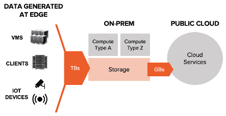
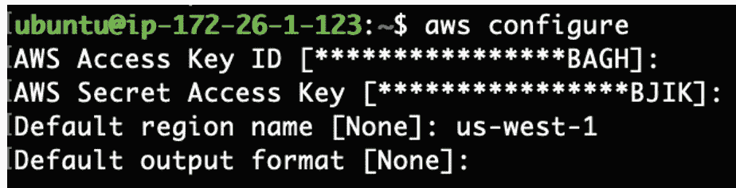
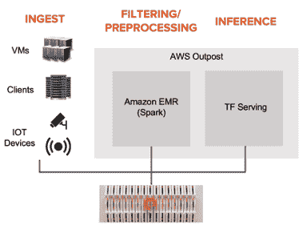

# 如何将本地存储与 AWS 前哨一起用于人工智能工作负载

> 原文：<https://towardsdatascience.com/how-to-use-high-performance-local-storage-for-ai-workloads-on-aws-outposts-3203b2853cc4?source=collection_archive---------42----------------------->

## 一起更好:内部云计算+共享数据


米歇尔在 [Unsplash](https://unsplash.com?utm_source=medium&utm_medium=referral) 上的照片

从无人驾驶汽车和金融交易到交通系统，许多用例需要近实时和本地*处理数据的能力。事情正在发生，我们需要尽快做出决定。没有时间将所有数据传输回公共云。*

因此，许多组织选择将其公共云项目扩展到私有的本地位置，构建混合云解决方案。

[AWS 前哨](https://aws.amazon.com/outposts/)是采用云优先计划的组织满足本地数据处理或低延迟要求的方式之一。借助前哨机架，您可以在数据中心部署 AWS 计算硬件。

这篇文章介绍了混合云人工智能工作流，并描述了如何将本地存储与 AWS 前哨配对。在本文中，我使用 Pure Storage [FlashBlade](https://www.purestorage.com/products/flashblade.html) 作为示例存储服务器，因为它支持来自同一设备的文件和对象存储。

# 人工智能部署的混合云模型

随着数据科学团队将其模型投入生产，他们必须支持更大规模的数据接收和数据处理，作为推理的一部分。

通常，将大型数据集转移到公共云中的性能损失(或成本)令人望而却步。或者，从边缘到公共云的连接可能不可靠。由于这些限制，拥有大量数据摄取的团队正在将人工智能推理从公共云迁移到边缘数据中心。

*注意:在这种情况下，我们使用“边缘”来表示分布式计算模型，其中服务交付在多个边缘站点执行，例如主机托管设施。*

团队可以在公共云中集中模型开发，然后将最终模型部署到边缘数据中心进行推理。团队可以在边缘执行初始分析，以识别异常或有趣的数据点，并将其发送回公共云进行进一步分析或重新培训。



混合云部署示例。(图片由作者提供)

例如，一家自动驾驶汽车公司可能有一个车队，每天每辆车都会产生 2TB 的数据日志。然而，他们的计算机视觉训练数据集可能没有足够的特定路标变体样本(汽车可能会遇到的其他东西)。因此，该公司的数据科学家可能会在边缘位置执行推理，以提取具有这些高价值异常的数据点，然后将这些数据点输入到模型再训练中。

完整的数据集被摄取到本地服务器中，AWS 前哨——甚至可能是一个 [GPU 前哨配置](https://blogs.nvidia.com/blog/2019/12/03/aws-outposts-t4-gpus/)——可以用作推理的边缘计算。

# 从前哨 EC2 实例访问本地服务器上的数据

亚马逊的高级解决方案架构师 Josh Coen 写了[一篇很棒的文章](https://aws.amazon.com/blogs/storage/connecting-aws-outposts-to-on-premises-data-sources/)，强调了前哨站和相邻存储设备之间联网路径的简单性。

建立连接后，很容易开始使用这些外部数据集。在这一节中，我将演示前哨站中的 EC2 实例如何与本地文件和对象数据进行交互。

先决条件

*   前哨站配置:[在前哨站](https://medium.com/@emwatz/launch-ec2-instances-on-aws-outposts-fc4a0e12bd27)中启动一个 EC2 实例(通过 AWS 前哨站控制台)。验证该实例可以 ping 通本地网络上的设备。
*   FlashBlade 配置:为文件测试创建一个子网、一个数据 VIP 和一个文件系统。为对象测试创建一个对象存储用户和一个存储桶。

**连接到文件存储器**

使用 data vip 将文件系统挂载到实例内部的一个目录中。示例:

```
mkdir -p /mnt/datasets
mount -t nfs 10.21.239.11:/datasets /mnt/datasets
```

就是这样！

通过`ls`确认 EC2 实例中挂载的文件系统的内容是否如预期的那样出现。

> *注意:为了通过每个挂载点的多个 TCP 连接提高性能，请使用 nconnect 挂载选项。了解更多:* [*使用 nconnect 轻松提升 NFS 性能*](https://medium.com/@emwatz/use-nconnect-to-effortlessly-increase-nfs-performance-4ceb46c64089) *。*

**连接到对象存储器**

与区域内实例的流程一样，具有 S3 访问权限的 IAM 角色必须与实例关联，用户才能访问 S3。(更多信息，请参考 [AWS 命令行界面用户指南](https://docs.aws.amazon.com/cli/latest/userguide/cli-configure-quickstart.html#cli-configure-quickstart-creds)。)

使用`aws configure`命令为 FlashBlade 对象存储用户添加**访问密钥 ID** 和**秘密访问密钥**。



就是这样！

使用`aws s3 ls`命令验证 EC2 实例可以访问 FlashBlade 上的存储桶。因为系统使用自定义端点而不是默认的 AWS S3，所以使用之前在 FlashBlade 上创建的数据 VIP 指定一个`--endpoint-url`。

```
aws --endpoint-url http://10.21.239.11 s3 ls
```

此时，Outpost EC2 实例已准备好使用存储在 FlashBlade 上的文件和对象数据。

# 访问前哨站内 EMR 集群的本地数据集

通常，仅从边缘的原始数据直接进行推断是不够的。组织经常选择在运行推理之前对数据进行预处理或操作。你可以使用像 [AWS EMR](https://aws.amazon.com/emr/) 这样的服务在哨站内部执行预处理步骤。



内部推理管道示例。支持文件和对象协议工作负载。(图片由作者提供)

为了简化基础架构，组织可以在整个边缘分析管道中使用相同的共享存储。

**部署**

一旦运行了集群实例，集群工作负载就可以很容易地访问本地存储服务器上的数据。

> 关于启动集群的说明，请参见我的帖子:[在 AWS 前哨站上创建 Amazon EMR 集群](https://medium.com/@emwatz/create-amazon-emr-clusters-on-aws-outposts-bec702ec3bae)

要从该群集访问 FlashBlade S3 上的对象，请提交包含 FlashBlade 端点和凭据的作业。示例:

```
spark-submit --conf spark.hadoop.fs.s3a.endpoint=http://10.21.239.11 \
             --conf "spark.hadoop.fs.s3a.access.key=####" \
             --conf "spark.hadoop.fs.s3a.secret.key=####" \
             --master yarn \
             --deploy-mode cluster \
             wordcount.py \
             s3a://emily-outpost-bucket/sample.txt
```

或者，在 **spark-defaults.conf** 文件中记录 FlashBlade 规格，以便在默认情况下自动使用它们。

```
vi /etc/spark/conf.dist/spark-defaults.conf
```

将以下几行添加到文件的底部:

```
spark.hadoop.fs.s3a.endpoint 10.21.239.11  # YOUR DATA VIP
spark.hadoop.fs.s3a.access.key=####
spark.hadoop.fs.s3a.secret.key=##### Suggested tuning for FlashBlade performance 
performance.spark.hadoop.fs.s3a.fast.upload true
spark.hadoop.fs.s3a.connection.ssl.enabled false
spark.hadoop.mapreduce.fileoutputcommitter.algorithm.version 2
spark.hadoop.mapreduce.input.fileinputformat.split.minsize 541073408
```

现在，您可以提交作业，而无需在线指定 FlashBlade 规格:

```
spark-submit --master yarn \
             --deploy-mode cluster \
             wordcount.py \
             s3a://emily-outpost-bucket/sample.txt
```

# 外卖食品

混合云部署变得越来越普遍，尤其是为了支持边缘分析。使用 FlashBlade 作为示例存储服务器，我们演示了通过 AWS outbound EC2 实例使用本地文件和对象存储的快速步骤。这使得数据科学家能够部署边缘推理管道，这些管道可以使用大型数据集并在本地执行分析。

使用带有前哨的高性能本地存储有助于消除向公共云发送分析查询的延迟，并有助于防止将所有边缘数据推送到公共云所带来的传输时间(甚至可能有助于遵守数据治理要求)。通过将易于管理的计算和存储基础架构配对，混合云部署变得更加容易。

有关导航前哨的信息，另请参见:

[](https://medium.com/@emwatz/launch-ec2-instances-on-aws-outposts-fc4a0e12bd27) [## 在 AWS 前哨上启动 EC2 实例

### 视觉向导

medium.com](https://medium.com/@emwatz/launch-ec2-instances-on-aws-outposts-fc4a0e12bd27) [](https://medium.com/@emwatz/create-amazon-emr-clusters-on-aws-outposts-bec702ec3bae) [## 在 AWS 前哨站上创建 Amazon EMR 集群

### 视觉向导

medium.com](https://medium.com/@emwatz/create-amazon-emr-clusters-on-aws-outposts-bec702ec3bae)