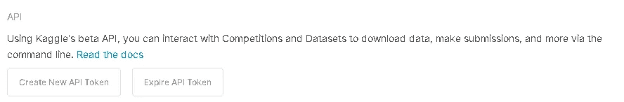
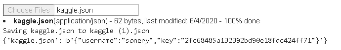
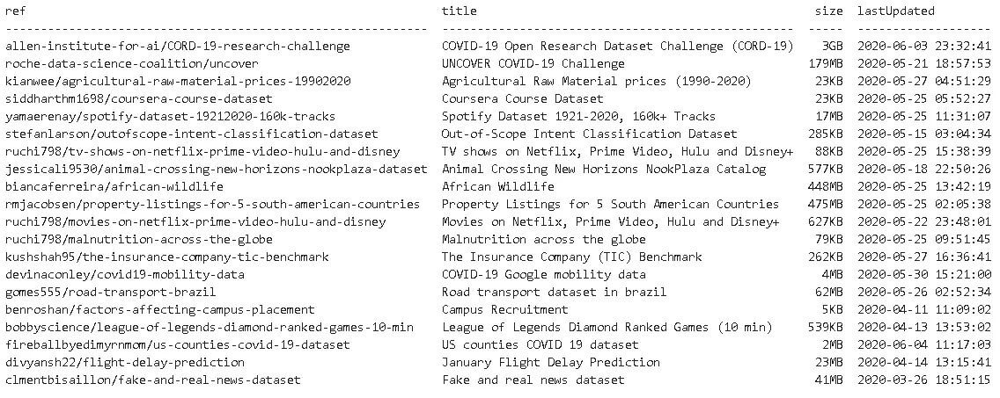
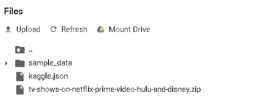
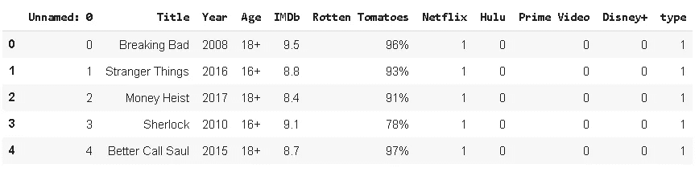
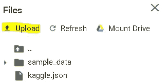
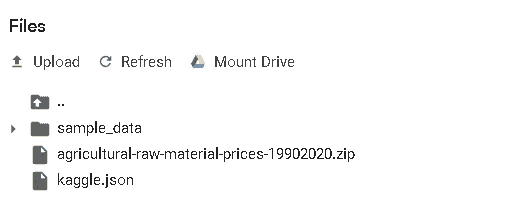

# 如何在 Google Colab 中使用 Kaggle 数据集

> 原文：<https://towardsdatascience.com/how-to-use-kaggle-datasets-in-google-colab-bca5e452a676?source=collection_archive---------27----------------------->

## 使用 kaggle API 将数据集直接下载到 colab。


照片由[尼克·费因斯](https://unsplash.com/@jannerboy62?utm_source=unsplash&utm_medium=referral&utm_content=creditCopyText)在 [Unsplash](https://unsplash.com/s/photos/coordinate?utm_source=unsplash&utm_medium=referral&utm_content=creditCopyText) 拍摄

Kaggle 是数据科学领域非常受欢迎的平台。它的名气来自比赛，但也有许多数据集，我们可以在实践中工作。在这篇文章中，我们将看到如何将数据集从 Kaggle 直接导入到 google colab 笔记本中。

我们首先转到 Kaggle 上的帐户页面来生成一个 API 令牌。在帐户页面上，我们向下滚动到 API 部分。



如果有以前生成的 API 令牌，我们应该通过单击“使 API 令牌过期”来使其过期。如果没有，我们可以单击“创建新的 API 令牌”直接生成令牌。点击后，会下载一个名为 kaggle.json 的文件。

然后，我们在 colab 中打开一个新的笔记本，并运行以下命令。

```
!pip install -q kaggle
```

然后我们需要上传 kaggle.json 文件。

```
from google.colab import filesfiles.upload()
```



选择从 kaggle 下载的“kaggle.json”。我们需要将这个文件保存到一个名为 kaggle 的目录中。运行以下命令来完成此任务:

```
!mkdir ~/.kaggle!cp kaggle.json ~/.kaggle/
```

我们现在使用以下命令更改文件的权限:

```
!chmod 600 ~/.kaggle/kaggle.json
```

我们现在可以在 kaggle 上看到数据集:

```
!kaggle datasets list
```



要下载特定的一个:

```
!kaggle datasets download -d "name_of_the_dataset"
```

例如:

```
!kaggle datasets download -d ruchi798/tv-shows-on-netflix-prime-video-hulu-and-disney
```

我们现在在 colab 中有可用的数据:



让我们把它读入熊猫的数据帧:

```
import numpy as np
import pandas as pddf = pd.read_csv("/content/tv-shows-on-netflix-prime-video-hulu-and-disney.zip")df.head()
```



我们不必每次都经历所有这些步骤。一旦完成这些步骤，下次我们只需将 kaggle.json 上传到 colab，然后下载数据集。



```
!kaggle datasets download -d kianwee/agricultural-raw-material-prices-19902020
```



我们总是可以用`!kaggle datasets list`来检查可用的数据集

我认为 kaggle 和 google colab 是数据科学领域的两个主要参与者。两者都对社区做出了贡献，从而推动了数据科学的发展。在两者之间建立联系是件好事。

感谢您的阅读。如果您有任何反馈，请告诉我。