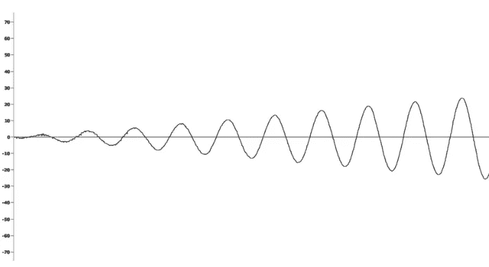
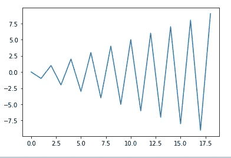
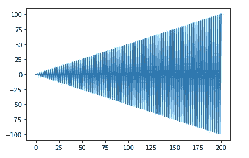
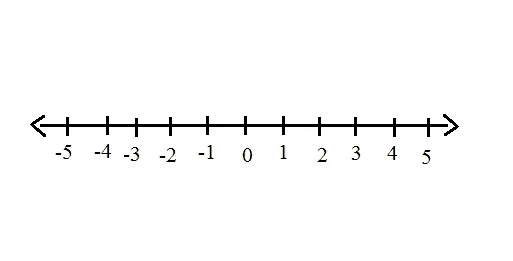
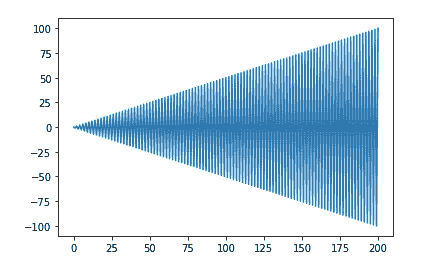
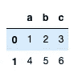
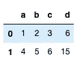

# 如何使用 Lambda 获得高效的 Python 代码

> 原文：<https://towardsdatascience.com/how-to-use-lambda-for-efficient-python-code-ff950dc8d259?source=collection_archive---------13----------------------->

## 使用 lambda 对元组进行排序并为您的数据科学创意创建复杂函数的技巧


检索自 [Gideon Pyzer](https://gideonpyzer.dev/blog/2017/02/05/create-an-aws-lambda-function-in-javascript/)

# 动机



这张图让你想起了什么？波的振幅放大？这个怎么做？你仔细看看图表，发现了一些有趣的事情。看起来像是随着 x 的增加，y 轴上的值先下降到-1，然后上升到 1，再下降到-2，然后上升到 2，依此类推。这给了你一个想法，图表可以用这样的列表来制作

`[0, -1, 1, -2, 2, -3, 3, -4, 4, -5, 5, -6, 6, -7, 7, -8, 8, -9, 9]`

如果您将上述列表中的`matplotlib`用作参数，您应该得到与上图接近的图形:



这看起来很容易。一旦您理解了如何使用列表创建图形，您就可以轻松地重新创建波形图。但是如果你想创建一个更酷的图表，需要一个更大的列表，像这样呢？



你肯定不想手动写上面的单子，单子上有 200 个数字。因此，您必须弄清楚如何使用 Python 来创建编号范围为(n，m)的列表



但是从 0 开始，按-1，1，-2，2，…n 进行。

如果我们认识到按元素|0|、|-1|、|1|、|-2|、|2|的绝对值排序的列表，..，n .所以有排序和绝对值的东西会起作用？答对了。我将向你展示如何用`lambda`在一行**代码中轻松创建这种功能。**

# 顺便问一下，Lambda 是什么？

嘿，很高兴你这么问。Python 中的`lambda`关键字提供了声明*小型匿名函数*的快捷方式。它的行为就像常规函数一样。它们可以作为函数对象的替代。让我们举一个如何用 lambdas 代替 function 的小例子:

```
def mult(x,y):
  return x*ymult(2,6)
```

结果:`12`

我们可以用`lambda`让上面的代码更短

```
mult = lambda x, y: x*y
mult(2,6)
```

但是我们需要定义乘法的名称吗？毕竟，我们只是想创建一个可以将两个数相乘的函数，对吗？我们可以将上面的函数简化为更简单的代码:

```
(lambda x, y: x*y)(2, 6)
```

那看起来更短。但是为什么你要费心去学习`lambda`，只是为了节省几行代码呢？因为`lambda`可以帮助你轻松创造更复杂的东西。比如根据字母表对元组列表进行排序:

```
tuples = [(1, 'd'), (2, 'b'), (4, 'a'), (3, 'c')]sorted(tuples, key=lambda x: x[1])
```

结果:

```
[(4, 'a'), (2, 'b'), (3, 'c'), (1, 'd')]
```

这给了你一个如何使用`lambda`创建上面的图表的提示。准备好了吗？这是:

```
import matplotlib.pyplot as pltnums = plt.plot(sorted(range(-100, 101), key=lambda x: x * x))plt.plot(nums)
```

给我们图表:



## 何时使用`lambda`的其他启示:

想创建一个函数来计算一个数的另一个数的幂吗？我们可以使用嵌套函数和`lambda`的组合:

```
def power(n):
  return lambda x: x**npower_3 = power(3)list(map(power_3,[2,3,4,5]))
```

结果:

```
[8, 27, 64, 125]
```

或者使用`lambda`来操作`pandas`数据帧

```
import pandas as pd
df = pd.DataFrame([[1,2,3],[4,5,6]], columns=['a','b','c'])
```



```
#Create the 4th column that is the sum of the other 3 columnsdf['d'] = df.apply(lambda row: row['a']+row['b']+row['c'],axis=1)
```



# 结论

恭喜你！现在你知道如何使用`lambda`作为函数的快捷方式。当你想在短时间内创建一个无名函数时，我鼓励你使用`lambda`。你也可以像上面一样把它作为一个高阶函数的参数，或者和像`filter()`、`map()`、`apply()`这样的函数一起使用。

我希望这篇教程能给你一些动机和理由来用`lambda`切换你的一些 Python 代码。随着您越来越多地为您的数据科学项目引入更复杂的代码，代码中的一个小变化可以在时间和效率上给您带来巨大的回报。

在[这个 Github repo](https://github.com/khuyentran1401/Data-science/blob/master/python/lambda.ipynb) 中，您可以随意派生和使用本文的代码。

我喜欢写一些基本的数据科学概念，并尝试不同的算法和数据科学工具。你可以在 LinkedIn 和 Twitter 上与我联系。

如果你想查看我写的所有文章的代码，请点击这里。在 Medium 上关注我，了解我的最新数据科学文章，例如:

[](/timing-the-performance-to-choose-the-right-python-object-for-your-data-science-project-670db6f11b8e) [## 高效 Python 代码的计时

### 如何比较列表、集合和其他方法的性能

towardsdatascience.com](/timing-the-performance-to-choose-the-right-python-object-for-your-data-science-project-670db6f11b8e) [](/maximize-your-productivity-with-python-6110004b45f7) [## 使用 Python 最大化您的生产力

### 你创建了一个待办事项清单来提高效率，但最终却把时间浪费在了不重要的任务上。如果你能创造…

towardsdatascience.com](/maximize-your-productivity-with-python-6110004b45f7) [](/cython-a-speed-up-tool-for-your-python-function-9bab64364bfd) [## cy thon——Python 函数的加速工具

### 当调整你的算法得到小的改进时，你可能想用 Cython 获得额外的速度，一个…

towardsdatascience.com](/cython-a-speed-up-tool-for-your-python-function-9bab64364bfd) [](/how-to-build-a-matrix-module-from-scratch-a4f35ec28b56) [## 如何从头开始构建矩阵模块

### 如果您一直在为矩阵运算导入 Numpy，但不知道该模块是如何构建的，本文将展示…

towardsdatascience.com](/how-to-build-a-matrix-module-from-scratch-a4f35ec28b56)