# 如何将机器学习用于药物发现

> 原文：<https://towardsdatascience.com/how-to-use-machine-learning-for-drug-discovery-1ccb5fdf81ad?source=collection_archive---------15----------------------->


由 [wowomnom](https://elements.envato.com/user/wowomnom) 在 [Envato 元素](https://elements.envato.com/)上定制一个图形(带许可证)

## [数据科学](https://medium.com/tag/data-science)

## 一步一步的实用生物信息学教程

# 1.介绍

我们可能已经看到机器学习以这样或那样的形式应用。例如，机器学习已经与计算机视觉一起用于自动驾驶汽车和自助结账便利店，用于零售市场购物篮分析(即找到通常一起购买的产品)，用于推荐系统的娱乐，等等。

这代表了 ***生物信息学教程*** 系列的第一篇文章(感谢 [Jaemin Lee](https://medium.com/u/983bdeefa40e?source=post_page-----1ccb5fdf81ad--------------------------------) 关于将我的文章发展成系列的建议！).在本文中，我将探索机器学习如何用于药物发现，特别是通过一步一步地向您展示如何在 Python 中建立一个简单的回归模型来预测分子的溶解度(*即*对数值)。需要注意的是，药物的*溶解度*是药物发现、设计和开发中一个重要的理化性质。在此，我们将转载一篇名为[*“ESOL:从分子结构直接估算水溶性”*](https://pubs.acs.org/doi/10.1021/ci034243x) 的研究文章，作者是 John S. Delaney。

这款笔记本的灵感来自 Pat Walters 在 [*【预测水溶性——比看起来更难】*](http://practicalcheminformatics.blogspot.com/2018/09/predicting-aqueous-solubility-its.html) 上的精彩博文，他在博文中重现了线性回归模型，其性能与 Delaney 的相似。这个例子在 Walters 合著的书[、*生命科学的深度学习:将深度学习应用于基因组学、显微镜学、药物发现等】*、](https://amzn.to/3cBOap1)中也有简要描述。

YouTube 视频 [*“使用 Python 进行计算药物发现的数据科学”*](https://www.youtube.com/watch?v=VXFFHHoE1wk) 中提供了展示本文所述实施的教程视频:

# 目录

1.[introduction](#d952)
2。[材料](#b61f)
2.1[Computing environmen](#834d) t
2.2 [Installing prerequisite Python librar](#d106) y
2.3。 [Datase](#0277) t
3[方法](#5ebf)
3.1 [Datase](#0277) t
3.1.1 读取数据集
3.1.2。Examining the SMILES data
3.2。 [Working with SMILES strin](#7eb0) g
3.2.1。convertit a molecule from the SMILES string to an rdkit object
3.2.2。Working with the rdkit object
3.2.3。Convert list of molecules to rdkit object
3.3 转换分子列表到 rdkit 对象。[计算分子描述符](#823f)s
3.3.1。Calculating LogP, MW and RB descriptors
3.3.2。计算芳香比例(T33) 3.3.2.1。芳香原子数(T34)3.3.2.2。重原子数(T35)3.3.2.3 计算芳香比例(AP)描述符
3.4。[数据集准备](#63e3)
3.4.1Creating the X Matrix
3.4.2。首页 〉外文书 〉文学 〉西洋文学 〉Creating the Y Matrix (T41) 3.5[数据分割](#f0d7)
3.6 线性回归模型(T46)(T47) [结果](#804e)
4.1(T51)线性回归模型(T52)(T53) 4.1.1 预测 X_train 数据的 LogS 值
4.1.2。预测 X_test 数据的 LogS 值
4.2。(T56) 比较线性回归方程(T57) [Deriving the Linear Regression Equatio](#a65b) n
4.3.1 基于列车集
4.3.2。基于完整数据集(用于比较)(T63) 4.4。 [Scatter plot of experimental vs. predicted Log](#de0c) S
4.4.1。Vertical Plot
4.4.2。横向 Plot

# 2.材料

从学术背景来看，检索关于如何进行实验的信息的研究论文的最重要部分之一必须是*材料和方法*部分，因为它将基本上告诉我们需要什么材料以及做了什么和如何做。因此，在这一部分，我将讨论您需要开始做些什么。

## 2.1.计算环境

首先，决定你是想在本地计算机上工作还是在云上工作。如果你决定在本地计算机上工作，那么任何可以安装 Python 和 Jupyter notebook 的计算机(我推荐安装 [conda](https://docs.conda.io/projects/conda/en/latest/user-guide/install/) 或 [Anaconda](https://www.anaconda.com/products/individual) )就足够了。如果你决定在云上工作，那就去谷歌实验室吧。

## 2.2.安装必备 Python 库

rdkit 库是一个 Python 库，它允许我们处理化学结构和计算它们的分子属性(*即*用于量化每个分子的分子特征，我们可以随后在机器学习模型的开发中使用)。

我们现在将安装 rdkit 库，启动一个新笔记本，并确保创建一个包含以下文本的**文本单元格**:

```
**# Install rdkit**
```

在这个文本单元格的正下方，您想要创建一个新的代码单元格，并用以下代码块填充它:

```
**! wget https://repo.anaconda.com/miniconda/Miniconda3-py37_4.8.2-Linux-x86_64.sh 
! chmod +x Miniconda3-py37_4.8.2-Linux-x86_64.sh 
! bash ./Miniconda3-py37_4.8.2-Linux-x86_64.sh -b -f -p /usr/local 
! conda install -c rdkit rdkit -y 
import sys 
sys.path.append('/usr/local/lib/python3.7/site-packages/')**
```

上面的 2 个单元格应该看起来像下面的截图:

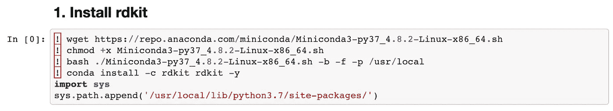

以上 2 个单元格(文本和代码单元格)的渲染。

## 2.3.数据集

我们现在将下载 Delaney 溶解度数据集，该数据集作为论文 [ESOL:直接从分子结构](https://pubs.acs.org/doi/10.1021/ci034243x)中的[补充文件](https://pubs.acs.org/doi/suppl/10.1021%2Fci034243x)提供。

***下载数据集***
下载到 Jupyter 笔记本如下:

```
**! wget https://raw.githubusercontent.com/dataprofessor/data/master/delaney.csv**
```

# 3.方法

## 3.1.资料组

***3.1.1。读入数据集***
读入我们从上述单元格下载的 CSV 数据。将数据分配到`sol`数据框中。

```
**import pandas as pd
sol = pd.read_csv('delaney.csv')**
```

显示`sol`数据帧给我们提供了以下信息:

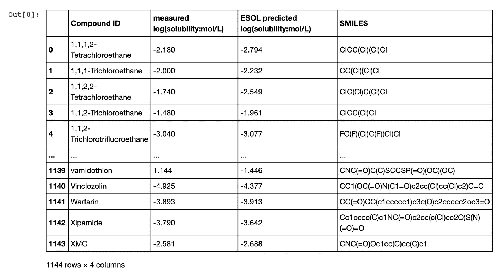

*sol* 数据框的内容。

***3.1.2。检验 SMILES 数据***
化学结构由一串称为 **SMILES** 符号的文本编码，这是简化分子输入行输入系统的首字母缩写。让我们看看`sol`数据帧中*微笑*列的内容。

```
**sol.SMILES**
```

运行上面的单元将为我们提供:

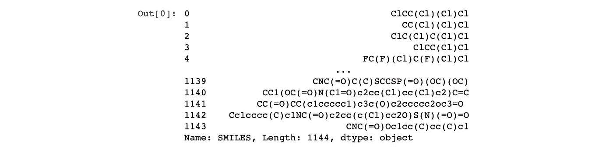

溶胶含量。SMILES(sol 数据框架中的 SMILES 列)。

每条线代表一种独特的分子。要选择第一个分子(第一行)，键入`sol.SMILES[0]`，我们将看到的输出是`ClCC(Cl)(Cl)Cl`。

## 3.2.使用微笑字符串

**3 . 2 . 1*。将一个分子从 SMILES 字符串转换成一个 rdkit 对象***
让我们从导入必要的库函数开始:

```
**from rdkit import Chem**
```

现在，应用`MolFromSmiles()`函数将 SMILES 字符串转换为 rdkit 分子对象:

```
**Chem.MolFromSmiles(sol.SMILES[0])**
```

这将产生以下输出:

```
<rdkit.Chem.rdchem.Mol at 0x7f66f2e3e800>
```

***3.2.2。使用 rdkit 对象***
让我们对查询 SMILES 字符串执行一个简单的原子计数，我们首先将它转换成一个 rdkit 对象，然后应用`GetNumAtoms()`函数。

```
**m = Chem.MolFromSmiles('ClCC(Cl)(Cl)Cl')
m.GetNumAtoms()**
```

这会产生以下输出:

```
6
```

**3 . 2 . 3*。将分子列表转换为 rdkit 对象*** 但是在我们进行任何描述符计算之前，我们必须先将 SMILES 字符串转换为 rdkit 对象，如 3.2 节所述。这里我们将做和上面描述的一样的事情，但是我们将利用 **for** 循环来遍历微笑字符串列表。

```
**from rdkit import Chem****mol_list= []
for element in sol.SMILES:
  mol = Chem.MolFromSmiles(element)
  mol_list.append(mol)**
```

接下来，我们将检查新的 rdkit 对象是否正在填充 mol_list 变量。

```
**len(mol_list)**
```

上面的行返回:

```
1144
```

这相当于 1144 个分子。现在，我们将看看变量的内容。

```
**mol_list[:5]**
```

这会产生以下输出:

```
[<rdkit.Chem.rdchem.Mol at 0x7f66edb6d670>,
 <rdkit.Chem.rdchem.Mol at 0x7f66edb6d620>,
 <rdkit.Chem.rdchem.Mol at 0x7f66edb6d530>,
 <rdkit.Chem.rdchem.Mol at 0x7f66edb6d6c0>,
 <rdkit.Chem.rdchem.Mol at 0x7f66edb6d710>]
```

## 3.3.计算分子描述符

我们现在将通过一组用于建模的分子描述符来表示数据集中的每个分子。

为了预测**对数**(水溶性对数)，Delaney 的研究使用了 4 个分子描述符:

1.  **cLogP** *(辛醇-水分配系数)*
2.  **MW** *(分子量)*
3.  **RB**(可旋转债券数量)
4.  **AP** *(芳香比例=芳香原子数/重原子数)*

不幸的是，rdkit 很容易计算前 3 个。至于 AP 描述符，我们将通过手动计算 rdkit 可以计算的芳香原子数*与重原子数*的比率来计算。

**3 . 3 . 1*。计算 LogP、MW 和 RB 描述符*** 我们现在将创建一个名为`generate()`的自定义函数，用于计算 3 个描述符 LogP、MW 和 RB。

```
**import numpy as np
from rdkit.Chem import Descriptors*****# Inspired by: https://codeocean.com/explore/capsules?query=tag:data-curation*

def generate(smiles, verbose=False):

    moldata= []
    for elem in smiles:
        mol=Chem.MolFromSmiles(elem) 
        moldata.append(mol)

    baseData= np.arange(1,1)
    i=0  
    for mol in moldata:        

        desc_MolLogP = Descriptors.MolLogP(mol)
        desc_MolWt = Descriptors.MolWt(mol)
        desc_NumRotatableBonds = Descriptors.NumRotatableBonds(mol)

        row = np.array([desc_MolLogP,
                        desc_MolWt,
                        desc_NumRotatableBonds])   

        if(i==0):
            baseData=row
        else:
            baseData=np.vstack([baseData, row])
        i=i+1      

    columnNames=["MolLogP","MolWt","NumRotatableBonds"]   
    descriptors = pd.DataFrame(data=baseData,columns=columnNames)

    return descriptors**
```

让我们应用`generate()`函数对`sol.SMILES`(来自`df`数据帧的微笑列)执行实际的描述符计算，并将描述符输出分配给`df`变量。

```
df = generate(sol.SMILES)
df
```

`df`数据帧的输出如下所示。

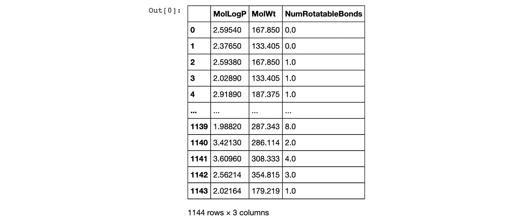

测向数据帧的内容。

**3 . 3 . 2*。计算芳香比例*** 如上所述，计算*芳香比例*的方程式是用*芳香原子数*除以*重原子数*得到的。

3.3.2.1。芳香原子数
这里我们将创建一个自定义函数来计算**芳香原子数**。有了这个描述符，我们可以用它来计算 AP 描述符。

计算单个分子中芳香原子数的例子。

```
**SMILES = 'COc1cccc2cc(C(=O)NCCCCN3CCN(c4cccc5nccnc54)CC3)oc21'****m = Chem.MolFromSmiles(SMILES)****aromatic_atoms = [m.GetAtomWithIdx(i).GetIsAromatic() for i in range(m.GetNumAtoms())]****aromatic_atoms**
```

这给出了以下输出。

```
[False,  False,  True,  True,  True,  True,  True,  True,  True,  False,  False,  False,  False,  False,  False,  False,  False,  False,  False,  False,  True,  True,  True,  True,  True,  True,  True,  True,  True,  True,  False,  False,  True,  True]
```

现在让我们创建一个名为`AromaticAtoms()`的自定义函数。

```
**def AromaticAtoms(m):
  aromatic_atoms = [m.GetAtomWithIdx(i).GetIsAromatic() for i in range(m.GetNumAtoms())]
  aa_count = []
  for i in aromatic_atoms:
    if i==True:
      aa_count.append(1)
  sum_aa_count = sum(aa_count)
  return sum_aa_count**
```

现在，应用`AromaticAtoms()`函数来计算查询 SMILES 字符串的芳香原子数。

```
**AromaticAtoms(m)**
```

输出是:

```
19
```

这意味着有 19 个芳香原子(即有 19 个原子是芳香环的一部分)。

现在让我们扩大规模，并将其应用于整个微笑列表。

```
**desc_AromaticAtoms = [AromaticAtoms(element) for element in mol_list]****desc_AromaticAtoms**
```

现在，打印出结果。

```
[0, 0, 0, 0, 0, 0, 0, 0, 6, 6, 6, 6, 6, 6, 6, 6, 6, 6, 6, 6, 6, 0, 6, 0, 0, 0, 0, 6, 6, 0, 6, 6, 6, 6, 6, 0, 6, 6, 0, 0, 6, 10, 6, 6, 0, 6, 6, 6, 6, 10, 6, 0, 10, 0, 14, 0, 0, 14, 0, 0, 0, 0, 10, 0, 0, 0, 0, 0, 0, 0, 0, 0, 0, 0, 10, 0, 0, 0, 0, 0, 10, 0, 0, 0, 0, ...]
```

恭喜你！我们现在已经计算了整个数据集的芳香原子数。

3.3.2.2。重原子数
这里，我们将使用 rdkit 库中的一个现有函数来计算重原子数。

计算单个分子重原子数的例子。

```
**SMILES = 'COc1cccc2cc(C(=O)NCCCCN3CCN(c4cccc5nccnc54)CC3)oc21'
m = Chem.MolFromSmiles(SMILES)
Descriptors.HeavyAtomCount(m)**
```

这将产生以下输出。

```
34
```

让我们扩大到整个微笑列表。

```
**desc_HeavyAtomCount = [Descriptors.HeavyAtomCount(element) for element in mol_list]
desc_HeavyAtomCount**
```

现在，打印出结果。

```
[6, 5, 6, 5, 8, 4, 4, 8, 10, 10, 10, 9, 9, 10, 10, 10, 9, 9, 9, 8, 8, 4, 8, 4, 5, 8, 8, 10, 12, 4, 9, 9, 9, 15, 8, 4, 8, 8, 5, 8, 8, 12, 12, 8, 6, 8, 8, 10, 8, 12, 12, 5, 12, 6, 14, 11, 22, 15, 5, ...]
```

3.3.2.3。计算芳香比例(AP)描述符
现在让我们把芳香原子数和重原子数结合在一起。

计算单个分子的例子。

```
**SMILES = 'COc1cccc2cc(C(=O)NCCCCN3CCN(c4cccc5nccnc54)CC3)oc21'
m = Chem.MolFromSmiles(SMILES)
AromaticAtoms(m)/Descriptors.HeavyAtomCount(m)**
```

输出是:

```
0.5588235294117647
```

让我们放大并计算整个微笑列表。

```
**desc_AromaticProportion = [AromaticAtoms(element)/Descriptors.HeavyAtomCount(element) for element in mol_list]
desc_AromaticProportion**
```

这给出了输出:

```
[0.0, 0.0, 0.0, 0.0, 0.0, 0.0, 0.0, 0.0, 0.6, 0.6, 0.6, 0.6666666666666666, 0.6666666666666666, 0.6, 0.6, 0.6, 0.6666666666666666, 0.6666666666666666, 0.6666666666666666, 0.75, 0.75, 0.0, 0.75, 0.0, 0.0, 0.0, 0.0, 0.6, 0.5, 0.0, 0.6666666666666666, 0.6666666666666666, 0.6666666666666666, 0.4, 0.75, 0.0, 0.75, 0.75, 0.0, 0.0, 0.75, 0.8333333333333334, 0.5, 0.75, 0.0, 0.75, 0.75, 0.6, 0.75, 0.8333333333333334, 0.5, ...]
```

现在让我们把这个新计算的**芳烃比例**描述符放到一个数据帧中。

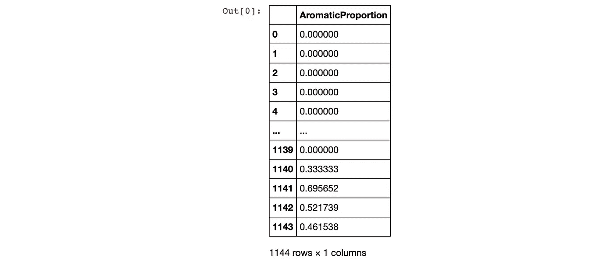

芳烃比例描述符数据帧的内容。

## 3.4.数据集准备

***3.4.1。创建 X 矩阵*** 让我们将 2 个数据帧中的所有计算描述符合并到 1 个数据帧中。在此之前，让我们先来看看我们将要组合的两个数据帧(`df`和`df_desc_AromaticProportion`)以及组合后的数据帧将会是什么样子，如下图所示。

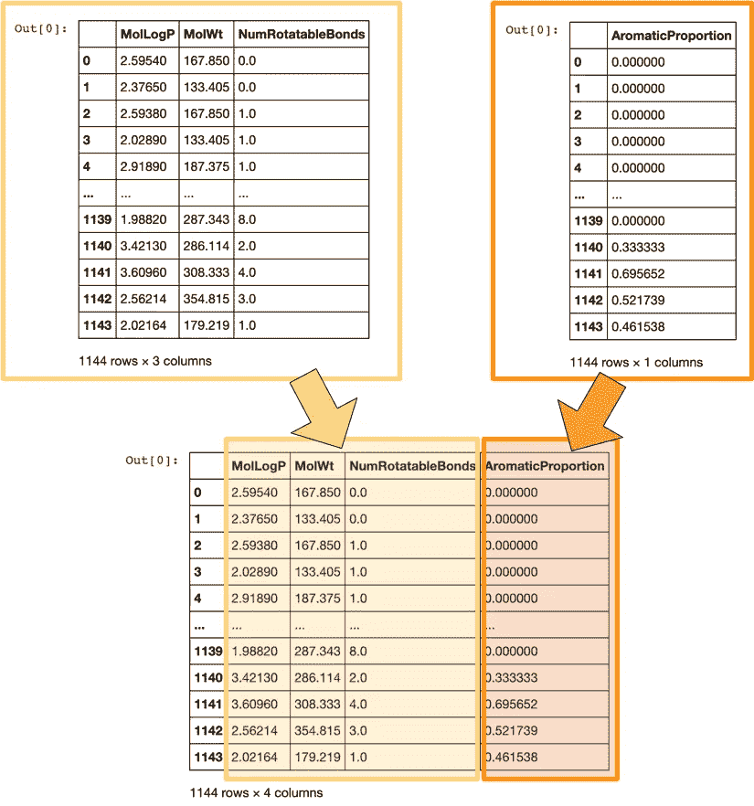

组合两个包含描述符的数据帧以形成 X 矩阵的图示。

让我们实际上结合 2 个数据帧来产生 X 矩阵。

```
**X = pd.concat([df,df_desc_AromaticProportion], axis=1)
X**
```

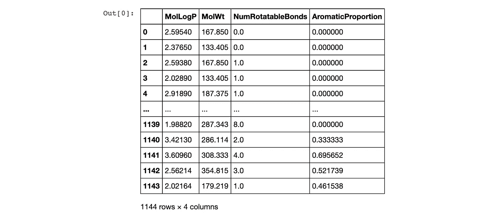

通过组合两个数据帧创建的 X 矩阵数据帧的内容。

**3 . 4 . 2*。创建 Y 矩阵*** Y 矩阵将从我们在本教程中要预测的 1 列中创建，这是对数值。在`sol`数据框中，日志值包含在`measured log(solubility:mol/L)`栏中。

让我们再看一下`sol`数据框。

```
sol.head()
```

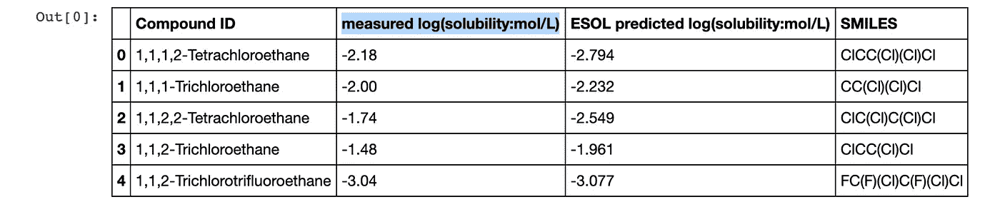

突出显示日志列的 sol 数据框架的内容。

对应于测得溶解度值(对数)的第二列(指数为 1)将用作 Y 矩阵。因此，我们将选择第二列(在上图中以蓝色突出显示)。

```
Y = sol.iloc[:,1]
Y
```

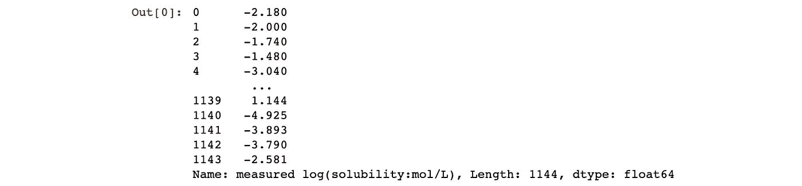

Y 矩阵的内容(对数列)。

## 3.5.数据分割

我们现在将继续使用 80/20 的拆分比率来执行数据拆分(*即*我们通过将`test_size`参数指定为 0.2 来完成此操作)，由此初始数据集的 80%将用作训练集，而数据集的剩余 20%将用作测试集。

```
**from sklearn.model_selection import train_test_split****X_train, X_test, Y_train, Y_test = train_test_split(X, Y,
                                                    test_size=0.2)**
```

## 3.6.线性回归模型

由于 Delaney 的最初研究和 Walters 的调查使用线性回归进行建模，因此为了便于比较，我们也将使用线性回归。

```
**from sklearn import linear_model
from sklearn.metrics import mean_squared_error, r2_score****model = linear_model.LinearRegression()
model.fit(X_train, Y_train)**
```

在运行上面的代码块时，我们将看到下面的输出，它基本上打印出了用于模型构建的参数。

```
LinearRegression(copy_X=True, fit_intercept=True, n_jobs=None, normalize=False)
```

# 4.结果

## 4.1.线性回归模型

***4.1.1。预测 X_train 数据的对数值*** 来自第 3.6 节的训练模型将应用于此，以预测训练集中所有样本(分子)的对数值(`X_train`)。

```
**Y_pred_train = model.predict(X_train)****print('Coefficients:', model.coef_)
print('Intercept:', model.intercept_)
print('Mean squared error (MSE): %.2f'
      % mean_squared_error(Y_train, Y_pred_train))
print('Coefficient of determination (R^2): %.2f'
      % r2_score(Y_train, Y_pred_train))**
```

这将生成以下预测结果。

```
Coefficients: [-0.7282008  -0.00691046  0.01625003 -0.35627645]
Intercept: 0.26284383753800666
Mean squared error (MSE): 0.99
Coefficient of determination (R^2): 0.77
```

让我们逐行分析上面的输出:

*   在第一行，`Coefficients`列出了每个独立变量的回归系数值(即由 LogP、MW、RB 和 AP 组成的 4 个分子描述符)
*   在第二行中，`Intercept`实际上是 X = 0 时回归线经过的 y 截距值。
*   在第三行中，`Mean squared error (MSE)`用作误差测量值(*即*越低越好)。
*   在第四行中，`Coefficient of determination (R²)`是皮尔逊相关系数值的平方值，并用作线性回归模型的拟合优度的度量(*即*越高越好)

**4 . 1 . 2*。预测 X_test 数据的对数值*** 接下来，来自 3.6 节的训练模型也将应用于此，以预测训练集中所有样本(分子)的对数值(`X_train`)。

我们将打印出如下预测性能:

```
**Y_pred_test = model.predict(X_test)****print('Coefficients:', model.coef_)
print('Intercept:', model.intercept_)
print('Mean squared error (MSE): %.2f'
      % mean_squared_error(Y_test, Y_pred_test))
print('Coefficient of determination (R^2): %.2f'
      % r2_score(Y_test, Y_pred_test))**
```

上述代码块产生以下预测结果。

```
Coefficients: [-0.7282008  -0.00691046  0.01625003 -0.35627645]
Intercept: 0.26284383753800666
Mean squared error (MSE): 1.11
Coefficient of determination (R^2): 0.75
```

## 4.2.比较线性回归方程

[德莱尼](https://pubs.acs.org/doi/10.1021/ci034243x)的工作提供了以下线性回归方程:

```
LogS = 0.16 - 0.63 cLogP - 0.0062 MW + 0.066 RB - 0.74 AP
```

由 Pat Walters[制作的复制品](http://practicalcheminformatics.blogspot.com/2018/09/predicting-aqueous-solubility-its.html)提供了以下内容:

```
LogS = 0.26 - 0.74 LogP - 0.0066 MW + 0.0034 RB - 0.42 AP
```

本教程的复制给出了以下等式:

*   基于列车组(如下文第 4.3.1 节所示)

```
LogS =  0.26 - 0.73 LogP - 0.0069 MW 0.0163 RB - 0.36 AP
```

*   基于完整的数据集(如下文第 4.3.2 节所示)

```
LogS =  0.26 - 0.74 LogP - 0.0066 MW + 0.0032 RB - 0.42 AP
```

## 4.3.推导线性回归方程

**4 . 3 . 1*。基于以下代码块中的训练集***
，我们将使用第 3.6 节中构建的线性回归模型，其中训练集用于模型构建。为了便于参考，我将代码放在这里:

```
**from sklearn import linear_model
from sklearn.metrics import mean_squared_error, r2_score****model = linear_model.LinearRegression()
model.fit(X_train, Y_train)**
```

因此，我们只需直接从包含在`model`变量中的先前构建的模型中打印出方程(*即*，通过调用模型变量的各个列)。

```
**yintercept = '%.2f' % model.intercept_
LogP = '%.2f LogP' % model.coef_[0]
MW = '%.4f MW' % model.coef_[1]
RB = '%.4f RB' % model.coef_[2]
AP = '%.2f AP' % model.coef_[3]****print('LogS = ' + 
      ' ' + 
      yintercept + 
      ' ' + 
      LogP + 
      ' ' + 
      MW + 
      ' ' + 
      RB + 
      ' ' + 
      AP)**
```

运行上述代码块会得到以下等式输出:

```
LogS =  0.26 -0.73 LogP -0.0069 MW 0.0163 RB -0.36 AP
```

**4 . 3 . 2*。基于完整的数据集(用于比较)***
这里我们将使用整个数据集来训练一个线性回归模型。`fit()`功能允许使用 X 和 Y 数据矩阵作为输入参数来训练`full` ( *即*线性回归模型)中定义的模型。

```
**full = linear_model.LinearRegression()
full.fit(X, Y)**
```

这会产生以下输出:

```
LinearRegression(copy_X=True, fit_intercept=True, n_jobs=None, normalize=False)
```

我们现在将打印出预测性能。

```
**full_pred = model.predict(X)****print('Coefficients:', full.coef_)
print('Intercept:', full.intercept_)
print('Mean squared error (MSE): %.2f'
      % mean_squared_error(Y, full_pred))
print('Coefficient of determination (R^2): %.2f'
      % r2_score(Y, full_pred))**
```

这将生成以下输出:

```
Coefficients: [-0.74173609 -0.00659927  0.00320051 -0.42316387]
Intercept: 0.2565006830997185
Mean squared error (MSE): 1.01
Coefficient of determination (R^2): 0.77
```

最后，我们将打印出线性回归方程。

```
**full_yintercept = '%.2f' % full.intercept_
full_LogP = '%.2f LogP' % full.coef_[0]
full_MW = '%.4f MW' % full.coef_[1]
full_RB = '+ %.4f RB' % full.coef_[2]
full_AP = '%.2f AP' % full.coef_[3]****print('LogS = ' + 
      ' ' + 
      full_yintercept + 
      ' ' + 
      full_LogP + 
      ' ' + 
      full_MW + 
      ' ' + 
      full_RB + 
      ' ' + 
      full_AP)**
```

这将产生以下输出。

```
LogS =  0.26 -0.74 LogP -0.0066 MW + 0.0032 RB -0.42 AP
```

## 4.4.实验测井与预测测井的散点图

在开始之前，让我们快速检查一下训练集和测试集的可变维度。

这里我们正在检查列车组的尺寸。

```
**Y_train.shape, Y_pred_train.shape**
```

这会产生以下尺寸输出:

```
((915,), (915,))
```

这里我们检查测试集的维度。

```
**Y_test.shape, Y_pred_test.shape**
```

这会产生以下尺寸输出:

```
((229,), (229,))
```

***4.4.1。垂直曲线图*** 现在让我们通过散点图来可视化实验对数值与预测对数值的相关性。我们将在两个散点图中分别显示测井曲线的实验值和预测值。在第一个版本中，我们将垂直堆叠两个散点图。

```
**import** **matplotlib.pyplot** **as** **plt****plt.figure(figsize=(5,11))

*# 2 row, 1 column, plot 1*
plt.subplot(2, 1, 1)
plt.scatter(x=Y_train, y=Y_pred_train, c="#7CAE00", alpha=0.3)

*# Add trendline*
*# https://stackoverflow.com/questions/26447191/how-to-add-trendline-in-python-matplotlib-dot-scatter-graphs*
z = np.polyfit(Y_train, Y_pred_train, 1)
p = np.poly1d(z)
plt.plot(Y_test,p(Y_test),"#F8766D")

plt.ylabel('Predicted LogS')

*# 2 row, 1 column, plot 2*
plt.subplot(2, 1, 2)
plt.scatter(x=Y_test, y=Y_pred_test, c="#619CFF", alpha=0.3)

z = np.polyfit(Y_test, Y_pred_test, 1)
p = np.poly1d(z)
plt.plot(Y_test,p(Y_test),"#F8766D")

plt.ylabel('Predicted LogS')
plt.xlabel('Experimental LogS')

plt.savefig('plot_vertical_logS.png')
plt.savefig('plot_vertical_logS.pdf')
plt.show()**
```

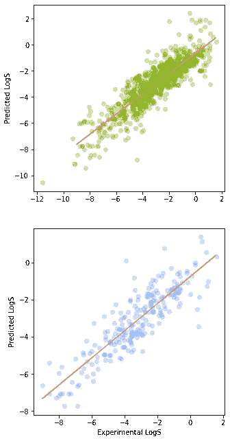

预测值与实验值的散点图(显示为垂直图)。

***4.4.2。水平图*** 在第二个版本中，我们将水平放置两个散点图，如下面的代码块所示。

```
**import** **matplotlib.pyplot** **as** **plt****plt.figure(figsize=(11,5))

*# 1 row, 2 column, plot 1*
plt.subplot(1, 2, 1)
plt.scatter(x=Y_train, y=Y_pred_train, c="#7CAE00", alpha=0.3)

z = np.polyfit(Y_train, Y_pred_train, 1)
p = np.poly1d(z)
plt.plot(Y_test,p(Y_test),"#F8766D")

plt.ylabel('Predicted LogS')
plt.xlabel('Experimental LogS')

*# 1 row, 2 column, plot 2*
plt.subplot(1, 2, 2)
plt.scatter(x=Y_test, y=Y_pred_test, c="#619CFF", alpha=0.3)

z = np.polyfit(Y_test, Y_pred_test, 1)
p = np.poly1d(z)
plt.plot(Y_test,p(Y_test),"#F8766D")

plt.xlabel('Experimental LogS')

plt.savefig('plot_horizontal_logS.png')
plt.savefig('plot_horizontal_logS.pdf')
plt.show()**
```

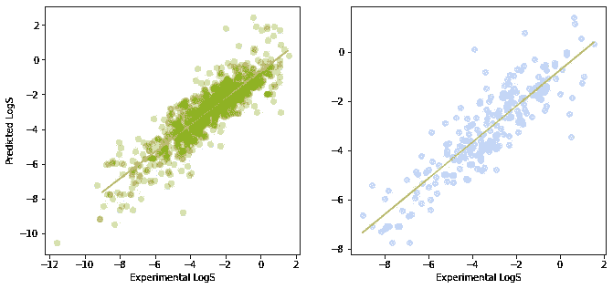

预测值与实验值的散点图(显示为水平图)。

## [订阅我的邮件列表，获取我在数据科学方面的最佳更新(偶尔还有免费内容)!](http://newsletter.dataprofessor.org/)

# 关于我

我是泰国一所研究型大学的生物信息学副教授和数据挖掘和生物医学信息学负责人。在我下班后的时间里，我是一名 YouTuber(又名[数据教授](http://bit.ly/dataprofessor/))制作关于数据科学的在线视频。在我做的所有教程视频中，我也在 GitHub 上分享 Jupyter 笔记本([数据教授 GitHub page](https://github.com/dataprofessor/) )。

[](https://www.youtube.com/dataprofessor?sub_confirmation=1) [## 数据教授

### 数据科学、机器学习、生物信息学、研究和教学是我的激情所在。数据教授 YouTube…

www.youtube.com](https://www.youtube.com/dataprofessor?sub_confirmation=1) 

## 在社交网络上与我联系

✅YouTube:[http://youtube.com/dataprofessor/](http://youtube.com/dataprofessor/)
♇网站:[http://dataprofessor.org/](https://www.youtube.com/redirect?redir_token=w4MajL6v6Oi_kOAZNbMprRRJrvJ8MTU5MjI5NjQzN0AxNTkyMjEwMDM3&q=http%3A%2F%2Fdataprofessor.org%2F&event=video_description&v=ZZ4B0QUHuNc)(在建)
♇LinkedIn:[https://www.linkedin.com/company/dataprofessor/](https://www.linkedin.com/company/dataprofessor/)
♇Twitter:[https://twitter.com/thedataprof](https://twitter.com/thedataprof)
♇Facebook:[http://facebook.com/dataprofessor/](https://www.youtube.com/redirect?redir_token=w4MajL6v6Oi_kOAZNbMprRRJrvJ8MTU5MjI5NjQzN0AxNTkyMjEwMDM3&q=http%3A%2F%2Ffacebook.com%2Fdataprofessor%2F&event=video_description&v=ZZ4B0QUHuNc)
♇github:[https://github.com/dataprofessor/](https://github.com/dataprofessor/)
♇insta gram:[https://www.instagram.com/data.professor/【t19](https://www.instagram.com/data.professor/)

***来自《走向数据科学》编辑的注释:*** *虽然我们允许独立作者根据我们的* [*规则和指导方针*](/questions-96667b06af5) *发表文章，但我们并不认可每个作者的贡献。你不应该在没有寻求专业建议的情况下依赖一个作者的作品。详见我们的* [*读者术语*](/readers-terms-b5d780a700a4) *。*