# 如何利用机器学习在 Reddit 上做预测:多元逻辑回归

> 原文：<https://towardsdatascience.com/how-to-use-machine-learning-to-make-predictions-on-reddit-part-i-44cd210ec427?source=collection_archive---------22----------------------->

## 这是来自四个不同市场的四个屏幕截图。共同的元素？卖家评分。

评级来自 Amazon.com，Google.com，Facebook.com 和 Ebay.com

卖家评级是每个好市场的要求。评级系统是帮助买家做出决策的重要工具，允许他们分享自己的感受，最重要的是，向他们保证交易的合法性。当然，永远不可能保证交易安全，但良好的卖家评级确实能激发信心。

考虑到评级系统的重要性，每个市场都有一个内置的交易促进系统来对卖家进行评级。但是那些不是用来买卖的平台呢？比如: [Reddit](http://reddit.com) 。

# Reddit:论坛变成市场

Reddit.com 是美国访问量排名第六的网站，它是一个论坛集合，人们在这里发布和评论链接、图片和讨论话题。Reddit 中的各个论坛或社区被称为子编辑，有超过 100 万个这样的子编辑。Reddit 的成员被称为“Redditors”，他们将内容提交给子编辑，其他成员可以“投赞成票”或“投反对票”。正如你所想象的，Reddit(它的名字是对“阅读”这个词的一个游戏)本来是一个讨论的地方，尽管它在很大程度上仍然是，一些社区已经变成了市场。还有很多这样的例子。

这里列出了 Reddit 上一些受欢迎的市场，以及在撰写本文时订阅每个市场的会员数量。

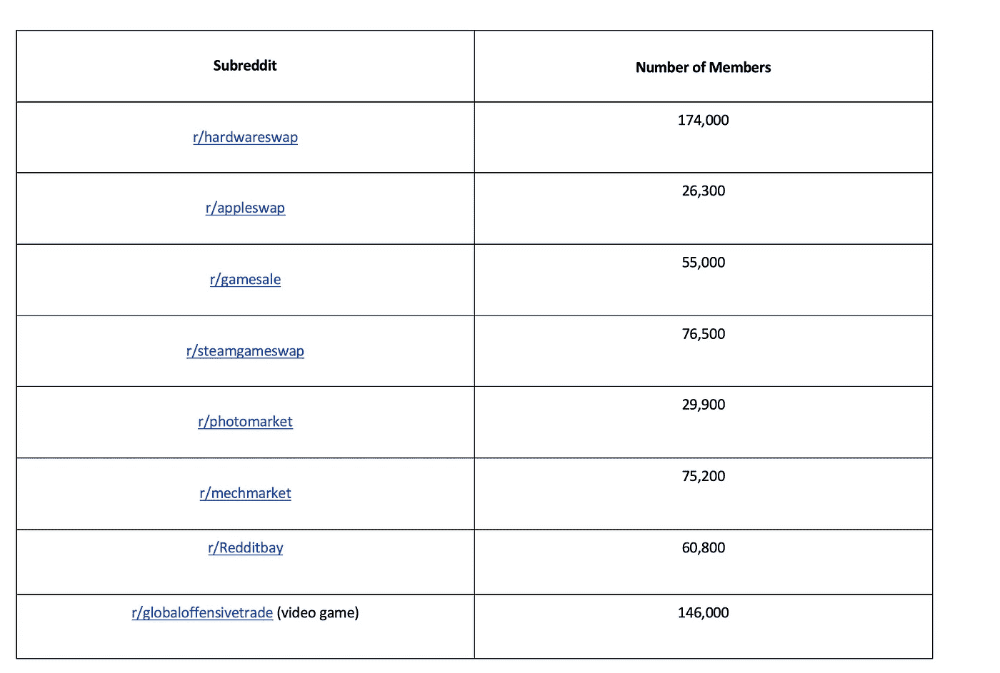

仅仅 8 个社区就有将近 65 万人！

我相信 Reddit 上的市场很受欢迎，因为 Reddit 的社区意识通常会带来合理的价格和成功的交易。然而，由于 Reddit 最初不是为此目的而设计的，与易贝等传统市场相比，它的界面存在许多问题。

例如，下面是一个典型的用户帖子:

Reddit.com 的纱帽

邮报是提供一个 BNIB 海盗船 SF750 白金 PSU(电源设备)为 150 美元以上的航运。但是，没有度量标准来确定该用户在该子编辑中是否有任何事务历史，也没有任何方法来确定该用户是否合法。此外，在这篇文章中，作者写了原始价格，但在其他情况下，潜在的买家需要自己研究产品，以确定其原始零售价格。

# 使用机器学习解决 Reddit 的“无评级”问题

看着 Reddit 市场的工作方式，我构建了一个算法来帮助解决缺乏专用评级系统带来的问题。

我认为这将是一个应用机器学习和 Python 自动化的有趣问题。这个项目的目标是看看我是否能收集到足够的数据，以确定与任何给定的 Reddit 用户进行交易的风险有多大。为了收集这些数据，我查看了参与成功交易的 Reddit 用户，然后确定了被发现实施欺诈的用户。本质上，我比较了两组 Redditors:骗子和非骗子。我比较的一些属性是:

●账户的年龄

●因果报应(票数上升)

●经过验证的电子邮件地址

●黄金(如果是付费账户)

●评论(使用自然语言处理进行分析)

●版主(任何子编辑)

●访问的子街道

●奖杯

Reddit.com 的纱帽

通过观察这两个组的用户活动，我试图确定某个账户是高风险还是低风险。

为了使项目的范围易于管理，我将重点放在了子编辑[r/硬件交换](http://old.reddit.com/r/hardwareswap)上。HardwareSwap 是一个由超过 170，000 名成员组成的社区，他们相互交换与计算机相关的硬件。在这个 Subreddit 中，你可以找到从显卡和 CPU 到 PlayStations 和计算机外设的所有东西。

# 探索性数据分析

当处理我正在调查的关于 Reddit 用户和市场的问题时，第一步是做一个**探索性数据分析**。在此分析中，我将使用或研究:

● PRAW (Python Reddit API 包装器)

●交易

●参与交易的用户

●交易方向(买与卖)

●交易的估计价格

**PRAW (Python Reddit API 包装器)**

为了访问 r/hardware WAP 数据，我注册了一个 Reddit API 密匙。你可以在这里找到 PRAW 的快速入门指南和其他文档[。首先，我需要在](https://praw.readthedocs.io/en/latest/getting_started/quick_start.html) [Reddit、](https://www.reddit.com/prefs/apps/)上注册一个应用程序，然后我收到一个 Reddit 客户端 ID 和客户端密码。

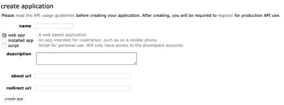

Reddit 应用程序注册表单的屏幕截图。Reddit.com 的纱帽

# 收集用于探索性数据分析(EDA)的硬件应用程序数据

现在我有了我的 Reddit API 密钥，我可以开始收集我需要的数据:交易的细节、用户、方向和估计的交易价格。因为我这个项目的主要目标是比较两组 redditor——合法用户和骗子(以及如何识别他们？)—我将从收集这些群体的数据开始。

**交易**

subreddit r/HardwareSwap 有一个确认线程，用户每个月都会在这个线程中确认他们成功的交易。这使得为 Reddit 用户收集交易细节成为可能。

下面是【2019 年 12 月确认线程的截图，让你对其格式有个概念:

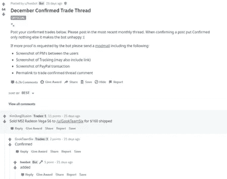

示例确认线程。Reddit.com 的纱帽

我首先收集了我想要调查的时间段(72 个月)的所有每月确认线程 URL。为了做到这一点，我用 PRAW 写了一个函数，在 r/hardware swap subredit 中搜索标题中带有“已确认贸易线索”字样的所有帖子。

[Github 链接](https://github.com/Landstein/Reddit-Transaction-Analysis/blob/master/confirm_scape_eda.py)到上述功能。

**参与交易的用户**

这个搜索产生了过去 72 个已确认交易线索的 URL 列表，代表了大约 6 年的数据。然后，我使用 Reddit API 从 72 个已确认的交易线索中提取相关的特定数据。我的主要目标是收集以下信息:

●参与交易者的用户名

●谁与谁交易的数据(买方和卖方)

●购买/出售的数据

为了收集这些数据，我编写了另一个函数来完成以下任务:

●从 confirm_urls 函数中获取 URL 列表(在上面的截图中以亮蓝色文字书写)。

●查看所有父评论并收集

1)评论者的用户名

2)父注释的文本

3)文本和天赋(已确认交易的数量)。

●添加(使用 Python 字典)注释的作者作为键，添加列表的列表作为值，其中存储了注释的正文和与进行交易的用户的信息。

每个结果数据点如下所示:

示例字典键、值对

如上所述，Python 字典中的键就是这样创建的:通过附加用户名(child.group()[2:])和 body_text，如上面的代码所示。如果字典中的用户有不止一个事务(这是常见的情况)，那么该函数会向值中存储的列表添加另一个条目。

**交易方向**

最后，我想检测每个交易的方向:也就是说，它是被描述为买入还是卖出。然而，在我第一次浏览代码的过程中，我发现还有第三个类别:“交易”，这发生在两个用户互相交易物品但没有交换货币的情况下。

为了确定每笔交易的方向，我在评论中寻找常用词——例如，“买”、“买”、“卖”或“交易”——并将它们放入一个列表，然后与一串文本进行比较。如果这些常用词出现在给定的字符串中，那么我就知道交易的方向。最后，我为我的功能无法确定方向的事务添加了一个“模糊”类别。下面的代码记录了每笔交易的方向:

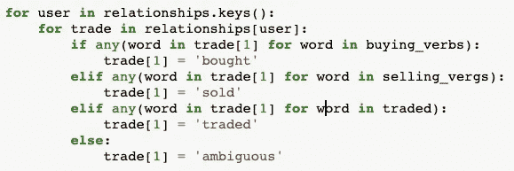

Github [链接](https://github.com/Landstein/Reddit-Transaction-Analysis/blob/master/scraping.py)到上面的函数

**注意:**使用 PRAW 提取所有这些数据需要大约 18 个小时。所以，如果你想自己尝试一下，我建议你通宵运行这个程序。

# 最后，埃达！

现在，到探索性数据分析组件。r/HardwareSwap 这个子字段的总价值和活动是我的风险分析非常需要的。使用我在上面描述的数据集合，我创建了一个 Pandas 数据框架，其中包括每个交易的用户、交易者、方向和产品的数据。

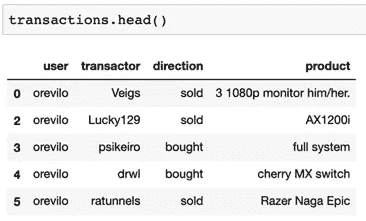

交易数据帧的前 5 行

上面的截图是交易数据帧的前 5 行。方向指示用户是购买还是出售产品。例如，在第 0 行中，用户 orevilo 销售给 veigs。

我得到的结果令人印象深刻。使用这个图表，我发现在过去的 6 年中，这个子 reddit 上至少有 134，013 个事务。

以下是按类型分列的交易明细:

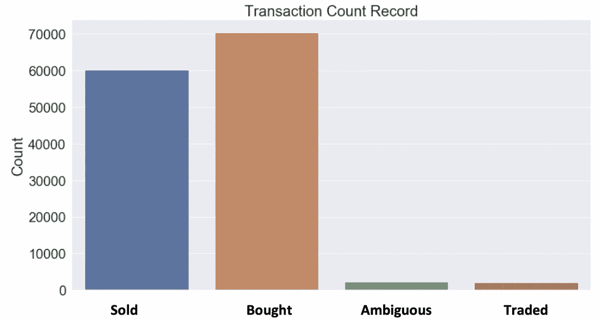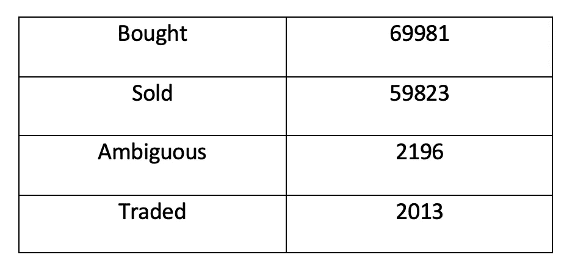

这四个值加起来有 134，013 笔交易。对于一个细分市场来说，这是一个令人印象深刻的大数字。

**预计成交价格**

当我看到这些数字时，我想知道一笔交易的平均价格，从而了解有多少价值通过 r/hardware WAP 流动。虽然得到的值是近似值，但这是一个有趣的度量。为了估计平均交易价格，我构建了一个函数，它查看过去 1，000 个交易提交，并选择 link_flair_css_class 关闭的提交，这意味着已经进行了交易。

在下图中，你可以看到不同的提交标志:(卖出，买入和平仓)

link_flair_css_class 卖出(蓝色)，买入(绿色)，成交(红色)。Reddit.com 的纱帽

然后，该函数检查提交的主体中卖方列出的价格；我使用正则表达式并寻找$符号后面的数字。此外，该函数返回一个包含价格、日期和 URL 的 Pandas 数据框，以便我可以检查近似值是否正确。

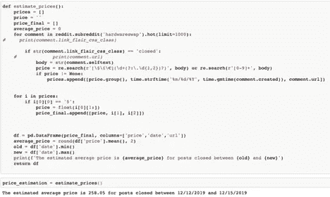

平均价格 258

这种方法得出 2019 年 12 月 12 日至 2019 年 12 月 15 日期间的平均样本交易价格为 258 美元。如果我们将这个数字乘以 134，000 笔记录的交易，过去 6 年中在 r/HardwareSwap 上交易的产品总价值估计约为 34，500，000 美元。虽然这是一个极端的估计，但即使是这一数额的四分之一，也仍然是一笔巨款。

# 多元逻辑回归

该项目的目标是**创建一个指标来确定与一个给定的 Reddit 用户**交易的风险水平。Reddit 上的欺诈活动并不多，但确实存在。这个项目旨在发现与合法 Redditors 的活动相关的模式，与欺诈用户(骗子)的活动形成对比。

考虑到 Reddit 不保留交易历史或收集任何有关其用户的真实身份信息，解决与欺诈相关的问题是一个相当困难的问题，因为与传统的信用指标和社交平台相比，Reddit 提供的指标并不典型地用于衡量风险。Reddit 不会收集创建特定于每个成员的信息记录所需的详细个人信息，因此，成员具有高度的匿名性。

鉴于这个问题，知道是否可以使用机器学习和 Reddit 允许用户从中提取的信息进行准确的预测将是非常有趣的。在这个项目中，我试图根据用户的 Reddit 活动来衡量他或她的风险水平。我首先想到的是使用**多元逻辑回归模型，**一种用于预测因变量结果的统计分析。在这个领域，它可以被称为机器学习模型。我将利用这个模型，因为只有有限数量的功能可供使用。多重逻辑回归模型将允许我确定与预测 Reddit 用户风险水平最相关的特征。

首先，我将确定项目中正在研究的两(2)组。这些是:

1.Reddit 用户/Redditors: 这些人在 Reddit 上做过真正的交易。他们已经完成了交易。

2. **Reddit 骗子:**这些是 Reddit 上的骗子，参与过各种诈骗活动。

Reddit 骗子数据集是从 r/hardwareswap 的[封禁列表](https://old.reddit.com/r/hardwareswap/wiki/banlist)和[通用封禁列表](https://www.reddit.com/r/UniversalScammerList/wiki/banlist)中收集的。这些都是被版主发现有欺诈行为的用户名单。因为这是任何市场分支提供的唯一系统，我不得不相信所有这些用户都是骗子。

现在我将使用 Reddit API 来收集 Reddit 用户和 Reddit 骗子的相关特性的数据。之后，我会查看数据，看看是什么将这两组分开。

对于第一个模型，我将研究的相关特性如下:

1.已验证的电子邮件地址(用户是否有)

2.用户是否是任何子编辑的版主

3.Reddit Gold

4.因果报应的数量

5.帐龄

6.最近的评论(最多 100 条)

利用这 6 个特征，我希望发现 Redditor 和 Scammer 群体之间的不同模式。

**注意:**您可能想在[https://praw . readthe docs . io/en/latest/code _ overview/models/redditor . html](https://praw.readthedocs.io/en/latest/code_overview/models/redditor.html)查看可用的 PRAW 属性(查看 Redditor 对象属性的完整列表)。

**评估 6 个特性**

1.  **帐龄**

Praw 属性。https://praw.readthedocs.io 中的屏幕帽

PRAW 属性

任何用户帐户的 PRAW 属性之一是“created_utc”，它指的是帐户的创建日期。为了将这变成一个有用的特性，我决定创建一个名为“ **age”的变量**age 变量获取 created_utc 属性中指示的日期，并从用户最后一次评论的时间中减去该日期。通常，骗子被抓后，他们的账户会休眠。因此，为了确定他们的账户在诈骗发生时的年龄，我查看了从每个账户创建日期到最近一次评论日期的时间长度。

上图比较了骗子(橙色)和 Redditors(蓝色)。从图表中可以明显看出，骗子有更高比例的帐户年龄为 1 年或更短，而 Redditors 的帐户平均年龄要大得多。这是有道理的，因为我认为打算诈骗的人不会使用他们已经联系了很长一段时间的 Reddit 账户；然而，也有大量超过 4 年的骗子账户。我不得不认为，这是由于一些被标记为骗子的 Redditors 陷入了某种纠纷，而调解人无法解决，最终买方/卖方都被标记为骗子。也有可能是一些骗子被抓了，但就是不在乎，继续用自己的账号。

**2。** **因缘**

Praw 属性。来自[的屏幕帽 https://praw.readthedocs.io](https://praw.readthedocs.io)

PRAW 属性

“因果报应”指的是用户提交的内容被投票支持时得到的分数。

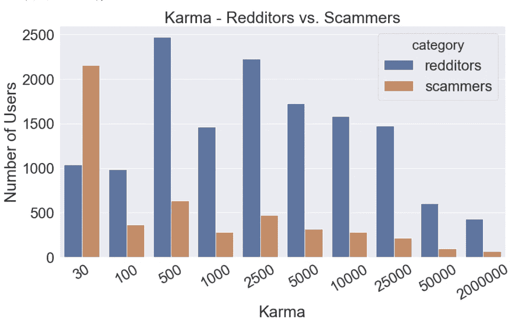

因果报应的分布显示，骗子拥有 30 或更少因果报应点数的帐户比例要高得多。另一方面，Redditors 的分布更为正常。

**3。** **电子邮件地址**

Praw 属性。来自[https://praw . readthedocs . io](https://praw.readthedocs.io)的屏幕盖

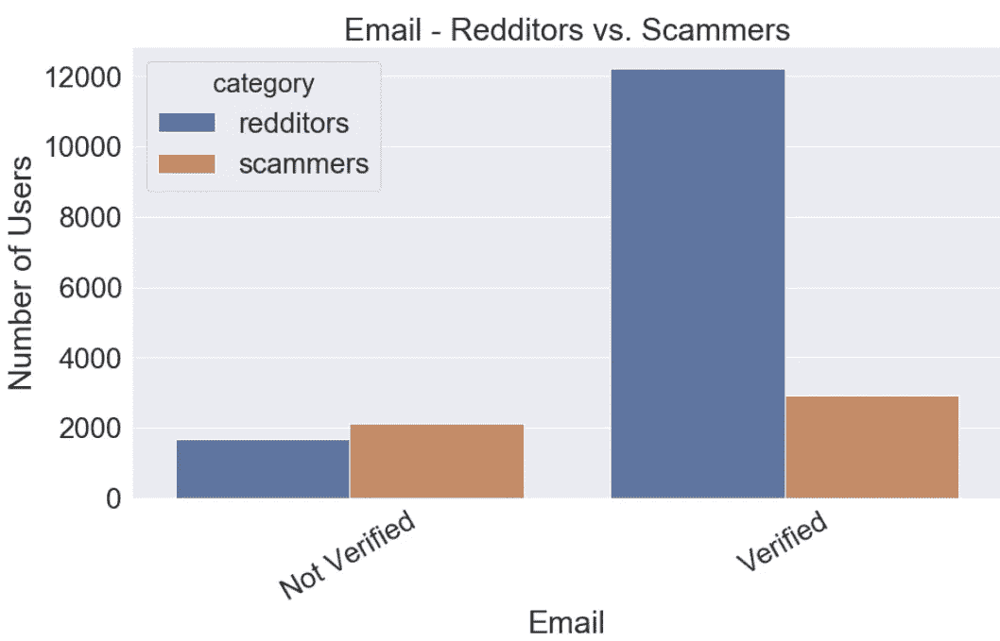

与骗子相比，Redditors 拥有经过验证的电子邮件地址的比例要高得多。

**4。REDDIT GOLD**

Praw 属性。来自[https://praw . readthedocs . io](https://praw.readthedocs.io)的屏幕盖

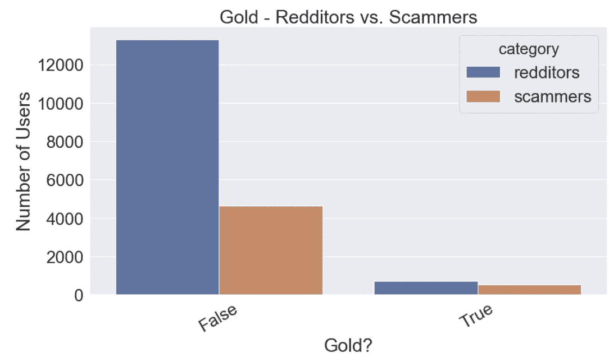

Reddit Gold 表示用户拥有付费的 Reddit 帐户(Premium)。看到有骗子有 Reddit 黄金，我很惊讶；当 Reddit 大部分是免费的时候，一些骗子为他们用来诈骗的账户付费，这似乎很可疑。这一事实可能是真实用户被错误地标记为骗子的结果。

**5。** **主持人**

Praw 属性。来自[https://praw . readthedocs . io](https://praw.readthedocs.io)的屏幕盖

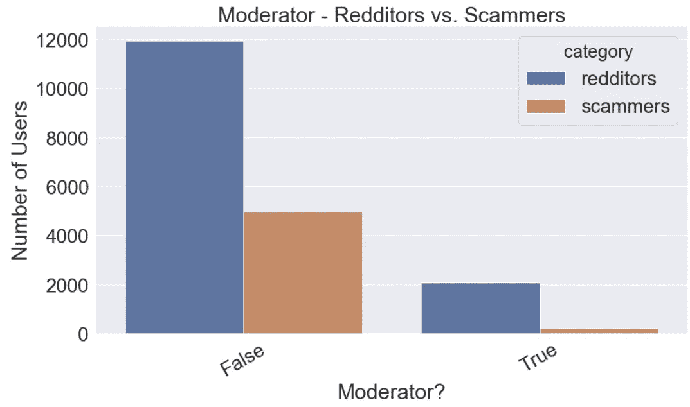

更大比例的 reddits 是 Subreddits 的版主。这是我所期待的，因为骗子可能不会使用他们诈骗某人时使用的相同帐户来努力调节 Subreddits。

6。备注

你可以看到评论少于 10 条的骗子数量激增。这是我想在未来重新审视的一个变量。Reddit API 允许每个用户最多 1000 条评论，但我只选取了最后 100 条作为案例研究。

我仔细研究这些个体变量的原因是为了在 Redditors 和 scammers 的活动中找到一个明显的差异。我已经能够使用机器学习来实现这一点。对于每个变量，两组之间活动分布的差异都有明确的定义。我坚信，如果我们认识到所有 6 个特征，那么我们将能够对 Reddit 账户及其风险水平做出准确的预测。

**多元逻辑回归模型**

在这个项目中，我对使用我上面讨论的变量预测定性结果感兴趣。这可以称为对观察结果进行分类，因为它涉及将观察到的数据分配到特定类别，在这种情况下，该类别可以是 Redditor 或 Scammer。具体来说，对于这个分类项目，我打算使用多元逻辑回归模型来预测一个观察的**概率**。几乎不可能肯定地说某个 Reddit 用户是骗子，但他/她的活动与欺诈用户的活动相匹配的概率是一个更现实的指标。

一个多重逻辑回归方程，其中 X = (X1，X2，…..，Xp)是 p，预测因子，看起来是这样的:

**数据分布**

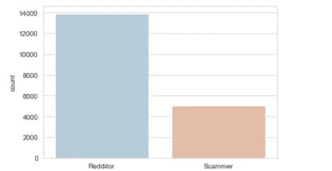

包装:

*   Numpy —支持大型多维数组和矩阵
*   熊猫—数据处理和分析
*   Sklearn —机器学习库
*   Statsmodel —探索数据，估计统计模型，并执行统计测试

**执行回归**

对于这个模型，**预测变量**将是电子邮件、版主、黄金、因果、年龄和评论，而**目标变量**将是用户名。目标变量中的数字“0”代表 Redditor，而数字“1”代表 scammer。

以黄色突出显示的岭回归参数

**L2 正则化—岭回归**

正则化可用于训练模型，通过防止算法过度拟合训练数据集，可以更好地对看不见的数据进行归纳。岭回归通过引入一条带有少量偏差的新的最佳拟合线来做到这一点，作为回报，它得到了方差的显著下降。随着新数据被引入模型，这有助于更好地进行长期预测。

# L2 方程

wikipedia.com 的纱帽

除 y 轴截距之外的每个参数都按脊线缩放。

现在我已经做了一些模型调优，是时候使用 Sklearn 运行模型了。

下面是模型在分析测试变量数据后给出的结果总结。

总的来说，多重逻辑回归模型做得很好，预测远远超过随机的 50/50 猜测。该模型的准确度(显示在黄色矩形中)为 83%。然而，在继续这个模型之前，我想看一下 p 值，以确保所有的变量都是显著的。我将利用 Statsmodel 库来解释我得到的结果，因为这个库给出了比 Sklearn 好得多的 p 值汇总。

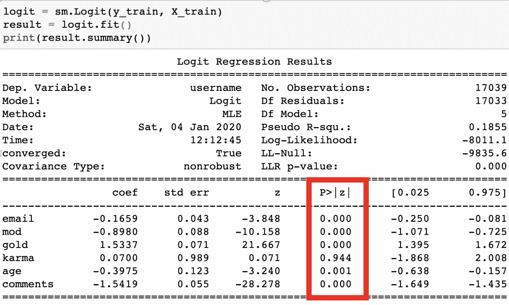

在上面的结果中(显示在红色矩形中)，变量“Karma”具有非常高的 p 值，这意味着它在这个模型中是无关紧要的。这有点令人惊讶，因为 EDA 已经表明因果报应是区分这两个组的相关特征。然而，在这里，我将删除变量“Karma ”,并重新运行模型以查看其响应。

**模型，版本 2** (去除预测变量 Karma 后)

具有特征因果报应

没有 Karma(更高的精度水平在下面的结果中突出显示，显示了改进):

没有特征因果报应

**精密**:

这指的是实际上是正确的肯定识别的比例。

其中 TP =真阳性，FP =假阳性。

在该模型预测的 310 个骗子中，有 253 个是正确的，其准确率为 82%。

**回忆:**

这是指被正确识别的实际阳性的比例。

其中 TP =真阳性，FN =假阴性。

在测试数据中，有 491 个骗子，253 个被正确识别，这产生了 52%的召回分数。

当涉及到这个项目的实际应用时，在这个过程之前确定一个 Reddit 用户是否是骗子是非常困难的。有可能一个 Redditor 显示了一个骗子的活动，但却有着良好的意图。另一方面，用户可能已经成功进行了 5 次交易，然后决定不继续进行第 6 次交易。

为了全面评估模型的效率，我考察了精确度和召回率。通过给预测的概率增加一个阈值，就给模型增加了很多价值。在下图中，您可以看到该模型根据预测的概率来预测 Reddit 用户是真实用户还是骗子，该模型对两组用户都使用了大于 0.5 的基本阈值。例如，如果用户是骗子的概率是> . 5%，那么模型将为该用户预测骗子。

这是一个示例输出，模型做出了 10 个预测:

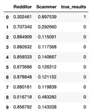

模型做出的 10 个预测

在上图中，你可以看到模型做出的 10 个预测。概率是根据电子邮件、mod、gold、评论和年龄计算的。在行 0 中，模型预测用户与骗子具有 0.697%的相似性，这最终是正确的，因为真实结果列显示用户 0 是骗子。

**不同概率下检查概率阈值的代码:**

在对测试数据应用不同的阈值之后。通过在预测骗子时将阈值提高到 60%，假阳性的数量减少了，从而将精确度提高到 92%。

# 使用模型—应用程序使用

查找没有确认交易的用户的提交

Reddit.com 的纱帽

典型提交，但用户有 0 笔确认交易

将用户名输入一个函数，该函数从 reddit API 中提取必要的数据。然后将数据输入多元逻辑回归模型，并返回一个评级。为了使应用程序更加用户友好，低于 40 的等级显示为危险，高于 60 的等级显示为安全。

正如你所看到的，这个用户得到了 38.2 的评分，这是相当低的。暗示找别人买可能更好。

# 使用模型-确认用户

找到已确认交易的用户

Reddit.com 的纱帽

拥有 7 笔已确认交易的用户

因为用户有 7 笔已确认的交易，所以它们很可能是真实的。为了创建一种类型的用户评级，该函数输出以前的交易。

**结论**

基于这些阈值和结果，可以有把握地说，如果一个 Reddit 用户的预测骗子概率高于 0 . 6 的**，那么**最好找其他人与**交易。因此，通过寻找 6 个特征/变量年龄、主持人、因果关系、电子邮件、黄金、评论并预测除因果关系之外的所有这些特征/变量的概率，可以预测与 Reddit 用户交易时的风险水平。**

如果你想查看我的**[**Github**](https://github.com/Landstein/Reddit-Transaction-Analysis)库中的所有代码。**