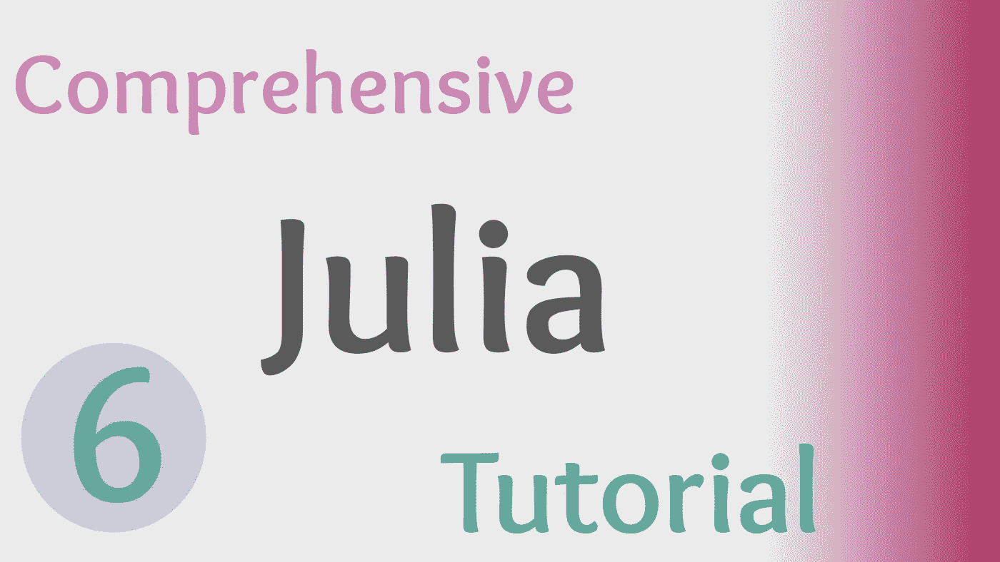
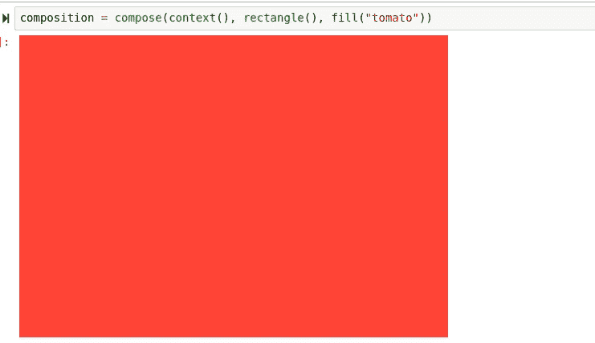
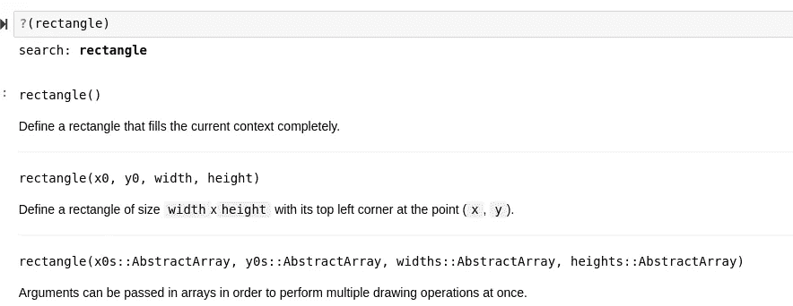
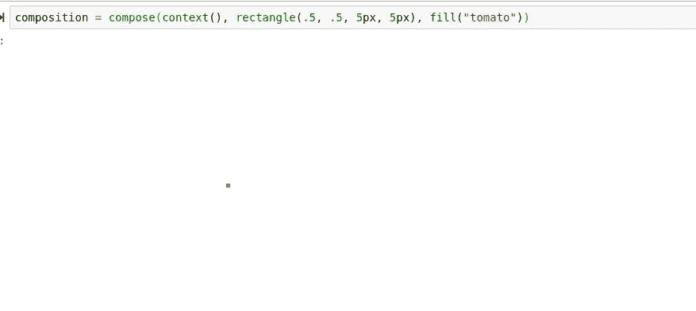
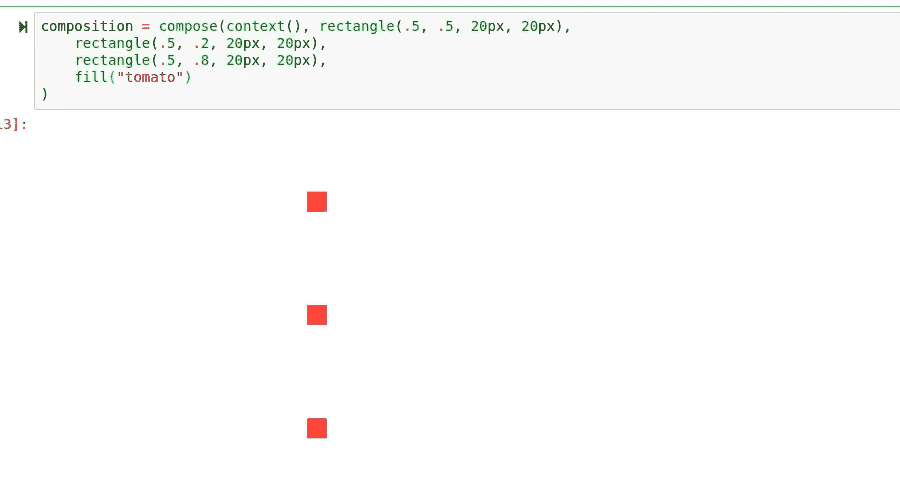

# 如何在 Julia 中使用模块

> 原文：<https://towardsdatascience.com/how-to-use-modules-in-julia-a27e31974b9c?source=collection_archive---------30----------------------->

## 朱莉娅综合教程

## 关于 Julia 语言中模块和导入如何工作的快速课程



(图片由作者提供)

> 本文视频:

> Github:

[](https://github.com/emmettgb/JuliaLessons/tree/master/6) [## emmettgb/JuliaLessons

### 此时您不能执行该操作。您已使用另一个标签页或窗口登录。您已在另一个选项卡中注销，或者…

github.com](https://github.com/emmettgb/JuliaLessons/tree/master/6) 

# 介绍

而我们在过去的朱莉娅教程中已经讲过的东西；函数、构造函数和类型当然是有价值的，一个程序员不可能从零开始构建一个完整的生态系统。也就是说，程序员经常使用包来执行他们的包不一定针对但需要的算法。包是代码的储存库，可以作为其他包迭代和构建的依赖项重用。

我们已经对 Pkg 以及如何使用它来安装 Julia 编程语言的包进行了概述。今天我们将使用一个名为 Compose.jl 的模块来练习用 Julia 编程。我选择这个库是因为它是一个函数式的声明性库，遵循我们在这些教程中介绍的相同的编程方法和原则。此外，作为一个图形包意味着人们可以在非常直观的输出中看到他们代码的直接结果——这对一个新的程序员来说很方便。如果您想了解更多关于该模块的信息，您可以访问 Juliahub:

 [## JuliaHub

### 编辑描述

juliahub.com](https://juliahub.com/ui/Packages/Compose/sbiEw/0.9.1) 

# 包装——基础

为了在 Julia 中添加一个包，我们将使用 Pkg。您可以通过使用将 Pkg 导入到 Julia 中，或者只使用 Pkg REPL，可以通过在 Julia REPL 中按]来访问它。添加相对简单，可以使用 Pkg.add()方法或 Pkg REPL 中的 add 命令来完成。当然，今天我们将使用 Compose.jl，所以您可能想继续添加它:

```
julia> ]
pkg> add Compose
```

这将把 Compose 添加到我们的全局包环境中。一些 Julia 开发者强烈反对这样做，但是我不同意——我认为在你的机器上有依赖是完全没问题的，只要它们是经常使用的依赖。此外，用户总是可以使用 rm 命令删除他们的包。

```
julia> ]
pkg> rm Compose
```

如果你想了解更多关于 Pkg 酷的原因，你可以看看我不久前写的一篇文章！：

[](/julias-package-manager-is-awesome-23b9c02e3a0b) [## 朱莉娅的包装经理棒极了

### 为什么 Julia 的 Pkg 是我用过的最好的软件包管理器。

towardsdatascience.com](/julias-package-manager-is-awesome-23b9c02e3a0b) 

为了让一个模块进入我们的 Julia 运行时环境，我们有一系列不同的选项来导入它。首要的是使用。使用 just 意味着该包将被预编译并从运行时内部调用，并且不会在运行时内部发生变化。我们可以使用 Compose 包

```
using Compose
```

在 Julia 语言中，使用导出的函数和结构是很常见的。这意味着这些函数不需要通过它们的父类来调用，而是可以在导入模块时直接调用。我们可以通过直接导入我们想要在 Julia 中使用的类型或函数来避免使用导出:

```
using Compose: compose
```

直接导入将加载我们的目标代码，而不包括包内的所有其他成分。直接导入也可以节省编译时间，在注册的软件中，对于只有一两个不同类型或函数要在你的软件中使用的依赖项，这是绝对推荐的。

除了使用之外，在 Julia 语言中，我们还可以访问 import 关键字。导入代码与使用代码正好相反，并且允许扩展包。通常情况下，除非需要扩展，否则不需要显式导入。

```
import Compose
# Direct explicit import:
import Compose: compose
```

# 作曲！

了解了使用 Julia 中模块的基础知识后，我们现在可以看看我们今天要学习的模块:

> Compose.jl

Compose 是一个用 pure Julia 编写的声明性矢量图形库，它使得只使用几个参数和节点就可以非常容易地绘制图形。您可以在此处查看 Juliahub 上的撰写文档:

 [## Home Compose.jl

### Compose 是一个用 Julia 编写的声明性矢量图形系统。它旨在简化复杂的创建…

juliahub.com](https://juliahub.com/docs/Compose/sbiEw/0.9.1/) 

说到这里，如果你是 Julia 的新手，并且正在使用 Julia 模块，那么看看 JuliaHub 肯定是值得的。JuliaHub 是 Julia 程序员的一体化软件包目的地，其中的文档很容易包含并自动集成到网站中。如果你想了解更多，我有一整篇关于它有多酷的文章！：

[](/juliahub-the-greatest-approach-to-putting-together-packages-and-documentation-707688a472d2) [## JuliaHub:将包和文档放在一起的最好方法

### JuliaHub 如何自动化所有程序员讨厌做的事情。

towardsdatascience.com](/juliahub-the-greatest-approach-to-putting-together-packages-and-documentation-707688a472d2) 

直接从 Compose 文档中提取，我们的第一个例子很简单，但是可以理解要点:

```
composition = compose(context(), rectangle(), fill("tomato"))
```



(图片由作者提供)

更深入地研究这个语句，compose()方法负责返回一个组合并接受参数。这些参数是称为组合表单和节点的类型。在方法调用内部，我们看到的参数是 context()、rectangle()和 fill()。Context 是根节点，所以在这个特定的实例中，它基本上可以被忽略。接下来的参数是矩形。这当然是在渲染图像中显示的类型。最后一个参数是 fill()，它接受一个字符串，表示整个上下文所需颜色的标题()。

幸运的是，我们可以使用？()方法，以了解有关这些参数的更多信息。让我们创建更多的矩形！我们将从查看在创建类型时可以提供什么类型的数据开始:



矩形既可以接受 0 个参数，也可以接受 4 个参数。这方面的四个参数是位置参数，窗体的 x 位置，窗体的 y 位置，然后是宽度和高度。有了这个新发现的信息，让我们修改我们的旧代码来改变矩形的大小:

```
composition = compose(context(), rectangle(.5, .5, 5px, 5px), fill("tomato"))
```



(图片由作者提供)

并添加更多的矩形:

```
composition = compose(context(), rectangle(.5, .5, 20px, 20px),
    rectangle(.5, .2, 20px, 20px),
    rectangle(.5, .8, 20px, 20px),
    fill("tomato")
)
```



(图片由作者提供)

# 使用与导入

一个可能令人混淆的概念是使用 import 和使用将模块导入 Julia。这是可以理解的，因为许多语言通常不包含这个特性；并且大多数使用 using 将类和函数从名称空间中取出。也就是说，普通的 Julia 程序员可以感觉到的使用和导入之间最明显的区别是扩展模块的能力。这在本文前面已经提到过，但是用代码详细说明一下，分派一个矩形只接受两个位置参数而不是一个或两个是不可能的，如下所示:

```
using Compose: rectangle
rectangle(x::Float64, y::Float64) = rectangle(x, y, 30px, 30px)
```

但是，如果我们使用 import 而不是使用:

```
import Compose: rectangle
rectangle(x::Float64, y::Float64) = rectangle(x, y, 30px, 30px)
```

# 结论

没有一个程序员能够写出整个世界的软件，幸运的是他们不需要这么做。这是因为数以百万计的开源开发者正在开发每个程序员都可以使用的奇妙模块。在 Julia 中，我们可以使用 Pkg 添加一些这样的包。从今天开始，关于模块最重要的事情是:

*   那个？()方法
*   JuliaHub 文档
*   添加包
*   导入和使用的区别

掌握这些概念会让你成为一个真正的茱莉亚语言大师，你已经在路上了！