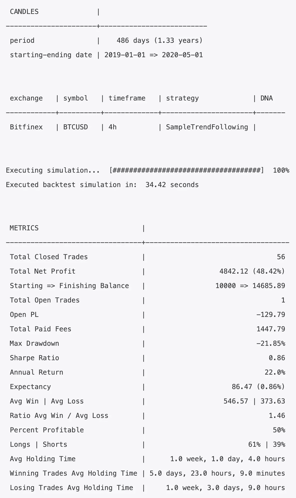

# 如何在你的算法交易策略中使用多个时间框架

> 原文：<https://towardsdatascience.com/how-to-use-multiple-timeframes-in-your-algotrading-strategy-8be026a890e2?source=collection_archive---------51----------------------->

## 你把钱放在桌子上而不使用它们


照片由 [Katerina Limpitsouni](https://undraw.co) 拍摄

在本教程中，我将看一个例子，说明如何在你的策略中使用多个时间框架。在[之前的文章](https://medium.com/@salehmir/how-to-write-a-profitable-strategy-for-algotrading-bitcoin-with-jesse-6c7064b22f1f)中，我们学习了如何进口蜡烛，写一个简单的盈利策略，定义路线，以及执行回溯测试。如果您还没有阅读我之前的文章，[请在继续之前阅读](https://medium.com/@salehmir/how-to-write-a-profitable-strategy-for-algotrading-bitcoin-with-jesse-6c7064b22f1f)。

我将从上一篇文章停止的地方继续。这是我最后得出的完整策略:

这是从`2019-01-01`到`2020-05-01`用`4h`时间框架回溯测试的结果:


从 2019 年 1 月 1 日到 2020 年 5 月 1 日的回溯测试结果，没有锚定时间框架

# 在您的策略中定义多个时间框架

这一次，我将使用多个时间框架，看看我是否能改善结果。有经验的交易者在手动交易中使用的一个技巧是观察更大时间框架的趋势(或者他们称之为**锚**时间框架)。这个简单的技巧经常会以减少进场信号的数量为代价来增加你的胜率。

你可能会问，我怎么知道哪个时间框架是锚定时间框架？通常的公式是你交易时间的 4 到 6 倍。例如，在我的例子中，`4h`的锚定时间范围是:

```
6 * 4h = 24h ("1D" in jesse's terms)
```

Jesse 提供了一个[实用助手](https://docs.jesse-ai.com/docs/utils.html#anchor-timeframe)来帮你计算，这就是我要用的。

让我们添加一个新的返回大趋势的属性方法。我会返回`1`表示上升趋势，返回`-1`表示下降趋势:

如你所见，这次我用了 [self.get_candles](https://docs.jesse-ai.com/docs/strategies/api.html#get-candles) 而不是 [self.candles](https://docs.jesse-ai.com/docs/strategies/api.html#candles) 。我还使用了一些其他内置属性，而不是使用硬编码的字符串:

这样，当我改变我的路线去尝试其他的交换、符号和时间框架时，我不必改变我的策略代码。

现在我更新了我的参赛规则，加入了`anchor_trend`:

# 修改您的路线

现在，我再次执行回溯测试，看看这一更改会如何影响回溯测试结果，但我得到了以下错误:

```
Uncaught Exception: RouteNotFound: Bellow route is required but missing in your routes: ('Bitfinex', 'BTCUSD', '1D')
```

错误是明显的。如果我在另一个时间段使用蜡烛，我也应该把它添加到我的`routes.py`文件中。我的交易路线必须保持不变，因为我交易的是单一头寸，所以我使用的任何其他时间框架都被视为额外的*蜡烛线。*

这是我的`routes.py`现在的样子:

这个错误告诉我，在我的路线中我遗漏了`('Bitfinex', 'BTCUSD', '1D')`；所以我们把它加到`extra_candles`列表里吧。这就是我的`routes.py`应该变成的样子:

这一次回溯测试进展顺利。结果如下:



从 2019 年 1 月 1 日到 2020 年 5 月 1 日的回溯测试结果，具有锚定时间框架

在我使用锚定时间框架来检测市场的更大趋势后，回溯测试结果中有一些值得注意的变化:

*   *总净利润*从 31.44%增加到 48.42%，这意味着更多的钱！
*   *总平仓交易*减少了，这意味着我得到的进场信号减少了，这是意料之中的，因为我在进场规则中增加了另一个进场条件。
*   *夏普比率*从 0.62 增加到 0.86。
*   *胜率*从 47%提高到 50%。

# 前瞻偏见

在 algo 策略中使用多个时间框架时，[前瞻偏差](https://www.investopedia.com/terms/l/lookaheadbias.asp)是一个严重的问题。简而言之，这意味着使用未来的数据。

你们中的一些人可能对此很熟悉，并想知道前瞻偏差是否在我们刚刚观察到的结果提升中起了作用。**放心，不会的**。Jesse 框架在幕后处理前瞻性偏见。

# 结论

我们刚刚看到了我的策略指标的显著提升，这是使用锚定时间框架来确定市场更大趋势的结果。

当然，你不会每次在策略中使用多个时间框架时都得到同样的提升。但在我看来，至少尝试一下是有意义的。

这个想法可以延伸。例如，如果你在交易以太网，你可能想利用比特币的锚趋势，因为很明显比特币是加密货币市场的国王，对其他硬币的价格有着巨大的影响。

为了获得我未来的作品和产品，请务必订阅杰西的[时事通讯](https://jesse-ai.com/)，并查看[论坛](https://forum.jesse-ai.com/)与像你我这样的量化分析师讨论算法交易

*最初发表于*[*【https://jesse-ai.com】*](https://jesse-ai.com/blog/tutorials/how-to-use-multiple-timeframes-in-your-algotrading-strategy)*。*

***来自《走向数据科学》编辑的注释:*** *虽然我们允许独立作者根据我们的* [*规则和指南*](/questions-96667b06af5) *发表文章，但我们并不认可每个作者的贡献。你不应该在没有寻求专业建议的情况下依赖一个作者的作品。详见我们的* [*读者术语*](/readers-terms-b5d780a700a4) *。*