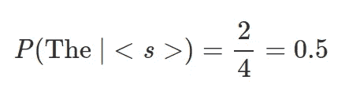
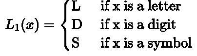
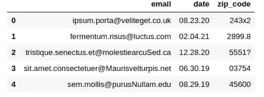

# 如何使用 n 元模型检测数据集中的格式错误

> 原文：<https://towardsdatascience.com/how-to-use-n-gram-models-to-detect-format-errors-in-datasets-bb2171842499?source=collection_archive---------48----------------------->

## 关于语言模型如何扩展和用于不同目的的代码优先方法。

图片由 [Ronile](https://pixabay.com/users/Ronile-126846/?utm_source=link-attribution&utm_medium=referral&utm_campaign=image&utm_content=359950) 从 [Pixabay](https://pixabay.com/?utm_source=link-attribution&utm_medium=referral&utm_campaign=image&utm_content=359950) 拍摄

格式错误，在最好的情况下，会破坏自动数据处理管道。在最坏的情况下，它们会在难以调试的下游分析任务中引入逻辑错误。发现这样的错误是一项单调而低效的工作，会降低工作效率。此外，这种手动过程可能引入不同类型的错误。**那么，我们能自动检测损坏的值吗？**

例如，考虑一个数据集`D`，它有数百万行，包含一个`Date`列。让我们假设这个列中的值符合一个特定的模式:`mm.dd.yyyy`。假设某处存在一个无效的单元格，由于输入错误，日期遵循不同的格式:`01.15–2019`。在自动化管道中，解析器将尝试读取该特性，并可能抛出异常。试图在管道执行之前找到错误几乎是不可能的。但是如果我们能让计算机检测到它呢？

**在这个故事中，我们使用 n-grams，一种语言模型，来自动化错误检测。**我们简要讨论 n 元语法以及 NLP 工程师如何使用它们来生成语言，并研究我们如何利用它们的属性来识别数据集中可能损坏的值。

> [学习率](https://mailchi.mp/d2d2d4a109b5/learning-rate-newsletter)是为那些对 AI 和 MLOps 的世界感到好奇的人准备的时事通讯。你会在每周五收到我关于最新人工智能新闻和文章的更新和想法。在这里订阅！

# 关于 n-grams

n-gram 是一个概率模型，简单来说，它试图预测序列中的下一个单词。像 n-grams 这样的概率模型总是通过例子来更好地理解。因此，请考虑下面这段摘自艾米莉·狄金森的诗:

> 在巨大的痛苦之后，一种正式的感觉来了——
> 神经像坟墓一样隆重地坐着——
> 僵硬的心会问‘是他吗，令人厌烦的’，
> 和‘昨天，还是几个世纪以前’？

首先，我们想知道每个句子从哪里开始，什么时候结束。为此，让我们用特殊字符`<s>`表示起点，用`</s>`指出终点位置。

> ~~巨大的痛苦之后，一种正式的感觉来了——~~
> <s>神经顿然，如同坟墓——</s>
> s<s>那颗僵硬的心质问‘是他，那个生了，< /s >
> < s >和‘昨天，还是几个世纪以前’？< /s >

要创建一个 n 元模型，首先我们必须为`n`超参数设置一个特定的数字。因此，让`n = 2`，在这种情况下，n-gram 模型转换为双-gram 模型。现在，我们可以计算两个连续单词的概率。例如，这段摘录中的句子通常以`the`一词开头。

使用这些概率，并给定一个新单词作为*种子*，我们可以预测序列中的下一个单词。显然，数据集越大，结果越好。同样，根据问题的不同，3-grams 可能更好，但是 `**n**` **的值越大，引入的稀疏性就越多。**

# 泛化树和泛化语言

为了使用 n-grams 来检测表中的格式错误，我们需要一种方法来将原始值归纳为模式。我们也可以用原始值训练一个 n 元模型，但是这种方法的复杂性引入了太多的自由度，导致高度稀疏。

例如，假设`v₁`是一个表示邮政编码的原始数字序列:`15122`。然后，让`v₂,v₃`表示两种不同的代码:`345a7`、`47592`。显然，`v₂`是错误的，但是如果我们在 n 元模型中传递原始值，我们将不会得到有价值的信息；看那个`p(a|5) = p(1|5)`，这样我们要么漏掉错误，要么产生假阳性。但是如果我们能把一个原始值归纳成一个模式，我们就能得到更有意义的表示。

为此，我们使用了*泛化树*和*泛化语言*的概念。**泛化树是一个类似下图的层次结构，将原始值映射到不同的表示形式。**

从那棵树上，我们可以派生出许多语言。下面给出一个例子。

使用`L₁`，我们可以将`v₁,v₂,v₃`转换成`DDDDD,DDDLD,DDDDD`。我们也可以将模式压缩为`v₁ = D(5), v₂ = D(3)L(1),D(1), v₃ = D(5)`。有了这个表示和足够大的数据集来训练一个 n 元模型，我们可以得到邮政编码格式的字母`L`出现的概率非常低。简而言之，这就是泛化树和语言的思想。如果需要更详细的介绍，请看下面的故事。

 [## 如何自动检测数据集中的错误

### 引入泛化树和泛化语言来自动检测结构化数据集中的损坏值。

towardsdatascience.com](/how-to-auto-detect-format-errors-in-a-dataset-6609a9e9aacc) 

# 实施和评估

现在是我们动手的时候了。对于这个例子，我们使用一个包含 100 行三个特征的合成数据集:*电子邮件、日期、邮政编码*。因此，让我们使用`pandas`加载数据，看看是什么样的。

这一次，我们使用了`zip_code`列，其中我们引入了一些错误。因此，我们指定我们将使用的泛化语言。它严格遵循`L₁`中定义的规则。

例如，`2899.8`的图案是`d(4)s(1)d(1)`，而`03754`的图案是`d(5)`。现在，让我们将每个邮政编码转换成它的模式。

我们使用流行的 python 库`nltk`，创建 3-grams 并构建最大似然估计模型(MLE)。

首先，我们填充序列，正如我们在这个故事的第一部分看到的。接下来，我们为每个填充序列(即，每个填充的邮政编码模式)构建一组 3-gram。最后，我们使用 3-grams 来拟合 MLE 模型。

为了评估一个邮政编码并检测任何错误，我们需要一个 score 函数。因此，下面我们定义这样一个函数。

这个函数获取一个原始值，相应地将其归纳为一个模式，填充它并计算每个 3-gram 的分数。最后，它返回最不可能的计算值。**这是因为我们只需要一个 3-gram 就可以确信我们有错误。这是对这个玩具例子的一个简单的解释，但是如果你想了解如何聚合许多泛化语言的结果，请阅读下面的故事。**

 [## 如何使用泛化语言自动检测数据集中的错误

### 使用远程监督和汇总预测结果生成验证数据，就像大海捞针一样。

towardsdatascience.com](/how-to-auto-detect-errors-in-a-dataset-part-ii-683b114865be) 

现在，如果我们将一个有效的邮政编码值传递给`score`方法，得到的概率很高:`score('15378') = 0.951`。另一方面，如果有任何包含字母、符号或五个以上数字的值，概率就会下降。例如，第一个邮政编码`243x2`的得分为`0.0098`。

# 结论

在这个故事中，我们使用一个玩具示例来展示语言模型(n-grams)如何用于表格数据集中的格式错误检测。我们简要解释了什么是 n 元语法，以及如何使用泛化树和语言来解决稀疏性问题。最后，我们实现了一个简单的解决方案，利用 n-grams 的能力结合泛化语言来检测合成数据集中的错误。

> **我叫 Dimitris Poulopoulos，是希腊比雷埃夫斯大学***[**BigDataStack**](https://bigdatastack.eu/)***的机器学习研究员和博士(c)。我曾为欧洲委员会、欧盟统计局、国际货币基金组织、欧洲中央银行、经合组织和宜家等主要客户设计和实施人工智能和软件解决方案。如果你有兴趣阅读更多关于机器学习、深度学习和数据科学的帖子，请在 twitter 上关注我的********[**LinkedIn**](https://www.linkedin.com/in/dpoulopoulos/)**或**[**@ james2pl**](https://twitter.com/james2pl)**。********