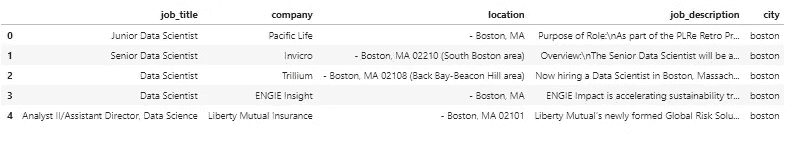
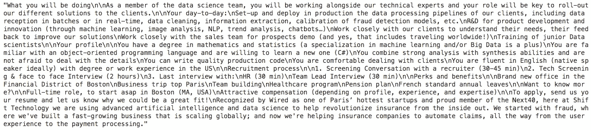
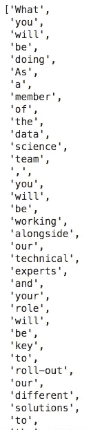
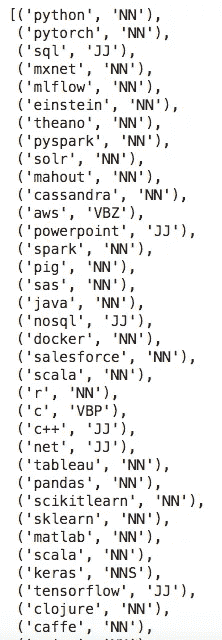
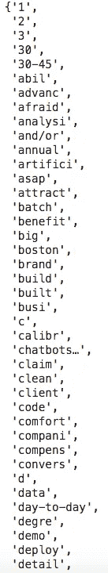
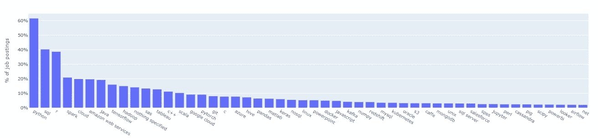
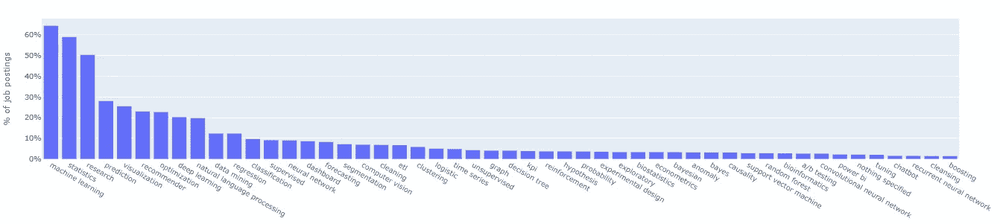

# 如何在 Python 中使用 NLP:一个实用的分步示例

> 原文：<https://towardsdatascience.com/how-to-use-nlp-in-python-a-practical-step-by-step-example-bd82ca2d2e1e?source=collection_archive---------0----------------------->

## 找出 NLTK 数据科学家需要的技能

在这篇文章中，我们展示了一个关于招聘信息的*分步* NLP 应用。

这是[对上一篇文章](/what-are-the-in-demand-skills-for-data-scientists-in-2020-a060b7f31b11)的技术解释，在这篇文章中，我们总结了数据科学家的热门技能。我们提供雇主最常要求的顶级工具、技能和最低限度的教育。

如果你想看一个用 Python 代码使用[自然语言工具包](https://www.nltk.org/) (NLTK)包的实际例子，这篇文章就是为你准备的。

让我们开始吧。

来源:[突发](https://burst.shopify.com/photos/what-does-a-brain-need?q=brain)

# 准备:收集数据

我们搜集了 8 个不同城市的“数据科学家”的招聘信息。抓取后，我们将数据下载到每个城市的单独文件中。

该分析中包含的 8 个城市是*波士顿、芝加哥、洛杉矶、蒙特利尔、纽约、旧金山、多伦多和温哥华*。变量是*职位、公司、地点和职位描述*。

在本文中，我们不会详细讨论这个过程。

我们准备好进行真正的分析了！我们将从这些数据中总结出雇主要求的流行工具、技能和最低学历。

# 步骤#1:加载和清理数据

首先，我们将 8 个城市的数据文件加载并组合到 Python 中。

我们删除具有相同*职位名称*、*职位描述*、*、*和*城市*特征的重复行/职位发布。

现在我们有一个包含 5 个要素和 2，681 行的数据集。

**相关文章:**[Python 中的数据清洗:终极指南(2020)](/data-cleaning-in-python-the-ultimate-guide-2020-c63b88bf0a0d)

# 步骤 2:形成关键词列表

在搜索职位描述之前，我们需要代表工具/技能/学位的关键词列表。

对于这个分析，我们使用一个简单的方法来形成列表。这些名单是基于我们的判断和招聘信息的内容。如果任务比这更复杂，你可以使用更高级的方法。

对于**工具**的关键词列表，我们最初是根据我们的数据科学知识得出一个列表。我们知道数据科学家常用的工具包括 Python、R、Hadoop、Spark 等等。我们对这个领域有相当的了解。因此，这份初步清单很好地涵盖了招聘启事中提到的许多工具。

然后我们查看随机的招聘信息，并添加列表中没有的工具。通常这些新的关键词会提醒我们添加其他相关的工具。

在这个过程之后，我们有了一个关键词列表，它涵盖了招聘信息中提到的大多数工具。

接下来，我们将关键字分为单单词列表和多单词列表。我们需要以不同的方式将这两个关键字列表与职位描述相匹配。

通过简单的字符串匹配，多词关键字通常是唯一的，很容易在工作描述中识别。

单个单词的关键字，比如“C ”,在我们的文章中是指 C 编程语言。但“c”也是一个常见的字母，用在许多单词中，包括“can”、“clustering”。我们需要进一步处理它们(通过标记化),以便仅在职位描述中有单个字母“c”时进行匹配。

以下是我们用 Python 编写的工具的关键词列表。

通过遵循与工具相似的过程，我们得到了**技能**的关键词列表。

对于**的教育水平**，我们使用不同的程序。

因为我们正在寻找最低要求的教育水平，我们需要一个数值来排列教育程度。比如我们用 1 代表“学士”或“本科生”，用 2 代表“硕士”或“研究生”，等等。

这样，我们就有了从 1 到 4 的学位排名。数字越高，受教育程度越高。

# 步骤 3:使用 NLP 技术简化工作描述

在这一步中，我们简化了工作描述文本。我们通过计算机程序使课文更容易理解；从而更有效地将文本与关键词列表进行匹配。

我们数据集中的 job_description 要素如下所示。

## **标记工作描述**

[记号化](https://en.wikipedia.org/wiki/Lexical_analysis#Tokenization)是将文本字符串解析成不同部分(记号)的过程。这是必要的，因为计算机程序能更好地理解标记化的文本。

我们必须用空格(" ")等分隔符将工作描述文本字符串显式地分割成不同的标记(单词)。我们使用 [word_tokenize](https://www.nltk.org/api/nltk.tokenize.html) 函数来处理这个任务。

在这个过程之后，工作描述文本串被分割成如下的标记(单词)。计算机可以更容易地读取和处理这些令牌。

例如，单个单词的关键字“c”只能与标记(单词)“c”匹配，而不能与其他单词“can”或“clustering”匹配。

请继续阅读 Python 代码。我们将标记化与接下来的几个过程结合在一起。

## **词性标注职位描述**

工作描述通常很长。我们希望保留对我们的分析有用的单词，同时过滤掉其他单词。我们使用词性标注来实现这一点。

词性标注是一种标注单词是名词、形容词还是动词等的自然语言处理方法。维基百科解释得很好:

> [**词性标注**](https://en.wikipedia.org/wiki/Part-of-speech_tagging) 是将文本(语料库)中的单词标记为对应于特定词性的过程，基于其定义和上下文，即其与短语、句子或段落中相邻和相关单词的关系。这种方法的一种简化形式通常是教学龄儿童识别名词、动词、形容词、副词等。

多亏了 NLTK，我们可以在 Python 中使用这个标记器。

将这种技术应用于关键字列表，我们可以找到与我们的分析相关的标签。

下面，我们用 POS 标签工具的关键字列表作为演示。

字母的不同组合代表标签。例如，NN 代表名词和单数词，如“python”，JJ 代表形容词，如“big”。完整的陈述列表在[这里](https://pythonprogramming.net/natural-language-toolkit-nltk-part-speech-tagging/)。

正如我们所见，标签并不完美。例如，“sql”被标记为“JJ”——形容词。但它仍然足以帮助我们筛选有用的单词。

我们使用所有关键字的标签列表作为工作描述的过滤器。我们只保留工作描述中具有相同关键字标签的单词。例如，我们将保留工作描述中带有标签“NN”和“JJ”的单词。通过这样做，我们可以从工作描述中过滤掉那些对我们的分析没有帮助的词，比如“the”、“then”。

在这个阶段，我们已经精简了工作描述，这些描述被符号化和缩短了。

保持耐心！我们只需要稍微多处理一下。

# 第四步:关键词和工作描述的最终处理

在这一步，我们进一步处理关键字列表和工作描述。

## **词干分析**

> [**词干化**](https://en.wikipedia.org/wiki/Stemming) 是将屈折(或有时派生)的单词简化为其词干、词根或词根形式(通常是书面单词形式)的过程。

词干处理允许计算机程序识别同一个词干的单词，尽管它们看起来不同。这样，我们就可以匹配单词，只要它们有相同的词干。例如，单词“模型”、“建模”都有相同的词干“模型”。

我们列出了关键字和精简的工作描述。

## **小写单词**

最后，我们通过小写来规范所有的单词。我们只将工作描述小写，因为关键字列表是小写的。

如前几节所述，前面过程中使用的 **Python 代码**如下。

现在，只有与我们的分析相关的工作描述中的单词(记号)保留了下来。下面是最终工作描述的一个例子。

*终于*了，我们准备好关键词匹配了！

# 第五步:匹配关键词和工作描述

为了查看职位描述是否提到了特定的关键字，我们将关键字列表与最终精简的职位描述进行匹配。

## **工具/技能**

您可能还记得，我们构建了两种类型的关键词列表——单词列表和多词列表。对于单字关键词，我们通过集合交集函数将每个关键词与职位描述进行匹配。对于多词关键字，我们检查它们是否是工作描述的子字符串。

## **教育**

对于教育程度，我们使用与工具/技能相同的方法来匹配关键词。然而，我们只记录最低水平。

例如，当“学士”和“硕士”这两个关键词同时出现在一份工作描述中时，学士学位就是这份工作所需的最低学历。

更详细的 **Python 代码**如下。

# 步骤 6:可视化结果

我们用柱状图总结结果。

对于工具/技能/教育水平的每个特定关键词，我们会计算与之匹配的职位描述的数量。我们也计算他们在所有工作描述中的百分比。

对于工具和技能列表，我们只列出了最受欢迎的前 50 个。对于学历层次，我们按照最低要求的层次来总结。

详细的 **Python 代码**如下。

## **最受欢迎的工具**

数据科学家的 50 大工具

## **热门技能需求**

数据科学家的 50 大技能

## **最低教育要求**

数据科学家的最低教育水平

我们*做到了*了！

我们希望这篇文章对您有所帮助。留下评论让我们知道你的想法。

同样，如果你想看到详细的结果，请阅读[2020 年数据科学家需要哪些技能](/what-are-the-in-demand-skills-for-data-scientists-in-2020-a060b7f31b11)。

如果你有兴趣阅读更多这样的文章，请在 [**中**](https://medium.com/@justintodata) 或 [**推特**](https://twitter.com/JustintoData) 上*关注*我们。

更多来自 Lianne & Justin 的数据科学文章:

 [## Python 中的数据清理:最终指南(2020)

### 清洁什么和如何清洁的技巧。

towardsdatascience.com](/data-cleaning-in-python-the-ultimate-guide-2020-c63b88bf0a0d)  [## 如何提高体育博彩赔率 Python 中的分步指南

### 我用数据科学策略在体育上赌了 20，000 美元。

towardsdatascience.com](/how-to-improve-sports-betting-odds-step-by-step-guide-in-python-94626b852f45)  [## 如何像老板一样在 Python 中操纵日期和时间

### 常用的日期时间函数及示例

towardsdatascience.com](/how-to-manipulate-date-and-time-in-python-like-a-boss-ddea677c6a4d)