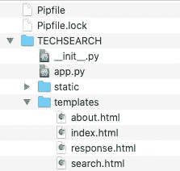

# 如何使用 NLP 找到技术工作并赢得黑客马拉松

> 原文：<https://towardsdatascience.com/how-to-use-nlp-to-find-a-tech-job-and-win-a-hackathon-7aa270ec608d?source=collection_archive---------16----------------------->


## 使用网络抓取、NLP 和 Flask 创建一个技术工作搜索网络应用程序

我和我的前端 web 开发人员 Brandon Franks 最近在一次 30 人团队、30 小时的黑客马拉松中赢得了“解决的最有趣的数据科学问题”奖。我们的获奖作品是一款 Web 应用程序，它从 Indeed.com 收集职位列表，使用自然语言处理(NLP)进行处理，并提供美国前 20 大科技城市的四大科技职位的职位总数、平均工资范围和前 10 大技术技能的汇总

这四个宽泛的技术职位——数据科学家、网络开发人员、UX 设计人员和 iOS 开发人员——包括了与该职位相关的所有职位。因此，网页开发人员包括网页开发人员、前端工程师、PHP 开发人员和许多其他被 Indeed.com 认为是网页开发人员相关的职位。

前 20 大科技城市是根据计算机和数学职业的最高平均工资计算美国前 20 大都会区(MSA)而确定的。Indeed.com 搜索以城市为半径 25 英里，因此搜索结果包括城市的周边地区。

首先，让我们看看成品:

[**点击此处查看科技求职网应用**](https://techjobsearch.herokuapp.com)

虽然 Web 应用程序使用起来非常简单，但它需要大量的幕后数据科学来构建汇总结果。让我们一步一步地完成网页抓取、NLP 和应用程序构建的过程，以便在黑客马拉松 30 小时的时限内将网站变得生动起来。

**关于代码的一句话**

该项目的所有代码、数据和相关文件都可以在 my [GitHub](https://github.com/JimKing100/techsearch) 访问。自述文件提供了 repo 目录和文件的详细信息。网页抓取和自然语言处理使用 Jupyter 笔记本。

**网页抓取**

Web 抓取代码使用 [BeautifulSoup](https://www.crummy.com/software/BeautifulSoup/bs4/doc/) 从 Indeed.com 站点定位并抓取数据。在抓取之前，请务必检查 robots.txt 文件，以确保所抓取的数据是允许的。我们收集的初始数据:

1.职位名称
2。公司
3。位置
4。工资
5。职位描述
6。作业计数

让我们用一段代码来演示这个基本过程。

```
def extract_job_title(soup):
    jobs = []
    for div in soup.find_all(name="div", attrs={"class":"row"}):
        for a in div.find_all(name="a", attrs={"data-tn-element":"jobTitle"}):
            jobs.append(a["title"])
    return(jobs)city_url = "[https://www.indeed.com/jobs?q=](https://www.indeed.com/jobs?q=)" + title_name + \
           "&l=" + city_name + "%2C+" + st_name + \
           "&start=" + str(start)
page = requests.get(city_url)
soup = BeautifulSoup(page.text, "html.parser")job_title_list.extend(extract_job_title(soup))
```

在上面的代码中， **city_url** 是使用职位、城市和州构建的。然后 html 页面被检索并存储在**页面**变量中。然后，BeautifulSoup 将页面解析成 html 组件，并将它们存储在 Beautiful soup 对象 **soup** (一个嵌套的数据结构)中。

然后调用 **extract_job_title** 函数，并将其传递给 soup 对象。 **soup.find_all** 方法定位适当的 html 并导航到与该值相关联的唯一 html 组件。在这种情况下，职位被发现为子组件**<a data-TN-element = " Job Title ">**in**<div class = " row ">**。你的浏览器检查成为一个必不可少的工具时，网页抓取！

刮擦是费时的。在 4 个职位和 20 个城市的 80 种排列中，每种排列大约需要 3 个小时才能获得 100 个职位。因此，Web 应用程序不是实时的，需要对数据进行预处理并以某种形式存储。因此，从抓取创建的结果数据帧被下载到一个. csv 文件和一个 sqlite DB 表中。的。csv 文件因其易用性和速度最终被应用程序使用。

为每个数据元素创建了类似的函数，并保存到下面的原始数据数据框中:


事实上 _df 数据帧—原始刮擦数据

刮刀的完整代码 scraper.ipynb 可以在[这里](https://github.com/JimKing100/techsearch/blob/master/preprocess/scraper.ipynb)找到。

**自然语言处理**

我们现在有了来自网络搜集的原始数据，但我们仍然需要为每个宽泛的职位确定顶级技术术语。职位描述是一大块文本，因此自然语言处理是从每个职位描述中提取关键技术术语的理想方法。一般步骤如下:

1.  *标记化* —获取原始文本，并将其简化为不含非字母数字字符(标记)的小写单词列表。
2.  *去掉停用词*——去掉我们可以忽略的常用词(如“我”、“和”、“the”等)。).
3.  *引理化* —将记号转换成它们的基本形式，称为引理(例如，游程、running 和 ran 都是引理游程的形式)。
4.  *减少* —通过大约 100 个技术术语的技术术语字典运行基本令牌，以减少基本令牌的数量。
5.  *计数和排名* —计数基本科技令牌，对其进行排名，并将其作为列表存储在数据帧中。

**标记化、删除停用词并词条化**

令牌化过程需要两个步骤。清理文本的预处理步骤和实际的标记化步骤。

以下代码片段中的文本清理使用了 BeautifulSoup、replace、regex、sub 和 lower 等方法的组合，将文本转换为小写字母数字单词。

```
# Clean the text
def clean_text(text):
    text = text.replace('\n', ' ')                # remove newline
    text = BeautifulSoup(text, "lxml").get_text() # remove html
    text = text.replace('/', ' ')                 # remove forward slashes
    text = re.sub(r'[^a-zA-Z ^0-9]', '', text)    # letters and numbers only
    text = text.lower()                           # lower case
    text = re.sub(r'(x.[0-9])', '', text)         # remove special characters
    return textdf['description'] = df.apply(lambda x: clean_text(x['description']), axis=1)
```

然后使用 [spacy](https://spacy.io/usage/spacy-101) 分词器对文本进行分词。Spacy 是用于高级 NLP 的免费开源库。在下面的代码片段中，spacy **记号赋予器**用英语语言模型(大号)初始化，并添加任何额外的停用词。在这种情况下，只有“year”被添加到停用字词中，因为我们将在代码的后面删除许多其他字词。

初始化后，使用 **tokenizer.pipe** 将文本从**描述**列读入**文档**。对于每个文档， **token.lemma_** 被附加到一个列表中。这为数据帧的每一行产生了一个词条列表。最终的列表随后被添加为名为**令牌**的列。

```
# Initialize the tokenizer
nlp = spacy.load("en_core_web_lg")
tokenizer = Tokenizer(nlp.vocab)
STOP_WORDS = nlp.Defaults.stop_words.union(['year'])# Tokenizer pipe removing stop words and blank words and lemmatizing
tokens = []for doc in tokenizer.pipe(df['description'], batch_size=500):

    doc_tokens = []
    for token in doc:
        if (token.lemma_ not in STOP_WORDS) & (token.text != ' '):
            doc_tokens.append(token.lemma_)tokens.append(doc_tokens)df['tokens'] = tokens
```

**将令牌简化为关键技术术语**

为了过滤掉尽可能多的“噪音”，创建了一个大约 100 个技术术语的列表，并通过该列表过滤令牌。这将为每个工作列表生成一个技术术语标记列表。

```
# Tech terms list
tech_terms = ['python', 'r', 'sql', 'hadoop', 'spark', 'java', 'sas', 'tableau',
              'hive', 'scala', 'aws', 'c', 'c++', 'matlab', 'tensorflow', 'excel',
              'nosql', 'linux', 'azure', 'scikit', 'machine learning', 'statistic',
              'analysis', 'computer science', 'visual', 'ai', 'deep learning',
              'nlp', 'natural language processing', 'neural network', 'mathematic',
              'database', 'oop', 'blockchain',
              'html', 'css', 'javascript', 'jquery', 'git', 'photoshop', 'illustrator',
              'word press', 'seo', 'responsive design', 'php', 'mobile', 'design', 'react',
              'security', 'ruby', 'fireworks', 'json', 'node', 'express', 'redux', 'ajax',
              'java', 'api', 'state management',
              'wireframe', 'ui prototype', 'ux writing', 'interactive design',
              'metric', 'analytic', 'ux research', 'empathy', 'collaborate', 'mockup', 
              'prototype', 'test', 'ideate', 'usability', 'high-fidelity design',
              'framework',
              'swift', 'xcode', 'spatial reasoning', 'human interface', 'core data',
              'grand central', 'network', 'objective-c', 'foundation', 'uikit', 
              'cocoatouch', 'spritekit', 'scenekit', 'opengl', 'metal', 'api', 'iot',
              'karma']

df['tokens_filtered'] = df.apply(lambda x: list(set(x['tokens']) & set(tech_terms)), axis=1)
```

**计数和排名**

对于每一个职位和城市，科技词汇都会被计算和排名。然后，在数据帧的列表中按排名顺序放置前十个术语。按职位和城市 **final_df** 汇总的最终数据框架如下:


final_df 数据帧 Web 应用程序中使用的数据

该数据帧被下载到一个. csv 文件中，并提供我们将在 Web 应用程序中使用的数据。

NLP 的完整代码，nlp.ipynb，可以在找到。

**烧瓶 App**

Flask 是一个简单的 Python Web 开发框架，非常适合像这样的小型项目。本文将不讨论使用 Flask 的细节，但是将提供代码的概述。

代码的基本布局如下:



烧瓶布局

pip 文件为应用程序提供环境和依赖关系。 **__init__。py** 文件保存初始化代码，**静态**目录包含图像、css、javascript 等静态内容，**模板**目录包含 html 文件。烧瓶应用程序的主要代码包含在 **app.py** 中，如下所示:

```
# Import Flask packagefrom flask import Flask, request, render_template
import pandas as pd
import re
import stringdef create_app():
    # Create Flask web server, makes the application
    app = Flask(__name__)# Routes determine location
    [@app](http://twitter.com/app).route("/")
    def home():
        return render_template('index.html')[@app](http://twitter.com/app).route("/search", methods=['GET'])
    def input():
        return render_template('search.html')[@app](http://twitter.com/app).route("/output", methods=['POST'])
    def output():
        df = pd.read_csv('[https://raw.githubusercontent.com/JimKing100/techsearch/master/data/scrape_results1.csv'](https://raw.githubusercontent.com/JimKing100/techsearch/master/data/scrape_results1.csv'))
        df = df.drop(df.columns[0], axis=1)title = request.values['title']
        city = request.values['city']
        result_df = df.loc[(df['job'] == title) & (df['city'] == city)]
        r_title = result_df['job'].iloc[0]
        r_city = result_df['city'].iloc[0]
        r_count = result_df['counts'].iloc[0]
        r_lsalary = result_df['low_salary'].iloc[0]
        r_hsalary = result_df['high_salary'].iloc[0]r_skills = re.sub('['+string.punctuation+']', '', result_df['skills'].iloc[0]).split()return render_template('response.html',
                               title='Search Results',
                               r_title=r_title,
                               r_city=r_city,
                               r_count=r_count,
                               r_lsalary=r_lsalary,
                               r_hsalary=r_hsalary,
                               r_skills=r_skills
                               )[@app](http://twitter.com/app).route("/about")
    def about():
        return render_template('about.html')return app
```

Flask 使用 routes 为函数分配 URL。因此“/”路由呈现索引或主页，“/about”路由呈现 about 页面，依此类推。当用户从搜索页面的下拉列表中选择一个职位和城市并点击搜索按钮时，POST 方法调用“/output”路径，执行实际的搜索并呈现结果页面。

Python 代码相当简单。加载包含抓取和 NLP 的最终结果的数据帧，请求职务和城市的值，提取基于职务和城市的数据子集，并将结果传递给页面呈现器。

这总结了创建一个获胜的黑客马拉松项目的整个过程！

我欢迎建设性的批评和反馈，请随时给我发私信。

在推特上关注我

这篇文章最初出现在我的 [GitHub 页面](https://jimking100.github.io/2020-01-05-Post-8/)网站上

【Indeed.com】科技工作数据来源