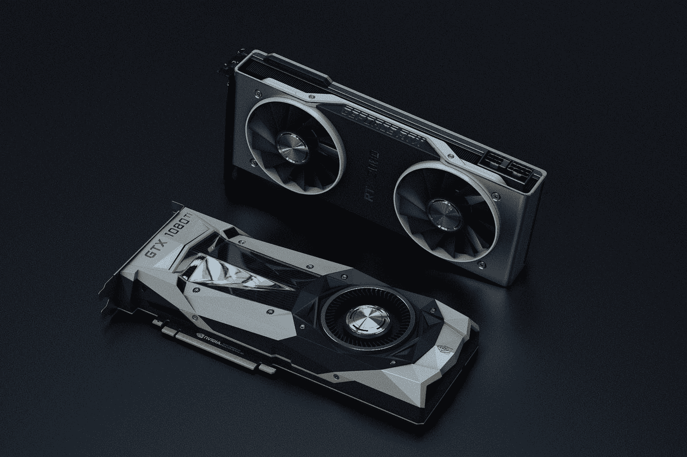

# 如何在 Colab 上配合 GPU 使用 OpenCV？

> 原文：<https://towardsdatascience.com/how-to-use-opencv-with-gpu-on-colab-25594379945f?source=collection_archive---------15----------------------->

## 使用其 NVIDIA GPU 在 Google Colab 上运行 OpenCV 的“dnn”



照片由[娜娜杜瓦](https://unsplash.com/@nanadua11?utm_source=medium&utm_medium=referral)在 [Unsplash](https://unsplash.com?utm_source=medium&utm_medium=referral) 上拍摄

**OpenCV 的‘深度神经网络’(dnn)**模块是一个方便的计算机视觉工具，它非常容易应用一些技术，如 Yolo 和 OpenPose。然而，OpenCV 的主要缺点是缺乏 GPU 支持，导致推理速度缓慢。幸好从 **OpenCV 4.2** 开始，支持 NVIDIA GPU/CUDA。

它仍然需要一些作品使用 GPU，你可以查看 Pyimagesearch 的文章[这里](https://www.pyimagesearch.com/2020/02/03/how-to-use-opencvs-dnn-module-with-nvidia-gpus-cuda-and-cudnn/)，他们演示了如何建立一个 Ubuntu 机器。

如果你和我一样没有带 GPU 的机器，可以考虑用 **Google Colab** ，这是一个免费的服务，有强大的 NVIDIA GPU。它也更容易设置，大部分的要求已经得到满足。在这篇文章中，我将分享我如何用几行代码为 OpenCV 的`dnn`设置 Colab 环境。你也可以在这里查看，我根据回答做了细微的改动。

将`dnn`分配给 GPU 的代码很简单:

```
import cv2
net = cv2.dnn.readNetFromCaffe(protoFile, weightsFile)
net.setPreferableBackend(cv2.dnn.DNN_BACKEND_CUDA)
net.setPreferableTarget(cv2.dnn.DNN_TARGET_CUDA)
```

但是，如果您直接在 Colab 上运行该单元格，您将看到以下错误:


所以我们需要做点什么。

如果你在 Colab 上检查预装 OpenCV 的版本，你会看到这个:


我们需要自己安装 cv2。

首先，运行这个单元:

```
%cd /content!git clone https://github.com/opencv/opencv!git clone https://github.com/opencv/opencv_contrib!mkdir /content/build%cd /content/build!cmake -DOPENCV_EXTRA_MODULES_PATH=/content/opencv_contrib/modules  -DBUILD_SHARED_LIBS=OFF  -DBUILD_TESTS=OFF  -DBUILD_PERF_TESTS=OFF -DBUILD_EXAMPLES=OFF -DWITH_OPENEXR=OFF -DWITH_CUDA=ON -DWITH_CUBLAS=ON -DWITH_CUDNN=ON -DOPENCV_DNN_CUDA=ON /content/opencv!make -j8 install
```

您将看到类似这样的内容:


这需要一段时间，完成后你可以检查 OpenCV 的版本。


就这样吧！现在你应该能够正确无误地将`dnn`设置为 CUDA 了。

```
net.setPreferableBackend(cv2.dnn.DNN_BACKEND_CUDA)
net.setPreferableTarget(cv2.dnn.DNN_TARGET_CUDA)
```

但是第一步要花很多时间，每次启动笔记本都需要做。这样很费时间，也不理想。

这里你可以做的一件事是将第一步的结果保存到你的 Google Drive(你必须挂载它)。

```
!mkdir  "/content/gdrive/My Drive/cv2_gpu"!cp  /content/build/lib/python3/cv2.cpython-36m-x86_64-linux-gnu.so   "/content/gdrive/My Drive/cv2_gpu"
```

然后在下次启动笔记本时将其复制到您的工作目录中。

```
!cp "/content/gdrive/My Drive/cv2_gpu/cv2.cpython-36m-x86_64-linux-gnu.so" .
```

并检查版本以确保完成。


如果你不想安装你的 Google Drive，你可以把它上传到云中的某个地方，然后用`!wget`把它下载到你的工作目录。

就是这样。感谢阅读。享受 GPU 带来的乐趣。