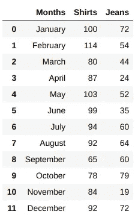
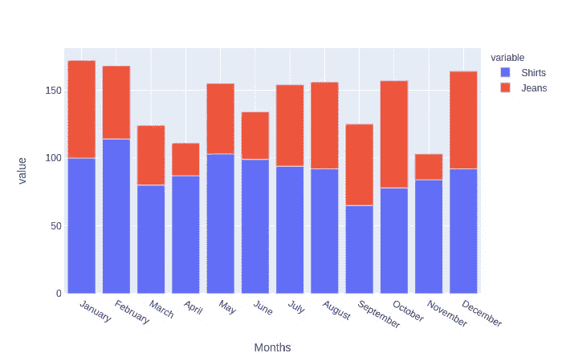
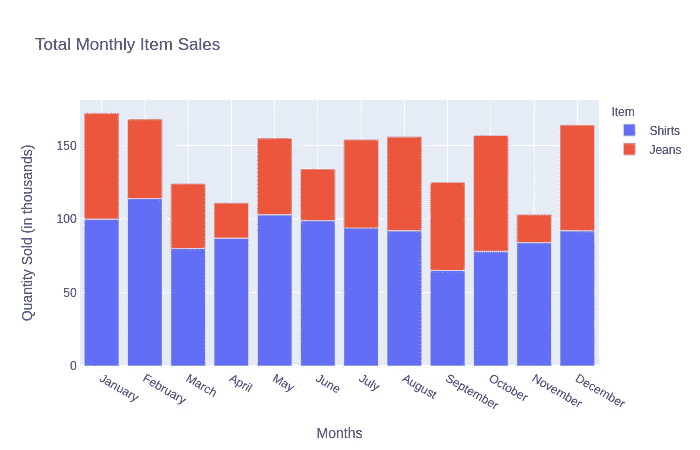
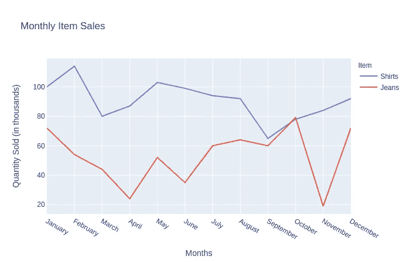
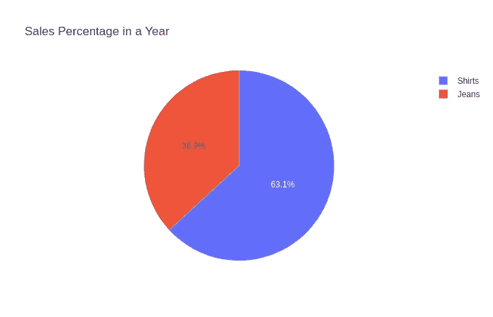

# 为什么我使用 Plotly 进行数据可视化

> 原文：<https://towardsdatascience.com/how-to-use-plotly-for-data-visualization-f3d62bbcfd92?source=collection_archive---------27----------------------->

## 了解商业图表和图形的 Plotly


卢克·切瑟在 [Unsplash](https://unsplash.com?utm_source=medium&utm_medium=referral) 上的照片

世界上的数据量每秒都在增长。从发送文本到点击链接，你都在创造数据点供公司使用。从这些数据收集中获得的见解可能非常有价值。每个企业都有自己需要检查的数据存储。完成这种检查的最重要的方法之一是可视化数据。

# 为什么要可视化数据？

简单来说——“*一图抵千言*”。在整个商业历史中，数据可视化一直是一个必要的组成部分。它如此必要的原因最终是因为我们是视觉动物。除此之外，你认为为什么我们大多数人更喜欢看改编自一本书的电影，而不是阅读这本书本身？在商业演示方面，销售数据的图表可能比纯文本更有洞察力。从视觉媒介而不是 word 文档中获取洞察力是很容易的。

通过可视化数据，您可以让更广泛的受众更容易访问这些数据。这有助于获得更多的洞察力，因为其他人可能会有一两个你可能从未想过的洞察力。越多的人看到你的视觉化图像，就越有可能获得更多的洞察力。


由[奥斯汀·迪斯特尔](https://unsplash.com/@austindistel?utm_source=medium&utm_medium=referral)在 [Unsplash](https://unsplash.com?utm_source=medium&utm_medium=referral) 上拍摄的照片

在向董事会成员或股东等关键决策者展示时，可视化也发挥着关键作用。当你构建大量的图表来突出关键数据点时，你决定制作的视觉效果可以帮助这些决策者向一个或另一个方向前进。如果在展示数据视觉效果时考虑了一个精选的叙述，那么这些决策者会倾向于根据你的展示做出具体的决定。

> [在这里注册一个中级会员，可以无限制地访问和支持像我这样的内容！在你的支持下，我赚了一小部分会费。谢谢！](https://marco-santos.medium.com/membership)

# 数据可视化工具

饼图、条形图、折线图等等都是展示数据时的有效视觉效果。这些视觉效果是经过检验的真实的数据呈现形式，我们使创建它们变得更加容易。我们过去用手做的事情现在在电脑上点击几下就可以完成了。

如今，我们可以使用多种程序来构建漂亮的图表。这些工具从更基于技术的可视化应用，如 Python 的 [**Matplotlib**](https://matplotlib.org/) 或 [**Plotly**](https://plotly.com/) 到更用户友好的应用，如 [**Tableau**](https://www.tableau.com/) 或 [**微软 Power BI**](https://powerbi.microsoft.com/en-us/) 。数据可视化工具现在比以往任何时候都更容易使用。


照片由[凯蒂·罗德里格斯](https://unsplash.com/@katertottz?utm_source=medium&utm_medium=referral)在 [Unsplash](https://unsplash.com?utm_source=medium&utm_medium=referral) 上拍摄

在 Python 编程领域，有许多不同的库可以用来制作数据可视化。这些库包括但不限于*牛郎星*、*海本*和 *Plotly* 。没有更好的 Python 库，因为这完全取决于你喜欢什么，以及你试图可视化的问题或数据。

# 学习如何使用 Plotly

我们之前提到的一个工具叫做 ***Plotly*** 。Plotly 是一个类似于 Matplotlib 的 Python 图形和绘图库。两者的区别在于，Plotly 可以动态地创建交互式图表和图形。

## 一个简单的商业问题

要开始使用 Plotly，我们首先需要数据来绘制图表或绘图。比方说，你在一家销售服装的公司工作。他们希望您绘制他们的衬衫和牛仔裤在一年中的销售图表，并为此向您提供了数据。这个问题将帮助我们开始与 Plotly 合作。

## 安装 Plotly

为了开始，我们必须首先在您的终端中使用以下命令安装 Plotly:

```
$ pip install plotly
```

或者如果您安装了 [**Anaconda**](https://www.anaconda.com/products/individual) :

```
$ conda install -c plotly plotly
```

## Plotly 导入

现在您已经安装了 Plotly，让我们打开一个新文件，并开始为我们的数据可视化示例导入必要的库:

```
import plotly.express as px
import calendar as cal
import random
import pandas as pd
```

这里我们使用的是`plotly.express`，它是 Plotly 中的一个模块，可以为我们快速创建图形和图表。

## 创建数据

由于我们实际上没有得到真实的数据，我们将不得不创建自己的数据:

```
data = {'Months': [cal.month_name[i] for i in range(1,13)],
        'Shirts': [round(random.gauss(100, 15)) for _ in range(12)],
        'Jeans': [round(random.gauss(50, 20)) for _ in range(12)]}
```

Plotly 与 Pandas 数据框架配合得非常好，因此我们将把新创建的数据存储到 DF:

```
df = pd.DataFrame(data)
```

这个新的 DF 看起来像这样:



我们对 Plotly 的 DF

## 普罗特利条形图

现在我们已经准备好了 DF，我们可以开始制作条形图了:

```
fig = px.bar(df, 
             x='Months', 
             y=['Shirts','Jeans'])fig.show()
```

这里我们使用`.bar()`方法，输入我们数据的 DF，并指定 *x* 和 *y* 轴。我们正在制作一个堆叠条形图，为列列表:'`Shirts`'和'`Jeans`'。我们将通过调用`fig.show()`来显示它。



成功！这很简单。这个 Plotly 图表很酷的一点是，你可以通过放大、平移等方式开始与它互动。但是就整个图表而言，我们想要改变一些东西，使这个图表更具描述性，例如添加标题和重命名一些标签。

```
fig = px.bar(df, 
             x='Months', 
             y=['Shirts','Jeans'],
             title='Total Monthly Item Sales',
             labels={'variable': 'Item',
                     'value': 'Quantity Sold (in thousands)'})fig.show()
```

这段代码与之前代码的不同之处在于增加了`title=`和`labels={}`参数。有了这些新的参数，我们为图表添加了一个标题，在`labels`下面，我们基本上使用了一个字典来替换当前的两个标签。



更新了带有正确标签和标题的条形图

现在条形图已经被正确标记，我们基本上已经完成了对这些数据使用 Plotly。但是，如果我们想要制作其他类型的图表或图形，以便查看数据的不同方面，该怎么办呢？

## 普洛特利线图

Plotly 也允许我们创建其他类型的可视化。我们可以使用之前的代码轻松创建一个线图，只需更改一点:

```
fig = px.line(df, 
              x='Months', 
              y=['Shirts','Jeans'],
              title='Monthly Item Sales',
              labels={'variable': 'Item',
                      'value': 'Quantity Sold (in thousands)'})fig.show()
```

我们在这里所做的只是将`px.bar`改为`px.line`。这会显示以下内容:



具有相同数据的折线图

现在我们有了一个线图！但是等等，还有更多…

## 普罗特利饼图

假设我们想比较全年卖出了多少件衬衫和多少条牛仔裤。

首先，我们必须更改数据以显示衬衫和牛仔裤的总销售额:

```
pie_df = df[['Shirts','Jeans']].sum()
```

这里我们只是从 DF 中得到`Shirts`和`Jeans`的和。然后，我们将需要使用`px.pie()`使用我们新总结的 DF。

```
fig = px.pie(values=pie_df.values, 
             names=pie_df.index, 
             title="Sales Percentage in a Year")fig.show()
```

参数`values`用于确定饼图每个部分的大小。`names`是每个部分的标签。



我们的数据饼状图

厉害！现在我们已经为我们的数据创建了三种不同类型的可视化。但是你不必停下来——如果你觉得有必要继续尝试 Plotly，还有更多选项可用( [*查看这里了解更多*](https://plotly.com/python/basic-charts/) )。

# 数据洞察和结论

在可视化我们的数据之后，我们需要根据视觉效果得出某种见解或结论。根据这些图表，你能看出什么？有没有一些显而易见的结论可以得出？一些不那么明显的呢？

无论如何，见解和结论更容易看到而不是阅读。如果你仍然想知道可视化的重要性，那么就回头看看我们创建的 DF，并将其与我们用 Plotly 创建的任何视觉效果进行比较。有时候看资料不如看资料。