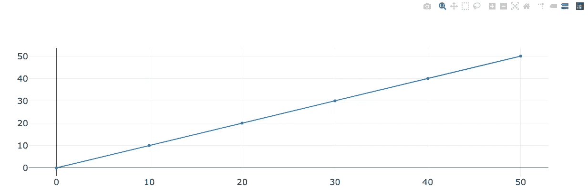
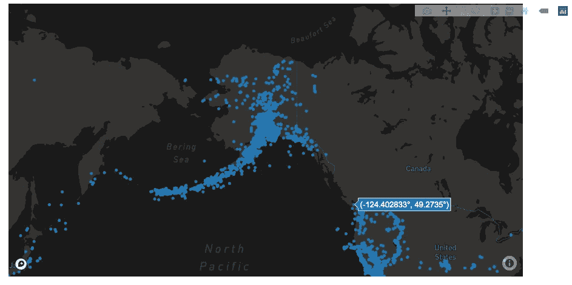
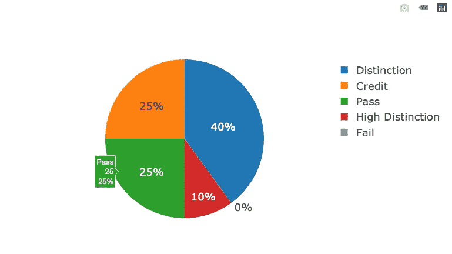
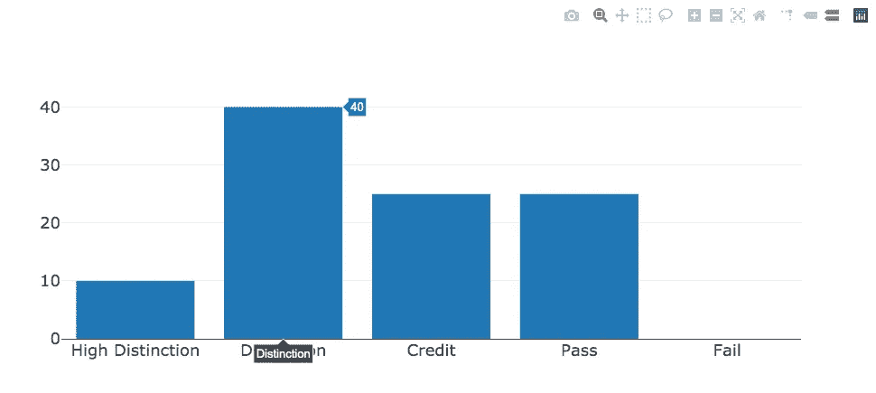
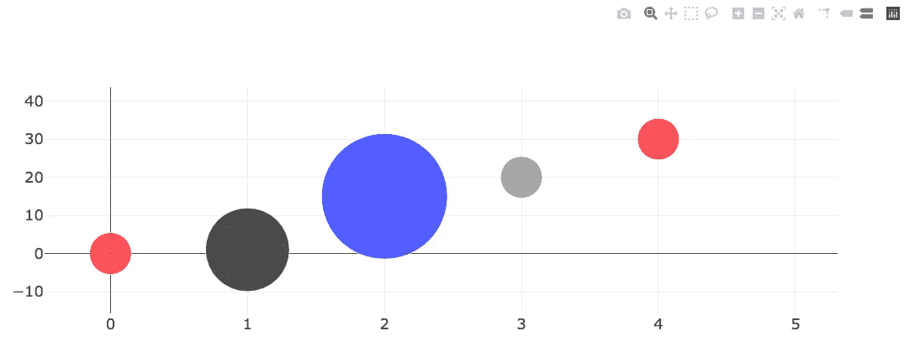

# 如何使用 Plotly.js 进行数据可视化

> 原文：<https://towardsdatascience.com/how-to-use-plotly-js-for-data-visualization-46933e1bbd29?source=collection_archive---------24----------------------->

## 从 40 多种图表类型中选择

卢克·切瑟在 Unsplash[上的照片](https://unsplash.com?utm_source=medium&utm_medium=referral)

在近年来，数据可视化已经成为医疗保健、非营利组织和许多其他部门决策的主要工具之一。通过使用数据可视化，如图表和地图，我们可以用图形表示数据。它帮助人们根据趋势和模式做出快速判断。

互联网上有许多数据可视化工具。在这些工具的广泛列表中， [plotly.js](https://plotly.com/javascript/) 就是其中之一。这是一个基于 [d3.js](https://d3js.org/) 和 [stack.gl](https://github.com/stackgl) 构建的 JavaScript 开源图形库。这个库提供了各种各样的图表类型，包括 3D 图表、图形和 SVG 地图。

我已经使用 plotly.js 创建了仪表板，通过其丰富的图形库中的交互式图表来可视化数据。与其他库相比，我更喜欢 Plotly.js，因为它易于使用，并且有健壮的[文档](https://plotly.com/javascript/plotlyjs-function-reference/)。从这篇文章中，你将学到一些 plotly.js 的基本概念和命令，它们将教会你如何可视化数据。

# 设置

首先，我们需要在 HTML 文件中添加 plotly.js。你可以[下载](https://cdn.plot.ly/plotly-latest.min.js)文件或者使用 [CDN](https://en.wikipedia.org/wiki/Content_delivery_network) 链接。这里，为了方便起见，我们将使用 CDN 链接。之后，我们需要一个名为 **test** 的空 DIV 来附加图表。最后，我们需要添加一些 JavaScript 代码来绘制图表。现在将下面的代码保存在一个 HTML 文件中，比如`test.html`。

通过在您的浏览器上加载这个文件，您可以看到一个如下图所示的线形图。如果您看不到任何内容，请尝试打开浏览器的开发人员控制台。它将帮助您调试问题。

折线图

现在让我们将脚本标签分解成单独的部分。首先，我们有包含散列的`data`数组。在散列中，我们有两个键值对`x`和`y`，分别代表`x-axis`和`y-axis`的值。接下来是一个`layout`散列，这里我们定义了图表的字体大小。`config`散列用于向图表添加额外的配置。因为我们希望图表具有响应性，所以我们将 responsive 设置为 true。您可以在此找到关于配置[的更多信息。现在我们需要将图表添加到 HTML 元素中。在这种情况下，它是一个`DIV with id test`。最后，我们可以使用`Plotly.newPlot`方法创建图表，方法是将 DIV DOM 元素、数据数组、布局和配置散列作为参数传递。](https://plotly.com/javascript/configuration-options/)

我们再来看几个例子。

## 地图

首先，我们需要定义数据 URL。`Plotly.d3.json`方法可以从提供的 URL 读取 JSON 数据。我们可以在`data`数组的散列中使用`type`键来配置图表类型。散列还接受`latitude`、`longitude`和`hoverinfo`数据。`hoverinfo`用于当悬停在地图坐标上时显示信息。这里我们显示的是纬度和经度信息。你可以在这里找到更多选项[。在`layout`散列中，我们有`mapbox`和`margin`。`mapbox`的选项不言自明。如果您正在寻找更多的边距设置，请查看此处的](https://plotly.com/javascript/reference/#scatter-hoverinfo)。`config`散列包含`mapboxAccessToken`和`responsive`密钥。你可以在这里从[获取令牌值，我们已经讲过了`responsive` key 的使用。](https://docs.mapbox.com/help/how-mapbox-works/access-tokens/)

通过在浏览器上运行上面的代码，我们可以看到如下图所示的地图。

地震数据

## 饼图

为了创建饼图，我们可以在`data`数组的散列中使用`type`键来配置图表类型。我们还需要定义每个切片的值。为此，我们需要使用`values`和`labels`作为键。

通过在浏览器上运行上面的代码，我们可以看到一个类似下面的饼状图。

学生成绩

## 条形图

为了创建条形图，我们可以在`data`数组的散列中使用`type`键来配置图表类型。我们还需要定义每个条形的值。为此，我们需要使用`x`和`y`作为键。

通过在浏览器上运行上述代码，我们可以看到如下所示的条形图。

学生成绩

# 气泡图

为了创建气泡图，我们可以在`data`数组的散列中使用`mode`键来配置模式类型。我们还需要定义每个圆的中心值。为此，我们需要使用`x`和`y`作为键。使用`size`键设置圆圈的大小。如您所见，最后一个圆不可见，因为我们没有提供大小。

通过在浏览器上运行上面的代码，我们可以看到一个类似下图的气泡图。

# 包裹

数据分析是许多企业的重要组成部分。当处理数据变得更容易时，我们可以改善我们的判断和决策，当我们有一种有效的方法来显示数据时，这是可能的。Plotly.js 是实现商业[的一个很好的工具。它可以帮助您发现隐藏的见解，否则使用传统方法很难发现。我希望这篇文章能帮助你开始使用 plotly.js。](https://github.com/plotly/plotly.js/blob/master/LICENSE)