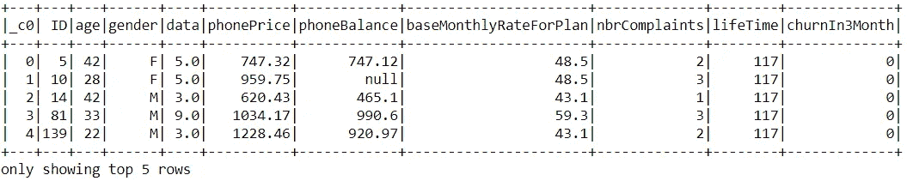
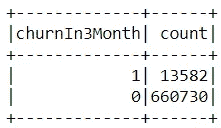
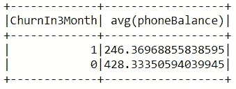
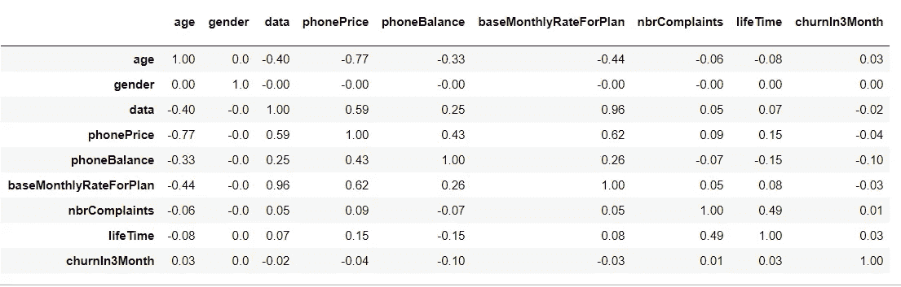
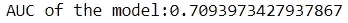
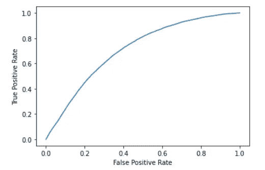
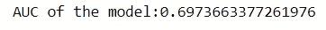

# 如何将 Pyspark 用于您的机器学习项目

> 原文：<https://towardsdatascience.com/how-to-use-pyspark-for-your-machine-learning-project-19aa138e96ec?source=collection_archive---------24----------------------->

## 使用 Pyspark 进行数据清理、EDA、特征工程和机器学习


来源:https://unsplash.com/photos/Q1p7bh3SHj8

Pyspark 是一个支持 Apache Spark 的 Python API，Apache Spark 是一个用于处理大数据分析的分布式框架。当您处理大型数据集时，这是一个令人惊叹的框架，它正在成为任何数据科学家的必备技能。

在本教程中，我将介绍如何使用 Pyspark 来做你习惯在 Kaggle 笔记本上看到的事情(清洁、EDA、特征工程和构建模型)。

我为一家电信公司使用了一个包含客户信息的数据库。目标是预测未来三个月哪些客户会离开(流失)。包含数据的 CSV 文件包含超过 800，000 行和 8 个特征，以及一个二进制变动变量。

> **这里的目标不是找到最佳解决方案。而是向您展示如何使用 Pyspark。**在这个过程中，我将尝试展示许多可用于您机器学习项目所有阶段的功能！

让我们首先创建一个 SparkSession，这是任何 Spark 功能的入口点。

```
import pyspark
from pyspark.sql import SparkSessionspark = SparkSession.builder.master("local[4]")\
       .appName("test").getOrCreate()
```

## 获取数据

以下是如何使用 Pyspark 读取 CSV 文件。

```
df=spark.read.csv('train.csv',header=True,sep= ",",inferSchema=True)
```

这是数据帧的样子。



## 清理数据

Pyspark.sql 模块允许您在 Pyspark 中做几乎任何可以用 sql 做的事情。

例如，让我们先清理一下数据。首先，如上图所示，我们有一些空值。我将删除所有包含空值的行。

```
df = df.na.drop()
```

然后，`when/otherwise` 函数允许您过滤一列，并根据每行中找到的内容分配一个新值。举个例子，我用 0 和 1 代替男性和女性作为性别变量。

```
from pyspark.sql.functions import when
df = df.withColumn("gender",when(df["gender"]=='M',0).otherwise(1))
```

## 探索性数据分析

一旦数据全部清理完毕，许多类似 SQL 的函数可以帮助分析数据。

例如，`groupBy`函数允许您对值进行分组，并为每个类别返回 count、sum 或其他值。让我们看看有多少数据点属于流失变量的每个类。

```
df.groupBy('churnIn3Month').count().show()
```



我们这里有不平衡的班级。虽然我不会在本教程中做任何事情，但在接下来的一个教程中，我将向您展示如何使用 Pyspark 处理不平衡的类，如欠采样、过采样和 SMOTE。

另一件有趣的事情是观察两组(离开的客户和没有离开的客户)之间某些特征的不同。我发现了一个有趣的结果。

```
**from** pyspark.sql.functions **import** avg
df.select("phoneBalance","churnIn3Month").\
          groupBy("ChurnIn3Month").agg(avg("phoneBalance"))
```



我们看到，离开的客户平均手机余额少得多，这意味着他们的手机更接近完全支付(这当然使他们更容易离开电话公司)。

现在，让我们来看一个相关矩阵。我使用 Pyspark 中的`correlation`函数创建了它。我也做了一点手脚，在这里用了熊猫，只是为了更容易地创造一些视觉上的东西。

```
from pyspark.ml.stat import Correlationx=df.columns[2:11]
corr_plot = pd.DataFrame()for i in x:
    corr=[]
    for j in x:
        corr.append(round(df.stat.corr(i,j),2))
    corr_plot = pd.concat([corr_plot,pd.Series(corr)],axis=1)corr_plot.columns=x
corr_plot.insert(0,'',x)
corr_plot.set_index('')
```



同样，`phoneBalance`与客户流失变量的相关性最强。

## 特征工程

考虑到上面的结果，我决定创建一个新变量，它将是`phoneBalance`变量的平方。下面是如何用 Pyspark 做到这一点。

```
from pyspark.sql.functions import col, pow
df = df.withColumn('phoneBalance2',pow(col('phoneBalance'),2))
```

`withColumn`函数允许您向 pyspark 数据框架添加列。超级有用！

# 机器学习

Pyspark 中的机器学习库肯定还没有达到 Scikit Learn 的标准。也就是说，你仍然可以用它做很多事情。

然而，你要做的第一件事是创建一个包含你所有特征的矢量。我们将使用的所有方法都需要它。

```
from pyspark.ml.feature import VectorAssemblerignore=['churnIn3Month', 'ID','_c0']
vectorAssembler = VectorAssembler(inputCols=[x for x in df.columns  
                  if x not in ignore], outputCol = 'features')new_df = vectorAssembler.transform(df)
new_df = new_df.select(['features', 'churnIn3Month'])
```

然后，让我们将数据分成训练集和验证集。

```
train, test = new_df.randomSplit([0.75, 0.25], seed = 12345)
```

好了，现在让我们建立一些模型。我将只展示几个模型，只是为了让您了解如何使用 Pyspark。

## 1.逻辑回归

```
from pyspark.ml.classification import LogisticRegressionlr = LogisticRegression(featuresCol = 'features', 
                         labelCol='churnIn3Month')
lr_model = lr.fit(train)
```

我们可以看看模型的 ROC 曲线。提醒一下，AUC(曲线下面积)越接近 1，模型就越能区分不同的类别。

```
import matplotlib.pyplot as pltplt.plot(lr_model.summary.roc.select('FPR').collect(),
         lr_model.summary.roc.select('TPR').collect())
plt.xlabel('False Positive Rate')
plt.ylabel('True Positive Rate')
plt.show()lr_model.summary.areaUnderROC
```



## 2.随机森林分类器

让我们再做一个模型，展示一旦数据以 Pyspark 的正确格式，即向量，拟合模型是多么容易。下面是如何创建一个随机森林模型。

```
from pyspark.ml.classification import RandomForestClassifierrf = RandomForestClassifier(featuresCol = 'features', labelCol = 
                            'churnIn3Month')
rf_model = rf.fit(train)
```

下面是如何获得模型的 AUC:

```
from pyspark.ml.evaluation import BinaryClassificationEvaluatorpredictions = rf_model.transform(test)
auc = BinaryClassificationEvaluator().setLabelCol('churnIn3Month')
print('AUC of the model:' + str(auc.evaluate(predictions)))
```



这两个模型非常相似，但结果表明，在我们的情况下，逻辑回归模型略好。

## **结论**

Scikit Learn 非常棒，只要您不处理太多数据，它的表现就会令人钦佩。可悲的是，你的项目越大，你就越有可能需要 Spark。幸运的是，正如您在这里看到的，开始使用 Pyspark 的学习曲线并不太陡，尤其是如果您熟悉 Python 和 SQL 的话。在我看来，Pyspark 的主要弱点是数据可视化，但希望随着时间的推移，这种情况会有所改变！

这就是了。对于想用 Pyspark 进行机器学习的人来说，这篇文章应该是一个很好的起点。我希望你喜欢它，并感谢阅读！