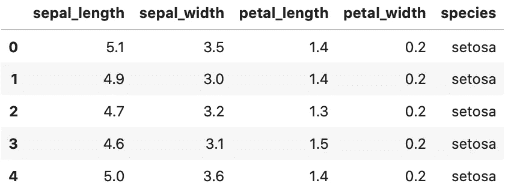
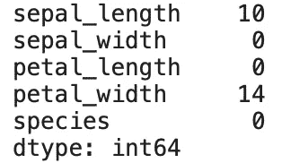
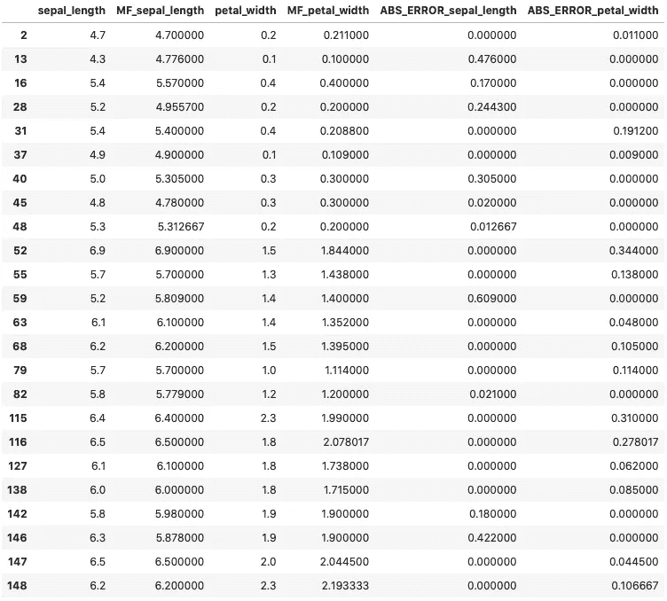

# 如何使用 Python 和 MissForest 算法估算缺失数据

> 原文：<https://towardsdatascience.com/how-to-use-python-and-missforest-algorithm-to-impute-missing-data-ed45eb47cb9a?source=collection_archive---------6----------------------->

## 使用随机森林处理丢失数据的分步指南

缺失值填补是数据科学和机器学习中的一个古老问题。技术从简单的均值/中值插补发展到基于机器学习的更复杂的方法。方法选择对最终结果有多大影响？事实证明，**很多**。

由[岩田良治](https://unsplash.com/@ryoji__iwata?utm_source=unsplash&utm_medium=referral&utm_content=creditCopyText)在 [Unsplash](https://unsplash.com/s/photos/puzzle?utm_source=unsplash&utm_medium=referral&utm_content=creditCopyText) 上拍摄的照片

如果你更喜欢视频，这里也有适合你的东西:

缺失森林视频的缺失数据填补

让我们弄清楚一些事情——缺失值插补通常是特定于域的。例如，由于客户没有使用某些服务，数据集可能包含缺失值，因此插补是错误的做法。

此外，像均值/中值/众数插补这样的简单技术通常效果不佳。原因很容易解释。**极值**会影响数据集中的平均值，尤其是平均值。此外，用相同的值填充 10%或更多的数据听起来不太妙，至少对于连续变量来说是这样。

这篇文章的结构如下:

*   KNN 插补的问题
*   什么是 MissForest？
*   实践中的失误
*   错误森林评估
*   结论

# KNN 插补的问题

甚至一些基于机器学习的插补技术也有问题。例如，KNN 插补法是简单平均插补法的一个很好的开端，但也带来了一些问题:

*   您需要为 K 选择一个值——这对于小型数据集来说不成问题
*   对异常值很敏感，因为它使用表面下的欧几里得距离
*   不能应用于分类数据，因为需要某种形式的数字表示转换
*   可能**计算量很大**，但这取决于数据集的大小

不要误解我的意思，我会选择 KNN 估算法，而不是简单的平均值，但仍然有更好的方法。如果你想了解更多关于这个话题的信息，这里有我最近的一篇文章:

 [## 如何用 Python 和 KNN 处理缺失数据

### 使用机器学习算法处理缺失数据

towardsdatascience.com](/missing-value-imputation-with-python-and-k-nearest-neighbors-308e7abd273d) 

# 什么是 MissForest？

MissForest 是一种基于机器学习的插补技术。它使用随机森林算法来完成任务。它基于迭代方法，并且在每次迭代中生成的预测更好。你可以在下面阅读更多关于算法的理论，因为 [Andre Ye](https://medium.com/@andre_ye) 做了很好的解释和漂亮的视觉效果:

 [## MissForest:最佳缺失数据插补算法？

### 告别 KNN-估算

towardsdatascience.com](/missforest-the-best-missing-data-imputation-algorithm-4d01182aed3) 

这篇文章更多的是针对**的实际应用**，所以我们不会过多的钻研理论。总的来说，误盗非常好，因为:

*   不需要大量的数据准备，因为随机森林算法可以确定哪些特征是重要的
*   不需要任何调整—就像 K-最近邻中的 K
*   不关心分类数据类型—随机森林知道如何处理它们

接下来，我们将深入研究一个实际的例子。

# 实践中的失误

我们将使用[虹膜数据集](https://gist.githubusercontent.com/curran/a08a1080b88344b0c8a7/raw/0e7a9b0a5d22642a06d3d5b9bcbad9890c8ee534/iris.csv)进行实践部分。数据集不包含任何缺失值，但这是关键所在。我们将随机产生缺失值，因此我们可以稍后评估 MissForest 算法的性能。

在我忘记之前，请从终端执行`pip install missingpy`来安装所需的库。

太好了！接下来，让我们导入 Numpy 和 Pandas，并读入提到的 Iris 数据集。我们还将制作数据集的**副本**,以便稍后我们可以使用真实值进行评估:

代码片段 1 —导入和数据集加载

作者图片

好了，现在让我们制作两个唯一随机数列表，范围从零到虹膜数据集的长度。通过一些熊猫操作，我们将根据随机生成的索引位置，用 NaNs 替换`sepal_length`和`petal_width`的值:

代码片段 2 —缺失数据生成

作者图片

如您所见，`petal_width`只包含 14 个缺失值。这是因为随机化过程产生了两个相同的随机数。这不会给我们带来任何问题，因为最终缺失值的数量是任意的。

下一步是，嗯，进行插补。我们还必须从图片中移除**目标变量**。方法如下:

代码片段 3—缺失数据插补

就是这样—缺失值现在被估算！

但是我们如何评价这该死的东西呢？这是我们接下来要回答的问题。

# 错误森林评估

为了执行评估，我们将使用我们拷贝的、未接触的数据集。我们将添加两个额外的列，表示来自 MissForest 算法的估算列——都用于`sepal_length`和`petal_width`。

然后我们将创建一个新的**数据集**，只包含这两列——原始状态和估算状态。最后，我们将计算绝对误差，以便进一步检查。

代码如下:

代码片段 4 — MissForest 评估

如您所见，代码的最后一行只选择了进行插补的行。让我们来看看:

作者图片

所有的绝对误差都很小，在原始平均值的一个标准偏差之内。如果不考虑增加的小数位，估算值看起来很自然。如果需要，可以很容易地修复。

# 离别赠言

这是一篇关于用机器学习方法进行缺失值插补的简短扼要的文章。你已经了解了为什么机器学习在这个领域优于简单的平均水平，以及为什么 MissForest 优于 KNN imputr。

我希望这对你来说是一本好书。保重。

*喜欢这篇文章吗？成为* [*中等会员*](https://medium.com/@radecicdario/membership) *继续无限制学习。如果你使用下面的链接，我会收到你的一部分会员费，不需要你额外付费。*

 [## 通过我的推荐链接加入 Medium-Dario rade ci

### 作为一个媒体会员，你的会员费的一部分会给你阅读的作家，你可以完全接触到每一个故事…

medium.com](https://medium.com/@radecicdario/membership) 

*原载于 2020 年 11 月 5 日 https://betterdatascience.com***。**