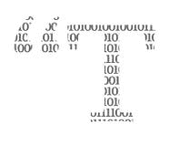

# 如何有效地使用 Python 类

> 原文：<https://towardsdatascience.com/how-to-use-python-classes-effectively-10b42db8d7bd?source=collection_archive---------5----------------------->

## 当一堆功能对你来说是更好的选择时


做事的方式应该只有一种。但是上课的时候会很混乱。照片由[妮可·沃尔夫](https://unsplash.com/@joeel56?utm_source=unsplash&utm_medium=referral&utm_content=creditCopyText)在 [Unsplash](https://unsplash.com/s/photos/code?utm_source=unsplash&utm_medium=referral&utm_content=creditCopyText) 拍摄

“T这里应该只有一种——最好只有一种——显而易见的方法”，Python 的[禅如是说。然而，在有些领域，即使是经验丰富的程序员也在争论什么是正确或错误的做事方式。](https://www.python.org/dev/peps/pep-0020/)

其中一个领域是 Python 类。从面向对象编程中借鉴来的，它们是非常漂亮的构造，可以在编码时扩展和修改。

最大的问题是，类会使你的代码比必要的更复杂，更难阅读和维护。那么什么时候应该使用类，什么时候应该使用标准函数呢？

这个故事是对这个问题的更深入的探究。所以如果你很急，你可以跳过下面的两个部分，直接向下滚动到第*部分，什么时候使用类*和*部分，当类不是一个好主意*的时候。

# Python 类:非常基础

类是允许您将数据结构和过程分组到一个地方的对象。例如，假设您正在编写一段代码来组织服装店的库存。

您可以创建一个类，获取商店中的每件衣服，并存储关键数量，如衣服的类型、颜色和尺寸。我们还将添加一个选项来添加价格。

```
class Clothing(object):
    def __init__(self, type, color, size, price=None):
        self.type = type
        self.color = color
        self.size = size
        self.price = price
```

现在，我们可以定义该类的各种实例，并将它们组织起来:

```
bluejeans = Clothing("jeans", "blue", 12)
redtshirt = Clothing("t-shirt", "red", 10, 10)
```

我们将在类的定义之后添加这两行没有缩进的内容。这段代码将会运行，但是它不会做太多。我们可以在类定义中的`__init__`函数下直接添加一个设置价格的方法:

```
 def set_price(self, price):
 *"""Set the price of an item of clothing."""*        self.price = price
        print(f"Setting the price of the {self.color} {self.type} to ${price}.")
```

我们还可以添加一些例程来告诉我们价格，或者通过降低价格来促销商品:

```
 def get_price(self):
 *"""Get the price of an item of clothing, if price is set."""*        try:
            print(f"The {self.color} {self.type} costs ${self.price}.")
        except:
            print(f"The price of the {self.color} {self.type} hasn't been set yet!") def promote(self, percentage):
 *"""Lower the price, if initial price is set."""*        try:
            self.price = self.price * (1-percentage/100)
            print(f"The price of the {self.color} {self.type} has been reduced by {percentage} percent! It now only costs ${self.price:.0f}.")
        except:
            print(f"Oops. Set an initial price first!")
```

现在，我们可以在初始化该类实例的行之后添加一些方法调用:

```
print("blue jeans -------------------")
bluejeans.promote(20)
bluejeans.set_price(30)
bluejeans.get_price()print("red t-shirt ------------------")
redtshirt.get_price()
redtshirt.promote(20)
```

如果运行该脚本，输出将如下所示:

```
blue jeans -------------------
Oops. Set an initial price first!
Setting the price of the blue jeans to $30.
The blue jeans costs $30.
red t-shirt ------------------
The red t-shirt costs $10.
The price of the red t-shirt has been reduced by 20 percent! It now only costs $8.
```

如果你需要添加更多的例程，你可以把它们放在类定义中。

最棒的是，你可以添加和删除任意多的对象。删除属性的过程如下:

```
del redtshirt.price 
```

如果你想删除整个对象，你可以这样做:

```
del redtshirt
```

所有这些都是整洁、简单和可扩展的。试着用标准函数来实现，你可能会遇到更多的麻烦。

从理论的角度来看，有更多的理由说明 Python 类在许多情况下是一个美丽的概念。


正确使用时，类是强大的概念。Muhannad Ajjan 在 [Unsplash](https://unsplash.com/s/photos/code?utm_source=unsplash&utm_medium=referral&utm_content=creditCopyText) 上拍摄的照片

# 理论上来说，课堂是很神奇的

## 关注点分离:给每个类分配自己的工作

如果你参加过计算机科学的讲座，很可能你已经偶然发现了“关注点分离”的原则。这基本上意味着你把你的程序分成不同的部分来处理不同的信息。

从本质上来说，类允许你遵守这个原则。换句话说，当你开始写一个程序，并且你在考虑类的时候，你可能在构建一个好的架构，因为你确保了每个问题都有自己的位置。

## 解耦:使维护更容易

在类中思考不仅有助于保持特性的分离，还能使它们相互独立。这不仅能保持物品的整洁；维护起来也方便了很多。

假设您在一个类中发现了一个 bug:您可以修复这个 bug，而不用担心其他类，因为它们之间没有联系。同样，你可以添加新的特性，而不用担心会与软件的其他部分纠缠在一起。

## 实现隐藏:定义程序员能使用什么，不能使用什么

通过使用类，您可以确保方法只用于一组数据。这增加了代码的安全性，因为您不太可能在不属于它们的地方使用函数。

## 封装:改变代码，但不改变用户体验

将数据结构和方法存储在一起也称为封装。由于所有这些对最终用户都是隐藏的，这允许您修改数据结构和方法，而不会损害用户体验。

例如，您可能需要构建一个非常复杂的方法。封装的优点是用户不需要理解任何复杂性，因为他们可以像使用黑盒一样使用它。

不使用类来构建黑盒函数是完全可能的。然而，对于类，这种类型的功能实际上是可以保证的。

## 继承:编写数据结构的 DNA

有了类，你只需要定义一个数据结构一次。当定义一个类的实例时，该实例自动继承给定的结构。

此外，继承使得删除或修改实例或整个类变得非常容易。这使得整个结构更加灵活。

[](/the-ultimate-guide-to-writing-better-python-code-1362a1209e5a) [## 编写更好的 Python 代码的终极指南

### 让你的软件更快、更易读和更易维护并不需要这么难

towardsdatascience.com](/the-ultimate-guide-to-writing-better-python-code-1362a1209e5a) 

# 何时使用类

有了这么多的优点，用一个类来做任何事情都很有诱惑力。然而，在实践中，有些情况下使用类非常有意义，而有些情况下则没有意义。

## 将数据和方法组合在一起

根据经验，当您有一组具有特定结构的数据，并且希望对其执行特定的方法时，请使用类。然而，只有在代码中使用多种数据结构时，这才是有效的。

如果你的整个代码不会处理一个以上的结构。如果你只有一种数据结构，那就真的要看手头的问题了。你可以通过有没有上课勾画出你的程序来得到一个大概的想法；通常你会很快发现哪个解决方案更简单。

## 当心全局变量

另一个经验法则是[这个](https://www.reddit.com/r/learnpython/comments/6wsjt9/i_still_dont_get_when_to_use_class_vs_functions/):如果你想使用全局变量来访问数据，定义一个类并构建一个方法来访问每一段数据可能更容易。


上课并不总是一个好主意。照片由[克里斯蒂娜@ wocintechchat.com](https://unsplash.com/@wocintechchat?utm_source=unsplash&utm_medium=referral&utm_content=creditCopyText)在 [Unsplash](https://unsplash.com/collections/10869614/people-working?utm_source=unsplash&utm_medium=referral&utm_content=creditCopyText) 上拍摄

# 当上课不是个好主意时

## 对堆使用 heapq

与堆栈不同，[堆](https://gribblelab.org/CBootCamp/7_Memory_Stack_vs_Heap.html)是一种更灵活的存储数据的方式，因为它有无限的内存大小，并允许您调整变量的大小。另一方面，使用堆访问变量速度较慢，并且您必须自己管理内存。

如果一个堆更适合你的目的，你不需要定义一个类。Python 的内置`heapq`，或者堆队列算法，为你做了[工作](https://devblogs.microsoft.com/python/idiomatic-python-functions-versus-classes/)。

## 考虑使用 functools.partial()

您可能很想使用一个类，因为您经常用相同的参数调用一个函数。在大多数情况下，用`functools.partial()`来代替会更好。

实现起来相当简单。假设您有一个将两个值相乘的函数，但是您一直使用它来将两个值加倍。为了避免重复代码，您可以这样写:

```
from functools import partialdef multiply(x,y):
    return x * ydoubling = partial(multiply,2)
print(doubling(4))
```

比定义一个新类简单多了！

## “面向未来”的课程

一些程序员痴迷于类，因为它们是如此的灵活和可扩展。这就是为什么，即使在声誉良好的公司和经验丰富的开发人员中，您也可能会遇到这样的代码:

```
class newclass:
    """defining a new class to do something awesome"""
    pass
```

其背后的思想是，随着代码的增长，无论新的数据结构和方法是什么，都可能需要这个类。但这不是好习惯！

猜猜这三行代码是做什么的？完全没有。这些行并不难编码。如果你认为你以后还需要另一门课，并且你真的认为你将来会忘记它，你可以留下这样的评论:

```
# initiate a new class here if needed for purpose XY
```

尽管你想让你的代码具有可扩展性和不傻，初始化一个什么都不做的类通常不是一个好主意。

[](/7-reasons-why-programmers-burn-out-44a40bf8948d) [## 程序员精疲力竭的 7 个原因

### 和 7 种解决方法

towardsdatascience.com](/7-reasons-why-programmers-burn-out-44a40bf8948d) 

# 底线是:Python 类是一把双刃剑

毫无疑问，阶级是一个强大的概念。正确使用，它们可以使你的代码更整洁，更可读和可维护。

但是它们被过度使用了。如果使用不当，它们会污染你的代码，直到你什么都不懂。

有时，特别是在简单的程序中，你可以使用一个类或一组通用函数，代码在长度和复杂性上非常相似。随着程序变得越来越复杂，差异变得越来越突出。

从这个意义上来说，Python 的禅坚持了它的结论:大多数时候，确实只有一种好的做事方式，不管有没有类。然而，这并不总是完全显而易见的。困难的部分是认识到哪条路是好的。

*如果你有其他关于 Python 或其他编程语言的问题，请在评论中告诉我！感谢* [*卢卡斯·苏亚雷斯*](https://medium.com/u/3d4826ca4d12?source=post_page-----10b42db8d7bd--------------------------------) *询问何时使用类，何时不使用类的技巧。*