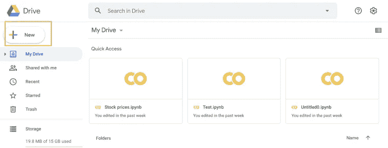
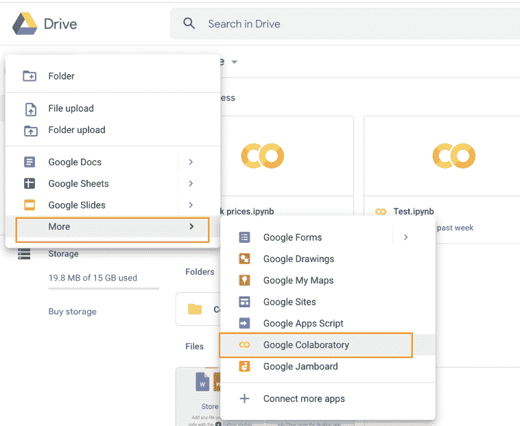
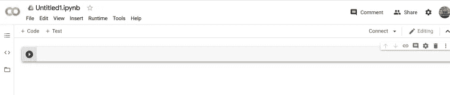
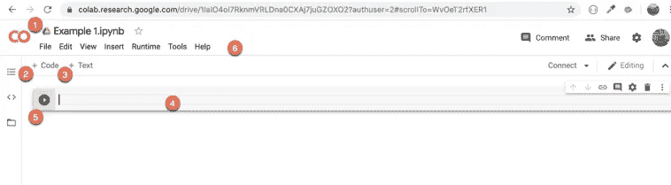
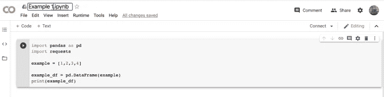
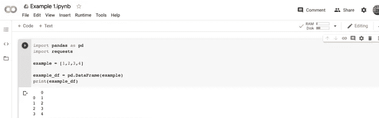

# 如何在 iPad 上使用 Python

> 原文：<https://towardsdatascience.com/how-to-use-python-on-ipad-9a9bd97c40?source=collection_archive---------3----------------------->

## 了解如何使用 iPad 创建 Python 脚本

对于那些一直在阅读我的关于 Python 金融的博客和观看我的视频的 T2 的人，我想与你们分享如何使用 iPad 用 Python 编程。

照片由 [bongkarn thanyakij](https://www.pexels.com/@bongkarn-thanyakij-683719?utm_content=attributionCopyText&utm_medium=referral&utm_source=pexels) 从 [Pexels](https://www.pexels.com/photo/person-holding-white-ceramic-mug-while-writing-on-tablet-3787817/?utm_content=attributionCopyText&utm_medium=referral&utm_source=pexels)

# 为什么 iPad 要用 Python？

你们中的一些人可能会问，为什么我要把笔记本电脑换成 iPad 来编码呢？从我的角度来看，我不认为 iPad 会取代笔记本电脑进行编码。至少短期内不会。然而，在编码方面，它可以作为笔记本电脑的一个很好的补充。

例如，想象一下，你要去湖边的某个地方度周末，而你不想带着电脑和充电器。在这种情况下，如果你想在周末假期继续写代码，唯一的选择就是带上 iPad。

# 如何在 iPad 上使用 Python 编码？

根据我的经验，到目前为止，我发现在 iPad 上使用 Python 的最好方式是通过 [Google Colab](https://colab.research.google.com/notebooks/intro.ipynb) 。这是一个免费工具，所有拥有 Gmail/Google 账户的人都可以使用。

*Google Colab* 提供与 Jupyter notebook 相同的功能。 *Colab* 允许您在浏览器中编写和执行 Python，主要优势是:

*   **不需要预先设置。**它预装了大量的软件包。即 Pandas、Numpy、TensorFlow、Scikit-learn、Matplotlib 等众多。我们可以简单地通过导入包来使用它们。
*   **脚本在所有设备中都可用**。也就是说，可以在笔记本电脑和 iPad 上访问和编辑相同的脚本。
*   **免费访问 GPU。**
*   代码和脚本可以很容易地与他人分享。创建的脚本可以上传到 Github，也可以作为*下载到本地磁盘。py 扩展名。*
*   最棒的是，它完全免费，让我们可以在 iPad 上用 Python 编程。

总而言之，我认为 Google Colab 是一个很好的工具，可以用来进行金融分析或任何其他数据科学项目。我在 Medium 上发布的所有文章都是使用 Google Colab 或 Jupyter Notebook 完成的。这意味着它们都可以用 iPad 复制。

## 如何设置 Google Colab？

为了开始在 iPad 上使用 Python，我们需要有一个 Google drive 帐户。 [Google Drive 提供免费云存储供个人使用。](https://www.google.com/drive/)你可以在这里创建一个免费账户[。](https://www.google.com/drive/)

创建帐户后，要在 iPad 中开始编码，需要遵循以下步骤:

1.  使用浏览器登录 iPad 中的 Google Drive。然后，通过点击 *New* 创建一个新的 Colab 文档:

2.选择*更多*和*谷歌联合实验室。*如果您在列表中没有看到 Google 协同实验室，请点击*连接更多应用*将其安装到您的 Google Drive 中。

3.一个新的 *Google Colab* 文档将会打开，我们可以在其中添加代码或文本:

4.以下是文件的主要部分。单击 1 重命名文档。2 和 3 允许您为编码或简单文本编辑添加新的单元格。4 是我们可以输入 Python 代码的单元格。一旦脚本准备就绪，单击 5 运行该单元格中的代码。最后，使用工具栏(6)保存或下载您的代码。

5.开始输入您的代码。下面以一个简单的例子来创建一个熊猫数据框架:

6.点击*播放*按钮，运行单元格以执行代码。结果显示在单元格下方:

# 包扎

正如我们所看到的，在 iPad 上开始使用 Python 是非常容易的。然而，出于两个原因，我不认为我的 iPad 会取代我的笔记本电脑来完成我的 Python 项目。：

*   首先，也是最重要的，对我来说，用 iPad 屏幕键盘写代码效率非常低。与使用普通键盘相比，我的速度更慢，也更容易出错。如果使用 iPad Magic Keyboard 的体验有所改善，我会在以后的帖子中分享我的体验。
*   第二个原因是，与我的笔记本电脑或台式电脑相比，我的 iPad 屏幕较小。

然而，有时，特别是当我不得不旅行时，我用我的 iPad 进行 Python 编码，它的工作就像我在计算机中编码一样。请随意发表您的评论，分享您使用 iPad 编码的经验，以及您使用的是哪一款应用程序。

我还有一个 Youtube 视频短片，是关于如何用 iPad 用 Python 编程的:

如何使用 iPad 编写 Python 代码

*原载于 2020 年 5 月 24 日 https://codingandfun.com**T21*[。](https://codingandfun.com/how-to-use-python-on-ipad/)