# 如何使用 Python Seaborn 进行探索性数据分析

> 原文：<https://towardsdatascience.com/how-to-use-python-seaborn-for-exploratory-data-analysis-1a4850f48f14?source=collection_archive---------17----------------------->

## 通过直方图、热图、散点图、条形图等浏览示例数据集

来源: [Unsplash](https://unsplash.com/photos/z55CR_d0ayg)

这是一个使用 **Python** 中 **seaborn** 库进行**探索性数据分析(EDA)** 的教程。

EDA 是数据分析(或机器学习/统计建模)中除了[Python 中的数据清洗:终极指南(2020)](https://www.justintodata.com/data-cleaning-python-ultimate-guide/) 之外的另一个关键过程。

在本指南中，您将发现(通过示例):

*   如何使用 **seaborn** Python 包生成有用且漂亮的可视化效果，包括直方图、条形图、散点图、箱线图和热图。
*   如何**用不同的图探索单变量、多变量数值和分类变量**。
*   如何**发现多个变量之间的关系**。
*   更多。

我们开始吧！

# 什么是探索性数据分析(EDA)，为什么？

> **探索性数据分析** ( **EDA** )是一种分析数据集以总结其主要特征的方法，通常采用可视化方法。
> 
> 可以使用或不使用统计模型，但 EDA 主要是为了查看数据可以告诉我们什么，而不仅仅是正式的建模或假设测试任务。
> 
> [维基百科](https://en.wikipedia.org/wiki/Exploratory_data_analysis)

在进一步分析或建模之前探索数据是很重要的。在这个过程中，我们可以从数据集获得洞察的概览；我们可以发现不明显的趋势、模式和关系。

# 什么是 seaborn？

统计数据可视化是一个流行的 Python 库，用于执行 EDA。

它基于 [matplotlib](https://matplotlib.org/) 并提供了一个高级接口，用于绘制有吸引力且信息丰富的统计图形。

在这篇文章中，我们将使用一个[清理过的 YouTube 数据集](https://github.com/liannewriting/youtube-data-sydney-eda)作为例子。

在我们之前的文章[如何利用机器学习技术获得更多的 YouTube 浏览量](https://www.justintodata.com/get-more-youtube-views-with-machine-learning/)中，我们就如何基于同一数据集获得更多的浏览量提出了建议。

在探索之前，让我们将数据读入 Python 作为数据集 *df* 。

df 包含 729 行和 60 个变量。它为[悉尼的 YouTube 频道](https://www.youtube.com/channel/UCVQJZE_on7It_pEv6tn-jdA/featured)内的每个视频录制不同的功能，例如:

*   *浏览量*:视频的浏览量
*   *时长*:视频/健身程序的时长，以分钟为单位
*   *卡路里*:视频中健身过程中消耗的卡路里数
*   *days_since_posted* :视频发布到现在的天数
*   *日期*:视频/锻炼发布的日期
    悉尼几乎每天都会发布一个视频/锻炼
*   *健身程序类型*:视频关注的健身程序类型

同样，你可以在[如何利用机器学习技术获得更多 YouTube 浏览量](https://www.justintodata.com/get-more-youtube-views-with-machine-learning/)中找到更多细节。我们在这里只使用这个数据集。

# 单变量分析:数值变量

首先，让我们来探讨数值单变量。

我们创建 *df_numeric* 只是为了包含 7 个数字特征。

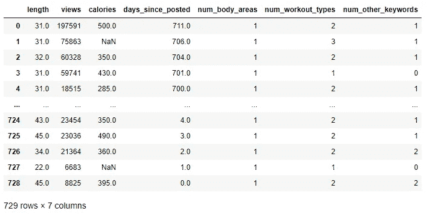

## 直方图:单一变量

[直方图](https://en.wikipedia.org/wiki/Histogram)是我们最喜欢的图形之一。

> 直方图**是数字数据分布的近似表示。**
> 
> 要构建直方图，第一步是“分格”(或“存储桶”)值的范围，即将整个值范围分成一系列区间，然后计算每个区间内有多少个值。
> 
> [维基百科](https://en.wikipedia.org/wiki/Histogram)

Seaborn 的函数 [distplot](https://seaborn.pydata.org/generated/seaborn.distplot.html) 有以下选项:

*   *箱*:箱设置
    用不同的箱设置绘制变量以发现模式很有用。如果我们不设置这个值，库会为我们找到一个有用的默认值。
*   *kde* :是否绘制高斯[核密度估计](https://en.wikipedia.org/wiki/Kernel_density_estimation)
    这有助于估计连续随机变量的概率密度函数的形状。更多细节可以在 seaborn 的页面上找到。
*   *地毯*:是否在支撑轴
    上绘制[地毯图](https://en.wikipedia.org/wiki/Rug_plot)这将在每个观察点绘制一个小的垂直勾。它有助于了解变量值的确切位置。

让我们先来看一个变量:length，它代表视频的长度。

我们可以在下面的图中看到 kde 线和地毯贴。

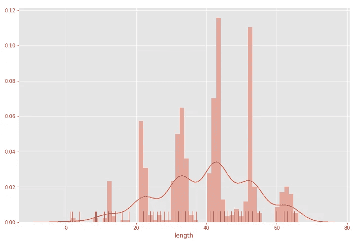

悉尼频道的视频通常长度为 30、40 或 50 分钟，呈现多模态模式。

## 直方图:多个变量

通常，我们希望将多个数值变量可视化并一起查看。

我们构建下面的函数 *plot_multiple_histograms* 来绘制特定变量组的直方图。

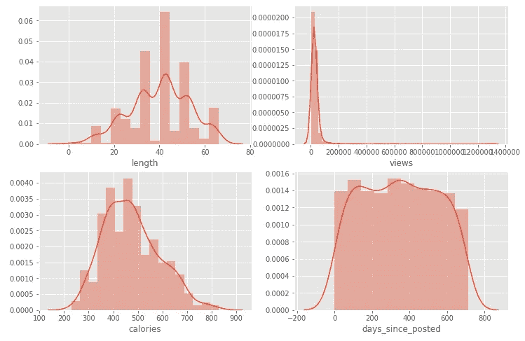

我们可以看到，不同的变量表现出不同形状的分布，异常值，偏度等。

# 单变量分析:分类变量

接下来，让我们看看分类单变量。

## 条形图:单变量

[条形图](https://en.wikipedia.org/wiki/Bar_chart)(或 seaborn 的计数图)是分类变量版本的直方图。

> **条形图**或**条形图**是一种图表或图形，用矩形条表示分类数据，矩形条的高度或长度与它们所代表的值成比例。
> 
> 条形图显示离散类别之间的比较。
> 
> [维基百科](https://en.wikipedia.org/wiki/Bar_chart)

首先，让我们选择分类(非数字)变量。

我们绘制了可变*区域*的条形图，该区域代表健身程序视频关注的身体区域。

这些视频针对了许多领域。不放大就很难阅读。尽管如此，我们可以看到这些视频中超过一半(超过 400 个)集中在“完整”的身体部位；第二个最受关注的领域是“ab”。

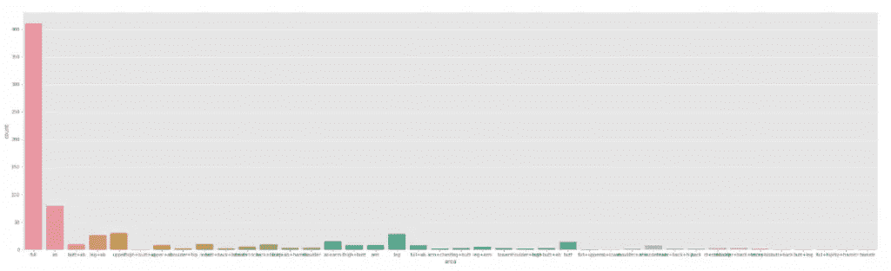

## 条形图:多个变量

此外，我们创建一个函数*plot _ multiple _ count plots*来一次绘制多个变量的条形图。

我们用它来绘制一些指标变量如下。

is _ { } _ 区域是不同身体区域的指示变量。例如，当锻炼集中在臀部时，is_butt_area == True，否则为 False。

is _ { } _ 健身程序是不同健身程序类型的指示变量。例如，当锻炼侧重于力量时，is_strength_workout == True，否则为 False。

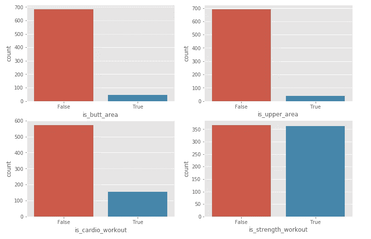

# 多变量分析

在逐一探究了变量之后，让我们一起来看看多个变量。

不同的图可以用来探索不同变量组合之间的关系。

在最后一节中，您还可以找到一种用于*测试多个变量*之间关系的建模方法。

## 散点图:两个数值变量

首先，让我们看看如何发现两个数值变量之间的关系。

如果我们想知道锻炼时间如何影响观看次数，该怎么办？

我们可以用散点图( [relplot](https://seaborn.pydata.org/generated/seaborn.relplot.html) )来回答这个问题。

> **散点图**使用笛卡尔坐标来显示一组数据的典型的两个变量的值。如果点被编码(颜色/形状/大小)，可以显示一个额外的变量。
> 
> 数据显示为点的集合，每个点的一个变量的值决定水平轴上的位置，另一个变量的值决定垂直轴上的位置。
> 
> [维基百科](https://en.wikipedia.org/wiki/Scatter_plot)

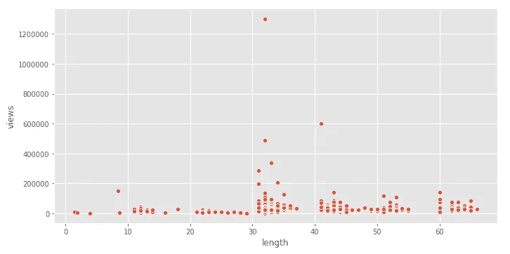

我们可以看到，更受欢迎的视频长度往往在 30 到 40 分钟之间。

## 条形图:两个分类变量

如果我们想知道两个分类变量之间的关系呢？

让我们来看看视频中最常见的 6 个区域(*区域 2* )和最常见的 4 种健身程序类型(workout_type2)。

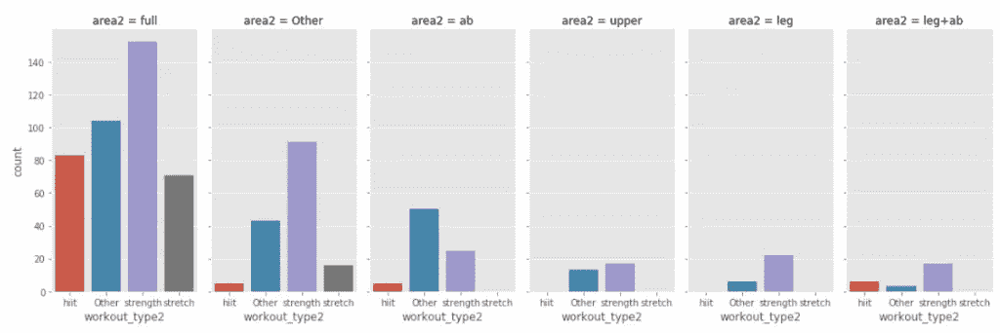

我们可以看到，视频中最常见的是“全面”的身体“力量”训练。

## 箱线图:数值和分类变量

[盒状图](https://en.wikipedia.org/wiki/Box_plot)是比较类别组时有用的可视化工具。

> **盒图** ( **盒须图**)是一种基于五个数字汇总显示数据集的标准化方式:最小值、最大值、样本中值、第一个和第三个四分位数。
> 
> [维基百科](https://en.wikipedia.org/wiki/Box_plot)

我们可以使用并排箱线图来比较分类变量类别中的数值变量。

悉尼的视频在一周的特定日子里会有更多的浏览量吗？

让我们画出*星期几*和视图。

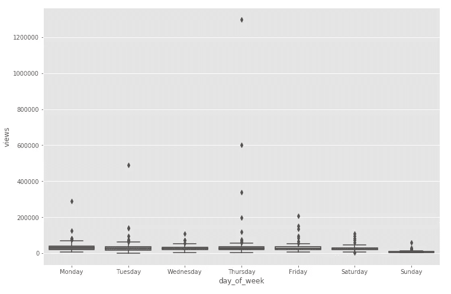

这很有趣，但由于离群值的原因很难看到。让我们移除它们。

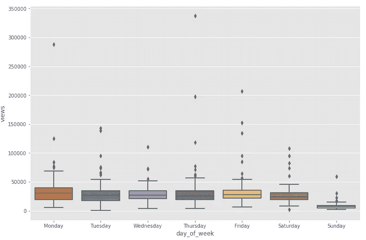

我们可以看到，周一的视频往往比其他日子有更多的浏览量。而周日视频的浏览量最少。

## 群集图:数值和分类变量

看待同一个问题的另一种方式是群体图。

> 一个**群集图**是一个分类散点图，其中的点被调整(仅沿分类轴)以使它们不重叠。
> 
> 这更好地表示了值的分布。
> 
> [seaborn 文档](https://seaborn.pydata.org/generated/seaborn.swarmplot.html)

当我们想要显示所有的观察结果以及一些基本分布的表示时，群图是对盒图的很好的补充。

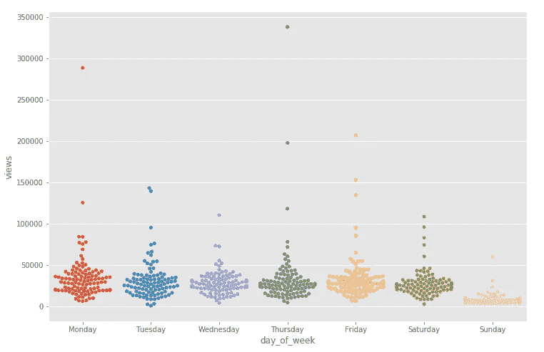

对于较大的数据集来说，群集图会有太多的点，但对于较小的数据集来说，这样做很好。

## 箱线图组:数值和分类变量

对于某些锻炼类型，一周中某些天的观看率会更高吗？

要回答这个问题，需要两个分类变量(锻炼类型、星期几)和一个数字变量(视图)。

让我们看看如何将这个问题的答案形象化。

我们可以使用面板箱线图( [catplot](https://seaborn.pydata.org/generated/seaborn.catplot.html) )将三个变量一起可视化。

catplot 有助于使用几种可视化表示中的一种来显示数值变量与一个或多个分类变量之间的关系。

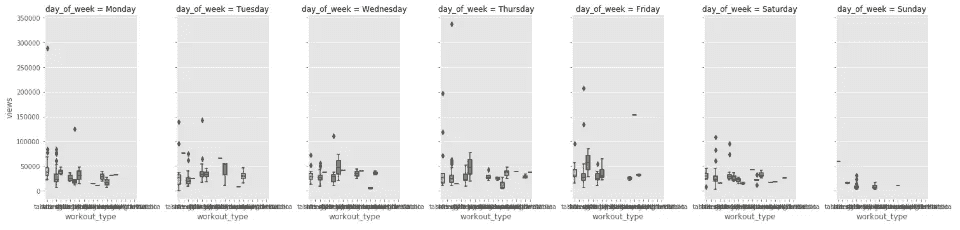

这是相当混乱的太多种类的锻炼类型。

根据锻炼类型的分布，我们将除“力量”、“hiit”、“伸展”、“有氧运动”之外的其他类别归为“其他”。

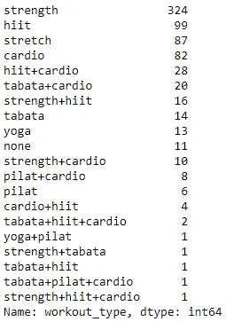

此外，我们删除了离群值，使图形更加清晰。

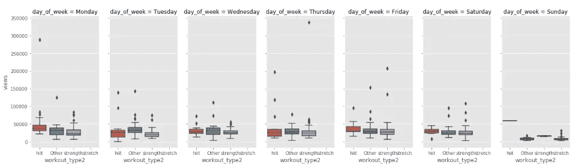

我们可以注意到这样的事情:

*   “伸展”训练仅在周日发布。
*   “hiit”锻炼似乎在周一有更多的观点。

## 热图:数字和分类变量

我们还可以使用数据透视表和热图来可视化多个变量。

> **热图**是一种数据可视化技术，以二维颜色显示现象的大小。
> 
> 颜色的变化可能是色调或强度的变化，给读者提供了明显的视觉线索，表明现象是如何聚集或随空间变化的。
> 
> [维基百科](https://en.wikipedia.org/wiki/Heat_map)

例如，下面的热图以*区域*和*健身 _ 类型*类别为轴；色标代表每个单元格中的视图。

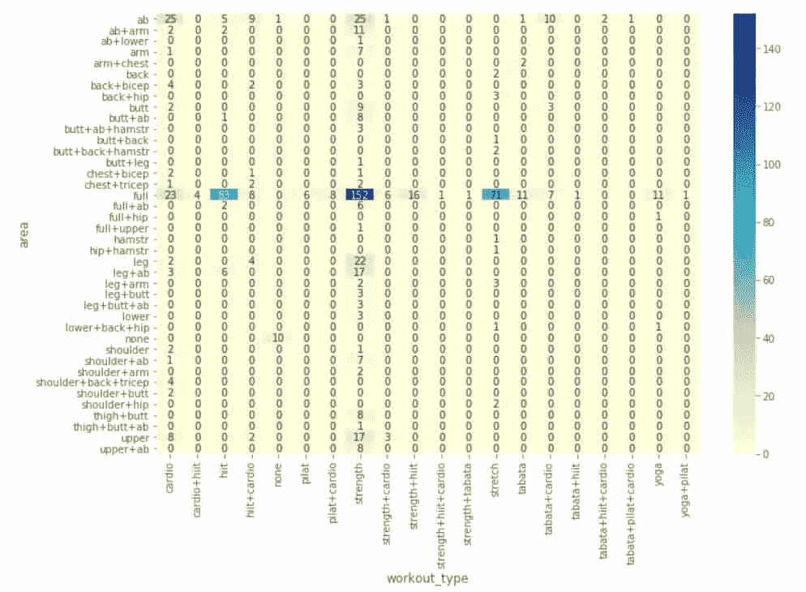

## (高级)关系检验和散点图:数值和分类变量

我们如何自动发现多个变量之间的关系？

让我们看看下面最关键的特征，看看我们如何找到有趣的关系。

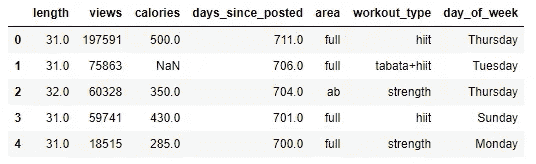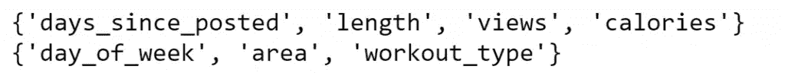

我们有 4 个数字变量和 3 个分类变量。

他们之间可能有许多复杂的关系！

在本节中，我们使用与[如何使用机器学习技术获得更多 YouTube 浏览量](https://www.justintodata.com/get-more-youtube-views-with-machine-learning/#step-3-engineering-the-features)中相同的方法来测试它们之间的关系(包括多重共线性)。

在高层次上，我们使用 [K 倍交叉验证](https://machinelearningmastery.com/k-fold-cross-validation/)来实现这一点。

首先，我们转换分类变量。由于我们将使用 5 重交叉验证，我们需要确保每个类别级别至少有 5 次观察。

接下来，我们遍历每个变量，并使用其他变量拟合一个模型来预测它。我们使用一个简单的模型[梯度推进模型(GBM)](https://en.wikipedia.org/wiki/Gradient_boosting) 和 K 倍验证。

根据目标变量是数值型还是分类型，我们应用不同的模型和分数(模型预测能力评估指标)。

当目标为数值时，我们使用[梯度推进回归器](https://scikit-learn.org/stable/modules/generated/sklearn.ensemble.GradientBoostingRegressor.html)模型和[均方根误差(RMSE)](https://en.wikipedia.org/wiki/Root-mean-square_deviation)；当目标是分类的时，我们使用[梯度推进分类器](https://scikit-learn.org/stable/modules/generated/sklearn.ensemble.GradientBoostingClassifier.html)模型和[精确度](https://developers.google.com/machine-learning/crash-course/classification/accuracy)。

对于每个目标，我们打印出 [K 倍验证分数](https://scikit-learn.org/stable/modules/cross_validation.html)(分数的平均值)和最重要的 5 个预测值。

我们还添加了三个由随机数组成的特征 *rand0* 、 *rand1* 、 *rand2* 。它们在比较变量之间的关系时充当锚。如果一个预测因子与这些随机变量相比不太重要或相似，那么它就不是目标变量的重要预测因子。

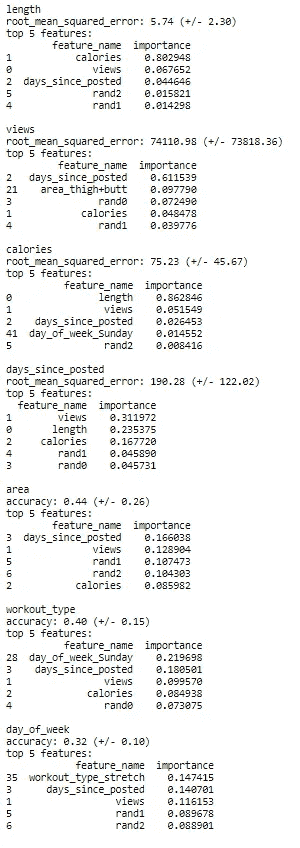

从上面的结果中，我们可以看到每个目标变量以及它们与预测值的关系。

同样，可以在[如何使用机器学习技术获得更多 YouTube 浏览量](https://www.justintodata.com/get-more-youtube-views-with-machine-learning/#step-3-engineering-the-features)中的多重共线性测试部分找到该测试的分步程序。

我们可以看到长度和卡路里之间有很强的关系。

让我们用散点图来形象化它们:x 轴表示长度，y 轴表示卡路里，而点的大小表示视图。

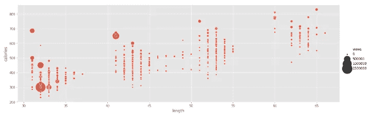

我们可以看到，视频越长，消耗的热量越多，很直观。我们还可以看到，观看次数越多的视频长度越短。

**相关文章**:

 [## 如何用机器学习技术获得更多的 YouTube 浏览量——仅仅是数据

### 在这篇文章中，我们用 Python 对 YouTube 数据应用了机器学习算法。我们将包括端到端流程…

www.justintodata.com](https://www.justintodata.com/get-more-youtube-views-with-machine-learning/) 

上一篇文章使用了相同的数据集。它包含了我们如何抓取和转换原始数据集的细节。

 [## Python 中的数据清理:终极指南(2020)——只进入数据

### 我们用 Python 创建了这个新的完整的分步指南。你将学习如何寻找和清理的技巧:丢失…

www.justintodata.com](https://www.justintodata.com/data-cleaning-python-ultimate-guide/) 

本文涵盖了清理的内容以及清理缺失数据、异常值、重复数据、不一致数据等的技术。

感谢您的阅读。

如果你有任何问题，请留言。我们会尽力回答。

离开之前，别忘了 [*报名参加刚刚进入数据快讯的*](https://www.justintodata.com/) ！或者在[推特](https://twitter.com/JustintoData)、[脸书](https://www.facebook.com/justintodata/)上与我们联系。
因此，您*不会*错过我们的任何新数据科学文章！

*原载于 2020 年 4 月 10 日 https://www.justintodata.com***。**

* [## 如何在线学习数据科学:你需要知道的一切——进入数据

### 这是利用在线资源进入数据科学的完整路线图/课程。你是否想学习…

www.justintodata.com](https://www.justintodata.com/how-to-learn-data-science-online-all-you-need-to-know/)  [## 如何利用深度学习进行情感分析(LSTM·克拉斯)——只分析数据

### 这是利用在线资源进入数据科学的完整路线图/课程。你是否想学习…

www.justintodata.com](https://www.justintodata.com/sentiment-analysis-with-deep-learning-lstm-keras-python/)  [## 预测时间序列的三个步骤:LSTM 与 TensorFlow Keras -只是进入数据

### 这是利用在线资源进入数据科学的完整路线图/课程。你是否想学习…

www.justintodata.com](https://www.justintodata.com/forecast-time-series-lstm-with-tensorflow-keras/)*