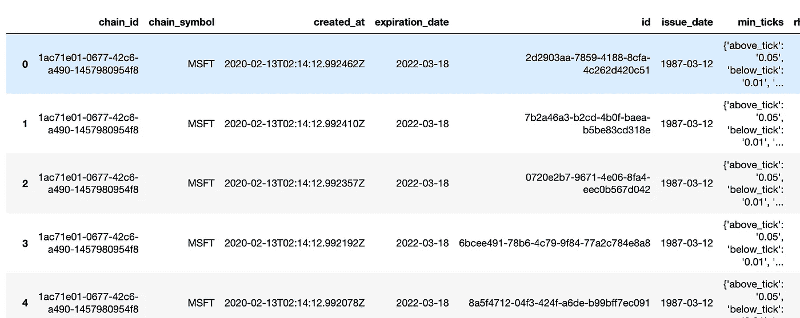

# 如何使用 Python 购买 Robinhood 的期权

> 原文：<https://towardsdatascience.com/how-to-use-python-to-buy-options-from-robinhood-8022bbcf3ddf?source=collection_archive---------13----------------------->


由[奥斯汀·迪斯特尔](https://unsplash.com/@austindistel?utm_source=medium&utm_medium=referral)在 [Unsplash](https://unsplash.com?utm_source=medium&utm_medium=referral) 上拍摄的照片

只是真的想测试我的编程技能，以搞乱股票。

那么什么是交易中的期权呢？它们是给予你在一段时间内以一定价格购买或出售资产的权利的合同。有些人将期权视为某种彩票，但我认为它就像 21 点，你可以采取某些策略来降低风险。

在本文中，我将创建 Python 代码来查看股票并购买它。为了做到这一点，让我们看看如何选择看起来像。这是一个期权标准报价的例子。

> 美国广播公司 2020 年 2 月 14 日 69 美元电话，4.20 美元

我们来分析一下。 ***ABC*** 是期权所基于的股票，通常代表该股票的 100 股。***2020 年 2 月 14 日*** 代表期权即将到期的月份。 ***69*** 是股票的执行价格。 ***叫*** 会是其中的一个选项类型，这里也可以填入选项。*4.20 美元是股票的溢价。*

*所以到目前为止，在期权交易中，微软的股票对我来说非常好。到目前为止，我已经获得了大量的。你可以在这里看到我的得失[。我们将利用微软购买罗宾汉的期权。](https://www.patreon.com/melvfnz/posts)*

*我用来从 Robinhood 中提取数据的叫做 [robin_stocks](https://robin-stocks.readthedocs.io/en/latest/index.html) 。我有一篇文章展示了如何设置它。*

*[](/using-python-to-get-robinhood-data-2c95c6e4edc8) [## 使用 Python 获取罗宾汉数据

### 让我们自动化一些股票，可以用来建造一个交易机器人。

towardsdatascience.com](/using-python-to-get-robinhood-data-2c95c6e4edc8) 

因此，我对微软股票的交易策略是，我通常在当前日期前 30 天买入期权看涨期权，然后选择高于当前股价的执行价格。

`robin_stocks`使它变得简单，我们已经可以拉可用的股票期权，我们可以使用`find_tradable_options_for_stock.`发送给他们，我已经设置了它，它已经拉了下面的调用。

`r.options.find_tradable_options_for_stock(‘MSFT’, optionType=’call’)`

我喜欢在数据框中查看结果，所以我会将所有这些数据转移过来。结果将如下所示:



既然我们知道了有效日期，我们现在可以发送一个包含正确信息的期权订单。我们将使用这行代码在`robin_stocks.orders.order_buy_option_limit(*price*, *symbol*, *quantity*, *expirationDate*, *strike*, *optionType='both'*, *timeInForce='gfd'*)`中发送订单

对于价格，我们可以只填写当前的期权价格。对于符号，我们将使用`MSFT`。数量我们将只购买 1 个合同订单。对于日期，我们将使用从今天(2020 年 2 月 13 日)起的 30 天。因此，我们将尝试选择一个接近 30 天的日期(2020 年 3 月 13 日)。我们将选择一个最接近且高于当前股价的价格。我们想要一个电话。生效时间对一天有利(gfd)。所以我们的代码看起来会像这样，它在 Robinhood 中的翻译是:

```
robin_stocks.orders.order_buy_option_limit(4.20, 'MSFT*'*, 1, 2020-03-13, 185.00, *optionType='call'*, *timeInForce='gfd'*)
```

> MSFT 2020 年 3 月 13 日 185 电话 4.20 美元

如果我们用 Python 运行这段代码，订单将被发送。然而，这并不一定是命令的执行。下面是完整的代码:* 

*访问我的微软得失[这里](https://www.patreon.com/melvfnz)！*

*我这里还有家教和职业指导！*

*如果你们有任何问题、评论或顾虑，请不要忘记通过 LinkedIn 与我联系！*