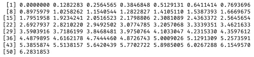
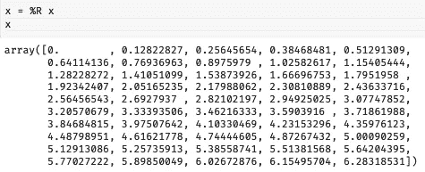
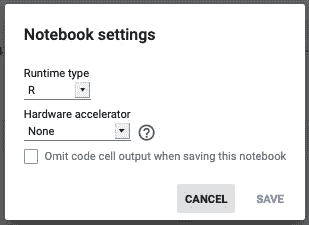
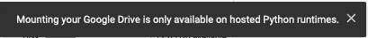
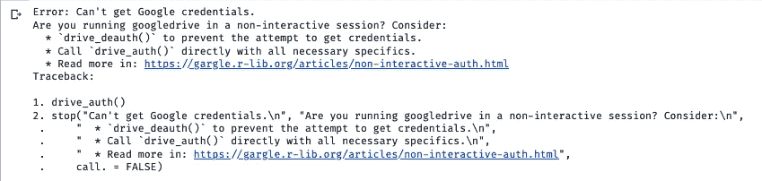
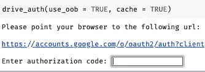
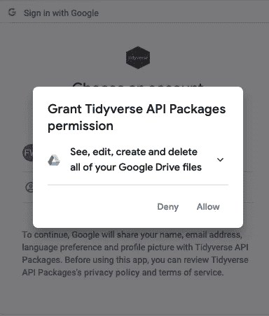

# 如何在 Google Colab 中使用 R

> 原文：<https://towardsdatascience.com/how-to-use-r-in-google-colab-b6e02d736497?source=collection_archive---------1----------------------->

## GOOGLE COLAB | RSTATS |笔记本

## 并使用来自您的驱动器和 BigQuery 的数据


安妮·斯普拉特在 [Unsplash](https://unsplash.com?utm_source=medium&utm_medium=referral) 上的照片

Colab，或 [Colaboratory](https://colab.research.google.com/notebooks/intro.ipynb#) 是 Google(主要)提供的一个交互式笔记本，用于通过浏览器编写和运行 Python。我们可以在 Colab 中执行数据分析，创建模型，评估这些模型。这个过程是在谷歌拥有的云中服务器上完成的。我们只需要一个浏览器和一个相当稳定的互联网连接。

无论是作为学生、专业人士还是研究人员，Colab 都是促进我们工作的一个很好的替代工具。

虽然 Colab 主要用于 Python 中的编码，但显然我们也可以将其用于 R ( [#Rstats](https://twitter.com/hashtag/rstats) )。

这篇文章将告诉你如何在 Google Colab 中运行 R，以及如何在 R 笔记本中挂载 Google Drive 或访问 BigQuery。

# 在 Colab 中运行 R 有两种方法

*   第一种方法是在 Python 运行时使用 rpy2 包。这个方法允许您一起执行 R 和 Python 语法。
*   第二种方式是*实际上*在 R 运行时启动笔记本。

## 如何在 Colab 中一起使用 R 和 Python

1.  打开你最喜欢的浏览器。
2.  创建新笔记本:[https://colab.research.google.com/#create=true](https://colab.research.google.com/#create=true)。
3.  通过执行该命令`%load_ext rpy2.ipython`运行 *rmagic* 。
4.  之后每次要用 R 的时候，在每个单元格的开头加`%%R`。

通过在单元格中执行以下命令来启动 [*rmagic*](https://rpy2.github.io/doc/latest/html/interactive.html) :

```
%load_ext rpy2.ipython
```

使用`%%R`执行**细胞魔法**。如果您希望在 r 中执行单元格中的所有语法，请使用此选项。注意，它必须放在单元格的开头。

```
%%R
x <- seq(0, 2*pi, length.out=50)
x
```

这些行将返回一个变量 *x* ，并将其显示在单元输出上:



图片作者，x

Use 【 to execute **线魔**。如果您希望单元格中的一行在 r 中执行，请使用此选项。

下面是如何使用这一行魔法将 R 变量复制到 Python 中:

```
x = %R x
```



作者的图像，通过使用 line magic 在 R 和 Python 之间传递变量，并在 Python 中显示 x

## 如何在 Colab 中使用 R

要直接用 R 使用笔记本:

1.  打开你最喜欢的浏览器。
2.  转到这个网址:【https://colab.research.google.com/#create=true】T2&language = r，或者这个短网址【https://colab.to/r】T4

访问 URL 后，您将被带到一个新的 Colab 笔记本，默认标题为 *Unitled.ipynb* 。

乍一看，使用 Python 和 R 运行时的笔记本没有区别。然而，如果我们转到“运行时”设置，并选择“更改运行时类型”，我们将得到一个对话框，确认我们已经在 R 运行时。



作者、运行时->更改运行时类型的图像

您还可以通过尝试将您的驱动器安装到笔记本上来确认您处于 R 运行时环境中。这样做，你会得到这样一个不幸的消息:



作者图片，啊哦，我们不能安装我们的谷歌驱动器！

消息*“挂载您的 Google Drive 仅在托管 Python 运行时上可用。”*明确表示你不是在 Python 运行时。

恭喜你，你现在已经成功地在 Colab 中运行 R 了。可以通过输入`R.version.string`打印出 R 版本来查看 R 版本。

这里，已经有几个对数据处理和数据可视化有用的包。可以通过运行`print(installed.packages())`来检查。

如果你在安装软件包时遇到问题，这篇文章可能会帮助你:

[](/how-to-install-packages-in-r-google-colab-423e8928cd2e) [## 如何在 R Google Colab 中安装包

### 一些限制以及如何克服其中一些限制

towardsdatascience.com](/how-to-install-packages-in-r-google-colab-423e8928cd2e) 

# 如何在 Colab R 运行时挂载 Google Drive

这应该很容易做到。我们只需要安装“googledrive”包并执行认证过程。

```
install.packages("googledrive")
library("googledrive")
```

安装包之后，我们需要对 googledrive 包进行认证和授权。您可以在此处阅读软件包文档:

[](https://googledrive.tidyverse.org/) [## Google Drive 的界面

### 大多数函数都以前缀 drive_ 开头。自动完成是你的朋友。目标是让驾驶人员感觉…

googledrive.tidyverse.org](https://googledrive.tidyverse.org/) 

```
# authorize google drivedrive_auth(
  email = gargle::[gargle_oauth_email](https://gargle.r-lib.org/reference/gargle_options.html)(),
  path = NULL,
  scopes = "https://www.googleapis.com/auth/drive",
  cache = gargle::[gargle_oauth_cache](https://gargle.r-lib.org/reference/gargle_options.html)(),
  use_oob = gargle::[gargle_oob_default](https://gargle.r-lib.org/reference/gargle_options.html)(),
  token = NULL
)
```

不幸的是，在尝试认证时，过程并不顺利。相反，我们面对的是这样一条错误消息:



图片作者，错误:无法获得谷歌证书。

显然，错误的发生是因为 *httr* 包中的交互函数无法执行。

这里有一个我们可以使用的变通办法，由 [jobdiogene](https://github.com/r-lib/httr/pull/634) 的提供:[https://gist . github . com/jobdiogenes/235620928 c84 e 604 C6 e 56211 CCF 681 f 0](https://gist.github.com/jobdiogenes/235620928c84e604c6e56211ccf681f0)

```
# Check if is running in Colab and redefine is_interactive()
if (file.exists("/usr/local/lib/python3.6/dist-packages/google/colab/_ipython.py")) {
  install.packages("R.utils")
  library("R.utils")
  library("httr")
  my_check <- function() {return(TRUE)}
  reassignInPackage("is_interactive", pkgName = "httr", my_check) 
  options(rlang_interactive=TRUE)
}
```

运行完那行代码后，我们可以再次尝试验证 Google Drive，现在它可以工作了！

```
drive_auth(use_oob = TRUE, cache = TRUE)
```



按作者分类的图像，交互式验证对话框

您需要点击链接并授予包访问您的 Google Drive 的权限。在此之后，您应该能够将授权代码粘贴到代码字段中。



图片由作者提供，授予许可

# 如何在 Colab R 运行时使用 BigQuery

对于业务人员，或者更习惯使用 R 的研究人员，也许我们需要从公司拥有的 BigQuery 或公开可用的数据集检索数据。

现在我们有了解决方法，授权 BigQuery 并从那里检索数据就很简单了:

```
install.packages("bigrquery")
library("bigrquery")
bq_auth(use_oob = TRUE, cache = FALSE)
```

使用自定义查询从 BigQuery 提取数据:

```
# Store the project id
projectid = "your-project-id"# Set the query
sql <- "SELECT * FROM your_table"# Run the query
project_query <- bq_project_query(projectid, sql, use_legacy_sql = FALSE)# Download result to dataframe
df <- bq_table_download(project_query)
```

## 结论

这是我认为我能为数据社区做出的贡献。正如我前面提到的，除了 Kaggle 和 RStudio Cloud 之外，Google Colab 为我们提供了学习或使用 R 的另一种选择。它们都是很好的平台，尤其是用于学习的时候；可以缩短初始设置(下载和安装 R，以及安装包)的时间。尽管在 Google Colab 中使用 R 的方式有点混乱，并且还没有与 Python 运行时相同的服务，但最终，它仍然工作得很好。

感谢阅读！

如果您有任何问题，请拨打 [Showwcase](https://www.showwcase.com/adityawarmanfw) 联系我！