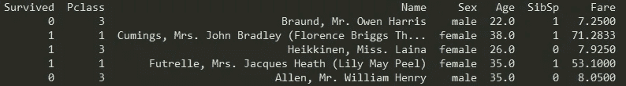
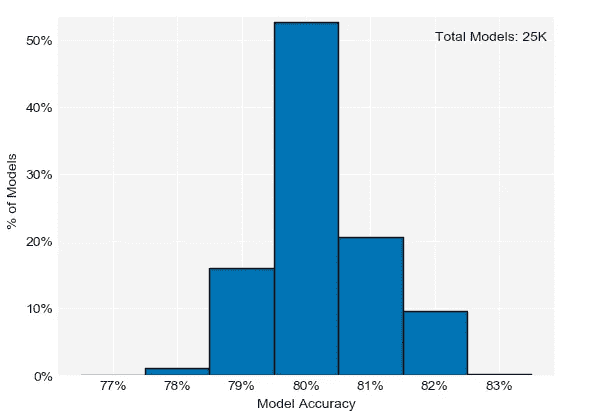

# 如何有效使用随机种子

> 原文：<https://towardsdatascience.com/how-to-use-random-seeds-effectively-54a4cd855a79?source=collection_archive---------3----------------------->

## 机器学习过程中经常被忽视的部分的最佳实践


图片来自 [Pixabay](https://pixabay.com/?utm_source=link-attribution&utm_medium=referral&utm_campaign=image&utm_content=1274944) 的 [Pezibear](https://pixabay.com/users/Pezibear-526143/?utm_source=link-attribution&utm_medium=referral&utm_campaign=image&utm_content=1274944)

建立预测模型是一个复杂的过程。你需要获得正确的数据，清理它，创建有用的特征，测试不同的算法，最后验证你的模型的性能。然而，这篇文章涵盖了模型构建过程中通常不会引起太多关注的一个方面:随机种子。

# ❓什么是随机种子？

随机种子用于确保结果是可重复的。换句话说，使用这个参数可以确保任何人重新运行您的代码都会得到完全相同的输出。在数据科学和其他领域，再现性是一个极其重要的概念。很多人已经写了很多关于这个话题的文章，所以我不会在这篇文章中进一步讨论。

根据您的具体项目，您甚至可能不需要随机种子。但是，有两个常见的任务会用到它们:

1.将数据分成训练集/验证集/测试集:随机种子确保每次运行代码时数据都以相同的方式划分

2.模型训练:诸如随机森林和梯度推进之类的算法是不确定的(对于给定的输入，输出并不总是相同的),因此需要随机种子参数来获得可重复的结果

除了再现性，随机种子对于基准测试结果也很重要。如果您正在测试一个算法的多个版本，那么所有版本使用相同的数据并且尽可能相似(除了您正在测试的参数之外)是非常重要的。

# 随机种子通常是如何设定的

尽管它们很重要，随机种子通常不需要太多的努力就能被设定。我对此感到内疚。我通常使用我正在工作的任何一天的日期(因此在 2020 年 3 月 1 日，我将使用 seed 20200301)。有的人每次都用同一个种子，有的人随机生成。

总的来说，随机种子通常被视为建模过程中的事后想法。这可能会有问题，因为正如我们将在接下来的几节中看到的，该参数的选择会显著影响结果。

# 🚢泰坦尼克号数据

现在，我将展示随机种子的选择会产生多大的影响。我将使用众所周知的泰坦尼克号数据集来做这件事(下载链接在下面)。

[](https://www.kaggle.com/c/titanic/data) [## 泰坦尼克号:机器从灾难中学习

### 从这里开始！预测泰坦尼克号上的生存并熟悉 ML 基础知识

www.kaggle.com](https://www.kaggle.com/c/titanic/data) 

以下代码和图是用 Python 创建的，但我在 r 中发现了类似的结果。与本文相关的完整代码可以在下面的 GitHub 资源库中找到:

[](https://github.com/jai-bansal/random-seed-blog-post) [## jai-bans al/random-seed-blog-post

### 这个存储库包含支持关于随机种子最佳实践的博客文章的代码。这篇博文可以在这里找到…

github.com](https://github.com/jai-bansal/random-seed-blog-post) 

首先，让我们看几行数据:

```
import pandas as pd
train_all = pd.read_csv('train.csv') # Show selected columns 
train_all.drop(['PassengerId', 'Parch', 'Ticket', 'Embarked', 'Cabin'], axis = 1).head()
```



泰坦尼克号数据集样本

泰坦尼克号的数据已经被分成了训练集和测试集。该数据集的一个经典任务是预测乘客存活率(编码在`Survived`列中)。测试数据没有附带`Survived`列的标签，所以我将执行以下操作:

1.保留部分训练数据作为验证集

2.根据剩余的训练数据训练模型以预测存活率，并根据步骤 1 中创建的验证集评估该模型

# 拆分数据

让我们先来看看`Survived`栏目的整体分布情况。

```
In [19]: train_all.Survived.value_counts() / train_all.shape[0] 
Out[19]:
0    0.616162 
1    0.383838 
Name: Survived, dtype: float64
```

在建模时，我们希望我们的训练、验证和测试数据尽可能相似，这样我们的模型就可以在与评估数据相同的数据上进行训练。请注意，这并不意味着**而不是**这三个数据集应该重叠！他们不应该。但是我们希望每一份报告中的观察结果具有广泛的可比性。现在，我将使用不同的随机种子分割数据，并比较训练集和验证集的`Survived`分布。

```
from sklearn.model_selection import train_test_split# Create data frames for dependent and independent variables 
X = train_all.drop('Survived', axis = 1) 
y = train_all.Survived # Split 1 
X_train, X_val, y_train, y_val = train_test_split(X, y, test_size = 0.2, random_state = 135153) In [41]: y_train.value_counts() / len(y_train) 
Out[41]:  
0    0.655899 
1    0.344101 
Name: Survived, dtype: float64 In [42]: y_val.value_counts() / len(y_val) 
Out[42]:  
0    0.458101 
1    0.541899 
Name: Survived, dtype: float64
```

在这种情况下，训练集中幸存者的比例远低于验证集中幸存者的比例。

```
# Split 2 
X_train, X_val, y_train, y_val = train_test_split(X, y, test_size = 0.2, random_state = 163035) In [44]: y_train.value_counts() / len(y_train) 
Out[44]:  
0    0.577247 
1    0.422753 
Name: Survived, dtype: float64 In [45]: y_val.value_counts() / len(y_val) 
Out[45]:  
0    0.77095 
1    0.22905 Name: Survived, dtype: float64
```

这里，在训练集中幸存者的比例比在验证集中高得多。

完全公开，这些例子是我在循环通过 200K 随机种子后发现的最极端的例子。不管怎样，这些结果有几个问题。首先，在这两种情况下，训练集和验证集之间的存活率分布有很大不同。这可能会对模型训练产生负面影响。第二，这些输出彼此非常不同。如果像大多数人一样，任意设置一个随机种子，那么根据您的选择，最终的数据分割可能会有很大的不同。

我将在文章的最后讨论最佳实践。接下来，我想展示我测试的所有 20 万个随机种子的训练和验证`Survival`分布是如何变化的。


一些数据拆分在训练集和验证集存活率%之间有很大差异。

约 23%的数据分割导致了训练集和验证集之间至少 5%的存活率差异。超过 1%的分裂导致至少 10%的存活率差异。最大存活百分比差异约为 20%。这里的要点是，使用任意随机种子会导致训练集和验证集分布之间的巨大差异。这些差异可能会在建模过程中产生意想不到的下游后果。

# 📈模特培训

上一节展示了随机种子如何影响数据分割。在这一节中，在之后，我使用不同的随机种子**来训练一个模型，数据已经被分成训练集和验证集(下一节将详细介绍我是如何做到这一点的)。**

提醒一下，我正在尝试预测`Survived`列。我将构建一个随机森林分类模型。因为随机森林算法是不确定的，所以需要一个随机种子来实现可再现性。我将在下面展示模型准确性的结果，但是我发现使用 precision 和 recall 也有类似的结果。

首先，我将创建一个训练和验证集。

```
X = X[['Pclass', 'Sex', 'SibSp', 'Fare']]  # These will be my predictors # The “Sex” variable is a string and needs to be one-hot encoded 
X['gender_dummy'] = pd.get_dummies(X.Sex)['female'] 
X = X.drop(['Sex'], axis = 1) # Divide data into training and validation sets 
# I’ll discuss exactly why I divide the data this way in the next section 
X_train, X_val, y_train, y_val = train_test_split(X, y, test_size = 0.2, random_state = 20200226, stratify = y)
```

现在，我将训练几个模型，并评估验证集的准确性。

```
# Model 1 from sklearn.ensemble import RandomForestClassifier 
from sklearn.metrics import accuracy_score # Create and fit model 
clf = RandomForestClassifier(n_estimators = 50, random_state = 11850) 
clf = clf.fit(X_train, y_train)  
preds = clf.predict(X_val)  # Get predictions In [74]: round(accuracy_score(y_true = y_val, y_pred = preds), 3) Out[74]: 0.765 # Model 2# Create and fit model 
clf = RandomForestClassifier(n_estimators = 50, random_state = 2298)
clf = clf.fit(X_train, y_train)
preds = clf.predict(X_val)  # Get predictionsIn [78]: round(accuracy_score(y_true = y_val, y_pred = preds), 3)
Out[78]: 0.827
```

为了找到这些结果，我测试了 25K 个随机种子，但是准确度变化> 6%绝对值得注意！同样，这两个模型是相同的，除了随机种子。

下图显示了我测试的所有随机种子的模型精确度是如何变化的。



模型精度因随机种子而异。

虽然大多数模型达到了约 80%的准确率，但有相当数量的模型得分在 79%-82%之间，少数模型得分超出了该范围。根据具体的用例，这些差异大到足以产生影响。因此，在与利益相关者交流结果时，应考虑随机种子选择导致的模型性能差异。

# 最佳实践

既然我们已经看到了随机种子的选择会影响结果的几个方面，我想提出一些最佳实践。

对于数据分割，我认为应该使用分层样本，以便因变量(本文中的`Survived`)在训练、验证和测试集中的比例相似。这将消除上述变化的存活率分布，并允许根据可比数据训练和评估模型。

`train_test_split`函数可以用 1 个附加参数实现分层抽样。请注意，如果稍后根据具有不同因变量分布的数据评估模型，性能可能会与预期不同。然而，我认为按因变量分层仍然是分割数据的首选方式。

下面是分层抽样在代码中的样子。

```
# Overall distribution of “Survived” column 
In [19]: train_all.Survived.value_counts() / train_all.shape[0] 
Out[19]:  
0    0.616162 
1    0.383838 
Name: Survived, dtype: float64 # Stratified sampling (see last argument) 
X_train, X_val, y_train, y_val = train_test_split(X, y, test_size = 0.2, random_state = 20200226, stratify = y) In [10]: y_train.value_counts() / len(y_train) 
Out[10]:  
0    0.616573 
1    0.383427 
Name: Survived, dtype: float64 In [11]: y_val.value_counts() / len(y_val) 
Out[11]:  
0    0.614525 
1    0.385475 
Name: Survived, dtype: float64
```

使用`stratify`参数，`Survived`的比例在训练集和验证集中是相似的。我仍然使用随机种子，因为我仍然想要可重复的结果。然而，我认为在这种情况下，具体的随机种子值并不重要。

这解决了数据分割的最佳实践，但是模型训练呢？在测试不同的模型规格时，应该使用随机种子进行公平的比较，但我不认为特定的种子有太大的关系。

然而，在向利益相关者报告绩效指标之前，最终模型应该用 2-3 个额外的种子进行训练和评估，以了解结果中可能的差异。这种做法可以更准确地传达模型性能。对于在生产环境中运行的关键模型，值得考虑使用多个种子运行该模型，并对结果进行平均(尽管这可能是一篇单独的博客文章的主题)。

# 🏁结论

希望我已经说服您注意一下经常被忽略的随机种子参数。如果您想查看本文中使用的完整代码，或者对随机 seed 最佳实践有其他想法，请随时联系我们！

如果你喜欢这篇文章，看看我下面的其他作品吧！

[](/la-traffic-data-analysis-part-1-53f24e21067d) [## 洛杉矶交通数据分析🚗:第一部分

### 使用公开来源数据分析洛杉矶的碰撞模式

towardsdatascience.com](/la-traffic-data-analysis-part-1-53f24e21067d) [](https://medium.com/@jai_bansal/7-tips-for-developing-technical-trainings-for-your-organization-928cf7744d44) [## 为您的组织开发技术培训的 7 个技巧

### 将你的下一个培训课程想法变成现实的技巧

medium.com](https://medium.com/@jai_bansal/7-tips-for-developing-technical-trainings-for-your-organization-928cf7744d44)