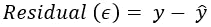
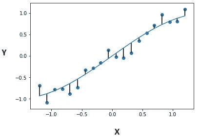
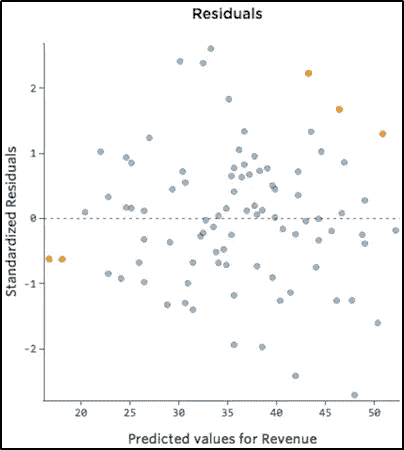
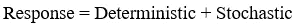
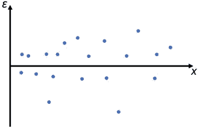
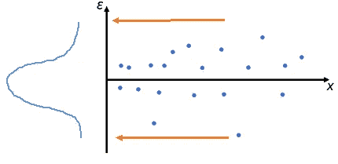
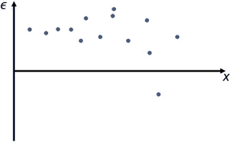
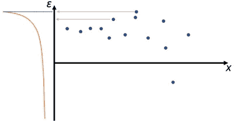

# 如何使用残差图进行回归模型验证？

> 原文：<https://towardsdatascience.com/how-to-use-residual-plots-for-regression-model-validation-c3c70e8ab378?source=collection_archive---------4----------------------->

## 使用残差图验证您的回归模型

# **概述**

任何数据科学/ML 项目最重要的部分之一是模型验证。这和你之前的工作一样重要。这是欢呼之前的最后一个障碍！

对于回归，有许多方法可以评估你的拟合度，即模型与数据的拟合程度。r 值就是这样一种度量。但它们并不总是最能让我们对自己的模型充满信心。

图片来自 U[n flash](https://unsplash.com/photos/6EnTPvPPL6I)

> 犯错是人之常情，随机犯错在统计学上是神圣的

这就是剩余图出现的原因。我们来谈谈什么是剩余图，以及你如何分析它们来解释你的结果。

## 残差

残差是一个点与回归线垂直距离的度量。简单来说就是预测值和观察到的实际值之间的误差。

残差方程

图 1 是如何根据最佳拟合线可视化残差的示例。垂直线是残差。

图 1 [ [StackOverflow](https://stackoverflow.com/questions/51220918/python-plot-residuals-on-a-fitted-model)

**残差图**

典型的残差图在 Y 轴上有残差值，在 x 轴上有独立变量。下面的图 2 是典型残差图的一个很好的例子。

图 2 [ [信用](https://www.qualtrics.com/support/stats-iq/analyses/regression-guides/interpreting-residual-plots-improve-regression/)

**剩余剧情分析**

线性回归模型最重要的假设是 ***误差是独立且正态分布的。***

让我们来看看这个假设意味着什么。

每个回归模型本质上都有一定程度的误差，因为你永远不可能 100%准确地预测某件事。更重要的是，随机性和不可预测性总是回归模型的一部分。因此，回归模型可以解释为:

模型中确定性的部分是我们试图用回归模型捕捉的。理想情况下，我们的线性方程模型应该准确地捕捉预测信息。本质上，这意味着如果我们获得了所有的预测信息，那么剩下的所有信息(残差)应该是完全随机的&不可预测的，即随机的。因此，我们希望残差服从正态分布。这正是我们在剩余图中寻找的。那么一个好坏残积的特点是什么呢？

**良好残差图的特征**

一个好的残差图的几个特征如下:

1.  靠近原点的点密度高，远离原点的点密度低
2.  它关于原点是对称的

为了解释为什么图 3 是基于上述特征的良好残差图，我们将所有残差投影到 y 轴上。如图 3b 所示，我们最终得到一条正态分布的曲线；满足残差正态性的假设。

图 3:良好的残差图

图 3b:投影到 y 轴上

最后，这是一个好的残差图的另一个原因是，独立于自变量(x 轴)的值，残差以相同的方式近似分布。换句话说，当我们沿着 x 轴移动时，我们**看不到**残差值的任何模式。

因此，这满足了我们早先的假设，即回归模型**残差是独立的，并且是正态分布的。**

利用上述特征，我们可以看出为什么图 4 是一个差的残差图。这个图远离原点密度高，靠近原点密度低。此外，当我们将残差投影到 y 轴上时，我们可以看到分布曲线不是正态的。

图 4:不良残差图示例

图 4b:投影到 y 轴上

重要的是要理解，这些图表明我们还没有完全捕捉到模型中数据的预测信息，这就是为什么“*会渗入到我们的残差中。一个好的模型在使用预测信息后应该总是只剩下随机误差(回想一下确定性的&随机成分)*

**总结**

要验证回归模型，必须使用残差图来直观地确认模型的有效性。绘制所有自变量的所有残差值可能有点复杂，在这种情况下，您可以生成单独的图，也可以使用其他验证统计数据，如调整后的 R 或 MAPE 分数。

# **关于作者**

Usman Gohar 是一名数据科学家，明尼阿波利斯数据科学的共同组织者，也是一名技术演讲人。他非常热衷于最新的数据科学研究，机器学习，并通过帮助和赋权年轻人在数据科学领域取得成功而蓬勃发展，特别是女性。您可以在 [LinkedIn](https://www.linkedin.com/in/usman-gohar/) 、 [Twitter](https://twitter.com/UsmanGohar) 、[Medium](https://medium.com/@usman.gohar)&follow on[Github](https://github.com/UsmanGohar)上与 Usman 联系。