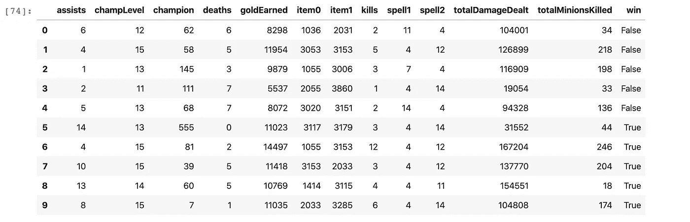
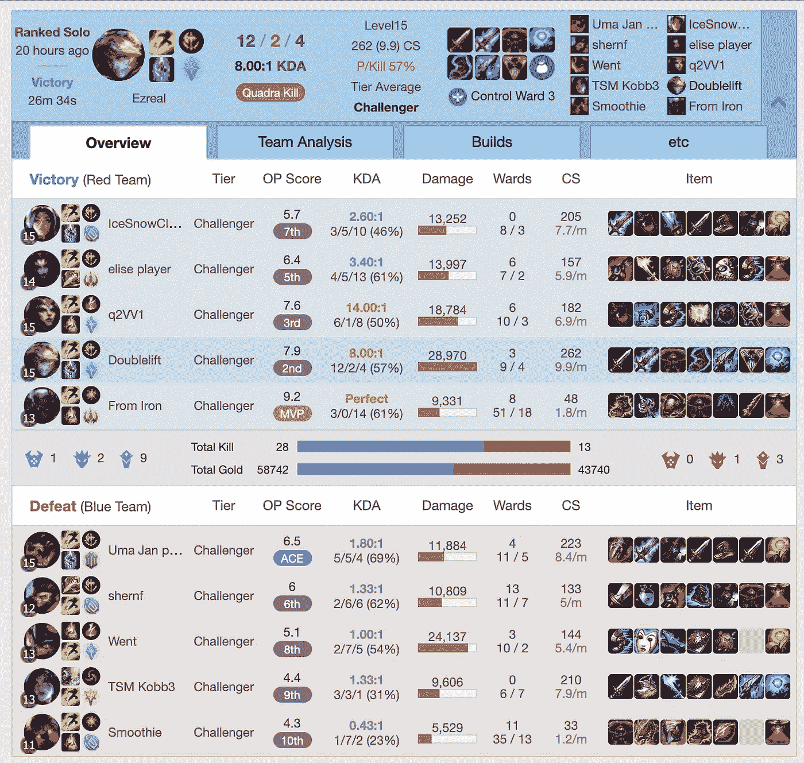
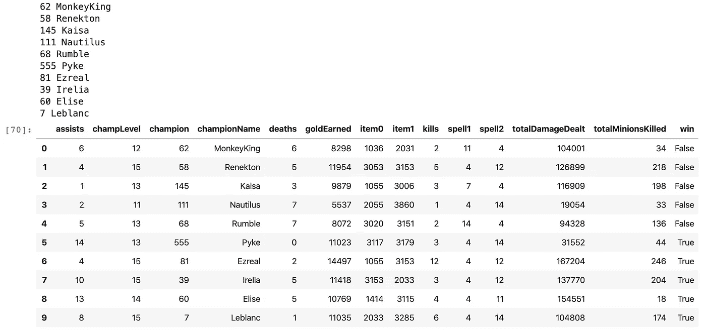

# 如何在 Python 中使用 Riot API

> 原文：<https://towardsdatascience.com/how-to-use-riot-api-with-python-b93be82dbbd6?source=collection_archive---------0----------------------->

## 在本教程中，我将使用 Riot API 来展示如何构建一个像 [op.gg](http://op.gg/) 这样的应用程序。


照片由[弗洛里安·奥利佛](https://unsplash.com/@rxspawn?utm_source=medium&utm_medium=referral)在 [Unsplash](https://unsplash.com?utm_source=medium&utm_medium=referral) 上拍摄

我建议在你开始做任何事情之前，阅读他们的[文档](https://developer.riotgames.com/docs/portal)以了解他们 API 的最新变化。

# 什么是 Riot Games API？

Riot Games API 是一个 REST API，它向开发者提供数据，用于构建我们自己的应用程序或网站。目前，所有英雄联盟 API 都是版本 4(2020 年 3 月 19 日更新)。从这个版本开始，他们不再在 API 路径中包含次要版本。

以下是您可以从 Riot Games API 获得的一些数据:

*   服务状态。
*   召唤师详细信息:姓名，级别，个人资料图标，帐户 id。
*   通过召唤师名字匹配历史和匹配细节和时间线。
*   某人当前的游戏信息，如果有人在游戏中。
*   其他信息，查看 [API 文档](https://developer.riotgames.com/api-methods/)

# Riot API 密钥入门

你总是需要一把钥匙来访问 Riot Games API。我们将讨论如何获得 API 密钥。

首先，使用您的 Riot 帐户登录 [Riot 开发者门户](https://developer.riotgames.com/)。就是你每次玩英雄联盟用的账号。

在你的`Dashboard`里，有一个`DEVELOPMENT API KEY`。请记住，密钥将在 24 小时后过期。**不要与任何人共享您的 API 密钥。如果你从 Riot API 得到一个“403”响应，你可能只需要刷新你的密钥。**

此外，您可以注册一个个人防暴产品，那么你就不需要每 24 小时刷新您的密钥。通常情况下，个人申请需要两周时间审核。

请记住您提出的请求数量，因为开发 API 密钥和个人产品密钥有上限:

*   每秒 20 个请求
*   每两分钟 100 个请求

如果你注册了一个生产 API 密匙，那就更难注册了。上限是:

*   每 10 秒钟有 3000 个请求
*   每 10 分钟 18 万次请求

完成上述所有要求后，现在您应该获得一个开发 API 密钥。让我们试着看看 [Doublelift](https://lol.gamepedia.com/Doublelift) Riot 账户。使用您的 API 密钥通过 access 在 Riot API 上进行测试:

```
[https://na1.api.riotgames.com/lol/summoner/v4/summoners/by-name/Doublelift?api_key=RGAPI-YOUR-API-KEY](https://na1.api.riotgames.com/lol/summoner/v4/summoners/by-name/Doublelift?api_key=RGAPI-YOUR-API-KEY)
```

结果应该是这样的:

请记住，Riot API 是区域化的，您需要选择您的区域。还有，账号详情，只有召唤师的名字容易获取，不加密。其他账户 id 信息是加密的。

还有，召唤师和账号 id 只在每个地区是唯一的，PUUIDs 是全球唯一的。

# 安装暴动监视器

如果你在谷歌上搜索`riot api` 或者`league of legends api`，有很多库可以使用。这里有一个 [Riot API 库](https://riot-api-libraries.readthedocs.io/en/latest/libraries.html)的列表。他们中的许多人都没有得到很好的维护，正如你所知，Riot 已经将他们的 API 版本升级到 V4，并取消了所有旧版本。

这里我使用了一个名为[的 Python 库。首先，你可以轻松地运行](https://github.com/pseudonym117/Riot-Watcher)

```
pip3 install riotwatcher
```

要查看这样的帐户信息，我们只需尝试从 URL:

# 访问等级信息

我们还可以使用一行代码获得排名信息:

# 访问匹配数据

例如，我们想获取最后的游戏信息。



然后对比 op.gg 数据。我们得到了一些准确的数据，但很难读懂。我们需要访问 Champion 和其他静态数据。



截图自 [op.gg](http://op.gg)

# 存取数据龙

现在我们只得到每个冠军的 id。为了更好的理解，我们需要知道每一个的名字。

从 Data Dragon 可以获得《英雄联盟》的所有静态信息数据。

运行代码后，我们得到了类似这样的结果。



此外，法术，符文和物品信息将从数据龙获得。现在，您几乎已经获得了构建 op.gg 这样的应用程序所需的所有数据。

# 确定冠军位置

如果你刊登最新的比赛细节。你可能会注意到位置信息和我们从 op.gg 得到的有点不同。

```
‘role’: ‘DUO_CARRY’,‘lane’: ‘BOTTOM’
```

你可以建立一个地图来确定每个冠军的位置。

*   (中路，独奏):中路
*   (TOP_LANE，SOLO): TOP
*   (丛林，无):丛林
*   (BOT_LANE，DUO_CARRY):底部
*   (BOT_LANE，DUO_SUPPORT):实用程序

# 下一步是什么

现在，您已经了解了什么是 Riot Games API，并且已经成功地使用 python 从 API 中检索了第一批数据。而这些几乎都是构建 op.gg 的数据。

Riot API 还提供对实时客户端数据和重放数据的访问。我打算谈谈如何构建一个基本的实时客户端脚本，为您提供有关您当前游戏的信息。如果你有任何问题，请在下面提问。

# 了解更多信息

*   你可以从 [DataDragon](https://developer.riotgames.com/ddragon.html) 获得所有关于冠军、物品等的信息。
*   暴乱开发者[不和频道](https://discordapp.com/invite/riotgamesdevrel)。