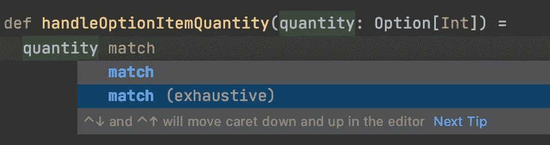

# 如何使用 Scala 模式匹配

> 原文：<https://towardsdatascience.com/how-to-use-scalas-pattern-matching-362a01aa32ca?source=collection_archive---------52----------------------->

## 当 if-else 语句太长时，就该考虑模式匹配了。


Andrew Ridley 在 [Unsplash](https://unsplash.com?utm_source=medium&utm_medium=referral) 上拍摄的照片

# 概观

模式匹配是 Scala 语言提供的最强大的工具之一。类似于 Kotlin 中的`when`语句和 Java 中的`switch`语句。

本质上，它将一个输入与我们想要匹配的所有可能的情况进行比较。在我看来，这是使用多行`if-else`语句的一种优雅的替代方式，当有许多案例需要比较时，可读性更好。

在本教程中，我们将通过几个不同的场景来学习如何在 Scala 中使用模式匹配。

对科特林的`when`说法感兴趣的，可以去看看这个[教程](https://medium.com/better-programming/stop-using-if-else-and-start-using-when-in-kotlin-96485c2a51d2?source=friends_link&sk=765f768351029adda0d2817c4b88cf72)。

# Scala 模式匹配剖析

Scala 模式匹配的剖析如下。

```
objectToMatch match {
  case object1 => println("You match object1.")
  case object2 => println("You match object2.")
  case _ => println("You match neither object1 nor object2.")
}
```

`objectToMatch`是你试图模式匹配的 Scala 对象的可能值。

`case object1`和`case object2`是你所知道的可能与`objectToMatch`匹配的两种模式。

`case _`是 everything else 子句，它本质上意味着`objectToMatch`与`object1`或`object2`都不匹配。

# 基本用法

既然我们已经理解了模式匹配的结构，让我们看一个简单的例子。

假设我们买了一袋混合水果，我们知道它通常含有苹果、香蕉、草莓或蓝莓。现在，我们有了一台能够对水果进行分类的扫描仪。如果我们使用 Scala 的模式匹配来编写程序，它会是这样的。

```
fruit match {
  case "apple" => println("received an apple.")
  case "banana" => println("received a banana.")
  case "strawberry" => println("received a strawberry.")
  case "blueberry" => println("received a blueberry.")
  case _ => println("unable to classify this fruit. is it really a fruit?")
}
```

如果您有一个名为`fruit`的变量，并且分配给它的值是`apple`，那么上面的模式匹配语句将把`received an apple.`打印到您的控制台。诸如此类。

当`fruit`的值既不是`apple`、`banana`、`strawberry`也不是`blueberry`时，语句会将`unable to classify this fruit. is it really a fruit?`打印到控制台。

现在，如果你要为此写一个`if-else`语句，它会是这样的。

```
if (fruit == "apple") *println*("received an apple.")
else if (fruit == "banana") *println*("received a banana.")
else if (fruit == "strawberry") *println*("received a strawberry.")
else if (fruit == "blueberry") *println*("received a blueberry.")
else *println*("unable to classify this fruit. is it really a fruit?")
```

在我看来，模式匹配表达式比`if-else`更具可读性，但是，嘿，这真的取决于你的偏好。归根结底，上述两种说法做的是同样的事情。

# 与案例类匹配

除了匹配对象本身的值，我们还可以匹配可能的类型(或`case class`)。

假设我们正在为一家超市的新鲜农产品部的计算机扫描仪编写一个分类程序。扫描仪将根据物品的类型给物品贴上标签，例如水果或蔬菜。我想这就是我们如何定义我们的特征和案例类。

```
trait GroceryItem

case class Fruit(name: String) extends GroceryItem

case class Vegetable(name: String) extends GroceryItem
```

现在，我们将编写一个函数，它将一个`GroceryItem`对象作为其输入，并对它是`Fruit`还是`Vegetable`进行分类。这是它最简单的写法。

```
def classifyGroceryItem(item: GroceryItem): Unit =
  item match {
    case _: Fruit => *println*("label item as fruit.")
    case _: Vegetable => *println*("label item as vegetable.")
    case _ => *println*("unable to label the item. this seems to be an item for other department.")
  }
```

注意语法`_: Fruit`。当我们想要对它的实例类型进行模式匹配时，我们应该这样写我们的`case`。此外，该表达式实际上并不查看字段`case class`的值(例如`name`)。

如果我们还想匹配 case 类的字段，我们可以这样做(看第一个`case`表达式)。

```
def classifyGroceryItem(item: GroceryItem): Unit =
  item match {
    case *Fruit*(name) if name == "apple" => *println*("item is a fruit and it's an apple.") 
    case _: Fruit => *println*("label item as fruit.")
    case _: Vegetable => *println*("label item as vegetable.")
    case _ => *println*("unable to label the item. this seems to be an item for other department.")
  }
```

请注意，case 表达式的顺序很重要。在上面的例子中，如果附加的`case Fruit(name)`表达式放在`case _: Fruit`之后，代码将永远不会到达它，因为它将立即匹配`case _: Fruit`。

从这个例子中，我们还了解到我们可以在`case`语句上添加一个`if`语句。我发现这在某些情况下很有用。

# 与选项匹配

在 Scala 中，我们可能有一个`Option`类型的对象，这仅仅意味着我们可能有也可能没有值。

假设我们有一个函数，它根据商品的名称扫描超市的库存，如果找到了商品，就返回数量。

```
val inventory: Map[String, Int] = *Map*(
  "apple" -> 10,
  "banana" -> 15,
  "strawberry" -> 10,
  "spinach" -> 30,
  "capsicum" -> 25
)

def findItemAndReturnQuantity(itemName: String): Option[Int] = {
  inventory.get(itemName)
}

findItemAndReturnQuantity("sugar") // res1: Option[Int] = None
findItemAndReturnQuantity("spinach") // res2: Option[Int] = Some(30)
```

我们可以使用模式匹配来处理一个`Option`对象。让我们编写一个函数来处理`findItemAndReturnQuantity`函数的输出。

```
def handleOptionItemQuantity(quantity: Option[Int]) =
  quantity match {
    case Some(value) => *println*(s"quantity is **$**value.")
    case None => *println*("item is not available.")
  }
```

综合起来看:

```
handleOptionItemQuantity(findItemAndReturnQuantity("strawberry"))
// quantity is 10.
```

太好了。🙂

在我们结束这一部分之前，我想向您展示一个简单的提示。在某些情况下，比如这个`Option`对象，编译器知道可能的结果是什么。因此，当您键入模式匹配表达式时，应该会看到下面的建议。



匹配(详尽)

如果您选择`match (exhaustive)`，它将自动填充值存在和不存在的情况。

```
def handleOptionItemQuantity(quantity: Option[Int]) =
  quantity match {
    case Some(value) => 
    case None =>
  }
```

记住，如果需要的话，我们还可以在上面的表达式中添加`if`语句。例如，当某个商品的库存量不足时，我们希望通知我们的员工。

```
def handleOptionItemQuantity(quantity: Option[Int]) =
  quantity match {
    case Some(value) if value < 10 => *println*(s"low stock - quantity is **$**value.")
    case Some(value) => *println*(s"quantity is **$**value.")
    case None => *println*("item is not available.")
  }
```

就是这样。😃

# 包裹

当你读到这一节的时候，你已经学会了 Scala 模式匹配的基础知识。您现在应该能够在您的代码中使用它，或者替换一些现有的多行语句`if-else`。

如果你也像我一样用 Kotlin 编程，你可能想看看这篇关于 Kotlin 的 when 语句的教程[。它本质上相当于 Scala 对 Kotlin 的模式匹配。](https://medium.com/better-programming/stop-using-if-else-and-start-using-when-in-kotlin-96485c2a51d2?source=friends_link&sk=765f768351029adda0d2817c4b88cf72)