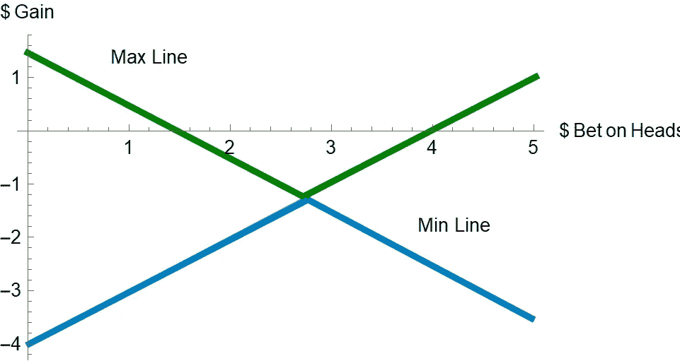

# 当你不知道将要发生什么的时候，如何用科学来决定

> 原文：<https://towardsdatascience.com/how-to-use-science-to-decide-when-you-dont-know-what-s-going-to-happen-3271eef061de?source=collection_archive---------56----------------------->

## 用不精确的概率做决策是一件有风险的事情

媒体倾向于指出重新开放经济相对于保持封锁的风险或好处。很少看到任何新闻媒体采取系统的方法，这是我们希望决策者正在做的。我们知道统计爱好者。随着大部分经济现在重新开放，我们抱着最好的希望，但在不确定的时期，我们能确定什么呢？数学可能有答案。

维基百科用户 [Alinaderi158](https://commons.wikimedia.org/w/index.php?title=User:Alinaderi158&action=edit&redlink=1) CCA-SA 4.0 的照片。

在我对传感器、机器学习和协作机器人的研究中，理解当你不知道将要发生什么时如何做出决定是我一直在处理的事情。数学可以告诉我们一些我们面临的事情，即使有很多我们不知道的事情。

我们做的每一个决定都有一定的风险。我买本田还是丰田？或者我应该省下那笔钱去坐公交车？去杂货店安全吗？还是我应该呆在家里叫外卖？在工作变得更安全之前，我能靠失业救济金生活下去吗？还是我应该现在就回去？

这些决定伴随着风险。它们也伴随着不确定性。

你可以把风险想象成人生的“已知的未知”，不确定性想象成人生的“未知的未知”。

我们现在都在应对的一大未知是冠状病毒。我向你保证，在 2019 年底和 2020 年初，数以千计的风险评估会议在无数的董事会会议室举行，没有提到全球疫情和全球封锁。它能被解释吗？可能比以前好，但不是完全好。

十几岁时，我是艾萨克·阿西莫夫的超级粉丝。阿西莫夫最出名的有两件事:他的机器人规则和虚构的心理史学，预测未来的数学，他在他的*基金会*系列中扮演了一个关键角色。从根本上说，阿西莫夫的心理史学是关于在不确定性下的决策，相信大规模的政治运动是可以预测的，或者至少是可以管理的。

混沌理论告诉我们，我们不能做阿西莫夫想要的事情。有太多不可预测的事件会产生巨大的影响。用数学术语来说，它们对初始条件很敏感。即使是像单个病毒的单个 RNA 链的单个变化这样微小而无足轻重的事情，也能对人类事件产生巨大的影响。“蝴蝶效应”意味着没有人能够预测遥远未来的全球性事件。

然而，假设有一个完全理性的负责人，他可以在考虑所有因素的情况下做出决策，并以最小的成本实现利益最大化。知道任何结果的概率都是未知的，某些行动的好处也是未知的，那么即使是超级人工智能也能做出正确的选择吗？这种生物可以依赖哪种数学？这样的人会选择什么样的策略呢？

在协作机器人中，我们不会告诉机器人具体要做什么。我们也不会让他们自己想办法。他们是团队的一部分，团队需要知道如何一起工作。我们使用战术手册。剧本是在很长一段时间内开发出来的，很多游戏，看看什么可行，什么不可行。这也需要一个有经验的教练根据情况选择正确的打法。

任何决策者在做出任何政策决定之前，手中都应该有一个剧本。边走边编是一个灾难的处方。这个剧本需要由手头的主题和政策制定方面的专家来编写，这样他们就知道什么样的决策是可行的。剧本必须包含决策者愿意做出的所有决策。

然而，我们如何利用数据从剧本中做出选择呢？如果你的专家中有一位是数学家，他们可能会建议一些数学方法来用不精确的概率做决策。

不确定性(我们称之为不精确概率)下的决策数学关注的是在你不知道最糟糕的事情会发生或者发生的可能性有多大的情况下做出最佳决策。数学家将最佳决策定义为带来最高收益的决策，这是一个衡量做出给定决策的总体收益的数字。

没有不确定性，做出任何选择的收益都很容易计算，即使结果是随机的。例如，假设你给我一个有六个面的骰子，告诉我如果我掷出 6，你会给我 10 美元，但如果我掷出其他任何东西，我必须付给你 x 美元。x 应该是多少才能让我接受你的提议？事实证明，有一个精确的数学答案，它来自于对“期望值”的计算，而“期望值”就是一个结果的成本或收益乘以它的概率。如果你把所有可能结果的期望值相加，就得到总期望值。如果期望值为正，总的来说，你会受益。如果是负数，总的来说，你会输。赌场知道这一点，因此操纵他们所有的游戏，以预期价值使赌场受益。

在骰子的情况下，掷出 6 的概率是 1/6。滚动其他任何东西的概率是 5/6。10 乘以 1/6 等于 10/6。x 乘以 5/6 等于 5x/6。两者相减，10/6 减去 5x/6，得到(10–5x)/6 或 5(2-x)/6。做一点数学计算，你会发现，如果 x 小于 2 美元，我会受益。如果 x 大于 2 美元，你就会获利。现在，对于一次掷骰，即使 x 很大，我仍可能获得收益。同样地，即使 x 很小，你也可能获得收益。但是在很多很多次的掷骰中，平均来说，具有最高期望值的人获胜的几率更大。

如果你想在任何碰运气的游戏中获胜，你所要做的就是计算出期望值是多少，并确保你能连续玩很多很多次。这就是为什么赌场和彩票中的大多数机会游戏都被操纵，以至于“庄家总是赢”。另一方面，股票市场通常有一个正的期望值。只要你把赌注压在很多很多股票上，就像投资股市指数基金一样，从长远来看，你就不会出错。

您可以将期望值应用于金融、物理、化学、生物等许多领域。数十亿年来，通过反复试验，进化已经确定了许多行为和解剖结构的预期值，并导致我们的形态和功能发展，因为它必须最大化我们的生存机会。

那么为什么不在决策中使用期望值呢？你可以，但是期望值只有在你知道期望什么时才起作用。如果没有呢？与进化不同，我们没有数不清的岁月和数十亿条生命来牺牲，来寻找合适的时机。计算机模型可能对此有所帮助，但是模型也依赖于知道会发生什么；你还能怎么造一个？

数学家们也研究了这个问题，并制定了一些策略。如果你无知，你所拥有的只是你对现实的信念来做决定。然而，这些都不是信仰的飞跃。相反，它们更像是猜测。对于每一个决策，你都要对该决策的最小预期收益或“效用”进行猜测。同样，你对不做这个决定的*最大*预期成本进行了猜测。

为什么我们关心最小的收益和最大的成本？原因是因为我们想限制我们的预期收益，这样我们就知道它会超过我们的猜测。

例如，假设我想在一次不能保证公平的掷硬币游戏中下注。它抬头的几率在 0.2 到 0.7 之间。我有五美元，我可以用任何方式把它分成正面和反面。我的增益是代表除法的可能结果的函数。最好的划分是什么？

把 h 股放在正面，把 T 股放在反面的预期效用是这些中最小的:

高 x 0.2-高 x 0.8

T x 0.3-H x 0.7

例如，如果我把 2 美元放在正面，3 美元放在反面，那么我的预期效用要么是 2 美元的损失，要么是 1.90 美元的损失，所以预期效用是负 2 美元。

如果我想找出最佳赌注是什么，我需要找出每个赌注的这些函数的最小值的最大值是多少。在 H+T=5 的约束下，这很简单，它就是两个函数相等的地方，或者两条线相交的地方。

最上面一行是最大期望值解。底线是每组赌注的最小期望值解。由作者用 Mathematica 创建。

那个点在 H=$2.75，T=$2.25。它当然还是会输。

这种决策方式被称为“马希民”,因为我们追求最小收益的最大化。它也被称为“最坏情况优化”决策，因为它是如此悲观[1]。几十年来，国际象棋程序一直利用这一点来战胜人类棋手。

也可以尝试优化最大增益。这就是所谓的“最佳情况优化”。那个点是两条线中任何一条的最高点。在这种情况下，最好的情况是把你所有的钱都押在反面，不要押在正面。这给了你大约 1.50 美元的估计收益。

然而，假设我想有一系列好的选择，而不是让这些算法为我挑选一个？如果我真的不确定概率，那么我可能只想过滤掉不好的概率。

有几种方法可以做到这一点。一个观察是，如果做出特定决策 D 的收益总是与所有其他决策一样好，但只对一个 E 更好，那么你应该扔掉 E，因为它永远不会击败 D。这被称为通过“逐点优势”选择最优集合。

一旦你这样做了，你就可以比较每一对决定。你减去他们的收益，然后计算两个决策的最坏情况期望值。这就像看着你的决定选择一个决定而不是另一个决定，看看你会失去什么。那些输给所有其他决定的人，你会丢掉。这种决策方法被称为“最大化”，因为你只是在寻找一个比其他人更好的“最大”决策集。

另一个选择是，只看某个给定决策的“最佳情况”和“最坏情况”之间的期望值都比另一个的期望值好的情况。换句话说，如果我锁定的最佳情况增益是 5，最差情况增益是-7，但我什么都不做的最佳情况增益是-8，那么即使锁定不是我最喜欢的选择，我也必须放弃什么都不做。这种方法被称为“区间支配”，是另一种摆脱糟糕选择的好方法。

我们的最后一个选择叫做电子证据可采性。在这种情况下，我们选择最大化至少一个预期效用情景的决策。也就是说，如果我看每一个可能的决策的预期效用，对于我提出的每一组概率，只有那些在保留方案中最好的才会被保留。这就像想象许多可能的场景，并抛弃那些在任何一个场景中都不尽如人意的决策。剩下的是那些有机会成为最佳选择的。

哪种方法最好？一般来说，如果你很不确定，你就不要选择 maximax 或马希民，因为不管你知道的有多少，你只会得到一个答案。然而，电子容许性、区间优势和极大性将会给你一些与你的不确定性成比例的好决策。少一些确定，多一些答案。就像柴郡猫说的，“如果你不知道你要去哪里，任何道路都可以。”

不考虑最大值和马希民，区间优势倾向于给你留下许多决策。如果你想要的只是摆脱那些完全糟糕的决定，那没问题。否则，最好选择 E-admissive 或 maximality。当你只有两个选择时，这些结果是一样的。一般来说，电子可接受性比最大性稍强。它考虑到了每一种可能的情况，但如果你过于乐观，它可能会被滥用，因为与 maximality 不同，它不仅仅关注最悲观的情况。

在任何情况下，无论你选择什么，都不能保证你不犯错误。你能保证的就是你做了你能做的最好的选择。

[1]特罗法，马蒂亚斯厘米。"使用不精确的概率在不确定的情况下做出决策."《国际近似推理杂志》第 45 期，第 1 号(2007):17–29。