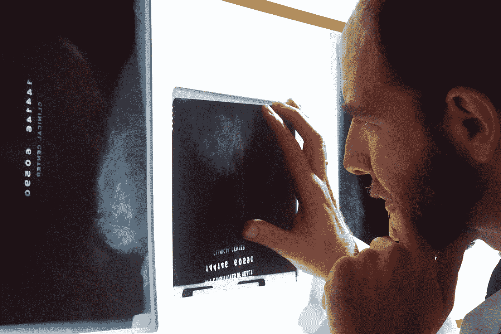
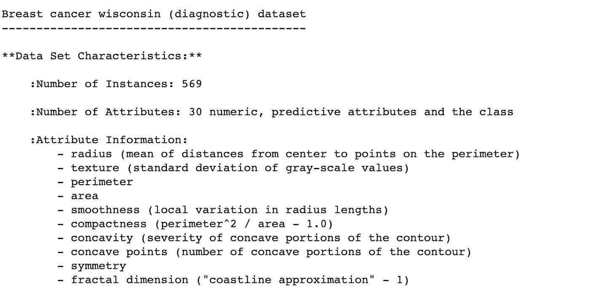
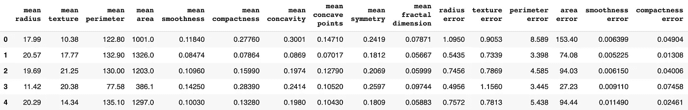
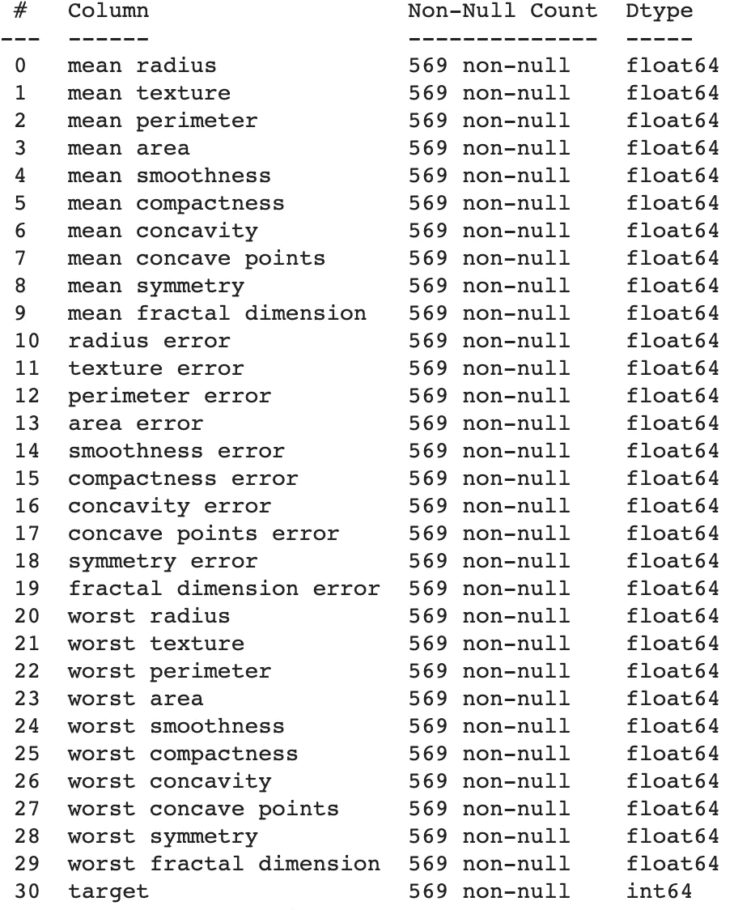

# 如何使用 Scikit-Learn 数据集进行机器学习

> 原文：<https://towardsdatascience.com/how-to-use-scikit-learn-datasets-for-machine-learning-d6493b38eca3?source=collection_archive---------6----------------------->

## 我们将探索乳腺癌数据集，并创建一个肿瘤分类模型



[国立癌症研究所](https://unsplash.com/@nci?utm_source=medium&utm_medium=referral)在 [Unsplash](https://unsplash.com?utm_source=medium&utm_medium=referral) 上拍摄的照片

Scikit-Learn 提供干净的数据集供您在构建 ML 模型时使用。当我说清洁时，我指的是准备好用于训练 ML 模型的清洁类型。最精彩的部分？这些数据集与 Scikit-Learn 包本身一起提供。你不需要下载任何东西。只需几行代码，您就可以处理数据。

> 拥有现成的数据集是一项巨大的资产，因为您可以直接创建模型，而不必花费时间来获取、清理和转换数据，而这正是数据科学家花费大量时间的事情。

即使所有的基础工作都已完成，您可能会发现使用 Scikit-Learn 数据集一开始会有点混乱。不要担心，几分钟后你将确切地知道如何使用数据集，并在探索人工智能世界的道路上前进。本文假设您已经安装了 python、scikit-learn、pandas 和 Jupyter Notebook(或者您可以使用 Google Collab)。我们开始吧。

# Scikit-Learn 数据集简介

Scikit-Learn 提供了七个数据集，他们称之为玩具数据集。不要被“玩具”这个词所迷惑。这些数据集非常强大，可以作为学习 ML 的一个强有力的起点。以下是一些数据集以及如何使用 ML:

*   波士顿房价-使用 ML 根据该城镇的房间数量、犯罪率等属性来预测房价
*   乳腺癌威斯康星州(诊断)数据集-使用 ML 将癌症扫描诊断为良性(不会扩散到身体其他部位)或恶性(扩散到身体其他部位)
*   葡萄酒识别—使用 ML 根据化学特征识别葡萄酒的类型

在本文中，我们将使用“威斯康星州乳腺癌”数据集。我们将导入数据并理解如何读取它。作为奖励，我们将建立一个简单的 ML 模型，能够将癌症扫描分类为恶性或良性。要阅读更多关于数据集的信息，请点击这里获取 Scikit-Learn 的文档。

# 我如何导入数据集？

数据集可以在`sklearn.datasets.`让我们导入数据中找到。我们首先导入保存所有七个数据集的`datasets`。

```
from sklearn import datasets
```

每个数据集都有一个用于加载数据集的相应函数。这些函数遵循相同的格式:“load_DATASET()”，其中 DATASET 是指数据集的名称。对于乳腺癌数据集，我们使用`load_breast_cancer()`。类似地，对于葡萄酒数据集，我们将使用`load_wine()`。让我们加载数据集，并将其存储到一个名为 data 的变量中。

```
data = datasets.load_breast_cancer()
```

到目前为止，一切顺利。这些加载函数(如`load_breast_cancer()`)不会以我们期望的表格格式返回数据。他们返回一个`Bunch`对象。不知道什么是`Bunch`？别担心。

> 把一个`**Bunch object**` 想象成 Scikit-Learn 对一本字典的别出心裁的名字


照片由 [Edho Pratama](https://unsplash.com/@edhoradic?utm_source=medium&utm_medium=referral) 在 [Unsplash](https://unsplash.com?utm_source=medium&utm_medium=referral) 上拍摄

让我们快速回忆一下字典。字典是一种将数据存储为键和值的数据结构。把字典想象成你所熟悉的那本字典。您搜索单词(关键字)，并获得它们的定义(值)。在编程中，你可以选择任意的键和值(单词，数字等等。).例如，为了存储电话簿，键可以是姓名，值可以是电话号码。所以你看，Python 中的字典不仅仅局限于你熟悉的典型字典，而是可以应用于你喜欢的任何东西。

# 我们的字典里有什么(Bunch)？

Scikit 的字典还是`Bunch`真的很厉害。让我们从看它的检索表开始。

```
print(data.keys())
```

我们得到以下密钥:

*   `data`是所有的特征数据(帮助我们识别肿瘤是恶性还是良性的扫描的属性，如半径、面积等。)在 NumPy 数组中
*   `target`是 NumPy 数组中的目标数据(要预测的变量，在本例中为肿瘤是恶性还是良性)，

这两个键是实际数据。其余的键(如下)用于描述目的。值得注意的是，所有的 Scikit-Learn 数据集都分为`data`和`target`。`data`表示特征，这些特征是帮助模型学习如何预测的变量。`target` 包括实际标签。在我们的例子中，目标数据是将肿瘤分类为 0 表示恶性或 1 表示良性的一列。

*   `feature_names`是特征变量的名称，换句话说就是`data`中列的名称
*   `target_names`是目标变量的名称，换句话说就是`target`列的名称
*   `DESCR`，DESCRIPTION 的简称，是对数据集的描述
*   `filename`是 CSV 格式数据的实际文件的路径。

要查看一个键的值，您可以键入`data.KEYNAME`,其中 KEYNAME 表示键。所以如果我们想看数据集的描述，

```
print(data.DESCR) 
```

以下是输出的预览(完整描述太长，无法包含):



Scikit-Learn 乳腺癌数据集描述

您也可以通过访问 [Scikit-Learn 的文档](https://scikit-learn.org/stable/modules/generated/sklearn.datasets.load_boston.html#sklearn.datasets.load_boston)来查看数据集信息。他们的文档可读性更好，也更整洁。

# 使用数据集

现在我们已经了解了 load 函数返回的内容，让我们看看如何在 ML 模型中使用数据集。首先，如果您想探索数据集，可以使用`pandas`来完成。方法如下:

```
# Import pandas
import pandas as pd# Read the DataFrame, first using the feature data
df = pd.DataFrame(data.data, columns=data.feature_names)# Add a target column, and fill it with the target data
df['target'] = data.target# Show the first five rows
df.head()
```



数据框的裁剪视图(不包括所有列)

你应该感到骄傲。您已经将一个数据集加载到一个 Pandas 数据框架中，该数据框架已准备好供探索和使用。要真正看到这个数据集的价值，运行

```
df.info()
```



df.info()输出—注意没有丢失值

有几件事需要注意:

*   没有任何缺失值，所有列都有 569 个值。这为我们节省了计算缺失值的时间。
*   所有的数据类型都是数字。这很重要，因为 Scikit-Learn 模型不接受分类变量。在现实世界中，当我们得到分类变量时，我们将它们转换成数值变量。Scikit-Learn 的数据集没有分类变量。

因此，Scikit-Learn 负责数据清理工作。他们的数据集非常有价值。通过使用它们，你将从学习 ML 中受益。

# 让我们做一些人工智能

最后，激动人心的部分。让我们建立一个模型，将癌症肿瘤分为恶性(扩散)或良性(非扩散)。这将向您展示如何将数据用于您自己的模型。我们将构建一个简单的 K 近邻模型。

首先，让我们将数据集一分为二，一个用于训练模型，为其提供学习数据，另一个用于测试模型，查看模型对以前从未见过的数据(扫描)的执行情况。

```
# Store the feature data
X = data.data# store the target data
y = data.target# split the data using Scikit-Learn's train_test_splitfrom sklearn.model_selection import train_test_split
X_train, X_test, y_train, y_test = train_test_split(X, y)
```

这给了我们两个数据集——一个用于训练，一个用于测试。让我们开始训练模型。

```
from sklearn.neighbors import KNeighborsClassifier
logreg = KNeighborsClassifier(n_neighbors=6)logreg.fit(X_train, y_train)
logreg.score(X_test, y_test)
```

有没有得到 0.909 的输出？这意味着模型有 91%的准确性！是不是很神奇？在短短几分钟内，你就建立了一个对癌症扫描进行分类的模型，准确率高达 90%。当然，在现实世界中要比这复杂得多，但是你已经有了一个很好的开始。通过尝试使用 Scikit-Learn 的数据集建立模型，您将学到很多东西。如果有疑问，就用谷歌搜索你的任何问题。有一个巨大的机器学习社区，很可能你的问题以前被问过。快乐 AI 学习！