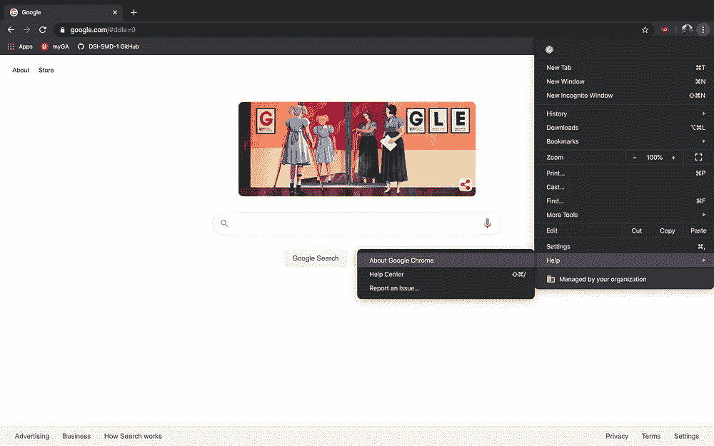
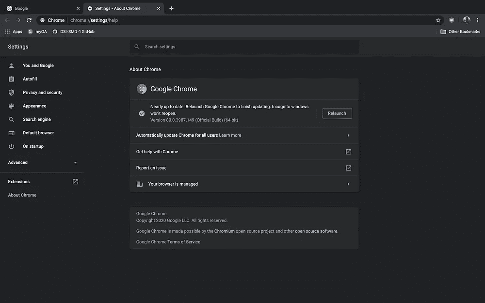
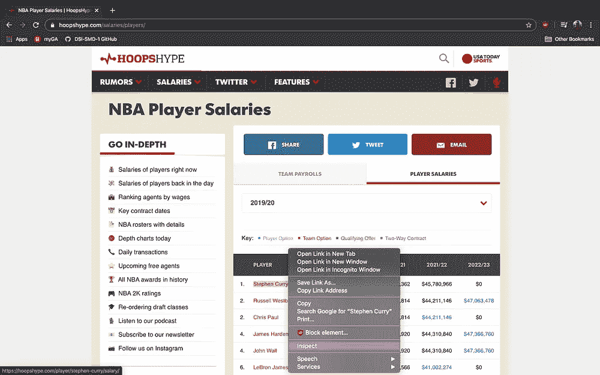
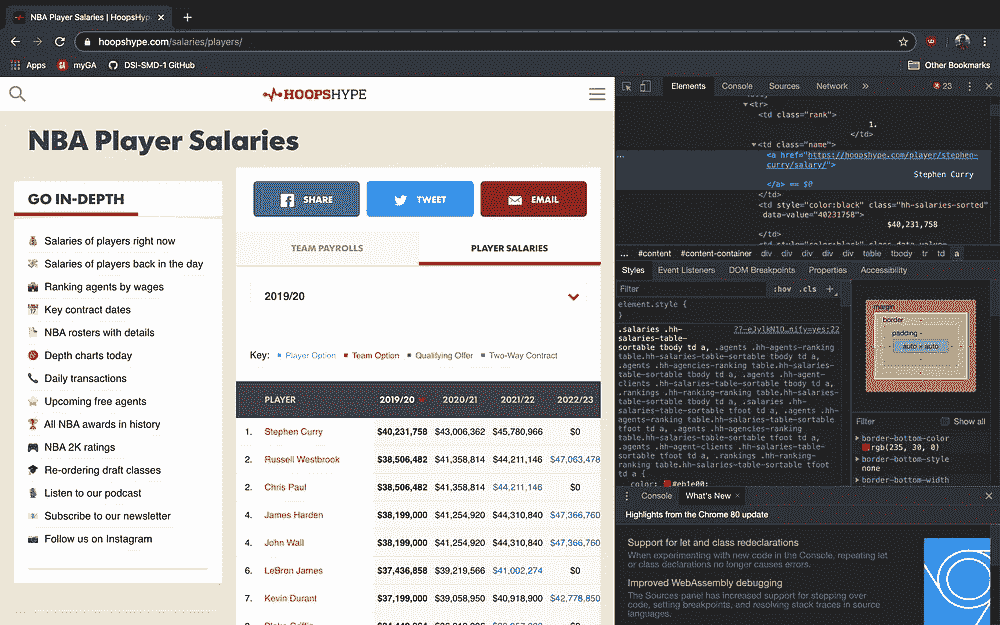
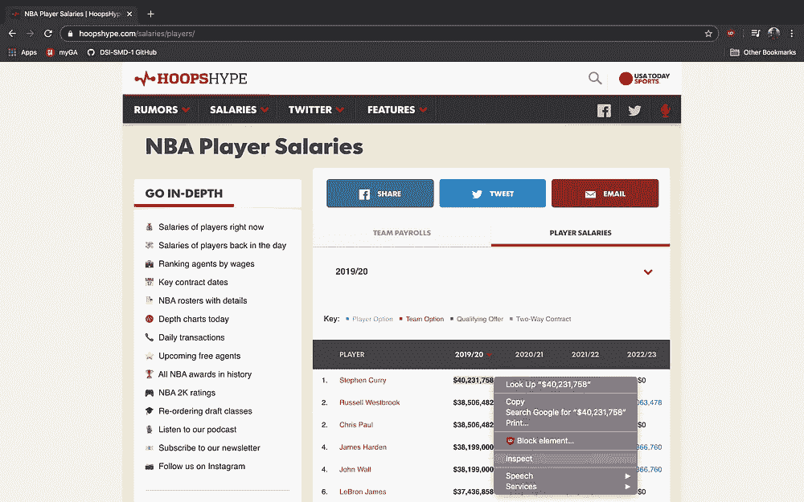
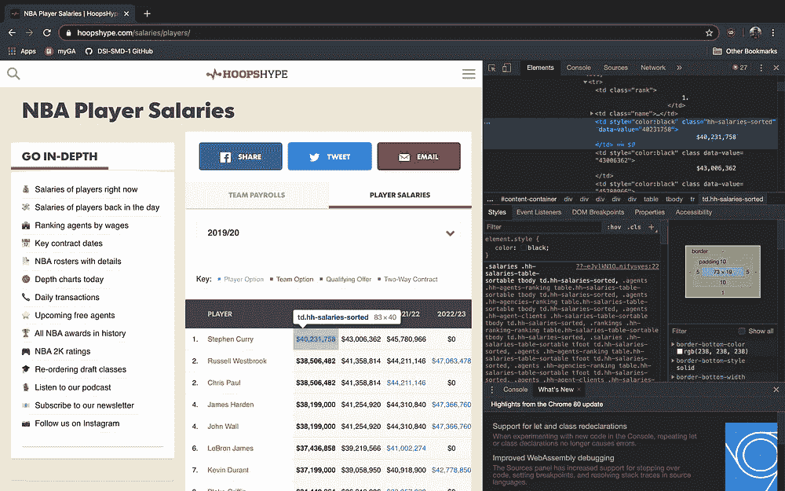
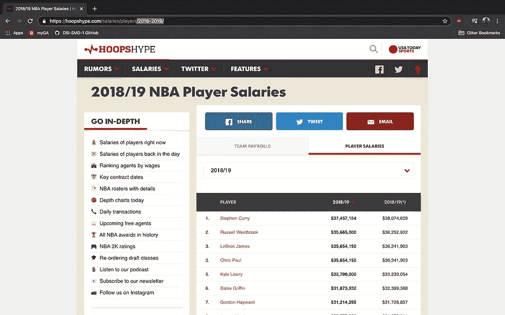
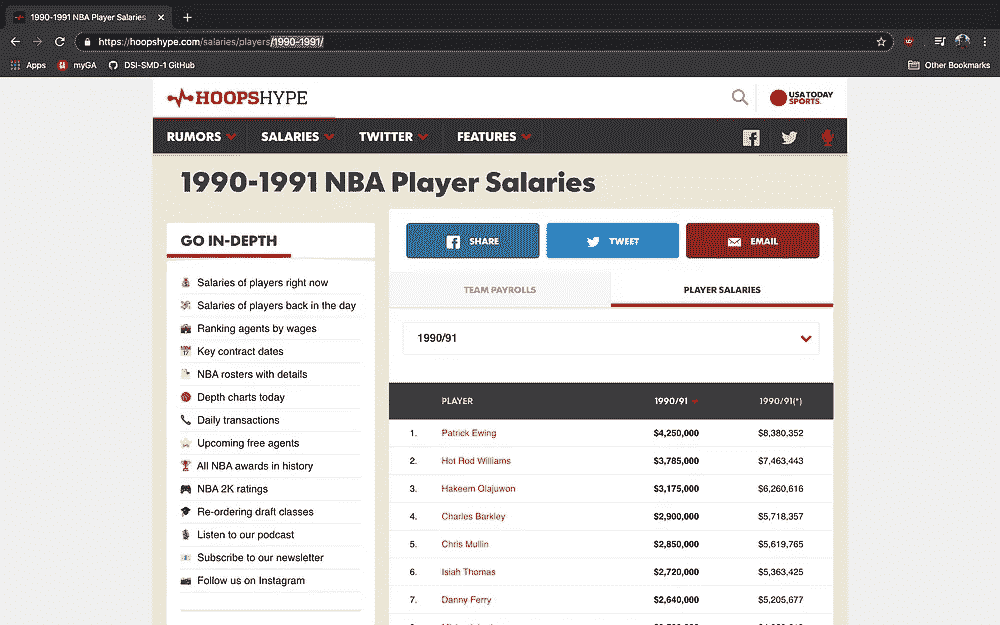

# 如何使用 Selenium 进行网页抓取并举例说明

> 原文：<https://towardsdatascience.com/how-to-use-selenium-to-web-scrape-with-example-80f9b23a843a?source=collection_archive---------2----------------------->

## 使用 Selenium 从 Hoopshype.com 收集 NBA 球员的姓名和薪水


照片由 [JC Gellidon](https://unsplash.com/@jcgellidon?utm_source=medium&utm_medium=referral) 在 [Unsplash](https://unsplash.com?utm_source=medium&utm_medium=referral)

Selenium 是一个 Python 库和工具，用于自动化 web 浏览器来完成许多任务。其中之一是网络搜集，以提取有用的数据和信息，否则可能无法获得。这里有一个如何使用 Selenium 的分步指南，以从 https://hoopshype.com/salaries/players/[网站](https://hoopshype.com/salaries/players/)提取 NBA 球员工资数据为例。

# 步骤 1 —安装和导入

```
pip install selenium
```

安装完成后，就可以开始导入了。

```
from selenium import webdriver
from selenium.webdriver.common.keys import Keys
import pandas as pd
```

# 步骤 2 —安装并访问网络驱动程序

网络驱动是这一过程的重要组成部分。它实际上会自动打开你的浏览器来访问你选择的网站。根据您使用哪种浏览器浏览互联网，此步骤会有所不同。我正好用谷歌 Chrome。有人说 Chrome 与 Selenium 配合使用效果最好，尽管它也支持 Internet Explorer、Firefox、Safari 和 Opera。对于 chrome，你首先需要在 https://chromedriver.chromium.org/downloads[下载网络驱动。根据您的 Chrome 版本，有几种不同的下载选项。要找到你的 Chrome 版本，点击浏览器窗口右上角的 3 个垂直点，向下滚动帮助，选择“关于谷歌 Chrome”。在那里你会看到你的版本。我的版本是 80.0.3987.149，如下图所示。](https://chromedriver.chromium.org/downloads)



现在，您需要知道您在本地计算机上保存 webdriver 下载的位置。我的只是保存在我默认的下载文件夹中。现在，您可以使用下载的 webdriver 的直接路径来创建一个驱动程序变量。

```
driver = webdriver.Chrome('/Users/MyUsername/Downloads/chromedriver')
```

# 步骤 3-通过 Python 访问网站

非常简单但非常重要的一步。你需要你的代码来打开你试图抓取的网站。

```
driver.get('[https://hoopshype.com/salaries/players/](https://hoopshype.com/salaries/players/)')
```

运行时，该代码片段将打开浏览器访问您想要的网站。

# 第 4 步—找到您正在搜集的特定信息

为了提取您想要搜集的信息，您需要定位元素的 XPath。XPath 是一种用于查找网页上任何元素的语法。要定位元素的 XPath，突出显示您要查找的列表中的第一个元素，右键单击并选择 inspect 这打开了开发者工具。对于我的例子，我首先想定位 NBA 球员的名字，所以我首先选择斯蒂芬·库里。



在开发者工具中，我们现在看到元素“斯蒂芬·库里”就是这样出现的。

> <a href = "">
> 斯蒂芬·库里< /a >
> < /td >

这个元素可以很容易地转换成它的 XPath，但是首先，我们需要记住，我们不只是试图定位这个元素，而是所有玩家的名字。使用相同的过程，我找到了列表中的下一个元素，拉塞尔·维斯特布鲁克。

> <a href = "">
> 拉塞尔·维斯特布鲁克< /a >
> < /td >

这两个(以及所有其他玩家名字)之间的共同点是`<td class=”name”>`，所以我们将使用它来创建一个包含所有玩家名字的*列表。翻译成 XPath 看起来像`//td[@class=”name”]`。分解一下，所有的 XPaths 前面都有一个**双斜线**，我们希望它出现在一个 **td** 标签中，在那个 **td** 标签中的每个**类**需要对应于**【name】**。我们现在可以用这个 Selenium 函数创建球员姓名列表。*

```
players = driver.find_elements_by_xpath('//td[[@class](http://twitter.com/class)="name"]')
```

现在，为了将每个玩家的名字放入一个列表中，我们编写了这个函数。

```
players_list = []
for p in range(len(players)):
    players_list.append(players[p].text)
```

按照同样的过程来获得球员的薪水…



斯蒂芬·库里 2019/20 工资

> </TD>40231758 美元

拉塞尔·威斯布鲁克 2019/20 赛季薪资

> </TD>38，506，482 美元

在检查这些元素并转换成 XPath 时，我们可以忽略样式和数据值，只关心类。

```
salaries = driver.find_elements_by_xpath('//td[[@class](http://twitter.com/class)="hh-salaries-sorted"]')
```

和工资清单文本…

```
salaries_list = []
for s in range(len(salaries)):
    salaries_list.append(salaries[s].text)
```

# 第五步——申请每一年，把所有的事情联系起来

通常，在使用 Selenium 时，您会试图检索位于同一网站的多个不同页面上的数据。在我的例子中，hoopshype.com 有追溯到 1990/91 赛季的 NBA 薪资数据。



正如你所看到的，每个季节的 URL 之间的差异只是被包含在最后的年份的问题。所以 2018/19 赛季的网址是[https://hoopshype.com/salaries/players/2018-2019/](https://hoopshype.com/salaries/players/2018-2019/)，1990/91 赛季的网址是[https://hoopshype.com/salaries/players/1990-1991/](https://hoopshype.com/salaries/players/1990-1991/)。这样，我们可以创建一个函数，循环遍历每一年，分别访问每个 URL，然后将我们之前展示的每一年的所有步骤放在一起。我还将每个球员与他们在该赛季的工资配对在一起，放入一个临时数据帧中，将年份添加到该临时数据帧中，然后将该临时数据帧添加到一个主数据帧中，该主数据帧包含了我们获得的所有数据。最后的代码在下面！