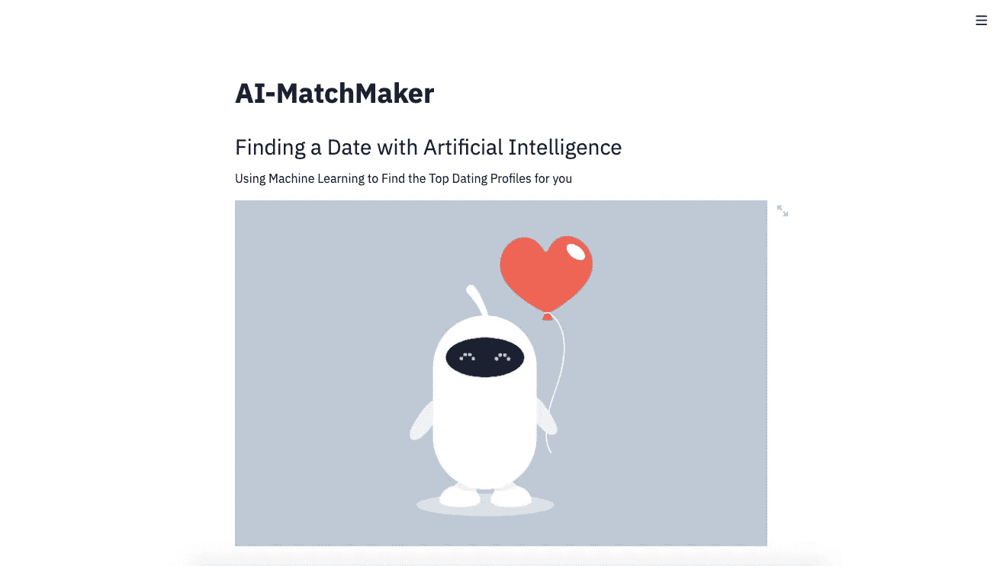
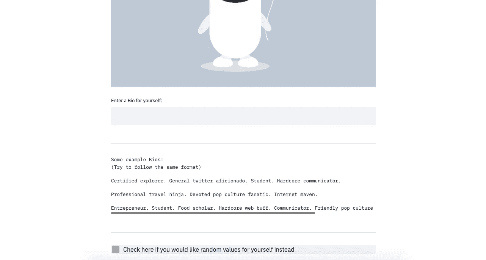
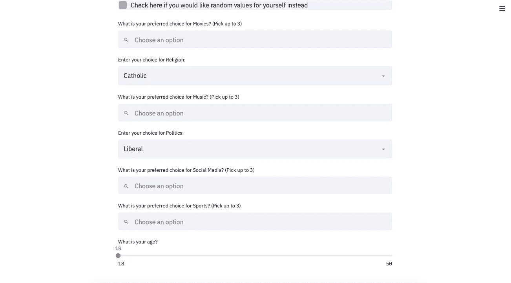
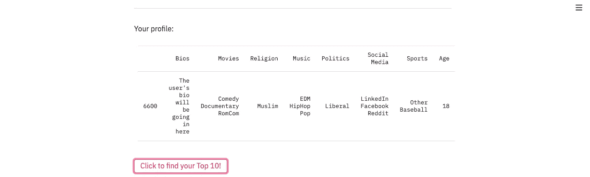
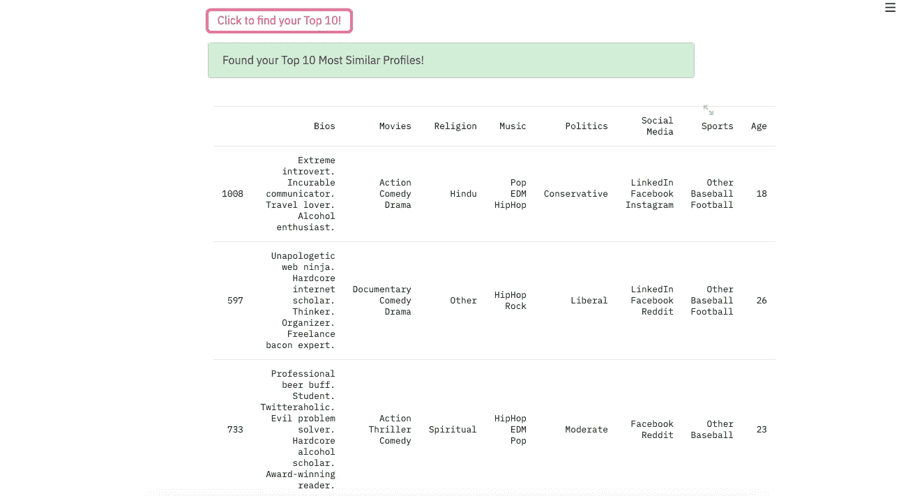

# 我如何使用 Streamlit 构建 Web 应用程序

> 原文：<https://towardsdatascience.com/how-to-use-streamlit-to-create-web-applications-218af44064f5?source=collection_archive---------8----------------------->

## 用于构建 Web 应用的 Streamlit 和 Python


威廉·艾文在 [Unsplash](https://unsplash.com?utm_source=medium&utm_medium=referral) 上的照片

W 说到网站设计，整体架构和建设是由前端开发人员负责的。这些开发人员接受想法和图像，并将其翻译成代码，以便这些想法和图像能够适当地显示在网站上。数据科学家通常不处理前端开发，更专注于应用程序或网站的内部功能。他们更专注于开发的后端。因此，许多数据科学家可能对开发前端应用程序来显示他们的数据科学项目的概念感到不舒服。但是，有一个简单的解决方案可以使前端开发的编码更加简单。

那个解决方案就是一个叫做— [**Streamlit**](https://docs.streamlit.io/) 的 Python 库！

*Streamlit* 是一个开源的 Python 库，它使得 web 应用程序的开发变得更加简单，也更加美观。像许多其他 Python 库一样，这个库使复杂的技术性任务对数据科学家来说变得更加容易。为数据科学项目编写前端代码的过程不再像以前那样耗时耗力。

> [在这里注册一个中级会员，可以无限制地访问和支持像我这样的内容！在你的支持下，我赚了一小部分会费。谢谢！](https://marco-santos.medium.com/membership)

# 在项目中使用 Streamlit

为了演示 Streamlit 的使用流程，我们将从一个数据科学项目开始:

> 人工智能媒人

并转换项目中的代码，使其具有交互性和视觉吸引力。

## 项目:人工智能媒人

作为这个项目的一点背景，主要思想是实现无监督的机器学习，将约会简档聚集在一起，然后在它们各自的簇内匹配它们。这将潜在地减少不兼容的匹配，并增加兼容的简档找到彼此的可能性。要了解有关该项目的编码和开发的更多信息，请单击下面的文章:

[](/dating-algorithms-using-machine-learning-and-ai-814b68ecd75e) [## 我用机器学习和人工智能做了一个约会算法

### 为约会应用程序利用无监督机器学习

towardsdatascience.com](/dating-algorithms-using-machine-learning-and-ai-814b68ecd75e) 

本文更深入地研究了所使用的聚类算法，以及用我们自己定制的约会资料数据集来创建和编码这些算法的过程。

## 与项目互动

这个项目的性质只是乞求用户的互动。如果我们有一个只是演示的约会算法，那有什么用呢？为了展示这个项目的全部范围和使用机器学习进行约会配置匹配的能力，我们必须能够与算法进行交互，并从用户输入数据。

在这里我们可以实现 *Streamlit* 来创建一个任何人都可以与之交互的简单用户界面。

# 创建 Streamlit 应用程序

为了运行 streamlit，我们必须先 [*安装 Streamlit 库*](https://docs.streamlit.io/) 。安装完成后，创建一个空的`.py`文件，我们将使用它来编写应用程序正常运行所需的所有代码。您可以随意使用任何 IDE。

## 导入库

让我们从导入我们将使用的库和数据集开始。

在这里，我们正在加载我们的应用程序运行所需的所有库。数据集存储在`.pkl`文件中。本文介绍了这些数据集的来源:

[](/generating-fake-dating-profiles-for-data-science-cd3b929972bc) [## 我为数据科学制作了 1000 份假的约会资料

### 我如何使用 Python Web Scraping 创建约会档案

towardsdatascience.com](/generating-fake-dating-profiles-for-data-science-cd3b929972bc) 

但是，我们改进了这个过程，以接受实际的标签或类别，而不是之前的数值，这可以在下面的 Github 链接中看到:

[](https://github.com/marcosan93/AI-Matchmaker/blob/master/Refining-Profile-Data.ipynb) [## Marcos an 93/人工智能媒婆

### permalink dissolve GitHub 是 4000 多万开发人员的家园，他们一起工作来托管和审查代码，管理…

github.com](https://github.com/marcosan93/AI-Matchmaker/blob/master/Refining-Profile-Data.ipynb) 

我们导入的下一个东西是用于用户输入数据的分类模型。如果你觉得有必要了解我们是如何对新用户数据进行分类的，那么看看这篇文章:

[](https://medium.com/swlh/how-a-dating-app-handles-new-profiles-part-2-fca4f13b5205) [## 约会应用如何处理新的个人资料？(第二部分)

### 使用无监督的机器学习用于新的约会简档

medium.com](https://medium.com/swlh/how-a-dating-app-handles-new-profiles-part-2-fca4f13b5205) 

# 助手功能和类别

为了组织我们的脚本，当我们在 Streamlit 中运行我们的脚本时，我们必须创建一些助手函数来简化这个过程。我们稍后将使用这些函数。

让我们解释一下这些功能的作用:

*   `string_convert()`函数处理我们的原始数据。由于我们的数据集中的一些行和新的用户数据包含列表，因此该函数将这些列表转换为字符串数据类型，以便进行矢量化。
*   `vectorization()`函数创建每一列中使用的单词数组，然后删除相应的列。这为每行创建了一个包含字向量的大数据帧。该函数还对新用户输入的单词进行矢量化处理。
*   `scaling()`函数缩放矢量化的 DF 以及新的用户数据。
*   `top_ten()`函数组织 DF，并找出每个配置文件之间的相关性。然后，它根据新用户数据对相关数据进行排序。然后，它缩小到与新用户数据相关的前 10 个相似简档，然后返回这些简档的 DF。
*   `example_bios()`函数主要是为 streamlit app 创建的，通过显示数据集中的随机 bios。其目的是让用户在撰写自己的简历时作为参考。

## 类别和概率

这里使用的类别是每个配置文件可供选择的选项。它也是供用户在他们自己的约会简档中输入的选择列表。

为了准确地表示每个虚假简介的选择，每个选择的概率是基于每个选择的受欢迎程度而建立的。当随机选择时，这些概率将被考虑在内。

当一个新用户与应用程序交互时，他们会看到上面为他们的约会档案中的每个类别所做的选择。

# 编码 Streamlit 部分

现在，这就是 streamlit 库的用武之地。在这里，我们将开始使用 streamlit 函数，以便我们的应用程序能够顺利运行。[点击此处查找以下所有功能的文档](https://docs.streamlit.io/api.html)。

## 标题和页眉

```
# Creating the Titles and Image
st.title("AI-MatchMaker")st.header("Finding a Date with Artificial Intelligence")
st.write("Using Machine Learning to Find the Top Dating Profiles for you")image = Image.open('robot_matchmaker.jpg')st.image(image, use_column_width=True)
```

上面的代码告诉 streamlit 显示 web 应用程序的标题、标题和图像。这将是用户在看到页面时首先看到的东西之一。



上面的代码显示了什么

## 输入新用户简介

```
# Instantiating a new DF row to classify later
new_profile = pd.DataFrame(columns=df.columns, 
                           index=[df.index[-1]+1])# Asking for new profile data
new_profile['Bios'] = st.text_input("Enter a Bio for yourself: ")# Printing out some example bios for the user        
example_bios()# Checking if the user wants random bios instead
random_vals = st.checkbox("Check here if you would like 
                           random values for yourself instead")
```

在这里，我们正在接受新的数据，算法将使用这些数据来查找前 10 个最相似的配置文件。这些信息将被储存在熊猫数据库中。我们也使用我们的`example_bios()`功能来显示随机的 bios 示例供用户参考。我们正在使用 Streamlit 的功能来接受文本输入，以及一个可选的复选框，如果他们选择这样做，将随机选择类别。



使用上面的 streamlit 代码时会看到什么

## 输入新的用户选择

接下来，我们将让用户做出选择，如果他们选择不随机化他们的选择。

这里我们做一个检查，看看用户是否勾选了要求随机值的复选框。如果他们选择了随机值，那么新的用户配置文件将包含为他们选择的随机值。但是，如果他们选择为自己选择值，那么他们将能够为自己选择值。

通过使用 streamlit 的`multiselect()`函数，我们可以让用户为指定的类别选择尽可能多的选项。`slider()`功能将允许用户通过与滑块小部件交互来选择他们的年龄。除了用户只能选择一个选项之外，`selectbox()`功能的作用类似于多选。

选择数据后，第一个格式化过程开始，将从`multiselect()`函数给出的列表转换成字符串和数据集的其余部分。这个过程是通过在循环中实现我们的`string_convert()`函数来完成的。



在这里，用户可以为呈现的每个类别进行选择

## 新的用户配置文件

在用户选择了类别并输入了自己的个人资料后，他们将会看到基于以下代码的约会资料:

```
# Displaying the User's Profile 
st.write("-"*1000)
st.write("Your profile:")
st.table(new_profile)# Push to start the matchmaking process
button = st.button("Click to find your Top 10!")
```



新用户的约会档案

从这里，用户可以更新他们的个人资料，如果他们希望改变他们的一些选择，或者他们可以通过单击突出显示的按钮继续找到他们的前 10 个约会资料。

## 寻找前 10 名

```
if button:    
    with st.spinner('Finding your Top 10 Matches...'):
        # Vectorizing the New Data
        df_v, input_df = vectorization(df, df.columns, new_profile)

        # Scaling the New Data
        new_df = scaling(df_v, input_df)

        # Predicting/Classifying the new data
        cluster = model.predict(new_df)

        # Finding the top 10 related profiles
        top_10_df = top_ten(cluster, vect_df, new_df)

        # Success message   
        st.success("Found your Top 10 Most Similar Profiles!")    
        st.balloons() # Displaying the Top 10 similar profiles
        st.table(top_10_df)
```

单击按钮时，将执行以下代码。点击后，由于`with st.spinner():` streamlit 动画，将弹出加载或进度通知。这个进度条将一直显示，直到它下面的所有代码都执行完毕。

在 spinner 函数的下面，我们之前定义的 helper 函数将被执行，以根据我们新的用户配置文件数据找到前 10 个配置文件。找到前 10 个配置文件后，将执行 streamlit 的`success()` ( *显示成功通知*)和`balloons()` ( *用动画庆祝气球*短暂覆盖页面)函数。这些功能并不是完全必要的，但是它们可以使这个过程在视觉上更吸引人。

该过程完成后，将显示前 10 个相似的配置文件:



用户的前 10 名(需要向下滚动查看更多)

# 结论

我们已经成功地为我们的约会算法编写了一个 streamlit 应用程序！但是为了查看该应用程序的所有优点，您需要在命令终端中运行该应用程序。( [*点击此处了解更多信息*](https://docs.streamlit.io/main_concepts.html) )。一旦我们在终端中运行了应用程序，我们就可以随心所欲地与它进行交互。

现在可能有一些潜在的方法来改进整个项目和演示，所以可以随意修改代码。另一个大大改进这个项目的方法是，只要给他们一个应用程序的链接，任何人都可以使用这个应用程序。这需要通过使用 AWS 或 Heroku 将应用程序托管在云上。请关注下一篇文章，它将深入研究在云上部署应用程序！

## 查看后续文章，我们开发了一个网站来托管我们的 Streamlit 应用程序:

[](/creating-a-website-to-host-your-python-web-application-f06f694a87e8) [## 我如何用 Python 和 AWS 制作一个网站

### 一步一步的教程

towardsdatascience.com](/creating-a-website-to-host-your-python-web-application-f06f694a87e8) 

[*在 Twitter 上关注我:@_Marco_Santos_*](https://twitter.com/_Marco_Santos_)

# 资源

[](https://github.com/marcosan93/AI-Matchmaker) [## Marcos an 93/人工智能媒婆

### 使用无监督机器学习和 NLP - marcosan93/AI-Matchmaker 的匹配简档

github.com](https://github.com/marcosan93/AI-Matchmaker) [](/dating-algorithms-using-machine-learning-and-ai-814b68ecd75e) [## 我用机器学习和人工智能做了一个约会算法

### 为约会应用程序利用无监督机器学习

towardsdatascience.com](/dating-algorithms-using-machine-learning-and-ai-814b68ecd75e) [](/generating-fake-dating-profiles-for-data-science-cd3b929972bc) [## 我为数据科学制作了 1000 份假的约会资料

### 我如何使用 Python Web Scraping 创建约会档案

towardsdatascience.com](/generating-fake-dating-profiles-for-data-science-cd3b929972bc) [](https://medium.com/swlh/how-a-dating-app-handles-new-profiles-part-2-fca4f13b5205) [## 约会应用如何处理新的个人资料？(第二部分)

### 使用无监督的机器学习用于新的约会简档

medium.com](https://medium.com/swlh/how-a-dating-app-handles-new-profiles-part-2-fca4f13b5205)