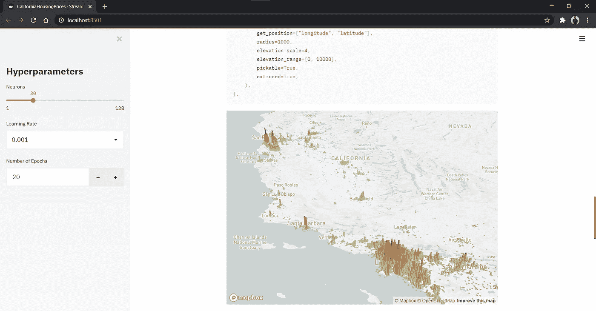
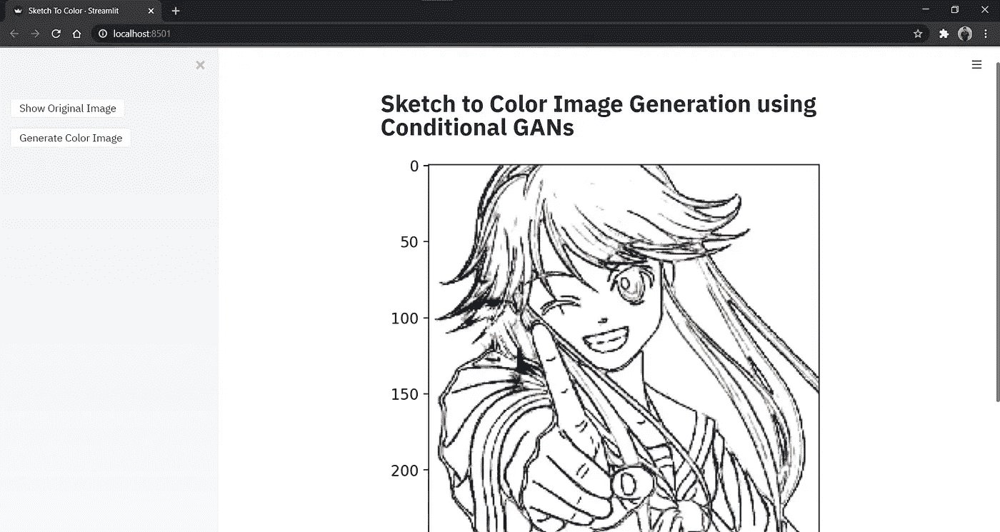

# 如何使用 Streamlit 部署包装在漂亮的 Web 应用程序中的 ML 模型

> 原文：<https://towardsdatascience.com/how-to-use-streamlit-to-deploy-your-ml-models-wrapped-in-beautiful-web-apps-66e07c3dd525?source=collection_archive---------20----------------------->

## 简化快速简单的机器学习 Web 应用程序

## 不要浪费时间去学 Django 或者 Flask！

## 不要把时间浪费在学习 Django 或者 Flask 上，多关注机器学习部分！

加州房价预测——Streamlit Web 应用程序(图片由作者提供)

如果你像我或任何其他机器学习爱好者一样，对你来说最糟糕的噩梦，显然不是 Cuda 错误，必须在其他地方部署模型，以在互联网上向你的朋友和网络展示你的工作。有许多方法可以解决这一问题，但在本文中，我将与您分享为什么我认为 Streamlit 是 it 的首选解决方案。

为了使这篇文章有条理并易于参考，让我们把它分成几个部分，这样你就可以直接跳到对你来说重要的部分。

*   有哪些选择？
*   *为什么要简化？*
*   *如何用现有的 ML 代码制作一个 Streamlit Web 应用程序？*
*   *如何部署 Streamlit Web App？*
*   *结论*

## 可供选择的事物

还有一些其他的方法来部署 ML web 应用程序，但是它们都有一些缺点，最明显的一个缺点是没有什么比 Streamlit 更简单快捷了。

T**ensor flow . js**是 TensorFlow 官方使用 Javascript 部署 ML 模型的方式。这是一种将简单的 ML 模型快速部署到 Web 上的非常棒的方式，但是当涉及到复杂的模型时，许多模型还不被这个库支持，并且不是所有在 Python 中工作的模型都能保证在 Javascript 中以相同的方式工作。

**即使我说的是快速，它仍然需要比 Streamlit 更多的工作和时间！*

 [## 面向 Javascript 开发人员的机器学习

### 在浏览器、Node.js 或 Google 云平台中训练和部署模型。TensorFlow.js 是开源的 ML 平台…

www.tensorflow.org](https://www.tensorflow.org/js) 

lask 是 python 中的一个小框架，它允许你使用你的 Python 技能来开发和部署 web 应用。如果你把它和 Streamlit 相比，你将需要更多的时间来编码和设计一个像样的 web 应用。

 [## 欢迎使用 Flask — Flask 文档(1.1.x)

### 欢迎阅读 Flask 的文档。开始安装，然后了解快速入门概述。有…

flask.palletsprojects.com](https://flask.palletsprojects.com/en/1.1.x/) 

D 是一个基于 Python 的 web 开发框架。使用这个框架来部署你的 ML 模型是一个很好的方法，它被包装在一个 web 应用程序中，但是这将需要大量的时间和对框架的理解。

 [## 姜戈

### Django 软件基金会非常重视我们开发人员、用户和社区的多样性。我们心烦意乱…

www.djangoproject.com](https://www.djangoproject.com/) 

## 为什么选择 STREAMLIT？

机器学习爱好者不应该浪费时间学习 web 开发，这样他们就可以专注于他们的目标，即构建更好的模型！

这正是 ***Streamlit*** 帮助我们的方式。这是构建 web 应用程序的最简单快捷的方法，它可以使用令人敬畏的 UI 元素和 Markdown 吸引人地呈现您的 ML 模型和数据。

 [## Streamlit —创建数据应用程序的最快方式

### Streamlit 是一个面向机器学习和数据科学团队的开源应用框架。在…中创建漂亮的数据应用程序

www.streamlit.io](https://www.streamlit.io/) 

现在，在多次称赞 Streamlit 使用简单快捷之后，我这么说是什么意思呢？为了理解这一点，让我和你们分享一下我是如何偶然发现这个惊人的框架的。

我对生成对抗网络感兴趣，目前，我正在探索和构建一些使用不同种类的 GANs 的项目。为了分享我的探索之旅并记录我的项目，我开始撰写 [GANs 系列](https://towardsdatascience.com/tagged/gans-series)，这是一系列关于 GANs 及其实现的文章。

我遇到的最大障碍是无法部署一个将黑白草图图像转换为彩色图像的条件 GAN 模型。我在生成器模型中使用的模型架构是一个 U-Net 模型，它有相当多的跳跃连接。你可以从[这篇文章](/generative-adversarial-networks-gans-89ef35a60b69?source=friends_link&sk=635c457c652ecc8eb92cc6f202565b49)中浏览详细的解释，用一步一步的代码块来训练模型。

U-NET 模型架构—(图片来源:[https://en.wikipedia.org/wiki/U-Net](https://en.wikipedia.org/wiki/U-Net))

我尝试了前面讨论的 web 部署的所有替代方案。这个模型在 TensorFlow.js 中似乎没有预期的效果，我花了将近一周的时间学习和尝试 Django 框架。

这是我偶然看到[Adrien Treuille](/build-an-app-to-synthesize-photorealistic-faces-using-tensorflow-and-streamlit-dd2545828021)[的这篇优秀文章](https://medium.com/u/39dfc90d7a34?source=post_page-----66e07c3dd525--------------------------------)的时候，他展示了他如何使用 Streamlit 在**13 行 Streamlit 代码下为一个 TL-GAN 制作了一个令人印象深刻的具有出色 UI 的 web 应用程序！**

我花了大约 15 分钟在网站上浏览他们的基本文档，当我试图为我的模型实现它时，Adrien 没有夸大其词，我只花了 12 行 Streamlit 代码来加载经过训练的模型，将其包装在下面显示的 UI 中，并为部署做好准备。

使用条件 GAN 生成草图到彩色图像— Streamlit Web 应用程序(图片由作者提供)

## 用现有的 ML 代码制作 WEB 应用程序

> 是的，你没看错，
> 你只需在现有的 Python 文件中添加几个 Streamlit 函数调用，而无需任何 HTML、CSS 或 JAVASCRIPT 代码来设计你的 Web 应用！

您所要做的就是从 pip 安装 Streamlit 包，并在现有的 python 文件中添加一些 Streamlit 函数。要**安装 Streamlit** 只需使用以下命令:

`pip install streamlit`

要检查安装是否成功，并在他们的 **hello world 应用**中探索，只需使用命令:

`streamlit hello`

一旦您安装了您的 Streamlit 并根据您的需求进行了必要的更改，您只需使用一个命令**在本地运行 web 应用程序**。

`streamlit run file_name.py`

***它有各种很酷很有用的功能，比如:***

*   ***保存文件时实时修改***
*   ***只需按下键盘上的 R 键即可重新运行应用***
*   ***只需按键盘上的 C 键*** 即可清除缓存
*   ***录制 web app 并在本地保存一个视频文件与大家分享***
*   ***…还有更多***

我在下面添加了一个 GitHub 要点，向您展示我是如何将 Streamlit 函数调用添加到草图到颜色图像生成模型的现有 python 代码中，使其成为一个功能齐全的 web 应用程序，如上图所示。

*我在添加 Streamlit 代码之前的代码被注释掉，以便更容易看到需要做什么更改。如果您希望看到草图到彩色图像生成模型的代码，您可以浏览此处链接的文章***。**

****就是这样！如果包括导入语句和我实现的其他条件，实际上有 13 行额外代码。****

## *部署 STREAMLIT WEB 应用程序*

*有各种选项可供您部署使用 Streamlit 构建的 web 应用程序。*

*H **eroku** 是一种可靠的方式来部署这些 web 应用程序，而不需要使用任何其他云服务并在其上设置虚拟实例。Heroku 为我们打理一切。但 Heroku 的一个缺点是，它在 dynos 的免费版本中只允许 512MB 的大小，TensorFlow 2.2.0 需要更多的空间来安装。如果您的代码不会中断，您可以使用任何低于 2.0.0 的版本。*

*A**mazon Web Services**是部署 Streamlit 应用程序的另一个好地方，而且比您想象的要简单。只需用 Ubuntu 18.04 或更高版本启动一个新的 EC2 实例，安装依赖项并运行`streamlit run file_name.py`命令。你将获得一个公共网址，你可以与你的朋友和网络在线分享，这样他们就可以通过你的出色的网络应用程序。*

*itHub repository 是为 Streamlit web 应用程序托管代码的另一种很酷的方式。这不能算作一个完整的部署方法，但 Streamlite 的一个优秀特性是**它允许链接到 streamlit run 命令**中的代码。因此，如果用户在他们的系统上安装了所有依赖项以及 Streamlit 包，他们可以通过提供到。py 文件。例如，您可以使用以下命令在您的系统上本地运行 my Streamlit web app:*

*`streamlit run [https://raw.githubusercontent.com/tejasmorkar/housing_price_prediction_aws/master/CaliforniaHousingPrices.py](https://raw.githubusercontent.com/tejasmorkar/housing_price_prediction_aws/master/CaliforniaHousingPrices.py)`*

*treamlit 仍然是一个新的框架，并致力于为其用户带来新的和酷的特性。其中一些将在他们的[路线图](https://github.com/streamlit/streamlit/wiki/Roadmap)中讨论。我期待的最激动人心的功能之一是一键轻松部署 Streamlit Web 应用程序。在[论坛](https://discuss.streamlit.io/t/the-streamlit-roadmap-big-plans-for-2020/2054)中阅读更多信息。*

*这是一个简单的 Web 应用程序的视频，我已经用 Ubuntu 18.04 在 AWS EC2 实例上部署了它。*

*加州房价预测演练视频— Streamlit Web 应用程序*

## *结论*

*所以，这就是为什么我觉得 Streamlit 是一个如此令人印象深刻的框架，可以帮助每个人专注于机器学习开发的重要部分，并释放部署部分所需的压力。*

> *少关注部署，多关注解决 Cuda 错误！*

*要开始使用 Streamlit，只需在链接上跳转到他们提供的官方文档—[https://docs.streamlit.io/en/stable/](https://docs.streamlit.io/en/stable/)*

*如果您对从入门到部署 Streamlit web 应用程序的任何内容有任何疑问，您可以在论坛上搜索或提出新问题。您将找到社区成员和 Streamlit 团队回答的几乎所有问题的解决方案—【https://discuss.streamlit.io/ *

*如果您有任何疑问、建议、错误或反馈，请随时通过任何最适合您的方式联系我！*

## *我的联系信息:*

***邮箱:***[*tejasmorkar@gmail.com*](mailto:tejasmorkar@gmail.com)**LinkedIn**:[*https://www.linkedin.com/in/tejasmorkar*](https://www.linkedin.com/in/tejasmorkar/)*/* **GitHub**:[*https://github.com/tejasmorka*](https://github.com/tejasmorkar)*r*
**Twitter**:[*https://twitter.com/TejasMorka*](https://twitter.com/TejasMorkar)**