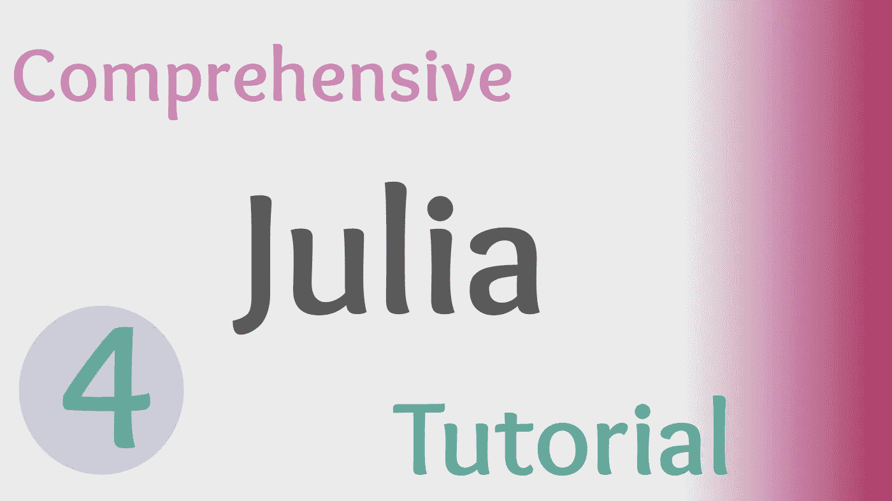
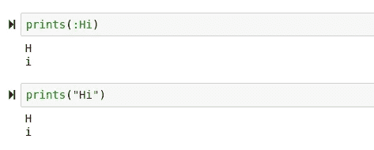

# 如何在 Julia 中使用语法表达式和调度

> 原文：<https://towardsdatascience.com/how-to-use-syntactical-expressions-and-dispatch-in-julia-67ce155e4af9?source=collection_archive---------37----------------------->

## 朱莉娅综合教程

## 朱莉娅的面包和黄油:句法表达和多重调度



(图片作者:)

> 本文视频

> 今日回购:

[](https://github.com/emmettgb/JuliaLessons/tree/master/4) [## emmettgb/JuliaLessons

### 此时您不能执行该操作。您已使用另一个标签页或窗口登录。您已在另一个选项卡中注销，或者…

github.com](https://github.com/emmettgb/JuliaLessons/tree/master/4) 

# 介绍

在过去的几个教程中，我们已经学习了一些相对基础的编程概念，比如类型、循环和函数。所有这些基本技能最终都消失了——这意味着你可以实际练习和学习有趣的东西了！虽然你可能确实需要一些练习来达到这个目标，而且如果你打算认真对待它的话，这将是一个很大的工作量和终生学习的承诺，你正在成为一个伟大的 Julian 开发者！

虽然之前我们没有讨论任何特定于 Julia 语言的内容，但是今天将会有所改变。对于以前编程过的人来说，这是一个理想的地方——但实际上不是在 Julia 中。这意味着很快我们将会使用真正的软件包和解决真正的问题，这将会使这些教程变得更加有用和有趣！

# 不要惊慌

当然，仅仅通过观看一些视频来成为一名程序员是很困难的。幸运的是，我们将重复使用并反复复习我们在这些视频中学到的所有技能。如果你当时没有给予足够的关注，某些事情似乎很容易被掩盖——但是不要担心，你会明白的！

# 句法表达

在 Julia 中，语法表达式是一个奇妙的工具，它使得编写新函数来执行算术变得非常科学和容易。通常，我们可以使用这些表达式将原本需要十到二十行的代码压缩成一两行。在大多数语言中，您会像这样编写一个函数来计算平均值:

```
function mean(x)
    return(sum(x) / length(x))
end
```

在 Julia 中，我们甚至可以更快地完成像这样的小操作:

```
mean(x) = sum(x) / length(x)
```

虽然保存两行代码可能不会令人难以置信地改变生活，但是下一个例子是一个更大的代码压缩！：

```
function Normalize(array)
    q = std(array)
    avg = mean(array)
    [i = (i-avg) / q for i in array]
end
```

此标准化函数获取平均值和标准偏差，并将其放入公式中，以便对数据进行标准化。这在统计学中被称为数据的“正态分布”对于这样的函数来说，四行代码当然是合理的，但是，使用 Julia，我们可以使用 dispatch 将整个代码块压缩成一行。我们所要做的就是将我们的计算放入一行 for 循环中，并设置一个语法表达式将其连接到一个方法，如下所示:

```
normalize(x) = [i = (i-mean(x)) / std(x) for i in x]
```

与后者相比，使用这种方法的唯一缺点是，每次运行这个循环时，都要计算平均值和标准偏差。这意味着在每个节拍，处理器移动数据要做的第一件事是计算平均值，然后从当前迭代中减去它。这也是判断的一个很好的例子——什么时候需要保存性能，当我们改变循环时性能会损失多少？

如果使用得当，语法表达式是一个非常有用的工具。此外，它们可以允许您分派类型，并将这些分派函数作为数据使用——从而使范例更加灵活。

# 多重调度

多重分派是 Julia 编程语言的最大特点。它甚至在朱莉娅的网站上写着，

> "朱莉娅使用多重分派作为范例."

在这种情况下，Julia 解决多态性技术问题的方法成为一种通用的工具，允许该语言在它想要的任何范式中工作。dispatch 实际上可以应用于很多事情。Dispatch 甚至可以像孩子一样用方法创建对象，让 Julia 一下子变成了面向对象的编程语言。

虽然我们今天不会处理弯曲范式为所欲为的问题，但我们将研究如何以最基本的形式使用调度来改善你的生活。这两个函数也许能够以相同的类型运行，但是让我们假设运行 string()将一个字符串的类型更改为 string 会破坏我们的性能，或者使计算机爆炸，或者类似的事情。

```
function print_symbol(symb)
    symb = string(symb)
    for char in symb
        println(char)
    end
endfunction print_string(str::String)
    for char in str
        println(char)
    end
end
```

所以我们有两个函数，一个会导致我们的计算机崩溃，如果我们传递一个字符串，另一个会返回一个错误，如果我们试图传递一个符号。在大多数其他应用程序中，在这种情况下唯一的选择是单独调用这些函数——或者，如果这些是自定义对象，我们可以使用 decorators。不管怎样，朱莉娅很好地解决了这个问题。使用 dispatch，我们可以创建两行代码来识别正在使用的类型，然后为该类型调用正确的函数。

```
prints(symb::Symbol) = print_symbol(symb)
prints(symb::String) = print_string(symb)
```

现在我们可以打印这两种类型:



(图片由作者提供)

> 很酷，对吧？

# 结论

Julia 编程语言将许多解决编程问题的有趣方法带到了一个非常高级和优雅的解决方案版本中。如果你以前没有使用过许多其他编程语言，这是这种语言很难让人钦佩的伟大之处之一。

> 多才多艺是一个很好的词。

真正令人兴奋的是教程的进度！您可以正式将调度添加到您已经学习的内容列表中——或者至少从这些教程中变得熟悉！非常感谢您的阅读、观看和反馈！在下一个教程中，我们将回顾我们已经完成的内容，并添加我们的第一个模块！