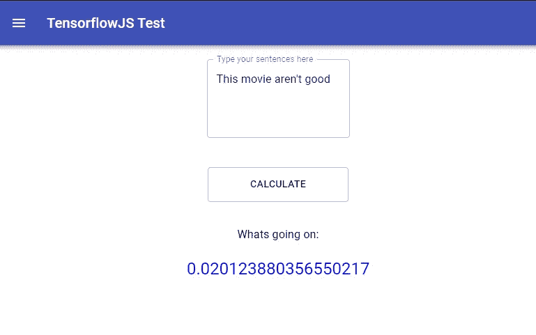

# 如何在 react.js 中使用 tensorflow.js 情感分析

> 原文：<https://towardsdatascience.com/how-to-use-tensorflow-js-in-react-js-sentimental-analysis-59c538c07256?source=collection_archive---------13----------------------->

## 与 TENSORFLOW 反应。射流研究…

## 了解如何在 react web 应用程序中实现情感分析


克里斯里德在 [Unsplash](https://unsplash.com/s/photos/tech?utm_source=unsplash&utm_medium=referral&utm_content=creditCopyText) 上的照片

2018 年 3 月，谷歌宣布[tensor flow . js 1.0 版本](https://medium.com/tensorflow/introducing-tensorflow-js-machine-learning-in-javascript-bf3eab376db)，该版本使开发者能够直接在浏览器中或通过 JavaScript 在 Node.js 中使用机器学习(ML)模型。

从那以后，我总是想在我的项目中使用 google 发布的那些花哨的预训练模型，如对象检测、姿态估计等等。然而，这些例子和演示是用纯 JavaScript 显示，关于如何在 react 应用程序中使用它的指导很少。

灵感来自 Tensorflow.js 社区[中的](https://www.youtube.com/watch?v=fZ1rzawCPD4&t=132s)[本森鲁阿](https://bensonruan.com/twitter-sentiment-analysis-with-tensorflowjs/)代码【展示&讲述。我决定写一些关于使用 create-react-app + tensorflow.js 的东西，以鼓励更多的人加入这个社区:

本教程的最终目的是创建一个情感分析计算器，它可以计算书面句子的积极(1)或消极(0)。当你需要发现和防止应用程序中的负面评论时，这是非常有用的。



计算值接近零(否定句)

*试玩 app* [*此处*](https://tfjs.manfye.com/)

# 1.0 设置您的创建-反应-应用程序

通过终端中的以下命令创建一个 [Create-React-App](https://reactjs.org/docs/create-a-new-react-app.html) :

```
npx create-react-app tfjs-sentiment
cd tfjs-sentiment
```

按如下方式安装 tensorflow.js:

```
npm install @tensorflow/tfjs 
```

并启动应用程序

```
npm start
```

# 2.0 理论和了解您的模型

我们在这里将使用的模型是 tensorflow.js [情感分析示例](https://github.com/tensorflow/tfjs-examples/tree/482226b15a757f39871038f35b3b8aad7729e594/sentiment)中的卷积神经网络(CNN)模型。它根据来自 [IMDB 数据集](https://keras.io/api/datasets/#imdb-movie-reviews-sentiment-classification)的 25000 条电影评论进行训练，这些评论被标记为积极或消极情绪。

模型在[这里](https://storage.googleapis.com/tfjs-models/tfjs/sentiment_cnn_v1/model.json)可用，元数据在[这里](https://storage.googleapis.com/tfjs-models/tfjs/sentiment_cnn_v1/metadata.json)可用。在我们开始编码之前看一下。

基本上，这个模型是一个经过训练的神经网络，它是一种“特殊的算法”,可以将你输入的句子分为肯定(1)和否定(0)两类。

我们必须将正确的输入放入模型中，以使我们的模型能够顺利工作。你必须知道的第一件事是，模型工作是作为一种数学逻辑，使用数学输入进行训练，它不理解字面上的“单词”或“英语”。我们必须把我们的句子转换成某种数学输入，以便使它起作用。接下来是元数据，元数据将文字输入转换为数字输入，例如:

```
book >>> 274
cutely >>> 68327
```

*注意:由于本教程关注的是如何在 react 中使用，这些模型背后的理论可以参考 word2vec 或其他 NLP 理论*

通过将每个单词分割成数字记号，将句子编码成这些数字输入:

```
this is a book >>> 14,9,6,274
```

然后，数字记号被改变为固定长度(100)的序列，以便改变为 2d 张量

```
0,0,0,0,0,0,0,0,0,0,0,0,0,0,0,0,0,0,0,0,0,0,0,0,0,0,0,0,0,0,0,0,0,0,0,0,0,0,0,0,0,0,0,0,0,0,0,0,0,0,0,0,0,0,0,0,0,0,0,0,0,0,0,0,0,0,0,0,0,0,0,0,0,0,0,0,0,0,0,0,0,0,0,0,0,0,0,0,0,0,0,0,0,0,0,0,14,9,6,274
```


2D 张量

最后，这个序列被转换成一个 2D 张量(基本上是一个矩阵)输入到模型中，神奇的事情发生了，模型会自动将句子分类成肯定或否定的陈述。

# 3.0 编码

如果你理解了上面的逻辑，就很容易将其转化为行动。

3.1 加载模型和元数据

```
import * as tf from '@tensorflow/tfjs';//Model and metadata URL
const url = {
model: 'https://storage.googleapis.com/tfjs-models/tfjs/sentiment_cnn_v1/model.json',
metadata: 'https://storage.googleapis.com/tfjs-models/tfjs/sentiment_cnn_v1/metadata.json'
};async function loadModel(url) {
try {
const model = await tf.loadLayersModel(url.model);
setModel(model);} catch (err) {
console.log(err);
}}async function loadMetadata(url) {
try {
const metadataJson = await fetch(url.metadata);
const metadata = await metadataJson.json();
setMetadata(metadata);} catch (err) {
console.log(err);
}} //React Hook
const [metadata, setMetadata] = useState();
const [model, setModel] = useState();useEffect(()=>{
tf.ready().then(()=>{
loadModel(url)
loadMetadata(url)
});
},[])
```

3.2 将句子转换为张量输入:

这里，我们将根据上述理论设置一个函数来逐个函数地处理输入文本:

标记句子中的每个单词:

```
const inputText = text.trim().toLowerCase().replace(/(\.|\,|\!)/g, '').split(' ');
```

使用元数据将字母标记转换为数字标记:

```
//Convert the alphabetical token to numerical token using metadata
const OOV_INDEX = 2;const sequence = inputText.map(word => {
let wordIndex = metadata.word_index[word] + metadata.index_from;
if (wordIndex > metadata.vocabulary_size) {
wordIndex = OOV_INDEX;
}
return wordIndex;
});
```

通过 padSequences 函数将序列固定为固定长度(截断和填充)

```
const PAD_INDEX = 0;const padSequences = (sequences, maxLen, padding = 'pre', truncating = 'pre', value = PAD_INDEX) => {
return sequences.map(seq => {
if (seq.length > maxLen) {
if (truncating === 'pre') {
seq.splice(0, seq.length - maxLen);
} else {
seq.splice(maxLen, seq.length - maxLen);
}
}if (seq.length < maxLen) {
const pad = [];
for (let i = 0; i < maxLen - seq.length; ++i) {
pad.push(value);
}
if (padding === 'pre') {
seq = pad.concat(seq);
} else {
seq = seq.concat(pad);
}
}return seq;});}const paddedSequence = padSequences([sequence], metadata.max_len);
```

最后，将填充的序列转换成我们的张量 2D 矩阵

```
const input = tf.tensor2d(paddedSequence, [1, metadata.max_len]);
```

3.3 将 tensor2D 加载到模型中

当你得到所有正确的输入后，最后一个简单的步骤就是使用 model.predict 对你的输入进行分类。

```
const predictOut = model.predict(input);
const score = predictOut.dataSync()[0];
predictOut.dispose();
setScore(score)
return score;
```

3.4 设置文本字段和按钮

通过 npm 安装材料界面

```
npm install @material-ui/core
```

然后把下面的代码输入到你的 react 应用程序中，一个文本框将会出现，你可以愉快地玩这个模型了！

```
import {
TextField,
Button
} from '@material-ui/core'const [testText, setText] = useState("");<TextField
id="standard-read-only-input"
label="Type your sentences here"
onChange={(e)=> setText(e.target.value)}
defaultValue=""
value={testText}
multiline
rows={4}
variant="outlined"
/>
{testText !== "" ?
<Button style={{width:"20vh", height:"5vh"}} variant= "outlined" onClick={()=>getSentimentScore(testText)}>Calculate</Button>
: <></>}
```

# 4.0 最后的话:

作为一名 react 前端开发人员和一名数据科学学生，我正在积极寻求一种将我的数据科学知识和 react 技能结合在一起的解决方案。

TF.js 提供了在 react 中集成深度学习模型的便利，其优势是一切都可以在前端完成，我们不需要后端服务器(例如 fastAPI，flask)或无服务器功能(例如 AWS lambda)来集成我们基于 python 的模型，我们可以利用当前的免费主机提供商，如 netlify 和 vercel。

使用 TF.js 的缺点是没有服务器，所有深度学习的模型都必须下载才能使用，有些模型价值超过 100Mb，与服务器中预装的模型相比，这对用户来说是糟糕的体验。

最后，开发者应该根据需要选择合适的深度学习模型的实现。

谢谢你的阅读，希望你喜欢它。

源代码可在[这里](https://github.com/manfye/tfjs-react)获得

# 我的 TF.js + React.js 文章:

[](/custom-object-detection-using-react-with-tensorflow-js-7f79adee9cd4) [## 使用 React 和 Tensorflow.js 进行自定义对象检测

### 让我们用 Azure 自定义视觉在 30 分钟内制作一个实时自定义对象检测器

towardsdatascience.com](/custom-object-detection-using-react-with-tensorflow-js-7f79adee9cd4) [](/loading-models-into-tensorflow-js-using-react-js-f3e118ee4a59) [## 使用 react.js 将模型加载到 tensorflow.js

### 立即在 react.js 中使用您的 python Tensorflow 模型

towardsdatascience.com](/loading-models-into-tensorflow-js-using-react-js-f3e118ee4a59) [](/how-to-use-tensorflow-js-in-react-js-object-detection-98b3782f08c2) [## 如何在 react.js 中使用 tensorflow.js 对象检测

### 使用 COCO-SSD 模型定位和识别单个图像中的多个对象

towardsdatascience.com](/how-to-use-tensorflow-js-in-react-js-object-detection-98b3782f08c2)